# Pengantar {.unnumbered}

Selamat datang di modul daring Praktikum Statistika untuk Perencanaan. Modul ini digunakan untuk mendampingi kalian mengikuti Praktikum dalam mata kuliah Statistika untuk Perencanaan, mata kuliah di Program Studi Perencanaan Wilayah dan Kota, Institut Teknologi Sumatera.

Modul praktikum ini akan mendampingi Anda mempelajari pengolahan statistik menggunakan bahasa pemrograman R. Untuk itu, modul ini terbagi menjadi **9 modul** yang disusun secara bertahap, dimulai dari pengenalan dasar hingga analisis multivariat:

| Modul |                   Topik                    |                                      Deskripsi Singkat                                       |
| :---: | :----------------------------------------: | :------------------------------------------------------------------------------------------: |
|   1   |        Pengolahan Data Terstruktur         | Dasar *data wrangling*: Impor, seleksi, standardisasi, penggabungan, dan ekspor data/dataset |
|   2   |           Statistika Deskriptif            |                 Perhitungan proporsi, mean, median, standar deviasi, dan IQV                 |
|   3   |              Visualisasi Data              |        Pembuatan grafik dengan `ggplot2`: bar chart, histogram, boxplot, scatter plot        |
|   4   | Distribusi Sampling & Interval Kepercayaan |                  Simulasi sampling, standard error, dan estimasi parameter                   |
|   5   |               Uji Hipotesis                |                 Uji hipotesis 1 dan 2 populasi untuk rata-rata dan proporsi                  |
|   6   |         Korelasi Nominal & Ordinal         |                            Koefisien V Cramer, Lambda, dan Gamma                             |
|   7   |              Korelasi Metrik               |                            Koefisien Spearman's ρ dan Pearson's r                            |
|   8   |               Regresi Linear               |                            Regresi linear sederhana dan berganda                             |
|   9   |         Analisis Komponen Prinsip          |                                   PCA dan Analisis Faktor                                    |

Setiap modul dilengkapi dengan **capaian pembelajaran**, **contoh kode**, dan **soal latihan** yang harus dikerjakan.

------------------------------------------------------------------------

# Pengenalan R dan RStudio {.unnumbered}

Selamat datang di dunia pengolahan data yang lebih canggih! Dalam praktikum ini, kalian akan berkenalan dengan teknik pengolahan dan analisis data dengan menggunakan bahasa pemrograman bernama R. R adalah bahasa pemrograman yang dibuat khusus untuk keperluan analisis statistik.

## Apa itu R?

R adalah lingkungan perangkat lunak (*software environment*) dan bahasa pemrograman yang digunakan untuk komputasi statistik dan grafik. R dikembangkan oleh Ross Ihaka dan Robert Gentleman di Universitas Auckland, Selandia Baru, pada awal tahun 1990-an sebagai evolusi dari bahasa S yang sebelumnya dikembangkan di Bell Laboratories [@history_overview_r]. R bersifat *open-source* (berlisensi GNU GPL), yang berarti dapat digunakan secara gratis dan dikembangkan secara kolaboratif oleh komunitas global [@r_wikipedia].

Keunggulan utama R dalam konteks perencanaan dan pemerintahan meliputi:

1.  **Ekosistem Paket yang Luas**: R memiliki puluhan ribu paket (*packages*) di CRAN untuk berbagai keperluan, mulai dari manipulasi data, pemodelan statistik, hingga analisis geospasial menggunakan `sf` dan `terra` [@spatial_r_sf; @spatial_data_science_terra].
2.  **Visualisasi Data**: Dengan paket seperti `ggplot2` dan `Shiny`, R memungkinkan pembuatan grafik berkualitas tinggi dan dashboard interaktif yang informatif [@shiny_gallery].
3.  **Dukungan Kebijakan Berbasis Data**: R mendukung implementasi kebijakan "Satu Data Indonesia" dengan kemampuan standardisasi, interoperabilitas, dan transparansi metode analisis yang dapat diaudit [@satu_data_local_govt]. R memfasilitasi proses ETL (*Extract-Transform-Load*) otomatis untuk membersihkan data dari berbagai instansi [@r_public_data].

Dalam bidang perencanaan wilayah dan kota, R digunakan untuk:

-   **Analisis Geospasial**: Mengelola data vektor dan raster untuk pemetaan dan pemodelan lingkungan [@spatial_data_science_terra].
-   **Perencanaan Transportasi**: Menggunakan paket seperti `stplanr` untuk analisis jaringan, rute, dan pemodelan transportasi berkelanjutan [@stplanr_cran; @sustainable_transport_stplanr].
-   **Simulasi Kebijakan**: Melakukan simulasi dampak kebijakan publik, seperti perubahan penggunaan lahan atau intervensi sosial, sebelum diterapkan secara nyata [@simulation_public_policies].

## Mengapa Menggunakan R?

R memiliki kelebihan yang signifikan dibandingkan dengan alat analisis berbasis antarmuka grafis (*Graphical User Interface* - GUI) seperti SPSS atau Microsoft Excel. Berikut adalah beberapa alasan utama mengapa R menjadi standar de facto dalam sains data modern:

1.  **Reproduksibilitas (*Reproducibility*)**:
    Berbeda dengan perangkat lunak berbasis *point-and-click* di mana langkah-langkah analisis seringkali sulit dilacak kembali, R bekerja berbasis skript (*script-based*). Setiap langkah analisis, mulai dari pembersihan data hingga pembuatan model, terekam secara eksplisit dalam kode. Hal ini memungkinkan analisis untuk diverifikasi, diaudit, dan dijalankan ulang oleh orang lain (atau diri kita sendiri di masa depan) dengan hasil yang identik, sebuah prinsip fundamental dalam penelitian ilmiah yang kredibel [@peng2011reproducible; @gandrud2013reproducible].

2.  **Fleksibilitas dan Kemampuan Kostumisasi**:
    R tidak membatasi pengguna pada menu yang sudah tersedia. Sebagai bahasa pemrograman, R memungkinkan kita untuk membangun alat analisis sendiri atau memodifikasi metode yang sudah ada sesuai dengan kebutuhan spesifik penelitian, memberikan fleksibilitas yang hampir tak terbatas dibandingkan perangkat lunak tertutup (*proprietary*) [@wickham2016r].

3.  **Gratis dan *Open Source***:
    Sebagai perangkat lunak *open source*, R dapat digunakan sepenuhnya secara gratis. Ini menghilangkan hambatan biaya lisensi yang mahal yang sering ditemui pada perangkat lunak komersial, membuatnya sangat aksesibel bagi mahasiswa, peneliti, dan pemerintah daerah dengan anggaran terbatas.

4.  **Komunitas yang Masif**:
    Dukungan komunitas R sangat luar biasa melalui platform seperti StackOverflow dan R-Bloggers. Jika Anda menemui masalah, kemungkinan besar orang lain sudah pernah menghadapinya dan solusinya sudah tersedia secara daring.

## Apa itu RStudio?

RStudio (yang kini bertransformasi menjadi **Posit**) adalah *Integrated Development Environment* (IDE) untuk R. Diluncurkan pertama kali pada tahun 2009, RStudio menyediakan antarmuka visual yang lebih ramah pengguna dibandingkan antarmuka baris perintah (*command line*) asli R [@about_posit]. Fitur-fitur seperti penyorotan sintaksis (*syntax highlighting*), *auto-completion*, dan manajemen *workspace* membuat pengguna baru lebih mudah mempelajari dan menggunakan R. Transformasi menjadi Posit mencerminkan komitmen terhadap ekosistem *data science* modern yang lebih luas, termasuk dukungan untuk Python [@goodbye_rstudio].

Gambar \@ref(fig:jendela-rstudio) memberikan penjelasan singkat tentang tampilan jendela RStudio yang terdiri atas 4 panel.

<div class="figure" style="text-align: center">

<p class="caption">(\#fig:jendela-rstudio)Bagian-bagian jendela RStudio</p>
</div>

1.  Panel *Environment* yang menampilkan daftar data atau variabel yang telah kita impor atau buat.
2.  Panel *Files, Plots, dan Help*, tempat kita melihat daftar *file* yang tersedia, grafik yang dihasilkan, dan menemukan dokumen bantuan untuk berbagai bagian dari R.
3.  Panel *Console*, digunakan untuk menjalankan kode.
4.  Panel *Script*, digunakan untuk menulis kode. Di sinilah kita akan menghabiskan sebagian besar waktu kerja kita.

## Instalasi R dan RStudio

Sebelum memulai praktikum, kalian perlu menginstal R dan RStudio terlebih dahulu. R harus diinstal **sebelum** RStudio, karena RStudio memerlukan instalasi R yang berfungsi untuk dapat berjalan.

**Langkah 1: Instalasi R**

1. Kunjungi situs resmi CRAN di **[cran.r-project.org](https://cran.r-project.org)**
2. Pilih sistem operasi Anda (Windows/macOS/Linux)
3. Untuk **Windows**: Klik "base" lalu unduh installer terbaru
4. Untuk **macOS**: Pilih versi sesuai prosesor (Apple Silicon M1/M2/M3/M4/M5 atau Intel)
5. Jalankan file installer dan ikuti petunjuk hingga selesai

**Langkah 2: Instalasi RStudio**

1. Kunjungi situs resmi Posit di **[posit.co/downloads](https://posit.co/downloads)**
2. Unduh **RStudio Desktop** versi gratis sesuai sistem operasi Anda
3. Jalankan installer dan ikuti petunjuk hingga selesai

**Verifikasi**: Buka RStudio setelah instalasi selesai. RStudio akan otomatis mendeteksi instalasi R yang sudah ada.

## Cara Menjalankan R

### Langsung di *Console*

Pertama, silakan buka program **RGui**. Caranya, buka Start Menu, ketikkan `R x.x.x`. Ganti `x.x.x` dengan nomor versi yang Anda unduh sebelumnya. Kemudian tekan *Enter*. Tampilannya adalah seperti yang terlihat pada Gambar \@ref(fig:jendela-r) berikut.

<div class="figure" style="text-align: center">

<p class="caption">(\#fig:jendela-r)Jendela R 4.5.2</p>
</div>

::: rmdexercise
**Aktivitas Mandiri: Kode R Pertama**

Cobalah ketik perintah berikut di jendela yang terdapat kursor di dalamnya, lalu tekan Enter setelah mengetikkan kode berikut:

`print(2 + 2)`

Anda akan melihat angka `4` sebagai hasilnya.

Selamat! Anda baru saja menjalankan kode R pertama Anda.
:::

Anda akan menyadari bahwa antarmuka RGui tidak bersahabat dengan pengguna *(user friendly)*. Selain itu tidak ada juga alat-alat yang memudahkan kita memanajemen pekerjaan seperti menampilkan lokasi file atau *script* kode sumber.

Oleh karena itu, kita membutuhkan cara kedua, yakni menggunakan **RStudio** melalui panel **Console** (jendela nomor 3 pada Gambar \@ref(fig:jendela-rstudio)).

::: rmdexercise
**Aktivitas Mandiri: Kode R pertama di RStudio**

Cobalah ketik perintah berikut di Console, lalu tekan Enter:

`print(2 + 2)`

Anda akan melihat hasil yang sama seperti yang Anda dapat di RGui. Inilah tempat menjalankan kode R di RStudio.

Selamat! Anda baru saja menjalankan kode R pertama Anda di RStudio.
:::

### Menggunakan *File* Kode Sumber

Namun, mengetik satu per satu di Console akan melelahkan jika perintahnya banyak. Oleh karena itu, kita biasanya menulis kode dalam sebuah file *source code* yang berekstensi (berakhiran) `.R`.

#### Membuat *File* Kode Sumber R (`.R`)

File kode sumber R (berekstensi `.R`) adalah dokumen teks yang berisi rangkaian perintah R yang dapat disimpan, diedit, dan dijalankan berulang kali. Ini adalah cara profesional dalam bekerja dengan R, karena kode kita menjadi **terdokumentasi**, **dapat direproduksi**, dan **mudah dibagikan**.

::: rmdexercise

**Aktivitas Mandiri: Membuat *file* Kode Sumber R Pertama**

1. Di RStudio, pilih menu **File → New File → R Script** (atau tekan **Ctrl + Shift + N** di Windows/Linux, **Cmd + Shift + N** di Mac)
2. Sebuah tab baru akan muncul di panel *Script* (jendela kiri atas)
3. Ketikkan kode R berikut di dalam tab tersebut

``` r
# File kode R pertama saya
# Dibuat pada: [isi dengan tanggal hari ini]

print("Halo dunia!")
print("Hari ini saya mulai belajar R!")

# Operasi matematika sederhana
1 + 1
2 * 3
```


4. Simpan file dengan memilih **File → Save** (atau **Ctrl + S** / **Cmd + S**) di direktori/folder pertama muncul di jendela Anda tersebut
5. Beri nama file dengan ekstensi `.R`, misalnya `kode_R_pertama_saya.R`

:::

#### Menjalankan kode dari file `.R`

Untuk menjalankan kode dari file `.R` ke Console tanpa mengetik ulang:

1. Anda bisa melakukan salah satu dari sekian cara ini:
    1. Sorot (blok) baris-baris kode yang ingin dijalankan di panel *Script*. Ini akan menjalankan kode yang Anda sorot saja.
    2. Klik angka baris di sebelah kiri untuk memilh seluruh kode yang ada dalam satu baris.
    3. **REKOMENDASI**: menempatkan kursor pada baris yang kodenya akan dijalankan. Ini akan secara otomatis meminta R menjalankan baris kode yang dianggap satu paket. 
2. Tekan kombinasi tombol **Ctrl + Enter** (Windows/Linux) atau **Cmd + Enter** (Mac)
3. Kode tersebut akan otomatis dikirim ke *Console* dan dijalankan

::: rmdexercise

**Aktivitas Mandiri: Menjalankan Kode R dari File Kode Sumber**

1. Masih dari *script* `kode_R_pertama_saya.R` tadi, tempatkan kursor pada baris berikut

``` r
...
print("Halo dunia!")
...

```

2. Jalankan baris tersebut dengan menekan tombol kombinasi sesuai penjelasan.
3. Kemudian, tempatkan kursor pada baris berikut

``` r
...
2 * 3
...

```

4. Jalankan baris tersebut kembali.

:::


Ini adalah cara kerja standar yang efisien dalam menggunakan R. Dengan cara ini, kita bisa:

- **Menyimpan pekerjaan** untuk digunakan di lain waktu
- **Menjalankan ulang** analisis dengan mudah
- **Berbagi kode** dengan rekan kerja atau asisten praktikum
- **Mendokumentasikan** setiap langkah analisis kita


------------------------------------------------------------------------

# Pengenalan Teknis R {.unnumbered}

Sebelum memulai praktikum dengan set data sesungguhnya, ada baiknya kita memahami beberapa konsep teknis dasar dalam bahasa pemrograman R. Bagian ini merangkum keterampilan-keterampilan dasar yang akan kalian temui tersebar di modul-modul praktikum.

## Pengaturan Direktori

Salah satu keterampilan penting dalam bekerja dengan R adalah mengorganisasi *file* dan data dengan baik. Sepanjang semester ini, kalian akan bekerja dengan berbagai dataset, kode R, dan hasil analisis. Pengaturan direktori yang terstruktur akan memudahkan kalian dalam mengelola semua file tersebut dan memastikan kode dapat berjalan dengan lancar.

### Struktur Direktori yang Ideal

Sebelum memulai praktikum, kalian perlu menyiapkan direktori kerja (*working directory*) yang terorganisir dengan baik. Berikut adalah struktur direktori yang **wajib** kalian gunakan sepanjang semester:

```text
Praktikum STP 2026/
├── Praktikum STP 2026.Rproj
├── datasets/
│   ├── data.csv
│   └── ...
├── output/
│   ├── output_1.xlsx
│   └── ...
├── modul_1.R
└── modul_2.R
```

**Komponen-komponen penting:**

-   **`Praktikum STP 2026.Rproj`**: File RStudio Project yang mengatur *working directory* secara otomatis dan menyimpan *environment* kerja kalian.
-   **`datasets/`**: Folder khusus untuk menyimpan **semua dataset mentah** (file Excel, CSV, atau format lainnya yang kalian terima dari asisten praktikum).
-   **`output/`**: Folder khusus untuk menyimpan **hasil-hasil analisis** seperti file Excel yang sudah diolah, file CSV hasil export, atau grafik yang dihasilkan.
-   **`modul_1.R`, `modul_2.R`, ...**: File-file kode R (script) yang akan kalian buat untuk setiap modul praktikum.

Dengan struktur seperti ini, kode R kalian akan lebih **ringkas** dan **portabel**. Sebagai contoh, untuk membaca data, kalian cukup menulis:

``` r
data <- read.xlsx("datasets/data_penduduk.xlsx")
```

Tanpa perlu menulis *path* lengkap seperti `C:\Users\NamaAnda\Documents\praktikum\data_penduduk.xlsx` yang panjang, rumit, dan berbeda-beda di setiap komputer.

### Membuat dan Mengatur Direktori Praktikum

Ikuti langkah-langkah berikut untuk menyiapkan direktori praktikum kalian:

#### Langkah 1: Membuat Folder Utama

Buatlah sebuah folder di komputer kalian dengan nama **`Praktikum STP 2026`** (sesuai tahun ajaran yang sedang berjalan). Penamaan yang seragam ini **sangat penting** agar asisten praktikum dapat dengan mudah membantu kalian jika terjadi masalah atau kesalahan.

Folder ini akan menjadi **direktori kerja** (*working directory*) kalian selama satu semester penuh.

#### Langkah 2: Membuat Subfolder `datasets` dan `output`

Di dalam folder `Praktikum STP 2026`, buatlah **dua subfolder**:

1.  Subfolder **`datasets`** - untuk menyimpan semua data mentah
2.  Subfolder **`output`** - untuk menyimpan hasil analisis

**Cara membuat folder:**

-   **Di Windows**: Klik kanan di dalam folder `Praktikum STP 2026` → pilih *New* → *Folder* → beri nama `datasets`, lalu ulangi untuk membuat folder `output`
-   **Di Mac/Linux**: Klik kanan di dalam folder `Praktikum STP 2026` → pilih *New Folder* → beri nama `datasets`, lalu ulangi untuk membuat folder `output`

Setiap kali kalian mendapatkan dataset baru untuk praktikum (misalnya file Excel atau CSV dari asisten), **simpanlah di dalam folder `datasets`**. Setiap kali kalian menghasilkan output analisis, **simpanlah di dalam folder `output`**.

#### Langkah 3: Mengubahnya Menjadi RStudio Project

Setelah struktur folder dasar sudah siap, langkah selanjutnya adalah mengubahnya menjadi **RStudio Project**. RStudio Project adalah fitur yang sangat berguna untuk mengelola sesi kerja R kalian.

**Keuntungan RStudio Project:**

1.  **Otomatis mengatur *working directory***: Ketika kalian membuka sebuah Project, RStudio otomatis mengatur *working directory* ke folder tersebut, sehingga kalian tidak perlu menggunakan perintah `setwd()` lagi.

::: rmdnote
Perintah `setwd()` digunakan untuk mengatur *working directory* secara manual. Misalnya, jika kita ingin mengatur *working directory* ke folder `Praktikum STP 2026` yang terletak dalam folder `Documents` pada direktori `C:/Users/NamaAnda/`, kita bisa menggunakan perintah 

```r
setwd("C:/Users/NamaAnda/Documents/Praktikum STP 2026")
```

Namun, jika kita sudah membuat direktori Anda sebagai Project, dalam praktikum ini, kita tidak perlu menggunakan perintah ini lagi.
:::

2.  **Mempertahankan status kerja**: RStudio menyimpan *environment* (variabel, data yang sudah dimuat) sehingga kalian bisa melanjutkan pekerjaan dari tempat terakhir kalian berhenti.
3.  **Memudahkan manajemen path**: Kalian cukup menulis *relative path* (misalnya `datasets/data.xlsx`) tanpa perlu mengetik *path* lengkap yang panjang dan berisiko error.
4.  **Portabilitas**: Project folder bisa dipindahkan ke komputer lain atau dibagikan ke rekan tanpa perlu mengubah kode, karena semua path bersifat relatif.

**Cara membuat RStudio Project:**

1.  Buka RStudio
2.  Pilih menu **File → New Project...**
3.  Pilih **Existing Directory** (karena folder sudah dibuat)
4.  Klik **Browse...** dan cari folder **`Praktikum STP 2026`** yang sudah kalian buat
5.  Klik **Create Project**

Setelah itu, RStudio akan membuat file **`Praktikum STP 2026.Rproj`** di dalam folder kalian. File `.Rproj` ini adalah "pintu masuk" ke Project kalian.

**Setiap kali ingin bekerja**: Cukup *double-click* file **`Praktikum STP 2026.Rproj`** tersebut, dan RStudio akan terbuka dengan *working directory* yang sudah otomatis diatur ke folder praktikum kalian. Kalian siap untuk mulai bekerja!

::: rmdwarning
**Catatan Penting:** Selalu buka RStudio melalui file `.Rproj`, bukan dengan membuka RStudio terlebih dahulu lalu membuka *script*. Ini memastikan *working directory* selalu benar dan kode kalian berjalan sebagaimana mestinya.
:::

### Mengunduh Dataset Praktikum dari GitHub

Setelah struktur direktori dan Project sudah siap, langkah selanjutnya adalah **mengunduh dataset-dataset praktikum** yang akan digunakan sepanjang semester. Semua dataset praktikum disimpan di *repository* GitHub dan dapat diunduh secara gratis.

::: rmdnote
**Mengapa Dataset Disimpan di GitHub? {.header}**

Dataset praktikum disimpan di GitHub agar:
- Semua mahasiswa mendapatkan dataset yang **sama** dan **terbaru**
- Dataset dapat **diakses kapan saja** tanpa perlu menunggu distribusi dari asisten
- Jika ada pembaruan dataset, kalian bisa **mengunduh ulang** dengan mudah
- Dataset **tidak hilang** meskipun laptop rusak atau file terhapus
:::

#### Langkah-Langkah Mengunduh Dataset

Ikuti langkah-langkah berikut dengan seksama untuk mengunduh folder `datasets/` dari GitHub:

**1. Buka halaman GitHub repository praktikum**

Klik link berikut atau copy-paste ke browser kalian:

**[https://github.com/abdulmubdibindar/praktikum-r-stp](https://github.com/abdulmubdibindar/praktikum-r-stp)**

Kalian akan melihat halaman repository yang berisi semua file praktikum.

**2. Download seluruh repository sebagai file ZIP**

- Di halaman GitHub, cari dan klik tombol hijau **"Code"** di bagian kanan atas
- Pada menu yang muncul, pilih **"Download ZIP"**
- Simpan file ZIP di lokasi yang mudah kalian temukan (misalnya folder **Downloads** atau **Desktop**)
- Tunggu hingga proses download selesai

**3. Ekstrak file ZIP yang sudah didownload**

- Buka folder tempat kalian menyimpan file ZIP (misalnya **Downloads**)
- Klik kanan pada file **`praktikum-r-stp-main.zip`**
- Pilih **"Extract All..."** atau **"Extract Here"** (di Windows)
- Atau untuk Mac/Linux: double-click file ZIP, akan otomatis ter-ekstrak
- Setelah ekstrak selesai, akan muncul folder bernama **`praktikum-r-stp-main`**

**4. Copy folder `datasets` ke dalam Project RStudio kalian**

Ini adalah langkah paling penting! Ikuti dengan teliti:

- Buka folder **`praktikum-r-stp-main`** yang baru diekstrak
- Di dalam folder tersebut, cari folder bernama **`datasets`**
- **Klik kanan** pada folder `datasets`, lalu pilih **"Copy"** (atau tekan `Ctrl + C`)
- Buka folder **`Praktikum STP 2026`** (folder Project RStudio kalian)
- **Klik kanan** di dalam folder tersebut, lalu pilih **"Paste"** (atau tekan `Ctrl + V`)
- Folder `datasets` beserta seluruh isinya sekarang sudah tersalin ke Project kalian

**5. Verifikasi dataset sudah tersimpan dengan benar**

Untuk memastikan dataset sudah tersimpan di lokasi yang benar, buka RStudio (klik file `.Rproj` kalian), lalu jalankan kode berikut di **Console**:


Jika hasilnya `TRUE`, berarti folder `datasets` sudah berada di lokasi yang benar! ✓

Selanjutnya, cek isi folder `datasets` dengan kode:


Kalian akan melihat daftar file-file dataset seperti `Data Praktikum 01.xlsx`, `Data Praktikum 02.xlsx`, `DataUtama_mhsUBL.csv`, dan lain-lain.

::: rmdimportant
**Struktur Folder yang Benar {.header}**

Pastikan struktur folder Project kalian sekarang terlihat seperti ini:

```text
Praktikum STP 2026/           ← Folder Project kalian
├── Praktikum STP 2026.Rproj  ← File Project RStudio
├── datasets/                 ← Folder datasets (HARUS ada di sini!)
│   ├── Data Praktikum 01.xlsx
│   ├── Data Praktikum 02.xlsx
│   ├── Data Praktikum 03.xlsx
│   ├── DataUtama_mhsUBL.csv
│   ├── DataUtama_mhsUINRIL.csv
│   ├── DataUtama_mhsUNILA.csv
│   ├── DataUtama_mhsITERA.csv
│   ├── data_mahasiswa.csv
│   └── ... (file-file dataset lainnya)
├── output/                   ← Folder untuk hasil analisis
└── ... (file .R kalian)
```

**PENTING**: Jika folder `datasets` berada di lokasi lain (misalnya di **Desktop** atau **Downloads**), kode praktikum **tidak akan bisa** membaca dataset. Pastikan folder `datasets` berada **langsung di dalam** folder `Praktikum STP 2026`.
:::

## Sintaks Dasar Bahasa R

Dalam subbab ini, kita akan membahas sintaks dasar bahasa R yang akan sering digunakan dalam praktikum ini.

### Komentar

Pada dasarnya, semua yang kita tulis di *script* akan dijalankan oleh R. Akan tetapi, kita bisa memberi tahu R untuk tidak menjalankan kode yang kita tulis dengan mengubah formatnya menjadi **komentar** (*comment*). Kita bisa menuliskan komentar dengan menggunakan tanda pagar (`#`) sebelum kode yang ingin kita komentari.

``` r
# Kode ini akan menghitung 1 + 1
1 + 1 
```

::: rmdimportant
Komentar sangat berperan penting dalam kode kalian. Malahan, ini adalah kekuatan terbesar dari penggunaan R dalam Kita akan sering menggunakan komentar dalam kode kalian. Jadi, jangan ragu untuk menggunakan komentar untuk menjelaskan kode kalian.
:::

#### Komentar Blok (*Block Comment*)

Untuk menulis komentar yang panjang (lebih dari satu baris), kita bisa menggunakan **komentar blok**. Ada dua cara:

**Cara 1: Tanda Pagar di Setiap Baris**

``` r
# Ini adalah komentar blok
# yang terdiri dari beberapa baris
# untuk menjelaskan konsep yang kompleks
hasil <- data.ubl |>
  filter(Jenis.Kelamin == "Laki-Laki") |>
  summarize(rata_rata = mean(jarak))
```

**Cara 2: Menggunakan if(FALSE)**

``` r
if(FALSE) {
  Ini adalah komentar blok alternatif.
  Semua teks di dalam kurung kurawal tidak akan dijalankan.
  Berguna untuk men-disable blok kode sementara saat debugging.
}
```

::: rmdnote
**Kapan Menggunakan Komentar Blok?**

- Menulis jawaban analisis yang panjang (misalnya interpretasi hasil statistik)
- Mendokumentasikan proses pemikiran Anda
- Men-disable sementara kode yang tidak ingin dihapus
- Menjawab soal Aktivitas Mandiri dalam bentuk teks
:::


### Variabel

Variabel adalah tempat menyimpan data dan informasi di R. Variabel terdiri atas nama variabel dan nilainya, Cara mendeklarasikan variabel adalah dengan operator `<-`. Operator deklarasi bisa dimasukkan dengan *hotkey* `Alt` + `I`.

Contoh:


``` r
a <- 1 # 'a' adalah nama variabel yang nilainya 1
b <- 2 # 'b' adalah nama variabel yang nilainya 2
```

::: rmdimportant
Meskipun kita bisa menggunakan `=` untuk meng-*assign* nilai ke variabel, praktik tersebut tidak lazim dipakai dalam komunitas R. Oleh karena itu, tetap gunakan *assignment operator* `<-` untuk memberi nilai pada suatu variabel.
:::

Variabel juga bisa dideklarasikan menggunakan operasi matematika dan variabel sebelumnya.


``` r
hasil <- a + b

paste("Hasil:",hasil)
```

```
## [1] "Hasil: 3"
```

Untuk menampilkan nilai variabel tuliskan kembali nama variabelnya lalu jalankan.


``` r
a
```

```
## [1] 1
```

``` r
b
```

```
## [1] 2
```

``` r
hasil
```

```
## [1] 3
```

### Konvensi Penamaan dalam R

R mendukung beberapa gaya penamaan variabel. Penting untuk diingat bahwa **R membedakan huruf besar dan kecil** (*case-sensitive*), sehingga `data` berbeda dengan `Data`, `JenisKelamin` berbeda dengan `jeniskelamin`, dan `"Laki-Laki"` berbeda dengan `"Laki-laki"`. Kesalahan dalam kapitalisasi adalah sumber *error* yang sangat umum bagi pemula.

R mendukung beberapa gaya penamaan variabel:

1. **snake_case** (disarankan untuk variabel R):
   - `data_mahasiswa`, `jarak_tempuh`, `biaya_sepekan`
   - Menggunakan garis bawah (`_`) untuk memisahkan kata
   
2. **dot.notation** (umum untuk nama kolom):
   - `data.ubl`, `Jenis.Kelamin`, `biaya.dalam.sepekan`
   - Menggunakan titik (`.`) untuk memisahkan kata
   - Sering muncul saat mengimpor data dari Excel

3. **camelCase** (jarang dipakai di R):
   - `dataMahasiswa`, `jarakTempuh`
   - Huruf besar menandai awal kata baru

**Rekomendasi:**

- Gunakan **snake_case** untuk nama variabel/objek R yang Anda buat sendiri
- Gunakan **dot.notation** untuk nama kolom dataset (konsisten dengan output dari Excel)
- Hindari spasi dan karakter khusus dalam nama variabel
- Gunakan nama yang deskriptif: `data_ubl` lebih baik dari `d1`
- Konsisten: Pilih satu gaya dan gunakan terus sepanjang kode Anda

::: rmdexercise
**Aktivitas Mandiri: Membuat Variabel Disertai Komentar**

1. Buatlah variabel dengan nama `nama` yang nilainya adalah nama kalian.
2. Buatlah variabel dengan nama `nim` yang nilainya adalah NIM kalian.
3. Buatlah variabel dengan nama `prodi` yang nilainya adalah program studi kalian.
4. Buatlah variabel dengan nama `angkatan` yang nilainya adalah angkatan kalian.
5. Tambahkan komentar pada baris paling atas bahwa variabel-variabel di bawahnya adalah "Identitas Saya".
6. Tampilkan nilai variabel `nama`, `nim`, `prodi`, dan `angkatan` dengan perintah berikut.

```r
cat("Nama saya adalah",nama,". NIM saya adalah",nim,". Saya adalah mahasiswa",prodi," angkatan",angkatan,".")
```

:::

## Paket (*Packages*)

R memiliki ribuan paket tambahan yang menyediakan fungsi-fungsi khusus.

-   **`install.packages("nama_paket")`**: Digunakan untuk mengunduh dan menginstal paket dari internet ke komputer kita. Ini cukup dilakukan satu kali saja. **Perhatikan bahwa nama paket ditulis dengan tanda `"` di awal dan akhir nama paket yang akan diinstal.**
-   **`library(nama_paket)`**: Digunakan untuk memuat paket yang sudah terinstal ke dalam sesi kerja kita agar isinya bisa digunakan. Ini harus dilakukan setiap kali kita membuka RStudio baru. **Perhatikan bahwa tanda `"` tidak perlu lagi ditulis ketika kita ingin memuat paket yang sudah kita instal.**


::: rmdexercise
**Aktivitas Mandiri: Instalasi Paket**

Berikut adalah paket-paket yang akan kita gunakan selama praktikum ini. Instalasilah paket-paket berikut di komputer kalian:

- `tidyverse`
- `openxlsx`
- `gtsummary`
- `flextable`
- `treemapify`
- `MKinfer`
- `rcompanion`
- `RCPA3`
- `vcdExtra`
- `psych`

Tunggu hingga masing-masing proses instalasi selesai. Ingat, tahap ini hanya perlu dilakukan satu kali saja.
:::

## Fungsi (*Functions*)

Fungsi adalah serangkaian instruksi yang dibungkus menjadi satu perintah untuk melakukan tugas tertentu. R memiliki banyak fungsi bawaan yang berguna untuk banyak hal, seperti `print()` untuk menampilkan output, `mean()` untuk menghitung rata-rata, atau `sum()` untuk menghitung jumlah.

### Menggunakan Fungsi

Untuk menggunakan fungsi, kita memanggil namanya diikuti dengan tanda kurung `()`. Di dalam tanda kurung, kita bisa memasukkan **argumen** (input).

``` r
# Contoh fungsi bawaan: mean (rata-rata)
nilai <- c(10, 20, 30)
rata_rata <- mean(nilai) # Hasil: 20
```

### Membuat Fungsi Sendiri

Kita dapat membuat fungsi buatan kita sendiri menggunakan perintah `function()`. Struktur dasarnya adalah sebagai berikut:

``` r
nama_fungsi <- function(input) {
  # Proses yang dilakukan
  hasil <- input * 2
  return(hasil)
}
```

Penjelasan:

- `nama_fungsi`: Nama yang akan kita gunakan untuk memanggil fungsi ini.
- `function(input)`: Mendefinisikan bahwa kita membuat sebuah fungsi yang menerima satu argumen bernama `input`.
- `{ ... }`: Blok kode yang berisi instruksi yang akan dijalankan.
- `return(hasil)`: Mengembalikan nilai `hasil` sebagai *output* dari fungsi.

::: rmdexercise
**Aktivitas Mandiri: Membuat Fungsi Sendiri**

1. Buatlah dua variabel dengan nama `c` dan `d` dengan nilai 10 dan 20
2. Buatlah fungsi dengan nama `kali_dua` yang menerima satu argumen `x` sebagai berikut:

``` r
kali_dua <- function(x) {
  # Proses yang dilakukan
  hasil <- x * 2
  return(hasil)
}
```

3. Jalankan fungsi tersebut dengan argumen nilai `c` dan `d` dan simpan nilainya berturut-turut pada variabel `c_kali2` dan `d_kali2`.
4. Tampilkan nilai variabel `c_kali2` dan `d_kali2`.

:::

Ini akan sangat berguna ketika kita ingin melakukan perhitungan yang sama berulang kali, seperti pada perhitungan IQV di Modul 2.

## Struktur Data Dasar

Kita perlu mengenal jenis-jenis struktur data yang ada di R. Mereka akan sangat sering kita gunakan selama praktikum ini.

### Vektor

Vektor adalah struktur data paling dasar di R yang dapat menampung lebih dari satu nilai. Kita membuatnya dengan fungsi `c()` (*combine*).

Ciri utama vektor adalah semua elemen di dalamnya harus memiliki tipe data yang sama. Jika tidak, R akan mengubah tipe data elemen tersebut menjadi tipe data yang paling umum.

``` r
angka <- c(1, 2, 3, 4, 5)
huruf <- c("a", "b", "c")
campuran <- c(1, "a", TRUE) # R akan mengubah tipe data elemen tersebut menjadi tipe data yang paling umum, yaitu character/string
```

::: rmdexercise
**Aktivitas Mandiri: Membuat Vektor**

1. Buatlah vektor dengan nama `nilai_ujian` yang berisi nilai ujian 5 mahasiswa berikut: 85, 90, 78, 92, 88
2. Buatlah vektor dengan nama `fakultas` yang berisi nama-nama fakultas di ITERA
3. Buatlah vektor dengan nama `apa_saja` yang berisi nilai `1` dan `"a"`
4. Tampilkan tipe data dari variabel `nilai_ujian`, `fakultas`, dan `apa_saja`. Perhatikan hasil pada bagian `apa_saja`. Apa jenis nilai-nilai dalam vektor tersebut?

:::


### List

List adalah struktur data yang dapat menampung banyak nilai yang berbeda tipe datanya.

``` r
list_saya <- list("kucing", 1, TRUE)
list_saya # Untuk menampilkan nilai list_saya
```

List juga bahkan dapat menampung vektor.

``` r
list_saya <- list(c(1, 2, 3), c("a", "b", "c"), c(TRUE, FALSE, TRUE))
list_saya
```

Kita dapat memberi nama elemen-elemen dalam list dengan mengetikkan nama elemen dan diikuti tanda `=` sebelum nilai elemen tersebut.

``` r
list_saya <- list(nama = "Budi", nilai_ujian = c(85, 90, 78), fakultas = "FTI")
```

::: rmdexercise
**Aktivitas Mandiri: Membuat List**

1. Buatlah list dengan nama `list_saya` yang berisi nama, nilai ujian, dan fakultas
2. Tampilkan nilai variabel `list_saya`

:::

### Tipe Data

Saat mengolah data, kalian akan sering menemukan singkatan tipe data berikut:

-   **`dbl` (Double)**: Angka numerik (bisa desimal).
-   **`chr` (Character)**: Teks atau *string*. Ditandai dengan tanda kutip.
-   **`fct` (Factor)**: Data kategorik (bisa nominal atau ordinal). Factor menyimpan nilai sebagai angka di belakang layar namun menampilkan label teks, yang berguna untuk analisis statistik dan plot.

### Data Frame dan Tibble

Data dalam R biasanya disimpan dalam bentuk tabel yang disebut *Data Frame*. Di era modern (tidyverse), kita sering menggunakan versi yang lebih canggih disebut **Tibble**. Strukturnya mirip spreadsheet: baris mewakili observasi, kolom mewakili variabel.

## Operator Pipa (`|>`)

Dalam `tidyverse`, kita sering menggunakan operator pipa (`|>`) untuk merangkai beberapa perintah sekaligus. Bayangkan ini sebagai penyambung proses:

``` r
# Tanpa pipa
hasil <- fungsi_2(fungsi_1(data))

# Dengan pipa (lebih mudah dibaca)
data |> 
  fungsi_1() |> 
  fungsi_2()
```

Artinya: "Ambil `data`, lalu `fungsi_1`, kemudian hasilnya dimasukkan ke `fungsi_2`."

Kita akan mempelajari penggunaan operator pipa (`|>`) secara lebih praktis dalam Modul \@ref(modul-1). 

## Manajemen Data (Input/Output)

Ini adalah kemampuan yang penting dalam pengolahan data di R karena seringkali kita perlu mengolah data dari file eksternal (seperti Excel) atau menyimpan data hasil pengolahan ke file eksternal.

Kita akan mempraktikkan kemampuan ini lebih banyak mulai di Modul \@ref(modul-1).

### Membaca Data

Kita sering menggunakan `read.xlsx()` dari paket `openxlsx` untuk membaca file Excel.

``` r
data <- read.xlsx("folder/nama_file.xlsx", sheet = "nama_sheet")
```

### Menyimpan Data

Setelah diolah, data bisa disimpan kembali ke Excel atau CSV.

``` r
write.xlsx(data, "folder/nama_file_baru.xlsx")
write.csv2(data, "folder/nama_file_baru.csv") # Format CSV Excel Indonesia (pemisah titik koma)
```

<!--chapter:end:index.Rmd-->

# Modul-1: Pengolahan Data Terstruktur {#modul-1}

Setelah mempelajari modul ini Anda diharapkan dapat:

1.  menganalisis variabel dan objek dalam sebuah format data terstruktur [STP-1.3]{.capaian}
2.  mengelola data terstruktur dengan tepat menggunakan perangkat komputer [STP-1.4]{.capaian}

---

Kita akan mempelajari cara pengolahan data terstruktur atau *dataset*/set data dari hasil kuesioner kepada mahasiswa-mahasiswa Universitas Islam Negeri Raden Intan Lampung (UINRIL) dan Universitas Bandar Lampung (UBL) tentang pola perjalanan mereka.

Dalam R, pengolahan data terstruktur dipermudah dengan adanya paket `tidyverse`. Paket ini menyertakan paket-paket lain yang mempunyai kegunaan unik dalam pengolahan data terstruktur.


``` r
library(tidyverse)
```

Seperti yang kalian lihat, paket `tidyverse` menyertakan paket-paket berikut yang mempunyai kegunaan masing-masing:

-   `dplyr`: menyediakan serangkaian fungsi inti untuk memanipulasi dan mentransformasi data secara efisien.
-   `forcats`: memudahkan pekerjaan dengan data kategorikal atau yang dalam R disebut juga 'factors'.
-   `ggplot2`: untuk membuat grafik yang ciamik.
-   `lubridate`: mempermudah pekerjaan terkait format tanggal
-   `purrr`: meningkatkan kemampuan pemrograman fungsi dan vektor
-   `readr`: untuk membaca data tabular seperti `.csv`
-   `stringr`: menyederhanakan operasi teks/*string*
-   `tibble`: versi modern dari *data.frame* yang lebih rapi dan mudah digunakan.
-   `tidyr`: untuk merapikan data dengan mengubah format atau struktur tata letaknya.

Selain paket `tidyverse`, kita juga akan menggunakan paket `openxlsx` untuk mengoperasikan *file* Excel.


## Mengimpor set data *(dataset)* dari Excel

Untuk membuat set data di lingkungan kerja R kita, gunakan fungsi `read.xlsx()` seperti berikut. Fungsi `read.xlsx()` mempunyai atribut utama berupa *file path* lokasi file yang ditempatkan di dalam tanda kurung.

::: rmdwarning

⚠️ **Penting**

Pastikan file Excel yang akan diimpor sudah tertutup, karena mengimpor file yang sedang terbuka akan menghasilkan *error*.
:::


``` r
# Memuat dataset dari file Excel "Data Praktikum 01.xlsx" yang terletak di folder datasets/
data <- read.xlsx("datasets/Data Praktikum 01.xlsx")

# Menampilkan 6 baris pertama dataset
head(data)
```

```
##   Kampus_PT Nomor.urut Jenis.Kelamin Umur                   Fakultas
## 1    UINRIL          1     Laki-laki   22                    Syariah
## 2    UINRIL          2     Laki-laki   25                    Syariah
## 3    UINRIL          3     Perempuan   24      Tarbiyah dan Keguruan
## 4    UINRIL          4     Laki-laki   19 Dakwah dan Ilmu Komunikasi
## 5    UINRIL          5     Laki-laki   23      Tarbiyah dan Keguruan
## 6    UINRIL          6     Laki-laki   21                       Adab
##                                   Prodi            Tingkat.Semester  Uang.Saku kepemilikan.mobil
## 1                        Hukum Keluarga 4 (Semester 7 - Semester 8) 1Jt - 2 Jt                 0
## 2                        Hukum Keluarga 4 (Semester 7 - Semester 8)     < 1 Jt                 1
## 3                Pendidikan Agama Islam 4 (Semester 7 - Semester 8)     < 1 Jt                 0
## 4        Komunikasi dan Penyiaran Islam 1 (Semester 1 - Semester 2)     < 1 Jt                 0
## 5            Manajemen Pendidikan Islam 4 (Semester 7 - Semester 8)     < 1 Jt                 0
## 6 Ilmu Perpustakaan dan Informasi Islam 4 (Semester 7 - Semester 8)     < 1 Jt                 0
##   kepemilikan.motor kepemilikan.sepedan      kendaraan.utama    kelurahan
## 1                 1                   0 Sepeda Motor Pribadi       Wiyono
## 2                 4                   0 Sepeda Motor Pribadi     Sukarame
## 3                 0                   0        Berjalan Kaki     Sukarame
## 4                 1                   0 Sepeda Motor Pribadi Harapan Jaya
## 5                 1                   0 Sepeda Motor Pribadi  Korpri Raya
## 6                 1                   0 Sepeda Motor Pribadi    Rajabasa 
##            jenis.tempat.tinggal               nama.jalan.tempat.tinggal
## 1         Rumah Bersama Saudara                            Pasar Wiyono
## 2                   Kos Sendiri                     jln endro suratmin 
## 3                   Kos Sendiri                         Jl. Pulau ambon
## 4                   Kos Sendiri           Jl.pulau pisang, gg way pesai
## 5 Rumah Mengontrak Bersama-sama                              Jl. Durian
## 6  Rumah Pribadi/Rumah Keluarga Jln Nunyai Gg. Hi. Ismail Blok B NO 22E
##   alasan.pemilihan.lokasi.tempat.tinggal jarak.(km) biaya.dalam.ribu2 Jumlah.Perjalanan.Senin
## 1                              Lain-lain      19.27               100                       3
## 2                    Dekat dengan kampus       0.58                80                       3
## 3                    Dekat dengan kampus       0.56                 0                       3
## 4                    Dekat dengan kampus       1.05                50                       0
## 5                    Dekat dengan kampus       1.69                50                       4
## 6                    Dekat dengan kampus       7.91                50                       0
##   Jumlah.Perjalanan.Selasa Jumlah.Perjalanan.Rabu Jumlah.Perjalanan.Kamis Jumlah.Perjalanan.Jumat
## 1                        3                      0                       0                       0
## 2                        3                      0                       3                       0
## 3                        0                      3                       0                       0
## 4                        2                      0                       2                       2
## 5                        4                      0                       0                       3
## 6                        2                      2                       0                       2
##   Jumlah.Perjalanan.Sabtu Jumlah.Perjalanan.Ahad
## 1                       0                      0
## 2                       0                      0
## 3                       0                      0
## 4                       0                      2
## 5                       2                      0
## 6                       2                      2
```

Fungsi tersebut akan mengimpor seluruh isi dari file Excel `Data Praktikum 01.xlsx` pada *sheet* pertama saja. *Dataset* yang kita impor akan menjadi objek dengan jenis **tibble**.

Apabila kita ingin mengimpor set data dari *sheet* lainnya, kita harus menyertakan detil nama sheet yang kita ingin impor pada atribut `sheet`. Misalnya kita ingin mengimpor *sheet* UBL yang bernama "DataUtama_mhsUBL", maka perintahnya adalah: 


``` r
# Menyimpan file sebagai variabel tersendiri sehingga lebih fleksibel
file_dibaca <- "datasets/Data Praktikum 01.xlsx" # nama variabel bukan 'file' saja karena sudah ada fungsi R tersendiri dengan nama tersebut

# Mengimpor data dari file_dibaca dan menyimpannya sebagai variabel
data_ubl <- read.xlsx(file_dibaca, sheet = "DataUtama_mhsUBL")

# Melihat data tersebut
head(data_ubl)
```

```
##   Timestamp Kampus_PT Nomor.urut Jenis.Kelamin Umur                         Fakultas
## 1  45413.83       UBL          1     Perempuan   21 Fakultas Ilmu Sosial dan Politik
## 2  45413.83       UBL          2     Laki-Laki   20                   Fakultas Hukum
## 3  45413.85       UBL          3     Laki-Laki   21      Fakultas Ekonomi dan Bisnis
## 4  45413.85       UBL          4     Laki-Laki   22      Fakultas Ekonomi dan Bisnis
## 5  45413.88       UBL          5     Laki-Laki   21      Fakultas Ekonomi dan Bisnis
## 6  45413.92       UBL          6     Perempuan   21      Fakultas Ekonomi dan Bisnis
##             Prodi            Tingkat.Semester     Uang.Saku kepemilikan.mobil kepemilikan.motor
## 1 Ilmu Komunikasi 4 (Semester 7 - Semester 8)        < 1 jt                 1                 2
## 2      Ilmu Hukum 3 (Semester 5 - Semester 6)   1 jt – 2 jt                 2                 1
## 3       Manajemen 4 (Semester 7 - Semester 8)   1 jt – 2 jt                 1                 2
## 4       Akuntansi 4 (Semester 7 - Semester 8)   1 jt – 2 jt                 1                 4
## 5       Manajemen 4 (Semester 7 - Semester 8) 2,1 jt – 3 jt                 4                 4
## 6       Akuntansi 4 (Semester 7 - Semester 8)   1 jt – 2 jt                 1                 2
##   kepemilikan.sepeda                                      kendaraan.utama               kelurahan
## 1                  1                                 Sepeda Motor Pribadi       Kalibalau Kencana
## 2                  1                                        Mobil Pribadi            Gunung sulah
## 3                  2                                 Sepeda Motor Pribadi              langkapura
## 4                  1 Kendaraan Bermotor (menumpang dengan keluarga/teman) Bilabong JAYA JAYA JAYA
## 5                  1                                        Mobil Pribadi                sukarame
## 6                  1                                  Transportasi Online               Way halim
##           jenis.tempat.tinggal                       nama.jalan.tempat.tinggal jarak.(km)
## 1 Rumah pribadi/rumah keluarga                                    eLBe Loundry   4.223797
## 2 Rumah pribadi/rumah keluarga                         Jl.Urip Sumoharjo no 88   2.703331
## 3 Rumah pribadi/rumah keluarga                  JL DARUSSALAM GG LANGGAR LK II   3.237072
## 4 Rumah pribadi/rumah keluarga Jl Darussalam bilabong bila bolong di jait dong   3.002336
## 5 Rumah pribadi/rumah keluarga          jl.cendrawasih sukarame bandar lampung   5.961925
## 6 Rumah pribadi/rumah keluarga                            Jl P tabuan nomor 26   2.925331
##           alasan.pemilihan.lokasi.tempat.tinggal               biaya.dalam.seminggu
## 1                 Bersama keluarga/saudara/teman                            25 ribu
## 2 Mudahnya akses berpergian dari tempat tinggal                                 200
## 3                 Bersama keluarga/saudara/teman 50rb menggunakan kendaraan pribadi
## 4    Lingkungan nyaman karna aman dari kejahatan                      Sminggu 20 rb
## 5                    Dekat dengan fasilitas umum                     20 JUTA RUPIAH
## 6                 Bersama keluarga/saudara/teman                              40 rb
##   Jumlah.perjalanan.Senin Jumlah.Perjalanan.Selasa Jumlah.Perjalanan.Rabu Jumlah.Perjalanan.Kamis
## 1                       2                        3                      2                       3
## 2                       3                        3                      3                       3
## 3                       1                        1                      1                       1
## 4                       2                        2                      2                       2
## 5                       1                        1                      1                       1
## 6                       3                        3                      1                       1
##   Jumlah.Perjalanan.Jumat Jumlah.Perjalanan.Sabtu Jumlah.Perjalanan.Ahad
## 1                       2                       2                      2
## 2                       3                       3                      3
## 3                       1                       1                      1
## 4                       2                       2                      2
## 5                       1                       1                      1
## 6                       1                       1                      1
```

Kita juga dapat melihat *dataset* kita secara lengkap dengan perintah `View()`.


``` r
# Melihat set data UINRIL
View(data)

# Melihat set data UBL
View(data_ubl)
```

## Analisis data terstruktur pada set data

Kita sudah mempelajari bahwa data terstruktur terdiri atas **objek**, **variabel**, dan **nilai**. Satu objek diwakili oleh satu baris, variabel oleh kolom, dan nilai berada di dalam sel-sel yang merupakan perpotongan kolom dan baris.

::: rmdimportant
⚠️ **Penting**

Di modul ini kita menggunakan istilah "variabel" untuk menyebut dua hal yang berbeda. Makna pertama mengacu pada penyimpan nilai di R, sementara yang kedua adalah elemen data terstruktur yang menjadi kolom-kolom.

Dalam modul ini kita akan menggunakan istilah yang sama untuk kedua makna, jadi pahami konteks kalimatnya terlebih dahulu ketika menemukan kata ini.
:::

Untuk mengetahui ringkasan struktur data, kita dapat menggunakan fungsi `glimpse()` yang membutuhkan set data yang kita simpan sebagai argumen.


``` r
# ringkasan struktur data UIN RIL
glimpse(data)
```

```
## Rows: 400
## Columns: 25
## $ Kampus_PT                              <chr> "UINRIL", "UINRIL", "UINRIL", "UINRIL", "UINRIL", …
## $ Nomor.urut                             <dbl> 1, 2, 3, 4, 5, 6, 7, 8, 9, 10, 11, 12, 13, 14, 15,…
## $ Jenis.Kelamin                          <chr> "Laki-laki", "Laki-laki", "Perempuan", "Laki-laki"…
## $ Umur                                   <dbl> 22, 25, 24, 19, 23, 21, 22, 21, 21, 21, 19, 19, 19…
## $ Fakultas                               <chr> "Syariah", "Syariah", "Tarbiyah dan Keguruan", "Da…
## $ Prodi                                  <chr> "Hukum Keluarga", "Hukum Keluarga", "Pendidikan Ag…
## $ Tingkat.Semester                       <chr> "4 (Semester 7 - Semester 8)", "4 (Semester 7 - Se…
## $ Uang.Saku                              <chr> "1Jt - 2 Jt", "< 1 Jt", "< 1 Jt", "< 1 Jt", "< 1 J…
## $ kepemilikan.mobil                      <dbl> 0, 1, 0, 0, 0, 0, 1, 1, 1, 0, 0, 0, 0, 0, 0, 0, 0,…
## $ kepemilikan.motor                      <dbl> 1, 4, 0, 1, 1, 1, 1, 4, 4, 1, 0, 1, 3, 1, 0, 0, 1,…
## $ kepemilikan.sepedan                    <dbl> 0, 0, 0, 0, 0, 0, 0, 0, 1, 0, 0, 0, 1, 0, 0, 0, 0,…
## $ kendaraan.utama                        <chr> "Sepeda Motor Pribadi", "Sepeda Motor Pribadi", "B…
## $ kelurahan                              <chr> "Wiyono", "Sukarame", "Sukarame", "Harapan Jaya", …
## $ jenis.tempat.tinggal                   <chr> "Rumah Bersama Saudara", "Kos Sendiri", "Kos Sendi…
## $ nama.jalan.tempat.tinggal              <chr> "Pasar Wiyono", "jln endro suratmin ", "Jl. Pulau …
## $ alasan.pemilihan.lokasi.tempat.tinggal <chr> "Lain-lain", "Dekat dengan kampus", "Dekat dengan …
## $ `jarak.(km)`                           <dbl> 19.27, 0.58, 0.56, 1.05, 1.69, 7.91, 2.58, 2.32, 0…
## $ biaya.dalam.ribu2                      <dbl> 100, 80, 0, 50, 50, 50, 35, 50, 40, 50, 0, 50, 50,…
## $ Jumlah.Perjalanan.Senin                <dbl> 3, 3, 3, 0, 4, 0, 3, 4, 2, 3, 4, 2, 3, 2, 3, 2, 2,…
## $ Jumlah.Perjalanan.Selasa               <dbl> 3, 3, 0, 2, 4, 2, 0, 4, 0, 2, 4, 2, 2, 2, 3, 2, 2,…
## $ Jumlah.Perjalanan.Rabu                 <dbl> 0, 0, 3, 0, 0, 2, 3, 4, 3, 2, 4, 2, 2, 2, 2, 2, 2,…
## $ Jumlah.Perjalanan.Kamis                <dbl> 0, 3, 0, 2, 0, 0, 0, 4, 0, 2, 2, 2, 2, 2, 0, 3, 2,…
## $ Jumlah.Perjalanan.Jumat                <dbl> 0, 0, 0, 2, 3, 2, 2, 4, 0, 0, 2, 2, 2, 2, 2, 0, 2,…
## $ Jumlah.Perjalanan.Sabtu                <dbl> 0, 0, 0, 0, 2, 2, 2, 2, 2, 0, 2, 2, 0, 0, 0, 0, 0,…
## $ Jumlah.Perjalanan.Ahad                 <dbl> 0, 0, 0, 2, 0, 2, 2, 2, 2, 0, 2, 2, 0, 2, 2, 0, 0,…
```

Hasil dari fungsi `glimpse()` tersebut menunjukkan jumlah baris, jumlah kolom, dan kolom-kolom yang ada dalam set data kita beserta rinciannya. Set data kita memiliki 400 baris yang ditunjukkan oleh **`Rows`** dan 25 kolom yang ditunjukkan oleh **`Columns`** . Ini artinya, set data kita memiliki 400 objek dan 25 variabel.

Rincian nama-nama variabel ditunjukkan pada baris keluaran yang diawali oleh simbol **`\$`**. Singkatan-singkatan di dalam kurung sudut `<>` bermakna jenis nilai dari variabel tersebut. [Laman ini](https://cran.r-project.org/web/packages/tibble/vignettes/types.html) memberikan penjelasan makna setiap singkatan tersebut.

Terlihat dalam data kita bahwa hanya ada dua tipe nilai variabel: `dbl` dan `chr` yang berarti *double* (bilangan desimal) dan *character* (huruf/*string*).

::: {.rmdexercise}
**Aktivitas Mandiri 1: Menganalisis Struktur Data [STP-1.3]**

Impor dan jalankan `glimpse(data)` untuk dataset **UIN RIL** dan jawab:

1. Berapa jumlah objek (baris) dalam dataset ini?
2. Berapa jumlah variabel (kolom)?
3. Sebutkan 3 variabel dengan tipe `dbl` dan 3 variabel dengan tipe `chr`
4. Mengapa variabel `Jenis.Kelamin` bertipe `chr` bukan `dbl`? Jelaskan!
:::

## Mengolah set data

Dalam bagian ini kita akan mengolah set data kita yang bertujuan untuk memenuhi kebutuhan pengolahan data kita. Sebelum melakukan pengolahan, maka kita perlu menjawab pertanyaan terlebih dahulu "apa yang kita butuhkan untuk pengolahan data kita?"

Dalam praktikum ini kita sudah mengetahui bahwa terdapat dua jenis set data hasil kuesioner, yakni set data mahasiswa Universitas Islam Negeri Raden Intan Lampung (UINRIL) dan juga Universitas Bandar Lampung (UBL). Kedua jenis set data tersebut disimpan dalam variabel yang berbeda. Kita butuh untuk *menggabungkan kedua set data* tersebut menjadi satu set data yang mencakup kedua kampus agar nanti kita bisa melakukan analisis dengan lebih leluasa.

Pengolahan set data seperti ini punya istilah yang keren: ***data wrangling*** (bisa dibaca "data rengling")

### Merancang Algoritma (Urutan kerja)

Karena R adalah program yang mayoritasnya *character user interface* (CUI) alih-alih *graphical user interface*, maka pekerjaan kita tidak bisa seleluasa GUI yang dapat kita bolak-balik urutannya. Kita sebaiknya memiliki "rencana kerja" yang jelas, yang dalam bahasa pemrograman disebut **algoritma**.

Algoritma yang akan kita lakukan dalam praktikum ini adalah sebagai berikut:

1.  Mengidentifikasi nama-nama kolom di set data UIN RIL
2.  Mengidentifikasi nama-nama kolom di set data UBL
3.  Menentukan kolom-kolom yang akan diambil di set data baru
4.  Menyeleksi kolom-kolom yang akan dipakai di set data UIN RIL dan UBL,
5.  Mengubah nama kolom-kolom di kedua set data menjadi nama-nama yang sudah ditentukan di langkah-3.
6.  Menyatukan kedua set data.

::: rmdnote
💡 **Tip**

Sebisa mungkin rancang setiap langkah pada urutan kerja kita dengan rinci agar kita dapat menerjemahkan langkah-langkah tersebut dengan lebih mudah ke baris kode.
:::


### Mengidentifikasi Nama-nama Kolom

Untuk mengidentifikasi nama-nama kolom kita dapat menggunakan fungsi `colnames()` yang mengambil argumen nama set data.


``` r
# data UIN RIL
colnames(data)
```

```
##  [1] "Kampus_PT"                              "Nomor.urut"                            
##  [3] "Jenis.Kelamin"                          "Umur"                                  
##  [5] "Fakultas"                               "Prodi"                                 
##  [7] "Tingkat.Semester"                       "Uang.Saku"                             
##  [9] "kepemilikan.mobil"                      "kepemilikan.motor"                     
## [11] "kepemilikan.sepedan"                    "kendaraan.utama"                       
## [13] "kelurahan"                              "jenis.tempat.tinggal"                  
## [15] "nama.jalan.tempat.tinggal"              "alasan.pemilihan.lokasi.tempat.tinggal"
## [17] "jarak.(km)"                             "biaya.dalam.ribu2"                     
## [19] "Jumlah.Perjalanan.Senin"                "Jumlah.Perjalanan.Selasa"              
## [21] "Jumlah.Perjalanan.Rabu"                 "Jumlah.Perjalanan.Kamis"               
## [23] "Jumlah.Perjalanan.Jumat"                "Jumlah.Perjalanan.Sabtu"               
## [25] "Jumlah.Perjalanan.Ahad"
```


``` r
# data UIN RIL
colnames(data_ubl)
```

```
##  [1] "Timestamp"                              "Kampus_PT"                             
##  [3] "Nomor.urut"                             "Jenis.Kelamin"                         
##  [5] "Umur"                                   "Fakultas"                              
##  [7] "Prodi"                                  "Tingkat.Semester"                      
##  [9] "Uang.Saku"                              "kepemilikan.mobil"                     
## [11] "kepemilikan.motor"                      "kepemilikan.sepeda"                    
## [13] "kendaraan.utama"                        "kelurahan"                             
## [15] "jenis.tempat.tinggal"                   "nama.jalan.tempat.tinggal"             
## [17] "jarak.(km)"                             "alasan.pemilihan.lokasi.tempat.tinggal"
## [19] "biaya.dalam.seminggu"                   "Jumlah.perjalanan.Senin"               
## [21] "Jumlah.Perjalanan.Selasa"               "Jumlah.Perjalanan.Rabu"                
## [23] "Jumlah.Perjalanan.Kamis"                "Jumlah.Perjalanan.Jumat"               
## [25] "Jumlah.Perjalanan.Sabtu"                "Jumlah.Perjalanan.Ahad"
```

Kita dapat mengetahui jumlah kolom setiap set data secara langsung dengan fungsi `length()`.


``` r
length(colnames(data)) # jumlah kolom set data UIN RIL
```

```
## [1] 25
```

``` r
length(colnames(data_ubl)) # jumlah kolom set data UBL
```

```
## [1] 26
```

Hasil ini menunjukkan bahwa kedua dataset memiliki jumlah kolom yang sama (25 kolom). Meskipun jumlahnya sama, kita sudah melihat bahwa ada perbedaan penamaan di antara keduanya yang perlu diseragamkan.


::: rmdimportant
⚠️ Penting!

Fungsi `length()` pada dasarnya adalah fungsi penghitung jumlah elemen dalam suatu vektor atau jenis data lain yang berupa daftar.


``` r
# Mendefinisikan suatu vektor
suatu_vektor <- c(1, 2, 3, 4, 5)

# Mengukur panjangnya
length(suatu_vektor)
```

```
## [1] 5
```
:::

Dari kedua fungsi tersebut, `length()` dan `colnames()`, kita dapat mengetahui bahwa terdapat perbedaan jumlah kolom dan juga perbedaan penamaan:

-   `kepemilikan.sepedan` di data UIN vs `kepemilikan.sepeda` di data UBL.

-   `biaya.dalam.ribu2` di data UIN vs `biaya.dalam.seminggu` di data UBL.

Perbedaan-perbedaan inilah yang membuat kita tidak bisa langsung menggabungkan data. Kita harus menyeragamkannya terlebih dahulu.

### Menentukan Kolom-kolom yang Akan Diambil di Set Data Baru

Setelah mengidentifikasi nama-nama variabel dan jumlahnya, kita putuskan untuk mengambil variabel-variabel berikut: (1) `Nomor.urut`, (2) `Jenis.Kelamin`, (3) `Umur`, (4) `Fakultas`, (5) `Prodi`, (6) `Tingkat.Semester`, (7) `Uang.Saku`, (8) `kepemilikan.mobil`, (9) `kepemilikan.motor`, (10) `kepemilikan.sepeda`, (11) `kendaraan.utama`, (12) `jenis.tempat.tinggal`, (13) `jarak`, (14) `biaya.dalam.seminggu`, (15) `Jumlah.perjalanan.Senin`, (16) `Jumlah.perjalanan.Selasa`, (17) `Jumlah.perjalanan.Rabu`, (18) `Jumlah.perjalanan.Kamis`, (19) `Jumlah.perjalanan.Jumat`, (20) `Jumlah.perjalanan.Sabtu`, (21) `Jumlah.perjalanan.Ahad`.

Kita akan menyimpan nama-nama kolom yang sudah kita tentukan tersebut menjadi sebuah vektor.


``` r
# Membuat vektor berisi nama-nama kolom final yang kita inginkan
kolom_final <- c(
  "nomor_urut", "jenis_kelamin", "umur", "fakultas", "prodi", 
  "tingkat_semester", "uang_saku",
  "kepemilikan_mobil", 
  "kepemilikan_motor", "kepemilikan_sepeda", "kendaraan_utama", 
  "jenis_tempat_tinggal", "jarak", "biaya_dalam_sepekan", 
  "jumlah_perjalanan_senin", "jumlah_perjalanan_selasa", 
  "jumlah_perjalanan_rabu", "jumlah_perjalanan_kamis", 
  "jumlah_perjalanan_jumat", "jumlah_perjalanan_sabtu", 
  "jumlah_perjalanan_ahad"
)
```

### Menyeleksi Kolom-kolom Yang Akan Dipakai

Kita akan menggunakan fungsi `select()` dari `dplyr` (bagian dari `tidyverse`) untuk memilih hanya kolom-kolom yang relevan dari masing-masing set data. Perhatikan baik-baik, kita harus menggunakan **nama kolom asli** saat menyeleksi.


``` r
# 4. Menyeleksi kolom dari data UIN RIL
# Fungsi select() memilih kolom yang kita butuhkan dari 25 kolom yang ada
data_uin_selected <- select(data,
  Nomor.urut, Jenis.Kelamin, Umur, Fakultas, Prodi, Tingkat.Semester,
  Uang.Saku, 
  kepemilikan.mobil, kepemilikan.motor, 
  kepemilikan.sepedan, # Perhatian: Nama asli pakai 'n'
  kendaraan.utama, jenis.tempat.tinggal, 
  `jarak.(km)`, # Backtick (`) WAJIB untuk nama kolom dengan karakter spesial
  `biaya.dalam.ribu2`,  # Backtick melindungi tanda kurung dan angka
  Jumlah.Perjalanan.Senin, Jumlah.Perjalanan.Selasa, Jumlah.Perjalanan.Rabu,
  Jumlah.Perjalanan.Kamis, Jumlah.Perjalanan.Jumat, Jumlah.Perjalanan.Sabtu,
  Jumlah.Perjalanan.Ahad
)
```


``` r
# 5. Menyeleksi kolom dari data UBL
data_ubl_selected <- select(data_ubl,
  Nomor.urut, Jenis.Kelamin, Umur, Fakultas, Prodi, Tingkat.Semester,
  Uang.Saku,
  kepemilikan.mobil, kepemilikan.motor, 
  kepemilikan.sepeda, # Di sini namanya sudah benar
  kendaraan.utama, jenis.tempat.tinggal,
  `jarak.(km)`,
  biaya.dalam.seminggu,
  Jumlah.perjalanan.Senin, Jumlah.Perjalanan.Selasa, Jumlah.Perjalanan.Rabu,
  Jumlah.Perjalanan.Kamis, Jumlah.Perjalanan.Jumat, Jumlah.Perjalanan.Sabtu,
  Jumlah.Perjalanan.Ahad
)
```

Sekarang kita punya dua *data frame* baru (`data_uin_selected` dan `data_ubl_selected`) yang isinya hanya kolom-kolom yang kita butuhkan.

### Mengubah Nama Kolom Menjadi Nama Standar

Ini adalah langkah kuncinya. Kita cukup menimpa nama-nama kolom di kedua *data frame* yang sudah kita seleksi tadi dengan nama-nama kolom dari vektor `kolom_final` yang kita buat di 3.3.3.


``` r
# Mengganti nama kolom di kedua data frame
colnames(data_uin_selected) <- kolom_final
colnames(data_ubl_selected) <- kolom_final
```

Untuk membuktikan bahwa namanya sudah berubah, kita bisa cek lagi.


``` r
# Cek nama kolom setelah diubah
colnames(data_uin_selected)
```

```
##  [1] "nomor_urut"               "jenis_kelamin"            "umur"                    
##  [4] "fakultas"                 "prodi"                    "tingkat_semester"        
##  [7] "uang_saku"                "kepemilikan_mobil"        "kepemilikan_motor"       
## [10] "kepemilikan_sepeda"       "kendaraan_utama"          "jenis_tempat_tinggal"    
## [13] "jarak"                    "biaya_dalam_sepekan"      "jumlah_perjalanan_senin" 
## [16] "jumlah_perjalanan_selasa" "jumlah_perjalanan_rabu"   "jumlah_perjalanan_kamis" 
## [19] "jumlah_perjalanan_jumat"  "jumlah_perjalanan_sabtu"  "jumlah_perjalanan_ahad"
```

``` r
print("-----------------------------------")
```

```
## [1] "-----------------------------------"
```

``` r
colnames(data_ubl_selected)
```

```
##  [1] "nomor_urut"               "jenis_kelamin"            "umur"                    
##  [4] "fakultas"                 "prodi"                    "tingkat_semester"        
##  [7] "uang_saku"                "kepemilikan_mobil"        "kepemilikan_motor"       
## [10] "kepemilikan_sepeda"       "kendaraan_utama"          "jenis_tempat_tinggal"    
## [13] "jarak"                    "biaya_dalam_sepekan"      "jumlah_perjalanan_senin" 
## [16] "jumlah_perjalanan_selasa" "jumlah_perjalanan_rabu"   "jumlah_perjalanan_kamis" 
## [19] "jumlah_perjalanan_jumat"  "jumlah_perjalanan_sabtu"  "jumlah_perjalanan_ahad"
```

Hasil dari kedua perintah di atas seharusnya adalah daftar nama yang identik.

::: {.rmdexercise}
**Aktivitas Mandiri 2: Seleksi dan Rename Kolom [STP-1.4]**

Gunakan dataset dari sheet UINRIL yang sudah diimpor di aktivitas sebelumnya:

1. Pilih hanya kolom: `Nomor.urut`, `Jenis.Kelamin`, `Umur`, `Fakultas`, `Prodi`
2. Rename kolom `Jenis.Kelamin` menjadi `JK` (gunakan fungsi `rename()`)
3. Simpan hasilnya ke variabel `data_uinril_subset`
4. Gunakan `glimpse(data_uinril_subset)` untuk memverifikasi hanya ada 5 kolom dan nama `JK` sudah benar
:::

### Menyatukan Kedua Set Data

Ini adalah langkah terakhir kita. Karena kedua set data kini memiliki struktur kolom yang sama persis, kita bisa menyatukannya menjadi satu *data frame* besar dengan fungsi `bind_rows()`.


``` r
# Menggabungkan kedua data frame menjadi satu
data_gabungan <- bind_rows(data_uin_selected, data_ubl_selected)
```

Hasil dari penggabungan tersebut menyebabkan *error* pada kolom `biaya.dalam.sepekan` . Ini disebabkan oleh `biaya.dalam.sepekan` dalam set data UINRIL (`data`) berbeda jenisnya dengan set data UBL (`data_ubl`). Begitu pula `Jumlah.perjalanan.Senin`


``` r
# Mengecek tipe data dalam set data UINRIL
glimpse(data_uin_selected)
```

```
## Rows: 400
## Columns: 21
## $ nomor_urut               <dbl> 1, 2, 3, 4, 5, 6, 7, 8, 9, 10, 11, 12, 13, 14, 15, 16, 17, 18, 1…
## $ jenis_kelamin            <chr> "Laki-laki", "Laki-laki", "Perempuan", "Laki-laki", "Laki-laki",…
## $ umur                     <dbl> 22, 25, 24, 19, 23, 21, 22, 21, 21, 21, 19, 19, 19, 19, 19, 20, …
## $ fakultas                 <chr> "Syariah", "Syariah", "Tarbiyah dan Keguruan", "Dakwah dan Ilmu …
## $ prodi                    <chr> "Hukum Keluarga", "Hukum Keluarga", "Pendidikan Agama Islam", "K…
## $ tingkat_semester         <chr> "4 (Semester 7 - Semester 8)", "4 (Semester 7 - Semester 8)", "4…
## $ uang_saku                <chr> "1Jt - 2 Jt", "< 1 Jt", "< 1 Jt", "< 1 Jt", "< 1 Jt", "< 1 Jt", …
## $ kepemilikan_mobil        <dbl> 0, 1, 0, 0, 0, 0, 1, 1, 1, 0, 0, 0, 0, 0, 0, 0, 0, 0, 0, 0, 0, 0…
## $ kepemilikan_motor        <dbl> 1, 4, 0, 1, 1, 1, 1, 4, 4, 1, 0, 1, 3, 1, 0, 0, 1, 2, 2, 1, 0, 0…
## $ kepemilikan_sepeda       <dbl> 0, 0, 0, 0, 0, 0, 0, 0, 1, 0, 0, 0, 1, 0, 0, 0, 0, 0, 0, 1, 0, 0…
## $ kendaraan_utama          <chr> "Sepeda Motor Pribadi", "Sepeda Motor Pribadi", "Berjalan Kaki",…
## $ jenis_tempat_tinggal     <chr> "Rumah Bersama Saudara", "Kos Sendiri", "Kos Sendiri", "Kos Send…
## $ jarak                    <dbl> 19.27, 0.58, 0.56, 1.05, 1.69, 7.91, 2.58, 2.32, 0.77, 6.56, 0.6…
## $ biaya_dalam_sepekan      <dbl> 100, 80, 0, 50, 50, 50, 35, 50, 40, 50, 0, 50, 50, 40, 0, 0, 30,…
## $ jumlah_perjalanan_senin  <dbl> 3, 3, 3, 0, 4, 0, 3, 4, 2, 3, 4, 2, 3, 2, 3, 2, 2, 2, 3, 2, 0, 2…
## $ jumlah_perjalanan_selasa <dbl> 3, 3, 0, 2, 4, 2, 0, 4, 0, 2, 4, 2, 2, 2, 3, 2, 2, 2, 3, 0, 0, 0…
## $ jumlah_perjalanan_rabu   <dbl> 0, 0, 3, 0, 0, 2, 3, 4, 3, 2, 4, 2, 2, 2, 2, 2, 2, 0, 3, 2, 2, 2…
## $ jumlah_perjalanan_kamis  <dbl> 0, 3, 0, 2, 0, 0, 0, 4, 0, 2, 2, 2, 2, 2, 0, 3, 2, 2, 2, 2, 2, 2…
## $ jumlah_perjalanan_jumat  <dbl> 0, 0, 0, 2, 3, 2, 2, 4, 0, 0, 2, 2, 2, 2, 2, 0, 2, 2, 0, 2, 2, 2…
## $ jumlah_perjalanan_sabtu  <dbl> 0, 0, 0, 0, 2, 2, 2, 2, 2, 0, 2, 2, 0, 0, 0, 0, 0, 2, 0, 2, 0, 0…
## $ jumlah_perjalanan_ahad   <dbl> 0, 0, 0, 2, 0, 2, 2, 2, 2, 0, 2, 2, 0, 2, 2, 0, 0, 1, 2, 0, 0, 2…
```

``` r
# Mengecek tipe data dalam set data UBL
glimpse(data_ubl_selected)
```

```
## Rows: 379
## Columns: 21
## $ nomor_urut               <dbl> 1, 2, 3, 4, 5, 6, 7, 8, 9, 10, 11, 12, 13, 14, 15, 16, 17, 18, 1…
## $ jenis_kelamin            <chr> "Perempuan", "Laki-Laki", "Laki-Laki", "Laki-Laki", "Laki-Laki",…
## $ umur                     <dbl> 21, 20, 21, 22, 21, 21, 22, 22, 22, 22, 21, 22, 22, 22, 19, 22, …
## $ fakultas                 <chr> "Fakultas Ilmu Sosial dan Politik", "Fakultas Hukum", "Fakultas …
## $ prodi                    <chr> "Ilmu Komunikasi", "Ilmu Hukum", "Manajemen", "Akuntansi", "Mana…
## $ tingkat_semester         <chr> "4 (Semester 7 - Semester 8)", "3 (Semester 5 - Semester 6)", "4…
## $ uang_saku                <chr> "< 1 jt", "1 jt – 2 jt", "1 jt – 2 jt", "1 jt – 2 jt", "2,1 jt –…
## $ kepemilikan_mobil        <dbl> 1, 2, 1, 1, 4, 1, 1, 1, 1, 1, NA, 0, 0, 1, 0, 0, 0, 0, 1, 1, 1, …
## $ kepemilikan_motor        <dbl> 2, 1, 2, 4, 4, 2, 1, 1, 1, 1, 1, 2, 0, 1, 1, 1, 0, 1, 0, 2, 2, 1…
## $ kepemilikan_sepeda       <dbl> 1, 1, 2, 1, 1, 1, 1, 1, 1, 1, NA, 0, 0, 0, 0, 0, 0, 0, 0, 0, 3, …
## $ kendaraan_utama          <chr> "Sepeda Motor Pribadi", "Mobil Pribadi", "Sepeda Motor Pribadi",…
## $ jenis_tempat_tinggal     <chr> "Rumah pribadi/rumah keluarga", "Rumah pribadi/rumah keluarga", …
## $ jarak                    <dbl> 4.2237967, 2.7033310, 3.2370722, 3.0023362, 5.9619250, 2.9253306…
## $ biaya_dalam_sepekan      <chr> "25 ribu", "200", "50rb menggunakan kendaraan pribadi", "Sminggu…
## $ jumlah_perjalanan_senin  <chr> "2", "3", "1", "2", "1", "3", "2", "4", "4", "3", "Tidak Valid",…
## $ jumlah_perjalanan_selasa <dbl> 3, 3, 1, 2, 1, 3, 2, 4, 4, 3, 3, 1, 1, 4, 1, 3, 3, 1, 1, 3, 1, 1…
## $ jumlah_perjalanan_rabu   <dbl> 2, 3, 1, 2, 1, 1, 2, 4, 4, 3, 1, 2, 1, 4, 3, 2, 4, 1, 1, 3, 1, 1…
## $ jumlah_perjalanan_kamis  <dbl> 3, 3, 1, 2, 1, 1, 2, 4, 4, 3, 1, 1, 1, 4, 3, 2, 2, 1, 1, 3, 1, 1…
## $ jumlah_perjalanan_jumat  <dbl> 2, 3, 1, 2, 1, 1, 2, 4, 3, 3, 1, 2, 1, 4, 3, 2, 3, 1, 1, 3, 1, 1…
## $ jumlah_perjalanan_sabtu  <dbl> 2, 3, 1, 2, 1, 1, 2, 3, 4, 2, 1, 1, 1, 1, 1, 2, 1, 1, 1, 3, 1, 1…
## $ jumlah_perjalanan_ahad   <dbl> 2, 3, 1, 2, 1, 1, 2, 3, 4, 1, 1, 1, 1, 1, 1, 1, 2, 1, 1, 3, 1, 1…
```

Ini adalah kasus yang tepat untuk menggambarkan bahwa dalam data terstruktur, jenis nilai harus sama persis. Untuk kesederhanaan praktikum, kita akan melewati dulu variabel `biaya.dalam.sepekan` dan `Jumlah.perjalanan.Senin` tersebut.

### Memperbaiki Set Data yang Akan Digabungkan

Kita akan menghapus `biaya.dalam.sepekan` dari kedua set data kita. Untuk menghapus suatu kolom, kita dapat menggunakan fungsi `select()` juga, akan tetapi kita tambahkan tanda negatif (`-`) di depan nama variabelnya.


``` r
# 'Menimpa' data_uin_selected dengan data_uin_selected yang variabel biaya.dalam.sepekan sudah dihapus
data_uin_selected <- select(data_uin_selected, 
                            -`biaya_dalam_sepekan`, -`jumlah_perjalanan_senin`)

# Melihat hasilnya
glimpse(data_uin_selected)
```

```
## Rows: 400
## Columns: 19
## $ nomor_urut               <dbl> 1, 2, 3, 4, 5, 6, 7, 8, 9, 10, 11, 12, 13, 14, 15, 16, 17, 18, 1…
## $ jenis_kelamin            <chr> "Laki-laki", "Laki-laki", "Perempuan", "Laki-laki", "Laki-laki",…
## $ umur                     <dbl> 22, 25, 24, 19, 23, 21, 22, 21, 21, 21, 19, 19, 19, 19, 19, 20, …
## $ fakultas                 <chr> "Syariah", "Syariah", "Tarbiyah dan Keguruan", "Dakwah dan Ilmu …
## $ prodi                    <chr> "Hukum Keluarga", "Hukum Keluarga", "Pendidikan Agama Islam", "K…
## $ tingkat_semester         <chr> "4 (Semester 7 - Semester 8)", "4 (Semester 7 - Semester 8)", "4…
## $ uang_saku                <chr> "1Jt - 2 Jt", "< 1 Jt", "< 1 Jt", "< 1 Jt", "< 1 Jt", "< 1 Jt", …
## $ kepemilikan_mobil        <dbl> 0, 1, 0, 0, 0, 0, 1, 1, 1, 0, 0, 0, 0, 0, 0, 0, 0, 0, 0, 0, 0, 0…
## $ kepemilikan_motor        <dbl> 1, 4, 0, 1, 1, 1, 1, 4, 4, 1, 0, 1, 3, 1, 0, 0, 1, 2, 2, 1, 0, 0…
## $ kepemilikan_sepeda       <dbl> 0, 0, 0, 0, 0, 0, 0, 0, 1, 0, 0, 0, 1, 0, 0, 0, 0, 0, 0, 1, 0, 0…
## $ kendaraan_utama          <chr> "Sepeda Motor Pribadi", "Sepeda Motor Pribadi", "Berjalan Kaki",…
## $ jenis_tempat_tinggal     <chr> "Rumah Bersama Saudara", "Kos Sendiri", "Kos Sendiri", "Kos Send…
## $ jarak                    <dbl> 19.27, 0.58, 0.56, 1.05, 1.69, 7.91, 2.58, 2.32, 0.77, 6.56, 0.6…
## $ jumlah_perjalanan_selasa <dbl> 3, 3, 0, 2, 4, 2, 0, 4, 0, 2, 4, 2, 2, 2, 3, 2, 2, 2, 3, 0, 0, 0…
## $ jumlah_perjalanan_rabu   <dbl> 0, 0, 3, 0, 0, 2, 3, 4, 3, 2, 4, 2, 2, 2, 2, 2, 2, 0, 3, 2, 2, 2…
## $ jumlah_perjalanan_kamis  <dbl> 0, 3, 0, 2, 0, 0, 0, 4, 0, 2, 2, 2, 2, 2, 0, 3, 2, 2, 2, 2, 2, 2…
## $ jumlah_perjalanan_jumat  <dbl> 0, 0, 0, 2, 3, 2, 2, 4, 0, 0, 2, 2, 2, 2, 2, 0, 2, 2, 0, 2, 2, 2…
## $ jumlah_perjalanan_sabtu  <dbl> 0, 0, 0, 0, 2, 2, 2, 2, 2, 0, 2, 2, 0, 0, 0, 0, 0, 2, 0, 2, 0, 0…
## $ jumlah_perjalanan_ahad   <dbl> 0, 0, 0, 2, 0, 2, 2, 2, 2, 0, 2, 2, 0, 2, 2, 0, 0, 1, 2, 0, 0, 2…
```

``` r
colnames(data_uin_selected)
```

```
##  [1] "nomor_urut"               "jenis_kelamin"            "umur"                    
##  [4] "fakultas"                 "prodi"                    "tingkat_semester"        
##  [7] "uang_saku"                "kepemilikan_mobil"        "kepemilikan_motor"       
## [10] "kepemilikan_sepeda"       "kendaraan_utama"          "jenis_tempat_tinggal"    
## [13] "jarak"                    "jumlah_perjalanan_selasa" "jumlah_perjalanan_rabu"  
## [16] "jumlah_perjalanan_kamis"  "jumlah_perjalanan_jumat"  "jumlah_perjalanan_sabtu" 
## [19] "jumlah_perjalanan_ahad"
```


``` r
# 'Menimpa' data_ubl_selected dengan data_ubl_selected yang variabel biaya.dalam.sepekan sudah dihapus
data_ubl_selected <- select(data_ubl_selected, 
                            -`biaya_dalam_sepekan`, -`jumlah_perjalanan_senin`)

# Melihat hasilnya
glimpse(data_ubl_selected)
```

```
## Rows: 379
## Columns: 19
## $ nomor_urut               <dbl> 1, 2, 3, 4, 5, 6, 7, 8, 9, 10, 11, 12, 13, 14, 15, 16, 17, 18, 1…
## $ jenis_kelamin            <chr> "Perempuan", "Laki-Laki", "Laki-Laki", "Laki-Laki", "Laki-Laki",…
## $ umur                     <dbl> 21, 20, 21, 22, 21, 21, 22, 22, 22, 22, 21, 22, 22, 22, 19, 22, …
## $ fakultas                 <chr> "Fakultas Ilmu Sosial dan Politik", "Fakultas Hukum", "Fakultas …
## $ prodi                    <chr> "Ilmu Komunikasi", "Ilmu Hukum", "Manajemen", "Akuntansi", "Mana…
## $ tingkat_semester         <chr> "4 (Semester 7 - Semester 8)", "3 (Semester 5 - Semester 6)", "4…
## $ uang_saku                <chr> "< 1 jt", "1 jt – 2 jt", "1 jt – 2 jt", "1 jt – 2 jt", "2,1 jt –…
## $ kepemilikan_mobil        <dbl> 1, 2, 1, 1, 4, 1, 1, 1, 1, 1, NA, 0, 0, 1, 0, 0, 0, 0, 1, 1, 1, …
## $ kepemilikan_motor        <dbl> 2, 1, 2, 4, 4, 2, 1, 1, 1, 1, 1, 2, 0, 1, 1, 1, 0, 1, 0, 2, 2, 1…
## $ kepemilikan_sepeda       <dbl> 1, 1, 2, 1, 1, 1, 1, 1, 1, 1, NA, 0, 0, 0, 0, 0, 0, 0, 0, 0, 3, …
## $ kendaraan_utama          <chr> "Sepeda Motor Pribadi", "Mobil Pribadi", "Sepeda Motor Pribadi",…
## $ jenis_tempat_tinggal     <chr> "Rumah pribadi/rumah keluarga", "Rumah pribadi/rumah keluarga", …
## $ jarak                    <dbl> 4.2237967, 2.7033310, 3.2370722, 3.0023362, 5.9619250, 2.9253306…
## $ jumlah_perjalanan_selasa <dbl> 3, 3, 1, 2, 1, 3, 2, 4, 4, 3, 3, 1, 1, 4, 1, 3, 3, 1, 1, 3, 1, 1…
## $ jumlah_perjalanan_rabu   <dbl> 2, 3, 1, 2, 1, 1, 2, 4, 4, 3, 1, 2, 1, 4, 3, 2, 4, 1, 1, 3, 1, 1…
## $ jumlah_perjalanan_kamis  <dbl> 3, 3, 1, 2, 1, 1, 2, 4, 4, 3, 1, 1, 1, 4, 3, 2, 2, 1, 1, 3, 1, 1…
## $ jumlah_perjalanan_jumat  <dbl> 2, 3, 1, 2, 1, 1, 2, 4, 3, 3, 1, 2, 1, 4, 3, 2, 3, 1, 1, 3, 1, 1…
## $ jumlah_perjalanan_sabtu  <dbl> 2, 3, 1, 2, 1, 1, 2, 3, 4, 2, 1, 1, 1, 1, 1, 2, 1, 1, 1, 3, 1, 1…
## $ jumlah_perjalanan_ahad   <dbl> 2, 3, 1, 2, 1, 1, 2, 3, 4, 1, 1, 1, 1, 1, 1, 1, 2, 1, 1, 3, 1, 1…
```

### Menyatukan Kedua Set Data Setelah Diperbaiki

Kita akan coba menggabungkan kedua set data tadi.


``` r
# Menggabungkan kedua data frame menjadi satu
# bind_rows() menumpuk baris-baris dari kedua dataset (seperti menumpuk kartu)
# PENTING: Nama kolom harus sama PERSIS agar penggabungan berhasil
data_gabungan <- bind_rows(data_uin_selected, data_ubl_selected)
```

Selesai! 🥳 Mari kita lihat hasil akhir dari kerja keras kita dengan `glimpse()`. Hasil akan menunjukkan bahwa kita mempunyai 779 objek yang merupakan gabungan responden mahasiswa UIN RIL dan UBL.


``` r
# Tampilkan struktur data gabungan yang sudah rapi
glimpse(data_gabungan)
```

```
## Rows: 779
## Columns: 19
## $ nomor_urut               <dbl> 1, 2, 3, 4, 5, 6, 7, 8, 9, 10, 11, 12, 13, 14, 15, 16, 17, 18, 1…
## $ jenis_kelamin            <chr> "Laki-laki", "Laki-laki", "Perempuan", "Laki-laki", "Laki-laki",…
## $ umur                     <dbl> 22, 25, 24, 19, 23, 21, 22, 21, 21, 21, 19, 19, 19, 19, 19, 20, …
## $ fakultas                 <chr> "Syariah", "Syariah", "Tarbiyah dan Keguruan", "Dakwah dan Ilmu …
## $ prodi                    <chr> "Hukum Keluarga", "Hukum Keluarga", "Pendidikan Agama Islam", "K…
## $ tingkat_semester         <chr> "4 (Semester 7 - Semester 8)", "4 (Semester 7 - Semester 8)", "4…
## $ uang_saku                <chr> "1Jt - 2 Jt", "< 1 Jt", "< 1 Jt", "< 1 Jt", "< 1 Jt", "< 1 Jt", …
## $ kepemilikan_mobil        <dbl> 0, 1, 0, 0, 0, 0, 1, 1, 1, 0, 0, 0, 0, 0, 0, 0, 0, 0, 0, 0, 0, 0…
## $ kepemilikan_motor        <dbl> 1, 4, 0, 1, 1, 1, 1, 4, 4, 1, 0, 1, 3, 1, 0, 0, 1, 2, 2, 1, 0, 0…
## $ kepemilikan_sepeda       <dbl> 0, 0, 0, 0, 0, 0, 0, 0, 1, 0, 0, 0, 1, 0, 0, 0, 0, 0, 0, 1, 0, 0…
## $ kendaraan_utama          <chr> "Sepeda Motor Pribadi", "Sepeda Motor Pribadi", "Berjalan Kaki",…
## $ jenis_tempat_tinggal     <chr> "Rumah Bersama Saudara", "Kos Sendiri", "Kos Sendiri", "Kos Send…
## $ jarak                    <dbl> 19.27, 0.58, 0.56, 1.05, 1.69, 7.91, 2.58, 2.32, 0.77, 6.56, 0.6…
## $ jumlah_perjalanan_selasa <dbl> 3, 3, 0, 2, 4, 2, 0, 4, 0, 2, 4, 2, 2, 2, 3, 2, 2, 2, 3, 0, 0, 0…
## $ jumlah_perjalanan_rabu   <dbl> 0, 0, 3, 0, 0, 2, 3, 4, 3, 2, 4, 2, 2, 2, 2, 2, 2, 0, 3, 2, 2, 2…
## $ jumlah_perjalanan_kamis  <dbl> 0, 3, 0, 2, 0, 0, 0, 4, 0, 2, 2, 2, 2, 2, 0, 3, 2, 2, 2, 2, 2, 2…
## $ jumlah_perjalanan_jumat  <dbl> 0, 0, 0, 2, 3, 2, 2, 4, 0, 0, 2, 2, 2, 2, 2, 0, 2, 2, 0, 2, 2, 2…
## $ jumlah_perjalanan_sabtu  <dbl> 0, 0, 0, 0, 2, 2, 2, 2, 2, 0, 2, 2, 0, 0, 0, 0, 0, 2, 0, 2, 0, 0…
## $ jumlah_perjalanan_ahad   <dbl> 0, 0, 0, 2, 0, 2, 2, 2, 2, 0, 2, 2, 0, 2, 2, 0, 0, 1, 2, 0, 0, 2…
```


🎉 **Selamat!** Kita telah berhasil menggabungkan dataset dari dua kampus berbeda. Dataset gabungan kita sekarang memiliki:

- **779 baris** (400 dari UIN RIL + 379 dari UBL)
- **19 kolom** yang sudah diseragamkan namanya
- Sudah siap untuk analisis lebih lanjut!

::: {.rmdexercise}
**Aktivitas Mandiri 3: Menggabungkan Data UINRIL dan ITERA [STP-1.3, STP-1.4]**

Dari file `Data Praktikum 01.xlsx`, gabungkan data responden dari UINRIL yang sudah kita impor sebelumnya dengan data ITERA.

**Langkah-langkah:**

1. **Impor data dari sheet ITERA** menggunakan `read.xlsx()`
   - Simpan sheet ITERA ke variabel `data_itera_lat`

2. **Identifikasi kolom yang bisa digabungkan**
   - Gunakan `colnames()` untuk melihat nama kolom di kedua dataset
   - Gunakan `glimpse()` untuk melihat tipe data setiap kolom
   - Tentukan 5 kolom yang tipenya sama dan bisa digabungkan

3. **Seleksi kolom yang sesuai** menggunakan `select()`
   - Pilih hanya 5 kolom yang ada di kedua dataset dan tipenya sama
   - Ingat menggunakan backtick (`) untuk kolom dengan karakter khusus

4. **Seragamkan nama kolom**
   - Buat vektor `kolom_final` berisi nama standar untuk semua kolom
   - Gunakan `colnames(data_itera_selected) <- kolom_final`

5. **Gabungkan dengan `bind_rows()`**
   - Jika ada error tipe data, periksa dengan `glimpse()` dan perbaiki
   - Simpan hasil gabungan ke variabel `data_gabungan_iteraunila`

**Analisis [STP-1.3]:**

1. Berapa jumlah **variabel** (kolom) dalam data gabungan?
2. Berapa jumlah **objek** (baris) dalam data gabungan?
3. Tampilkan bukti dengan `glimpse(data_gabungan_iteraunila)`

**Refleksi:**
- Apa tantangan terbesar yang Anda hadapi dalam menggabungkan data?
- Mengapa penting untuk mengecek tipe data sebelum menggabungkan dataset?
:::

### Mengekspor Set Data Hasil Pengolahan ke Fail *(File)* Terpisah

Dalam dunia data sains dikenal jenis fail `.csv` yang merupakan singkatan dari **comma-separated values*.* Fail ini menyimpan nilai-nilai dalam bentuk teks biasa yang dipisahkan oleh koma (*comma-separated*) sehingga dapat dibaca sebagai tabel. 


::: rmdnote
Teks biasa:

```         
Nama, umur
Ifna, 20
Salbina, 21
```

Ketika dibaca menjadi:

| Nama    | umur |
| ------- | ---- |
| Ifna    | 20   |
| Salbina | 21   |
:::

Selain tanda koma, tanda titik-koma (`;`) juga sering dipakai untuk menjadi pemisah nilai. Tanda ini biasanya dipakai pada fail yang menggunakan koma sebagai pemisah desimal, seperti di Indonesia, agar tanda koma tidak dibaca sebagai pemisah.

::: rmdnote
```
Nama; jarak
Ifna; 2,01
Salbina; 19,7
```

Dibaca menjadi:

| Nama    | jarak |
| ------- | ----- |
| Ifna    | 2,01  |
| Salbina | 19,7  |

:::

Cara mengekspor dataset hasil pengolahan kita ke format CSV adalah dengan menggunakan perintah `write.csv()` atau `write.csv2()`.

Penggunaan keduanya sangat ketat dan harus dipatuhi agar file tidak sulit dibaca oleh komputer lain ke depannya:

- `write.csv()` akan menulis fail csv dengan **titik sebagai pemisah desimal** dan **koma sebagai pemisah sel**.

- `write.csv2()` akan menulis fail csv dengan **koma sebagai pemisah desimal** dan **titi-koma sebagai pemisah sel**.

Kita dapat mengekspor set data hasil pengolahan kita menjadi fail dengan format data terstruktur seperti `.csv` atau Excel (`.xls`, `.xlsx`) dengan fungsi `write.csv2()` atau `write.xlsx()`.

Format perintah fungsi-fungsi ini adalah:

``` r
write.csv2(variabel_dataset, "nama_file_ekspor.csv")

write.xlsx(variabel_dataset, "nama_file_ekspor.xlsx")
```

Seluruh fail yang diekspor lokasi direktorinya **sama seperti lokasi file .Rproj** kita.

#### Mengekspor set data ke fail `.csv`

Terdapat dua jenis fungsi untuk mengekspor set data ke fail `.csv`: `write.csv()` dan `write.csv2()`. Perbedaan antara keduanya adalah **pemisah nilainya**.

Fungsi `write.csv()` digunakan untuk set data yang menggunakan **tanda titik** sebagai pemisah desimal, sehingga pemisahnya adalah **tanda koma (,)**. Ini adalah format yang biasa dipakai di Amerika Utara.

Sementara itu, `write.csv2()` menggunakan pemisah **titik-koma (;)** *(semicolon)*. Ini digunakan untuk set data yang pemisah desimalnya adalah **tanda koma**.


``` r
# Mengekspor data_gabungan dalam format csv
write.csv2(data_gabungan, "Data UINRIL & UBL.csv")
```

#### Mengekspor set data ke fail `.xlsx`

Sama seperti write.csv2(), fungsi write.xlsx() juga mengikuti format yang sama.


``` r
write.xlsx(data_gabungan, "Data UINRIL & UBL.xlsx")
```

::: {.rmdexercise}
**Aktivitas Mandiri 4: Mengekspor Set Data Gabungan [STP-1.3, STP-1.4]**

**Simpan ke file**
   - Ekspor hasil gabungan dengan `write.xlsx()`
   - Nama file: `Prak1_[NIM1]_[NIM2].xlsx`
   - Pastikan direktori file hasil ekspor ada di 

------------------------------------------------------------------------


<!--chapter:end:01-data-terstruktur.Rmd-->

# Modul-2: Analisis Statistika Deskriptif

Setelah mempelajari modul ini, Anda diharapkan dapat mengoperasikan perhitungan persentase/proporsi, rasio, laju, ukuran pemusatan, dan ukuran penyebaran untuk suatu data kuantitatif dengan menggunakan perangkat lunak [STP-2.4]{.capaian}

---

Dalam praktikum ini kita akan melanjutkan analisis data terstruktur kita dengan analisis statistika deskriptif untuk variabel-variabel **kategoris** dan **numerik**. Kedua jenis variabel ini berkaitan juga dengan tingkat pengukurannya yang terdiri atas **nominal**, **ordinal**, dan **interval/rasio (metrik).**

Analisis statistik deskriptif yang akan kita lakukan mencakup **persentase/proporsi**, **rata-rata *(mean)***, **median**, dan **standar deviasi**. Ada beberapa ukuran statistik yang tidak kita pelajari di kelas tetapi dikenalkan pada praktikum ini, seperti **persentil** dan **kuartil**. Perhitungan IQV akan dilakukan dengan sekaligus mengenalkan mekanisme `function` di R.

## Persiapan

Seperti biasa, kita perlu memuat *library* andalan kita dalam mengolah data, `tidyverse`, dan juga untuk membaca file Excel, `openxlsx`.


``` r
# Memuat library yang diperlukan
library(tidyverse)
library(openxlsx)
```

## Mengimpor Dataset

Kita menggunakan data mahasiswa UBL yang sudah lengkap karena sudah diolah kembali.


``` r
# Mengeset variabel tersendiri untuk nama file nama sheet
file_dibaca <- "datasets/Data Praktikum 02.xlsx"
sheet_ubl <- "DataUtama_mhsUBL"

# Mengimpor file menjadi dataset memanfaatkan variabel nama file dan nama sheet yang kita buat tadi
data_ubl <- read.xlsx(file_dibaca, sheet = sheet_ubl)
```

Sebelumnya kita sudah mengenal `glimpse()` yang berasal dari *library* `dplyr`, sekarang kita akan mengenal perintah untuk menampilkan ringkasan dataset bawaan R (disebut juga *'base R'*) bernama `summary()`.


``` r
# Melihat ringkasan dataset (cara lain)
summary(data_ubl)
```

```
##    Timestamp      Kampus_PT           Nomor.urut    Jenis.Kelamin           Umur      
##  Min.   :45414   Length:379         Min.   :  1.0   Length:379         Min.   :18.00  
##  1st Qu.:45416   Class :character   1st Qu.: 95.5   Class :character   1st Qu.:20.00  
##  Median :45423   Mode  :character   Median :190.0   Mode  :character   Median :21.00  
##  Mean   :45420                      Mean   :190.0                      Mean   :20.78  
##  3rd Qu.:45423                      3rd Qu.:284.5                      3rd Qu.:22.00  
##  Max.   :45424                      Max.   :379.0                      Max.   :23.00  
##                                                                                       
##    Fakultas            Prodi           Tingkat.Semester    Uang.Saku         kepemilikan.mobil
##  Length:379         Length:379         Length:379         Length:379         Min.   :0.0000   
##  Class :character   Class :character   Class :character   Class :character   1st Qu.:0.0000   
##  Mode  :character   Mode  :character   Mode  :character   Mode  :character   Median :1.0000   
##                                                                              Mean   :0.9654   
##                                                                              3rd Qu.:2.0000   
##                                                                              Max.   :4.0000   
##                                                                              NA's   :3        
##  kepemilikan.motor kepemilikan.sepeda kendaraan.utama     kelurahan         jenis.tempat.tinggal
##  Min.   :0.000     Min.   :0.0000     Length:379         Length:379         Length:379          
##  1st Qu.:1.000     1st Qu.:0.0000     Class :character   Class :character   Class :character    
##  Median :1.000     Median :0.0000     Mode  :character   Mode  :character   Mode  :character    
##  Mean   :1.517     Mean   :0.2857                                                               
##  3rd Qu.:2.000     3rd Qu.:0.0000                                                               
##  Max.   :5.000     Max.   :3.0000                                                               
##                    NA's   :1                                                                    
##  nama.jalan.tempat.tinggal   jarak.(km)       alasan.pemilihan.lokasi.tempat.tinggal
##  Length:379                Min.   : 0.06352   Length:379                            
##  Class :character          1st Qu.: 1.31127   Class :character                      
##  Mode  :character          Median : 2.69037   Mode  :character                      
##                            Mean   : 3.37914                                         
##                            3rd Qu.: 4.69466                                         
##                            Max.   :43.54519                                         
##                                                                                     
##  biaya.dalam.seminggu Jumlah.perjalanan.Senin Jumlah.Perjalanan.Selasa Jumlah.Perjalanan.Rabu
##  Min.   :  0.00       Min.   :1.000           Min.   :1.000            Min.   :1.000         
##  1st Qu.: 50.00       1st Qu.:2.000           1st Qu.:1.000            1st Qu.:1.000         
##  Median : 70.00       Median :2.000           Median :2.000            Median :2.000         
##  Mean   : 93.57       Mean   :2.679           Mean   :2.264            Mean   :2.092         
##  3rd Qu.:110.00       3rd Qu.:4.000           3rd Qu.:3.000            3rd Qu.:3.000         
##  Max.   :600.00       Max.   :8.000           Max.   :6.000            Max.   :6.000         
##  NA's   :2            NA's   :43                                                             
##  Jumlah.Perjalanan.Kamis Jumlah.Perjalanan.Jumat Jumlah.Perjalanan.Sabtu Jumlah.Perjalanan.Ahad
##  Min.   :1.000           Min.   :1.000           Min.   :1.000           Min.   :1.00          
##  1st Qu.:1.000           1st Qu.:1.000           1st Qu.:1.000           1st Qu.:1.00          
##  Median :2.000           Median :2.000           Median :2.000           Median :1.00          
##  Mean   :2.092           Mean   :2.032           Mean   :1.749           Mean   :1.52          
##  3rd Qu.:3.000           3rd Qu.:3.000           3rd Qu.:2.000           3rd Qu.:2.00          
##  Max.   :7.000           Max.   :9.000           Max.   :5.000           Max.   :4.00          
## 
```

## Merapikan Dataset *(Data Wrangling)*

Sering dikatakan bahwa 50% pekerjaan ilmuwan data adalah **merapikan dataset**. Ini diistilahkan dengan *wrangling*. *Data wrangling* mencakup penggantian nama variabel, pengecekan nilai yang hilang *(missing values)*, mengubah/memanipulasi variabel, dan masih banyak lagi.

#### Mengganti Nama Variabel

Pada praktikum sebelumnya kita mengubah nama kolom/variabel dalam *dataset* secara **keseluruhan**, yakni dengan menimpakan vektor nama-nama baru variabel kita dengan fungsi `colnames()` .

Kita pastinya tidak akan selalu mengubah semua kolom secara sekaligus, karena itu kita harus belajar bagaimana cara mengganti nama beberapa kolom saja, yakni dengan perintah `rename()`.

Perintah `rename()` memiliki sintaks seperti berikut

```r
rename(dataset_kita, nama_kolom_baru = nama_kolom_lama) 
```


``` r
# Membaca ulang dataset supaya menjadi kondisi semula
data_ubl <- read.xlsx(file_dibaca, sheet = sheet_ubl)
colnames(data_ubl)
```

```
##  [1] "Timestamp"                              "Kampus_PT"                             
##  [3] "Nomor.urut"                             "Jenis.Kelamin"                         
##  [5] "Umur"                                   "Fakultas"                              
##  [7] "Prodi"                                  "Tingkat.Semester"                      
##  [9] "Uang.Saku"                              "kepemilikan.mobil"                     
## [11] "kepemilikan.motor"                      "kepemilikan.sepeda"                    
## [13] "kendaraan.utama"                        "kelurahan"                             
## [15] "jenis.tempat.tinggal"                   "nama.jalan.tempat.tinggal"             
## [17] "jarak.(km)"                             "alasan.pemilihan.lokasi.tempat.tinggal"
## [19] "biaya.dalam.seminggu"                   "Jumlah.perjalanan.Senin"               
## [21] "Jumlah.Perjalanan.Selasa"               "Jumlah.Perjalanan.Rabu"                
## [23] "Jumlah.Perjalanan.Kamis"                "Jumlah.Perjalanan.Jumat"               
## [25] "Jumlah.Perjalanan.Sabtu"                "Jumlah.Perjalanan.Ahad"
```

``` r
# Mengganti nama variabel-variabel
data_ubl <- rename(data_ubl, biaya_dalam_sepekan = biaya.dalam.seminggu)
data_ubl <- rename(data_ubl, jumlah_perjalanan_senin = Jumlah.perjalanan.Senin)
data_ubl <- rename(data_ubl, jarak = `jarak.(km)`)  # tanda backtick (`) digunakan di antara "jarak.(km)" 
                                                    # karena ada tanda kurung yang dianggap oleh R mempunyai fungsi khusus
```

::: {.rmdnote}
**Pengenalan Teknik Pengolahan dalam R: *Pipe Operator* (`|>`)**

Dalam pengolahan data dengan `tidyverse` penting untuk kita kuasai penggunaan operator yang satu ini. Perhatikan dua cara berikut untuk mengganti nama variabel-variabel kita.


``` r
# CARA-1: CARA KONVENSIONAL

# Membaca ulang dataset supaya menjadi kondisi semula
data_ubl <- read.xlsx(file_dibaca, sheet = sheet_ubl)
colnames(data_ubl)
```

```
##  [1] "Timestamp"                              "Kampus_PT"                             
##  [3] "Nomor.urut"                             "Jenis.Kelamin"                         
##  [5] "Umur"                                   "Fakultas"                              
##  [7] "Prodi"                                  "Tingkat.Semester"                      
##  [9] "Uang.Saku"                              "kepemilikan.mobil"                     
## [11] "kepemilikan.motor"                      "kepemilikan.sepeda"                    
## [13] "kendaraan.utama"                        "kelurahan"                             
## [15] "jenis.tempat.tinggal"                   "nama.jalan.tempat.tinggal"             
## [17] "jarak.(km)"                             "alasan.pemilihan.lokasi.tempat.tinggal"
## [19] "biaya.dalam.seminggu"                   "Jumlah.perjalanan.Senin"               
## [21] "Jumlah.Perjalanan.Selasa"               "Jumlah.Perjalanan.Rabu"                
## [23] "Jumlah.Perjalanan.Kamis"                "Jumlah.Perjalanan.Jumat"               
## [25] "Jumlah.Perjalanan.Sabtu"                "Jumlah.Perjalanan.Ahad"
```

``` r
# Mengganti nama variabel-variabel
data_ubl <- rename(data_ubl, biaya_dalam_sepekan = biaya.dalam.seminggu)
data_ubl <- rename(data_ubl, jumlah_perjalanan_senin = Jumlah.perjalanan.Senin)
data_ubl <- rename(data_ubl, jarak = `jarak.(km)`)
```


``` r
# CARA-2: MENGGUNAKAN PIPE OPERATOR

# Membaca ulang dataset supaya menjadi kondisi semula
data_ubl <- read.xlsx(file_dibaca, sheet = sheet_ubl)

# Mengganti nama variabel-variabel
data_ubl <- data_ubl |> 
  rename(biaya_dalam_sepekan = biaya.dalam.seminggu) |>
  # setiap baris yang masih ada proses selanjutnya harus diisi dengan pipe operator
  rename(jumlah_perjalanan_senin = Jumlah.perjalanan.Senin) |> 
  rename(jarak = `jarak.(km)`)
```

Dalam cara 1, kita harus menulis `data_ubl` berkali-kali untuk setiap perintah. Ini mungkin tidak akan terasa jika jumlah kolom yang kita miliki sedikit. Tetapi, akan lain ceritanya jika jumlahnya banyak. Selain itu, data kita tidak bisa secara intuitif seperti biasanya kita membaca suatu teks dari kiri ke kanan.

Operator pipa (`|>`) memungkinkan hal tersebut. Selain kita tidak perlu menuliskan dataset kita berkali-kali, kita dengan lebih mudah memahami baris-baris kode kita tersebut sebagai proses dari atas ke bawah, dari kiri ke kanan, seperti pipa.

Berikut adalah penjelasan cara-2:

-   `data_ubl |>`: perintah "Ambil dataset `data_ubl`."

-   Kirimkan dataset itu ke fungsi berikutnya (`rename`).

-   Hasil dari fungsi `rename` pertama dikirimkan lagi ke fungsi `rename` kedua, dan seterusnya.

> ⚠️ **Penting**
>
> Pipe operator dapat dimasukkan dengan kombinasi tombol `Ctrl` + `Shift` + `M` di *keyboard*.

:::

::: {.rmdexercise}
**Aktivitas Mandiri 1: Menguasai Pipe Operator [STP-2.4]**

Dengan satu blok kode menggunakan pipe operator `|>`:
1. Baca dataset UBL dari file dan sheet yang sudah ditentukan
2. Ubah nama variabel `biaya.dalam.seminggu` menjadi `biaya_dalam_sepekan`
3. Ubah nama variabel `Jumlah.perjalanan.Senin` menjadi `jumlah_perjalanan_senin`
4. Buang baris yang mengandung missing values dengan fungsi `drop_na()`
5. Simpan hasilnya ke variabel `data_ubl_bersih`
6. Verifikasi dengan `glimpse(data_ubl_bersih)` - pastikan tidak ada NA
:::

#### Mengecek *Missing Values*

Pengecekan *missing values* dilakukan dengan perintah `is.na()` yang menghasilkan tabel berisi nilai *boolean* `FALSE` dan `TRUE` yang berarti 'tidak kosong' dan 'kosong' secara berturut-turut.

`colSums()` menjumlahkan nilai-nilai `TRUE` pada setiap kolom, menandakan berapa jumlah objek yang kosong nilainya.


``` r
check_mv_ubl <- is.na(data_ubl)

head(check_mv_ubl)
```

```
##   Timestamp Kampus_PT Nomor.urut Jenis.Kelamin  Umur Fakultas Prodi Tingkat.Semester Uang.Saku
## 1     FALSE     FALSE      FALSE         FALSE FALSE    FALSE FALSE            FALSE     FALSE
## 2     FALSE     FALSE      FALSE         FALSE FALSE    FALSE FALSE            FALSE     FALSE
## 3     FALSE     FALSE      FALSE         FALSE FALSE    FALSE FALSE            FALSE     FALSE
## 4     FALSE     FALSE      FALSE         FALSE FALSE    FALSE FALSE            FALSE     FALSE
## 5     FALSE     FALSE      FALSE         FALSE FALSE    FALSE FALSE            FALSE     FALSE
## 6     FALSE     FALSE      FALSE         FALSE FALSE    FALSE FALSE            FALSE     FALSE
##   kepemilikan.mobil kepemilikan.motor kepemilikan.sepeda kendaraan.utama kelurahan
## 1             FALSE             FALSE              FALSE           FALSE     FALSE
## 2             FALSE             FALSE              FALSE           FALSE     FALSE
## 3             FALSE             FALSE              FALSE           FALSE     FALSE
## 4             FALSE             FALSE              FALSE           FALSE     FALSE
## 5             FALSE             FALSE              FALSE           FALSE     FALSE
## 6             FALSE             FALSE              FALSE           FALSE     FALSE
##   jenis.tempat.tinggal nama.jalan.tempat.tinggal jarak alasan.pemilihan.lokasi.tempat.tinggal
## 1                FALSE                     FALSE FALSE                                  FALSE
## 2                FALSE                     FALSE FALSE                                  FALSE
## 3                FALSE                     FALSE FALSE                                  FALSE
## 4                FALSE                     FALSE FALSE                                  FALSE
## 5                FALSE                     FALSE FALSE                                  FALSE
## 6                FALSE                     FALSE FALSE                                  FALSE
##   biaya_dalam_sepekan jumlah_perjalanan_senin Jumlah.Perjalanan.Selasa Jumlah.Perjalanan.Rabu
## 1               FALSE                   FALSE                    FALSE                  FALSE
## 2               FALSE                   FALSE                    FALSE                  FALSE
## 3               FALSE                   FALSE                    FALSE                  FALSE
## 4               FALSE                   FALSE                    FALSE                  FALSE
## 5                TRUE                   FALSE                    FALSE                  FALSE
## 6               FALSE                   FALSE                    FALSE                  FALSE
##   Jumlah.Perjalanan.Kamis Jumlah.Perjalanan.Jumat Jumlah.Perjalanan.Sabtu Jumlah.Perjalanan.Ahad
## 1                   FALSE                   FALSE                   FALSE                  FALSE
## 2                   FALSE                   FALSE                   FALSE                  FALSE
## 3                   FALSE                   FALSE                   FALSE                  FALSE
## 4                   FALSE                   FALSE                   FALSE                  FALSE
## 5                   FALSE                   FALSE                   FALSE                  FALSE
## 6                   FALSE                   FALSE                   FALSE                  FALSE
```

``` r
colSums(check_mv_ubl)
```

```
##                              Timestamp                              Kampus_PT 
##                                      0                                      0 
##                             Nomor.urut                          Jenis.Kelamin 
##                                      0                                      0 
##                                   Umur                               Fakultas 
##                                      0                                      0 
##                                  Prodi                       Tingkat.Semester 
##                                      0                                      0 
##                              Uang.Saku                      kepemilikan.mobil 
##                                      0                                      3 
##                      kepemilikan.motor                     kepemilikan.sepeda 
##                                      0                                      1 
##                        kendaraan.utama                              kelurahan 
##                                      0                                      0 
##                   jenis.tempat.tinggal              nama.jalan.tempat.tinggal 
##                                      0                                      4 
##                                  jarak alasan.pemilihan.lokasi.tempat.tinggal 
##                                      0                                      0 
##                    biaya_dalam_sepekan                jumlah_perjalanan_senin 
##                                      2                                     43 
##               Jumlah.Perjalanan.Selasa                 Jumlah.Perjalanan.Rabu 
##                                      0                                      0 
##                Jumlah.Perjalanan.Kamis                Jumlah.Perjalanan.Jumat 
##                                      0                                      0 
##                Jumlah.Perjalanan.Sabtu                 Jumlah.Perjalanan.Ahad 
##                                      0                                      0
```

#### Menghapus *Missing Values*

Penghapusan *missing values* juga dapat digunakan dengan *pipe operator.* Adapun perintah yang dapat kita gunakan adalah `drop_na()` dari paket `tidyr`.


``` r
# Menghapus observasi yang memiliki Missing Values
data_ubl <- data_ubl |>
  drop_na()

# Mengecek kembali Missing Values
check_mv_ubl <- is.na(data_ubl)
colSums(check_mv_ubl)
```

```
##                              Timestamp                              Kampus_PT 
##                                      0                                      0 
##                             Nomor.urut                          Jenis.Kelamin 
##                                      0                                      0 
##                                   Umur                               Fakultas 
##                                      0                                      0 
##                                  Prodi                       Tingkat.Semester 
##                                      0                                      0 
##                              Uang.Saku                      kepemilikan.mobil 
##                                      0                                      0 
##                      kepemilikan.motor                     kepemilikan.sepeda 
##                                      0                                      0 
##                        kendaraan.utama                              kelurahan 
##                                      0                                      0 
##                   jenis.tempat.tinggal              nama.jalan.tempat.tinggal 
##                                      0                                      0 
##                                  jarak alasan.pemilihan.lokasi.tempat.tinggal 
##                                      0                                      0 
##                    biaya_dalam_sepekan                jumlah_perjalanan_senin 
##                                      0                                      0 
##               Jumlah.Perjalanan.Selasa                 Jumlah.Perjalanan.Rabu 
##                                      0                                      0 
##                Jumlah.Perjalanan.Kamis                Jumlah.Perjalanan.Jumat 
##                                      0                                      0 
##                Jumlah.Perjalanan.Sabtu                 Jumlah.Perjalanan.Ahad 
##                                      0                                      0
```

#### Menyesuaikan Variabel Nominal dan Ordinal dengan `factor()`

Apabila kita mengimpor dataset dengan variabel nonangka, bentuknya akan terbaca sebagai *character* (`chr`). Perintah `factor()` dari paket `forcats` berfungsi untuk mendefinisikan nilai-nilai yang ada dalam variabel kategoris tersebut sehingga kita mendefinisikan urutannya dan menetapkannya sebagai variabel ordinal.


``` r
# Mengidentifikasi variabel-variabel yang bisa diubah menjadi factor
glimpse(data_ubl)
```

```
## Rows: 330
## Columns: 26
## $ Timestamp                              <dbl> 45413.83, 45413.83, 45413.85, 45413.85, 45413.92, …
## $ Kampus_PT                              <chr> "UBL", "UBL", "UBL", "UBL", "UBL", "UBL", "UBL", "…
## $ Nomor.urut                             <dbl> 1, 2, 3, 4, 6, 7, 8, 9, 10, 12, 14, 15, 16, 17, 18…
## $ Jenis.Kelamin                          <chr> "Perempuan", "Laki-Laki", "Laki-Laki", "Laki-Laki"…
## $ Umur                                   <dbl> 21, 20, 21, 22, 21, 22, 22, 22, 22, 22, 22, 19, 22…
## $ Fakultas                               <chr> "Fakultas Ilmu Sosial dan Politik", "Fakultas Huku…
## $ Prodi                                  <chr> "Ilmu Komunikasi", "Ilmu Hukum", "Manajemen", "Aku…
## $ Tingkat.Semester                       <chr> "4 (Semester 7 - Semester 8)", "3 (Semester 5 - Se…
## $ Uang.Saku                              <chr> "< 1 jt", "1 jt – 2 jt", "1 jt – 2 jt", "1 jt – 2 …
## $ kepemilikan.mobil                      <dbl> 1, 2, 1, 1, 1, 1, 1, 1, 1, 0, 1, 0, 0, 0, 0, 1, 1,…
## $ kepemilikan.motor                      <dbl> 2, 1, 2, 4, 2, 1, 1, 1, 1, 2, 1, 1, 1, 0, 1, 0, 2,…
## $ kepemilikan.sepeda                     <dbl> 1, 1, 2, 1, 1, 1, 1, 1, 1, 0, 0, 0, 0, 0, 0, 0, 0,…
## $ kendaraan.utama                        <chr> "Sepeda Motor Pribadi", "Mobil Pribadi", "Sepeda M…
## $ kelurahan                              <chr> "Kalibalau Kencana", "Gunung sulah", "langkapura",…
## $ jenis.tempat.tinggal                   <chr> "Rumah pribadi/rumah keluarga", "Rumah pribadi/rum…
## $ nama.jalan.tempat.tinggal              <chr> "eLBe Loundry", "Jl.Urip Sumoharjo no 88", "JL DAR…
## $ jarak                                  <dbl> 4.2237967, 2.7033310, 3.2370722, 3.0023362, 2.9253…
## $ alasan.pemilihan.lokasi.tempat.tinggal <chr> "Bersama keluarga/saudara/teman", "Mudahnya akses …
## $ biaya_dalam_sepekan                    <dbl> 25, 200, 50, 20, 40, 70, 35, 50, 350, 50, 30, 35, …
## $ jumlah_perjalanan_senin                <dbl> 2, 3, 1, 2, 3, 2, 4, 4, 3, 2, 4, 2, 2, 2, 1, 1, 4,…
## $ Jumlah.Perjalanan.Selasa               <dbl> 3, 3, 1, 2, 3, 2, 4, 4, 3, 1, 4, 1, 3, 3, 1, 1, 3,…
## $ Jumlah.Perjalanan.Rabu                 <dbl> 2, 3, 1, 2, 1, 2, 4, 4, 3, 2, 4, 3, 2, 4, 1, 1, 3,…
## $ Jumlah.Perjalanan.Kamis                <dbl> 3, 3, 1, 2, 1, 2, 4, 4, 3, 1, 4, 3, 2, 2, 1, 1, 3,…
## $ Jumlah.Perjalanan.Jumat                <dbl> 2, 3, 1, 2, 1, 2, 4, 3, 3, 2, 4, 3, 2, 3, 1, 1, 3,…
## $ Jumlah.Perjalanan.Sabtu                <dbl> 2, 3, 1, 2, 1, 2, 3, 4, 2, 1, 1, 1, 2, 1, 1, 1, 3,…
## $ Jumlah.Perjalanan.Ahad                 <dbl> 2, 3, 1, 2, 1, 2, 3, 4, 1, 1, 1, 1, 1, 2, 1, 1, 3,…
```

Contoh pertama kita adalah variabel yang paling mudah: `Jenis.Kelamin`.


``` r
# Mengubah variabel Jenis.Kelamin dari chr menjadi factor (fct)
jk <- c("Laki-laki", "Perempuan") # Membuat vektor rincian nilai nominal

# Mengubah jenis variabel "Jenis.Kelamin" dari chr ke fct dengan 'mutate()'
data_ubl <- data_ubl |> 
  mutate(Jenis.Kelamin = factor(Jenis.Kelamin,jk))

# Mengecek hasil
glimpse(data_ubl)
```

```
## Rows: 330
## Columns: 26
## $ Timestamp                              <dbl> 45413.83, 45413.83, 45413.85, 45413.85, 45413.92, …
## $ Kampus_PT                              <chr> "UBL", "UBL", "UBL", "UBL", "UBL", "UBL", "UBL", "…
## $ Nomor.urut                             <dbl> 1, 2, 3, 4, 6, 7, 8, 9, 10, 12, 14, 15, 16, 17, 18…
## $ Jenis.Kelamin                          <fct> Perempuan, NA, NA, NA, Perempuan, Perempuan, Perem…
## $ Umur                                   <dbl> 21, 20, 21, 22, 21, 22, 22, 22, 22, 22, 22, 19, 22…
## $ Fakultas                               <chr> "Fakultas Ilmu Sosial dan Politik", "Fakultas Huku…
## $ Prodi                                  <chr> "Ilmu Komunikasi", "Ilmu Hukum", "Manajemen", "Aku…
## $ Tingkat.Semester                       <chr> "4 (Semester 7 - Semester 8)", "3 (Semester 5 - Se…
## $ Uang.Saku                              <chr> "< 1 jt", "1 jt – 2 jt", "1 jt – 2 jt", "1 jt – 2 …
## $ kepemilikan.mobil                      <dbl> 1, 2, 1, 1, 1, 1, 1, 1, 1, 0, 1, 0, 0, 0, 0, 1, 1,…
## $ kepemilikan.motor                      <dbl> 2, 1, 2, 4, 2, 1, 1, 1, 1, 2, 1, 1, 1, 0, 1, 0, 2,…
## $ kepemilikan.sepeda                     <dbl> 1, 1, 2, 1, 1, 1, 1, 1, 1, 0, 0, 0, 0, 0, 0, 0, 0,…
## $ kendaraan.utama                        <chr> "Sepeda Motor Pribadi", "Mobil Pribadi", "Sepeda M…
## $ kelurahan                              <chr> "Kalibalau Kencana", "Gunung sulah", "langkapura",…
## $ jenis.tempat.tinggal                   <chr> "Rumah pribadi/rumah keluarga", "Rumah pribadi/rum…
## $ nama.jalan.tempat.tinggal              <chr> "eLBe Loundry", "Jl.Urip Sumoharjo no 88", "JL DAR…
## $ jarak                                  <dbl> 4.2237967, 2.7033310, 3.2370722, 3.0023362, 2.9253…
## $ alasan.pemilihan.lokasi.tempat.tinggal <chr> "Bersama keluarga/saudara/teman", "Mudahnya akses …
## $ biaya_dalam_sepekan                    <dbl> 25, 200, 50, 20, 40, 70, 35, 50, 350, 50, 30, 35, …
## $ jumlah_perjalanan_senin                <dbl> 2, 3, 1, 2, 3, 2, 4, 4, 3, 2, 4, 2, 2, 2, 1, 1, 4,…
## $ Jumlah.Perjalanan.Selasa               <dbl> 3, 3, 1, 2, 3, 2, 4, 4, 3, 1, 4, 1, 3, 3, 1, 1, 3,…
## $ Jumlah.Perjalanan.Rabu                 <dbl> 2, 3, 1, 2, 1, 2, 4, 4, 3, 2, 4, 3, 2, 4, 1, 1, 3,…
## $ Jumlah.Perjalanan.Kamis                <dbl> 3, 3, 1, 2, 1, 2, 4, 4, 3, 1, 4, 3, 2, 2, 1, 1, 3,…
## $ Jumlah.Perjalanan.Jumat                <dbl> 2, 3, 1, 2, 1, 2, 4, 3, 3, 2, 4, 3, 2, 3, 1, 1, 3,…
## $ Jumlah.Perjalanan.Sabtu                <dbl> 2, 3, 1, 2, 1, 2, 3, 4, 2, 1, 1, 1, 2, 1, 1, 1, 3,…
## $ Jumlah.Perjalanan.Ahad                 <dbl> 2, 3, 1, 2, 1, 2, 3, 4, 1, 1, 1, 1, 1, 2, 1, 1, 3,…
```

Ternyata, hasil pendefinisian `factor` ke dalam data kita mengandung `NA` yang berarti data kosong atau *missing value*. Hal tersebut terjadi karena kita mendefinisikan vektor `jk` berisi `c("Laki-laki", "Perempuan")`.

Sementara itu, jika kita cermat, sebelumnya nilai jenis kelamin ditulis dengan `"Laki-Laki"` . Maka, kita harus memperbaiki vektor kita yang berisi nilai-nilai yang sesuai dengan dataset terlebih dahulu.


``` r
# Mengulangi pembacaan file sekaligus merapikan nama variabel-variabelnya serta menghilangkan Missing Values menggunakan Pipe operator
data_ubl <- read.xlsx(file_dibaca, sheet = sheet_ubl) |> 
  rename(biaya_dalam_sepekan = biaya.dalam.seminggu) |>
  rename(jumlah_perjalanan_senin = Jumlah.perjalanan.Senin) |> 
  rename(jarak = `jarak.(km)`) |> 
  drop_na()

# Memperbaiki vektor nilai nominal sesuai dengan yang ada di data dengan mengganti penulisan "Laki-laki" menjadi "Laki-Laki"
jk <- c("Laki-Laki", "Perempuan")

# Mengubah lagi jenis variabel "Jenis.Kelamin" dari chr ke fct dengan 'mutate()
data_ubl <- data_ubl |> 
  mutate(Jenis.Kelamin = factor(Jenis.Kelamin,jk))

# Mengecek hasil
glimpse(data_ubl)
```

```
## Rows: 330
## Columns: 26
## $ Timestamp                              <dbl> 45413.83, 45413.83, 45413.85, 45413.85, 45413.92, …
## $ Kampus_PT                              <chr> "UBL", "UBL", "UBL", "UBL", "UBL", "UBL", "UBL", "…
## $ Nomor.urut                             <dbl> 1, 2, 3, 4, 6, 7, 8, 9, 10, 12, 14, 15, 16, 17, 18…
## $ Jenis.Kelamin                          <fct> Perempuan, Laki-Laki, Laki-Laki, Laki-Laki, Peremp…
## $ Umur                                   <dbl> 21, 20, 21, 22, 21, 22, 22, 22, 22, 22, 22, 19, 22…
## $ Fakultas                               <chr> "Fakultas Ilmu Sosial dan Politik", "Fakultas Huku…
## $ Prodi                                  <chr> "Ilmu Komunikasi", "Ilmu Hukum", "Manajemen", "Aku…
## $ Tingkat.Semester                       <chr> "4 (Semester 7 - Semester 8)", "3 (Semester 5 - Se…
## $ Uang.Saku                              <chr> "< 1 jt", "1 jt – 2 jt", "1 jt – 2 jt", "1 jt – 2 …
## $ kepemilikan.mobil                      <dbl> 1, 2, 1, 1, 1, 1, 1, 1, 1, 0, 1, 0, 0, 0, 0, 1, 1,…
## $ kepemilikan.motor                      <dbl> 2, 1, 2, 4, 2, 1, 1, 1, 1, 2, 1, 1, 1, 0, 1, 0, 2,…
## $ kepemilikan.sepeda                     <dbl> 1, 1, 2, 1, 1, 1, 1, 1, 1, 0, 0, 0, 0, 0, 0, 0, 0,…
## $ kendaraan.utama                        <chr> "Sepeda Motor Pribadi", "Mobil Pribadi", "Sepeda M…
## $ kelurahan                              <chr> "Kalibalau Kencana", "Gunung sulah", "langkapura",…
## $ jenis.tempat.tinggal                   <chr> "Rumah pribadi/rumah keluarga", "Rumah pribadi/rum…
## $ nama.jalan.tempat.tinggal              <chr> "eLBe Loundry", "Jl.Urip Sumoharjo no 88", "JL DAR…
## $ jarak                                  <dbl> 4.2237967, 2.7033310, 3.2370722, 3.0023362, 2.9253…
## $ alasan.pemilihan.lokasi.tempat.tinggal <chr> "Bersama keluarga/saudara/teman", "Mudahnya akses …
## $ biaya_dalam_sepekan                    <dbl> 25, 200, 50, 20, 40, 70, 35, 50, 350, 50, 30, 35, …
## $ jumlah_perjalanan_senin                <dbl> 2, 3, 1, 2, 3, 2, 4, 4, 3, 2, 4, 2, 2, 2, 1, 1, 4,…
## $ Jumlah.Perjalanan.Selasa               <dbl> 3, 3, 1, 2, 3, 2, 4, 4, 3, 1, 4, 1, 3, 3, 1, 1, 3,…
## $ Jumlah.Perjalanan.Rabu                 <dbl> 2, 3, 1, 2, 1, 2, 4, 4, 3, 2, 4, 3, 2, 4, 1, 1, 3,…
## $ Jumlah.Perjalanan.Kamis                <dbl> 3, 3, 1, 2, 1, 2, 4, 4, 3, 1, 4, 3, 2, 2, 1, 1, 3,…
## $ Jumlah.Perjalanan.Jumat                <dbl> 2, 3, 1, 2, 1, 2, 4, 3, 3, 2, 4, 3, 2, 3, 1, 1, 3,…
## $ Jumlah.Perjalanan.Sabtu                <dbl> 2, 3, 1, 2, 1, 2, 3, 4, 2, 1, 1, 1, 2, 1, 1, 1, 3,…
## $ Jumlah.Perjalanan.Ahad                 <dbl> 2, 3, 1, 2, 1, 2, 3, 4, 1, 1, 1, 1, 1, 2, 1, 1, 3,…
```

Kita sudah berhasil menjadikan variabel `Jenis.Kelamin` sebagai factor. Selanjutnya, kita akan mengubah variabel-variabel kategoris lain menjadi factor juga. Variabel-variabel tersebut di antaranya adalah `Prodi`, `Tingkat.Semester`, `Uang.Saku`, dan `jenis.tempat.tinggal`.

Sekarang kita akan mengecek nilai variabel-variabel kategoris tersebut dengan dua cara berikut:


``` r
# Mengecek rincian nilai-nilai variabel lain secara bersamaan 
table(data_ubl$Fakultas) # cara 1
```

```
## 
##           Fakultas Ekonomi dan Bisnis                        Fakultas Hukum 
##                                   104                                    98 
##                Fakultas Ilmu Komputer      Fakultas Ilmu Sosial dan Politik 
##                                    29                                    52 
## Fakultas Keguruan dan Ilmu Pendidikan                       Fakultas Teknik 
##                                     6                                    41
```

``` r
data_ubl |>  # cara 2
  count(Prodi)
```

```
##                        Prodi  n
## 1        Administrasi Bisnis 15
## 2        Administrasi Publik 21
## 3                  Akuntansi 23
## 4                 Arsitektur  8
## 5                 Ilmu Hukum 98
## 6            Ilmu Komunikasi 20
## 7                Informatika 18
## 8                  Manajemen 77
## 9  Pendidikan Bahasa Inggris  6
## 10          Sistem Informasi 13
## 11              Teknik Mesin  7
## 12              Teknik Sipil 24
```

``` r
data_ubl |> 
  count(Tingkat.Semester)
```

```
##              Tingkat.Semester   n
## 1 1 (Semester 1 – Semester 2)  34
## 2 2 (Semester 3 – Semester 4)  50
## 3 3 (Semester 5 - Semester 6)  63
## 4 4 (Semester 7 - Semester 8) 183
```

``` r
data_ubl |> 
  count(Uang.Saku)
```

```
##       Uang.Saku   n
## 1   1 jt – 2 jt 167
## 2 2,1 jt – 3 jt 116
## 3 3,1 jt – 4 jt  18
## 4        < 1 jt  28
## 5        > 4 jt   1
```

``` r
table(data_ubl$jenis.tempat.tinggal)
```

```
## 
##              Kos bersama-sama                   Kos Sendiri         Rumah bersama saudara 
##                            14                            52                            23 
## Rumah mengontrak bersama-sama      Rumah mengontrak pribadi  Rumah pribadi/rumah keluarga 
##                             5                             3                           233
```

Kemudian kita buat vektor-vektor yang menyimpan nilai-nilai yang mungkinnya.

Perhatikan bahwa untuk **variabel ordinal** kita harus menuliskan vektor nilainya dengan urutan yang sesuai dengan tingkatannya.


``` r
# Membuat vektor nilai-nilai kategoris (untuk factor) berdasarkan nilai-nilai dari tampilan rincian
fakultas <- c("Fakultas Ekonomi dan Bisnis", "Fakultas Hukum",
              "Fakultas Ilmu Komputer", "Fakultas Ilmu Sosial dan Politik",
              "Fakultas Keguruan dan Ilmu Pendidikan", "Fakultas Teknik")
# nilai-nilai dalam vektor dapat di-Enter setelah tanda koma agar script lebih rapi dan enak dibaca

prodi <- c("Administrasi Bisnis", "Administrasi Publik",
           "Akuntansi","Arsitektur","Ilmu Hukum","Ilmu Komunikasi",
           "Informatika","Manajemen",
           "Pendidikan Bahasa Inggris", "Sistem Informasi")

# Variabel ordinal harus ditulis sesuai dengan urutan yang benar
tingkat <- c("1 (Semester 1 – Semester 2)",
             "2 (Semester 3 – Semester 4)",
             "3 (Semester 5 - Semester 6)",
             "4 (Semester 7 - Semester 8)")

uang_saku <- c("< 1 jt", "1 jt – 2 jt", "2,1 jt – 3 jt",
               "3,1 jt – 4 jt", "> 4 jt")
```

Sekarang kita sudah bisa mengubah nilai-nilai di variabel kategoris tersebut dari *character* menjadi *factor*. Variabel ordinal menggunakan atribut `ordered` yang bernilai `TRUE`, artinya urutan dipentingkan dalam `levels`.


``` r
# Mengubah variabel-variabel tersebut menjadi factor
data_ubl <- data_ubl |> 
  mutate(Jenis.Kelamin = factor(Jenis.Kelamin, levels = jk),
         Fakultas = factor(Fakultas, levels = fakultas),
         Prodi = factor(Prodi, levels = prodi),
         # jangan lupa atribut 'ordered = TRUE' untuk var. ordinal
         Tingkat.Semester = factor(Tingkat.Semester, 
                                   levels = tingkat,
                                   ordered = TRUE), 
         Uang.Saku = factor(Uang.Saku, levels = uang_saku, ordered = TRUE))

# Mengecek hasil
glimpse(data_ubl)
```

```
## Rows: 330
## Columns: 26
## $ Timestamp                              <dbl> 45413.83, 45413.83, 45413.85, 45413.85, 45413.92, …
## $ Kampus_PT                              <chr> "UBL", "UBL", "UBL", "UBL", "UBL", "UBL", "UBL", "…
## $ Nomor.urut                             <dbl> 1, 2, 3, 4, 6, 7, 8, 9, 10, 12, 14, 15, 16, 17, 18…
## $ Jenis.Kelamin                          <fct> Perempuan, Laki-Laki, Laki-Laki, Laki-Laki, Peremp…
## $ Umur                                   <dbl> 21, 20, 21, 22, 21, 22, 22, 22, 22, 22, 22, 19, 22…
## $ Fakultas                               <fct> Fakultas Ilmu Sosial dan Politik, Fakultas Hukum, …
## $ Prodi                                  <fct> Ilmu Komunikasi, Ilmu Hukum, Manajemen, Akuntansi,…
## $ Tingkat.Semester                       <ord> 4 (Semester 7 - Semester 8), 3 (Semester 5 - Semes…
## $ Uang.Saku                              <ord> "< 1 jt", "1 jt – 2 jt", "1 jt – 2 jt", "1 jt – 2 …
## $ kepemilikan.mobil                      <dbl> 1, 2, 1, 1, 1, 1, 1, 1, 1, 0, 1, 0, 0, 0, 0, 1, 1,…
## $ kepemilikan.motor                      <dbl> 2, 1, 2, 4, 2, 1, 1, 1, 1, 2, 1, 1, 1, 0, 1, 0, 2,…
## $ kepemilikan.sepeda                     <dbl> 1, 1, 2, 1, 1, 1, 1, 1, 1, 0, 0, 0, 0, 0, 0, 0, 0,…
## $ kendaraan.utama                        <chr> "Sepeda Motor Pribadi", "Mobil Pribadi", "Sepeda M…
## $ kelurahan                              <chr> "Kalibalau Kencana", "Gunung sulah", "langkapura",…
## $ jenis.tempat.tinggal                   <chr> "Rumah pribadi/rumah keluarga", "Rumah pribadi/rum…
## $ nama.jalan.tempat.tinggal              <chr> "eLBe Loundry", "Jl.Urip Sumoharjo no 88", "JL DAR…
## $ jarak                                  <dbl> 4.2237967, 2.7033310, 3.2370722, 3.0023362, 2.9253…
## $ alasan.pemilihan.lokasi.tempat.tinggal <chr> "Bersama keluarga/saudara/teman", "Mudahnya akses …
## $ biaya_dalam_sepekan                    <dbl> 25, 200, 50, 20, 40, 70, 35, 50, 350, 50, 30, 35, …
## $ jumlah_perjalanan_senin                <dbl> 2, 3, 1, 2, 3, 2, 4, 4, 3, 2, 4, 2, 2, 2, 1, 1, 4,…
## $ Jumlah.Perjalanan.Selasa               <dbl> 3, 3, 1, 2, 3, 2, 4, 4, 3, 1, 4, 1, 3, 3, 1, 1, 3,…
## $ Jumlah.Perjalanan.Rabu                 <dbl> 2, 3, 1, 2, 1, 2, 4, 4, 3, 2, 4, 3, 2, 4, 1, 1, 3,…
## $ Jumlah.Perjalanan.Kamis                <dbl> 3, 3, 1, 2, 1, 2, 4, 4, 3, 1, 4, 3, 2, 2, 1, 1, 3,…
## $ Jumlah.Perjalanan.Jumat                <dbl> 2, 3, 1, 2, 1, 2, 4, 3, 3, 2, 4, 3, 2, 3, 1, 1, 3,…
## $ Jumlah.Perjalanan.Sabtu                <dbl> 2, 3, 1, 2, 1, 2, 3, 4, 2, 1, 1, 1, 2, 1, 1, 1, 3,…
## $ Jumlah.Perjalanan.Ahad                 <dbl> 2, 3, 1, 2, 1, 2, 3, 4, 1, 1, 1, 1, 1, 2, 1, 1, 3,…
```

Sekarang, tipe data untuk variabel-variabel kategoris kita tadi sudah menampilkan `<fct>` yang berarti "factor". Variabel ordinal diidentifikasi dengan tipe `<ord>`.

Kita dapat mengecek urutan factor kita dengan perintah `levels()` berikut.


``` r
# Mengecek hasil dengan mengidentifikasi level factor untuk data kategoris-ordinal
levels(data_ubl$Tingkat.Semester)
```

```
## [1] "1 (Semester 1 – Semester 2)" "2 (Semester 3 – Semester 4)" "3 (Semester 5 - Semester 6)"
## [4] "4 (Semester 7 - Semester 8)"
```

``` r
levels(data_ubl$Uang.Saku)
```

```
## [1] "< 1 jt"        "1 jt – 2 jt"   "2,1 jt – 3 jt" "3,1 jt – 4 jt" "> 4 jt"
```

::: {.rmdexercise}
**Aktivitas Mandiri 2: Membuat Factor untuk Variabel Kategoris [STP-2.4]**

Untuk dataset UBL yang sudah dibersihkan:
1. Buat vektor `tempat_tinggal` dengan nilai-nilai jenis tempat tinggal yang ada di data
   (Gunakan `table(data_ubl$jenis.tempat.tinggal)` untuk melihat nilai-nilainya)
2. Gunakan `mutate()` untuk mengubah `jenis.tempat.tinggal` menjadi factor
3. Verifikasi dengan `glimpse()` - tipe harus `<fct>`
4. Cek level dengan `levels(data_ubl$jenis.tempat.tinggal)`
:::

## Analisis Statistika Deskriptif

Kita akan menggunakan paket `gtsummary` dan `flextable` untuk melakukan analisis statistik deskriptif dengan ringkas. Paket ini memiliki perintah `tbl_summary()` yang dapat mengeluarkan analisis statistika deskriptif secara intuitif berdasarkan jenis data yang kita masukkan.

Untuk meng-install kedua paket tersebut, hapus tanda pagar di depan baris pertama dalam *chunk* di bawah dan muat paket `gtsummary` saja.


``` r
# install.packages(c("gtsummary", "flextable"))
library(gtsummary)
library(flextable)
```

### Variabel Kategoris

Kita masih akan menggunakan *pipe operator* dalam mengoperasikan analisis ini. Perintah yang kita gunakan adalah `tbl_summary()` yang kita teruskan ke `as_flex_table()` sebagai keluarannya.

Untuk menampilkan persentase/proporsi, kita cukup memasukkan variabel-variabel kategoris ke dalam tabel dengan atribut `include`. Atribut tersebut menerima masukan berupa vektor nama-nama variabel kategoris dalam dataset kita. Fungsi `tbl_summary` ini akan menampilkan secara otomatis tabel distribusi frekuensinya disertai dengan nilai persentasenya di samping nilai frekuensi tersebut.


``` r
data_ubl |> 
  tbl_summary(include = c(Jenis.Kelamin,
                          Fakultas,
                          Tingkat.Semester,
                          Uang.Saku,
                          jenis.tempat.tinggal)) |> 
  as_flex_table()
```

```{=html}
<div class="tabwid"><style>.cl-ee74e0bc{}.cl-ee652a78{font-family:'Arial';font-size:11pt;font-weight:bold;font-style:normal;text-decoration:none;color:rgba(0, 0, 0, 1.00);background-color:transparent;}.cl-ee652aa0{font-family:'Arial';font-size:6.6pt;font-weight:normal;font-style:normal;text-decoration:none;color:rgba(0, 0, 0, 1.00);background-color:transparent;position: relative;bottom:3.3pt;}.cl-ee652aa1{font-family:'Arial';font-size:11pt;font-weight:normal;font-style:normal;text-decoration:none;color:rgba(0, 0, 0, 1.00);background-color:transparent;}.cl-ee6bf2ae{margin:0;text-align:left;border-bottom: 0 solid rgba(0, 0, 0, 1.00);border-top: 0 solid rgba(0, 0, 0, 1.00);border-left: 0 solid rgba(0, 0, 0, 1.00);border-right: 0 solid rgba(0, 0, 0, 1.00);padding-bottom:2pt;padding-top:2pt;padding-left:5pt;padding-right:5pt;line-height: 1;background-color:transparent;}.cl-ee6bf2c2{margin:0;text-align:center;border-bottom: 0 solid rgba(0, 0, 0, 1.00);border-top: 0 solid rgba(0, 0, 0, 1.00);border-left: 0 solid rgba(0, 0, 0, 1.00);border-right: 0 solid rgba(0, 0, 0, 1.00);padding-bottom:2pt;padding-top:2pt;padding-left:5pt;padding-right:5pt;line-height: 1;background-color:transparent;}.cl-ee6bf2e0{margin:0;text-align:left;border-bottom: 0 solid rgba(0, 0, 0, 1.00);border-top: 0 solid rgba(0, 0, 0, 1.00);border-left: 0 solid rgba(0, 0, 0, 1.00);border-right: 0 solid rgba(0, 0, 0, 1.00);padding-bottom:5pt;padding-top:5pt;padding-left:5pt;padding-right:5pt;line-height: 1;background-color:transparent;}.cl-ee6bf2e1{margin:0;text-align:center;border-bottom: 0 solid rgba(0, 0, 0, 1.00);border-top: 0 solid rgba(0, 0, 0, 1.00);border-left: 0 solid rgba(0, 0, 0, 1.00);border-right: 0 solid rgba(0, 0, 0, 1.00);padding-bottom:5pt;padding-top:5pt;padding-left:5pt;padding-right:5pt;line-height: 1;background-color:transparent;}.cl-ee6bf2f4{margin:0;text-align:left;border-bottom: 0 solid rgba(0, 0, 0, 1.00);border-top: 0 solid rgba(0, 0, 0, 1.00);border-left: 0 solid rgba(0, 0, 0, 1.00);border-right: 0 solid rgba(0, 0, 0, 1.00);padding-bottom:5pt;padding-top:5pt;padding-left:15pt;padding-right:5pt;line-height: 1;background-color:transparent;}.cl-ee6bf2f5{margin:0;text-align:left;border-bottom: 0 solid rgba(0, 0, 0, 1.00);border-top: 0 solid rgba(0, 0, 0, 1.00);border-left: 0 solid rgba(0, 0, 0, 1.00);border-right: 0 solid rgba(0, 0, 0, 1.00);padding-bottom:5pt;padding-top:5pt;padding-left:5pt;padding-right:5pt;line-height: 1;background-color:transparent;}.cl-ee6c3d68{width:3.18in;background-color:transparent;vertical-align: middle;border-bottom: 1pt solid rgba(0, 0, 0, 1.00);border-top: 1pt solid rgba(0, 0, 0, 1.00);border-left: 0 solid rgba(0, 0, 0, 1.00);border-right: 0 solid rgba(0, 0, 0, 1.00);margin-bottom:0;margin-top:0;margin-left:0;margin-right:0;}.cl-ee6c3d7c{width:0.99in;background-color:transparent;vertical-align: middle;border-bottom: 1pt solid rgba(0, 0, 0, 1.00);border-top: 1pt solid rgba(0, 0, 0, 1.00);border-left: 0 solid rgba(0, 0, 0, 1.00);border-right: 0 solid rgba(0, 0, 0, 1.00);margin-bottom:0;margin-top:0;margin-left:0;margin-right:0;}.cl-ee6c3d86{width:3.18in;background-color:transparent;vertical-align: top;border-bottom: 0 solid rgba(0, 0, 0, 1.00);border-top: 0 solid rgba(0, 0, 0, 1.00);border-left: 0 solid rgba(0, 0, 0, 1.00);border-right: 0 solid rgba(0, 0, 0, 1.00);margin-bottom:0;margin-top:0;margin-left:0;margin-right:0;}.cl-ee6c3d90{width:0.99in;background-color:transparent;vertical-align: top;border-bottom: 0 solid rgba(0, 0, 0, 1.00);border-top: 0 solid rgba(0, 0, 0, 1.00);border-left: 0 solid rgba(0, 0, 0, 1.00);border-right: 0 solid rgba(0, 0, 0, 1.00);margin-bottom:0;margin-top:0;margin-left:0;margin-right:0;}.cl-ee6c3d9a{width:3.18in;background-color:transparent;vertical-align: top;border-bottom: 0 solid rgba(0, 0, 0, 1.00);border-top: 0 solid rgba(0, 0, 0, 1.00);border-left: 0 solid rgba(0, 0, 0, 1.00);border-right: 0 solid rgba(0, 0, 0, 1.00);margin-bottom:0;margin-top:0;margin-left:0;margin-right:0;}.cl-ee6c3da4{width:0.99in;background-color:transparent;vertical-align: top;border-bottom: 0 solid rgba(0, 0, 0, 1.00);border-top: 0 solid rgba(0, 0, 0, 1.00);border-left: 0 solid rgba(0, 0, 0, 1.00);border-right: 0 solid rgba(0, 0, 0, 1.00);margin-bottom:0;margin-top:0;margin-left:0;margin-right:0;}.cl-ee6c3dae{width:3.18in;background-color:transparent;vertical-align: top;border-bottom: 0 solid rgba(0, 0, 0, 1.00);border-top: 0 solid rgba(0, 0, 0, 1.00);border-left: 0 solid rgba(0, 0, 0, 1.00);border-right: 0 solid rgba(0, 0, 0, 1.00);margin-bottom:0;margin-top:0;margin-left:0;margin-right:0;}.cl-ee6c3daf{width:0.99in;background-color:transparent;vertical-align: top;border-bottom: 0 solid rgba(0, 0, 0, 1.00);border-top: 0 solid rgba(0, 0, 0, 1.00);border-left: 0 solid rgba(0, 0, 0, 1.00);border-right: 0 solid rgba(0, 0, 0, 1.00);margin-bottom:0;margin-top:0;margin-left:0;margin-right:0;}.cl-ee6c3dc2{width:3.18in;background-color:transparent;vertical-align: top;border-bottom: 0 solid rgba(0, 0, 0, 1.00);border-top: 0 solid rgba(0, 0, 0, 1.00);border-left: 0 solid rgba(0, 0, 0, 1.00);border-right: 0 solid rgba(0, 0, 0, 1.00);margin-bottom:0;margin-top:0;margin-left:0;margin-right:0;}.cl-ee6c3dc3{width:0.99in;background-color:transparent;vertical-align: top;border-bottom: 0 solid rgba(0, 0, 0, 1.00);border-top: 0 solid rgba(0, 0, 0, 1.00);border-left: 0 solid rgba(0, 0, 0, 1.00);border-right: 0 solid rgba(0, 0, 0, 1.00);margin-bottom:0;margin-top:0;margin-left:0;margin-right:0;}.cl-ee6c3dd6{width:3.18in;background-color:transparent;vertical-align: top;border-bottom: 1pt solid rgba(0, 0, 0, 1.00);border-top: 0 solid rgba(0, 0, 0, 1.00);border-left: 0 solid rgba(0, 0, 0, 1.00);border-right: 0 solid rgba(0, 0, 0, 1.00);margin-bottom:0;margin-top:0;margin-left:0;margin-right:0;}.cl-ee6c3dea{width:0.99in;background-color:transparent;vertical-align: top;border-bottom: 1pt solid rgba(0, 0, 0, 1.00);border-top: 0 solid rgba(0, 0, 0, 1.00);border-left: 0 solid rgba(0, 0, 0, 1.00);border-right: 0 solid rgba(0, 0, 0, 1.00);margin-bottom:0;margin-top:0;margin-left:0;margin-right:0;}.cl-ee6c3deb{width:3.18in;background-color:transparent;vertical-align: middle;border-bottom: 0 solid rgba(255, 255, 255, 0.00);border-top: 0 solid rgba(255, 255, 255, 0.00);border-left: 0 solid rgba(255, 255, 255, 0.00);border-right: 0 solid rgba(255, 255, 255, 0.00);margin-bottom:0;margin-top:0;margin-left:0;margin-right:0;}.cl-ee6c3df4{width:0.99in;background-color:transparent;vertical-align: middle;border-bottom: 0 solid rgba(255, 255, 255, 0.00);border-top: 0 solid rgba(255, 255, 255, 0.00);border-left: 0 solid rgba(255, 255, 255, 0.00);border-right: 0 solid rgba(255, 255, 255, 0.00);margin-bottom:0;margin-top:0;margin-left:0;margin-right:0;}</style><table data-quarto-disable-processing='true' class='cl-ee74e0bc'><thead><tr style="overflow-wrap:break-word;"><th class="cl-ee6c3d68"><p class="cl-ee6bf2ae"><span class="cl-ee652a78">Characteristic</span></p></th><th class="cl-ee6c3d7c"><p class="cl-ee6bf2c2"><span class="cl-ee652a78">N = 330</span><span class="cl-ee652aa0">1</span></p></th></tr></thead><tbody><tr style="overflow-wrap:break-word;"><td class="cl-ee6c3d86"><p class="cl-ee6bf2e0"><span class="cl-ee652aa1">Jenis.Kelamin</span></p></td><td class="cl-ee6c3d90"><p class="cl-ee6bf2e1"><span class="cl-ee652aa1"></span></p></td></tr><tr style="overflow-wrap:break-word;"><td class="cl-ee6c3d9a"><p class="cl-ee6bf2f4"><span class="cl-ee652aa1">Laki-Laki</span></p></td><td class="cl-ee6c3da4"><p class="cl-ee6bf2e1"><span class="cl-ee652aa1">165 (50%)</span></p></td></tr><tr style="overflow-wrap:break-word;"><td class="cl-ee6c3d9a"><p class="cl-ee6bf2f4"><span class="cl-ee652aa1">Perempuan</span></p></td><td class="cl-ee6c3da4"><p class="cl-ee6bf2e1"><span class="cl-ee652aa1">165 (50%)</span></p></td></tr><tr style="overflow-wrap:break-word;"><td class="cl-ee6c3dae"><p class="cl-ee6bf2e0"><span class="cl-ee652aa1">Fakultas</span></p></td><td class="cl-ee6c3daf"><p class="cl-ee6bf2e1"><span class="cl-ee652aa1"></span></p></td></tr><tr style="overflow-wrap:break-word;"><td class="cl-ee6c3d9a"><p class="cl-ee6bf2f4"><span class="cl-ee652aa1">Fakultas Ekonomi dan Bisnis</span></p></td><td class="cl-ee6c3da4"><p class="cl-ee6bf2e1"><span class="cl-ee652aa1">104 (32%)</span></p></td></tr><tr style="overflow-wrap:break-word;"><td class="cl-ee6c3d9a"><p class="cl-ee6bf2f4"><span class="cl-ee652aa1">Fakultas Hukum</span></p></td><td class="cl-ee6c3da4"><p class="cl-ee6bf2e1"><span class="cl-ee652aa1">98 (30%)</span></p></td></tr><tr style="overflow-wrap:break-word;"><td class="cl-ee6c3d9a"><p class="cl-ee6bf2f4"><span class="cl-ee652aa1">Fakultas Ilmu Komputer</span></p></td><td class="cl-ee6c3da4"><p class="cl-ee6bf2e1"><span class="cl-ee652aa1">29 (8.8%)</span></p></td></tr><tr style="overflow-wrap:break-word;"><td class="cl-ee6c3d9a"><p class="cl-ee6bf2f4"><span class="cl-ee652aa1">Fakultas Ilmu Sosial dan Politik</span></p></td><td class="cl-ee6c3da4"><p class="cl-ee6bf2e1"><span class="cl-ee652aa1">52 (16%)</span></p></td></tr><tr style="overflow-wrap:break-word;"><td class="cl-ee6c3d9a"><p class="cl-ee6bf2f4"><span class="cl-ee652aa1">Fakultas Keguruan dan Ilmu Pendidikan</span></p></td><td class="cl-ee6c3da4"><p class="cl-ee6bf2e1"><span class="cl-ee652aa1">6 (1.8%)</span></p></td></tr><tr style="overflow-wrap:break-word;"><td class="cl-ee6c3d9a"><p class="cl-ee6bf2f4"><span class="cl-ee652aa1">Fakultas Teknik</span></p></td><td class="cl-ee6c3da4"><p class="cl-ee6bf2e1"><span class="cl-ee652aa1">41 (12%)</span></p></td></tr><tr style="overflow-wrap:break-word;"><td class="cl-ee6c3d9a"><p class="cl-ee6bf2e0"><span class="cl-ee652aa1">Tingkat.Semester</span></p></td><td class="cl-ee6c3da4"><p class="cl-ee6bf2e1"><span class="cl-ee652aa1"></span></p></td></tr><tr style="overflow-wrap:break-word;"><td class="cl-ee6c3d9a"><p class="cl-ee6bf2f4"><span class="cl-ee652aa1">1 (Semester 1 – Semester 2)</span></p></td><td class="cl-ee6c3da4"><p class="cl-ee6bf2e1"><span class="cl-ee652aa1">34 (10%)</span></p></td></tr><tr style="overflow-wrap:break-word;"><td class="cl-ee6c3d9a"><p class="cl-ee6bf2f4"><span class="cl-ee652aa1">2 (Semester 3 – Semester 4)</span></p></td><td class="cl-ee6c3da4"><p class="cl-ee6bf2e1"><span class="cl-ee652aa1">50 (15%)</span></p></td></tr><tr style="overflow-wrap:break-word;"><td class="cl-ee6c3d9a"><p class="cl-ee6bf2f4"><span class="cl-ee652aa1">3 (Semester 5 - Semester 6)</span></p></td><td class="cl-ee6c3da4"><p class="cl-ee6bf2e1"><span class="cl-ee652aa1">63 (19%)</span></p></td></tr><tr style="overflow-wrap:break-word;"><td class="cl-ee6c3d9a"><p class="cl-ee6bf2f4"><span class="cl-ee652aa1">4 (Semester 7 - Semester 8)</span></p></td><td class="cl-ee6c3da4"><p class="cl-ee6bf2e1"><span class="cl-ee652aa1">183 (55%)</span></p></td></tr><tr style="overflow-wrap:break-word;"><td class="cl-ee6c3d9a"><p class="cl-ee6bf2e0"><span class="cl-ee652aa1">Uang.Saku</span></p></td><td class="cl-ee6c3da4"><p class="cl-ee6bf2e1"><span class="cl-ee652aa1"></span></p></td></tr><tr style="overflow-wrap:break-word;"><td class="cl-ee6c3d9a"><p class="cl-ee6bf2f4"><span class="cl-ee652aa1">&lt; 1 jt</span></p></td><td class="cl-ee6c3da4"><p class="cl-ee6bf2e1"><span class="cl-ee652aa1">28 (8.5%)</span></p></td></tr><tr style="overflow-wrap:break-word;"><td class="cl-ee6c3d9a"><p class="cl-ee6bf2f4"><span class="cl-ee652aa1">1 jt – 2 jt</span></p></td><td class="cl-ee6c3da4"><p class="cl-ee6bf2e1"><span class="cl-ee652aa1">167 (51%)</span></p></td></tr><tr style="overflow-wrap:break-word;"><td class="cl-ee6c3d9a"><p class="cl-ee6bf2f4"><span class="cl-ee652aa1">2,1 jt – 3 jt</span></p></td><td class="cl-ee6c3da4"><p class="cl-ee6bf2e1"><span class="cl-ee652aa1">116 (35%)</span></p></td></tr><tr style="overflow-wrap:break-word;"><td class="cl-ee6c3d9a"><p class="cl-ee6bf2f4"><span class="cl-ee652aa1">3,1 jt – 4 jt</span></p></td><td class="cl-ee6c3da4"><p class="cl-ee6bf2e1"><span class="cl-ee652aa1">18 (5.5%)</span></p></td></tr><tr style="overflow-wrap:break-word;"><td class="cl-ee6c3d9a"><p class="cl-ee6bf2f4"><span class="cl-ee652aa1">&gt; 4 jt</span></p></td><td class="cl-ee6c3da4"><p class="cl-ee6bf2e1"><span class="cl-ee652aa1">1 (0.3%)</span></p></td></tr><tr style="overflow-wrap:break-word;"><td class="cl-ee6c3dc2"><p class="cl-ee6bf2e0"><span class="cl-ee652aa1">jenis.tempat.tinggal</span></p></td><td class="cl-ee6c3dc3"><p class="cl-ee6bf2e1"><span class="cl-ee652aa1"></span></p></td></tr><tr style="overflow-wrap:break-word;"><td class="cl-ee6c3d9a"><p class="cl-ee6bf2f4"><span class="cl-ee652aa1">Kos bersama-sama</span></p></td><td class="cl-ee6c3da4"><p class="cl-ee6bf2e1"><span class="cl-ee652aa1">14 (4.2%)</span></p></td></tr><tr style="overflow-wrap:break-word;"><td class="cl-ee6c3d9a"><p class="cl-ee6bf2f4"><span class="cl-ee652aa1">Kos Sendiri</span></p></td><td class="cl-ee6c3da4"><p class="cl-ee6bf2e1"><span class="cl-ee652aa1">52 (16%)</span></p></td></tr><tr style="overflow-wrap:break-word;"><td class="cl-ee6c3d9a"><p class="cl-ee6bf2f4"><span class="cl-ee652aa1">Rumah bersama saudara</span></p></td><td class="cl-ee6c3da4"><p class="cl-ee6bf2e1"><span class="cl-ee652aa1">23 (7.0%)</span></p></td></tr><tr style="overflow-wrap:break-word;"><td class="cl-ee6c3d9a"><p class="cl-ee6bf2f4"><span class="cl-ee652aa1">Rumah mengontrak bersama-sama</span></p></td><td class="cl-ee6c3da4"><p class="cl-ee6bf2e1"><span class="cl-ee652aa1">5 (1.5%)</span></p></td></tr><tr style="overflow-wrap:break-word;"><td class="cl-ee6c3d9a"><p class="cl-ee6bf2f4"><span class="cl-ee652aa1">Rumah mengontrak pribadi</span></p></td><td class="cl-ee6c3da4"><p class="cl-ee6bf2e1"><span class="cl-ee652aa1">3 (0.9%)</span></p></td></tr><tr style="overflow-wrap:break-word;"><td class="cl-ee6c3dd6"><p class="cl-ee6bf2f4"><span class="cl-ee652aa1">Rumah pribadi/rumah keluarga</span></p></td><td class="cl-ee6c3dea"><p class="cl-ee6bf2e1"><span class="cl-ee652aa1">233 (71%)</span></p></td></tr></tbody><tfoot><tr style="overflow-wrap:break-word;"><td  colspan="2"class="cl-ee6c3deb"><p class="cl-ee6bf2f5"><span class="cl-ee652aa0">1</span><span class="cl-ee652aa1">n (%)</span></p></td></tr></tfoot></table></div>
```

Untuk menghitung IQV, kita bisa memanfaatkan perintah `function` yang mengambil masukan nilai-nilai yang ada di tanda kurungnya dan memprosesnya di dalam kurung kurawal `{}`. Perintah function selalu diakhiri dengan `return()` di dalamnya untuk menunjukkan hasil yang akan menjadi keluaran fungsi tersebut.


``` r
iqv <- function(x) {
  
  # 1. Membersihkan data dari nilai yang hilang (NA)
  x_clean <- x[!is.na(x)]
  
  # 2. Membuat tabel frekuensi dari data yang bersih
  counts <- table(x_clean)
  
  # 3. Menghitung jumlah kategori (K)
  K <- length(counts)
  
  # 4. Kasus khusus: Jika hanya ada 1 kategori atau tidak ada data,
  #    maka tidak ada variasi, sehingga IQV = 0.
  if (K <= 1) {
    return(0)
  }
  
  # 5. Menghitung jumlah total observasi (n)
  n <- sum(counts)
  
  # 6. Menghitung jumlah kuadrat dari proporsi setiap kategori (Σpᵢ²)
  sum_p_sq <- sum((counts / n)^2)
  
  # 7. Menerapkan formula IQV
  #    IQV = [K / (K - 1)] * [1 - Σpᵢ²]
  iqv_value <- (K / (K - 1)) * (1 - sum_p_sq)
  
  # 8. Mengembalikan hasil perhitungan IQV
  return(iqv_value)
}
```

Untuk menghasilkan nilai IQV suatu variabel, kita perlu memasukkan vektor yang berisi nilai-nilai dalam variabel dataset kita. Ini dapat dilakukan dengan sintaks `dataset$nama_variabel`. Tanda \$ berfungsi memberi tahu R untuk memilih variabel yang ada dalam dataset yang digunakan.


``` r
# Menampilkan vektor jenis.tempat.tinggal (opsional. Hapus komentar pada baris 
# berikut jika ingin mencobanya)
# data_ubl$jenis.tempat.tinggal

# Menghitung IQV variabel jenis.tempat.tinggal
iqv(data_ubl$jenis.tempat.tinggal)
```

```
## [1] 0.5636143
```

### Variabel Numerik

Perintah `tbl_summary` akan menentukan jenis statistik deskriptif yang ditampilkan secara intuitif berdasarkan dataset yang dibacanya. Perhatikan hasil dari `tbl_summary` berikut untuk variabel `kepemilikan.mobil` dan `jarak`.


``` r
data_ubl |> 
  tbl_summary(include = c(kepemilikan.mobil,
                          jarak)) |> 
  as_flex_table()
```

```{=html}
<div class="tabwid"><style>.cl-ef71d524{}.cl-ef64a91c{font-family:'Arial';font-size:11pt;font-weight:bold;font-style:normal;text-decoration:none;color:rgba(0, 0, 0, 1.00);background-color:transparent;}.cl-ef64a926{font-family:'Arial';font-size:6.6pt;font-weight:normal;font-style:normal;text-decoration:none;color:rgba(0, 0, 0, 1.00);background-color:transparent;position: relative;bottom:3.3pt;}.cl-ef64a930{font-family:'Arial';font-size:11pt;font-weight:normal;font-style:normal;text-decoration:none;color:rgba(0, 0, 0, 1.00);background-color:transparent;}.cl-ef6c1e68{margin:0;text-align:left;border-bottom: 0 solid rgba(0, 0, 0, 1.00);border-top: 0 solid rgba(0, 0, 0, 1.00);border-left: 0 solid rgba(0, 0, 0, 1.00);border-right: 0 solid rgba(0, 0, 0, 1.00);padding-bottom:2pt;padding-top:2pt;padding-left:5pt;padding-right:5pt;line-height: 1;background-color:transparent;}.cl-ef6c1e7c{margin:0;text-align:center;border-bottom: 0 solid rgba(0, 0, 0, 1.00);border-top: 0 solid rgba(0, 0, 0, 1.00);border-left: 0 solid rgba(0, 0, 0, 1.00);border-right: 0 solid rgba(0, 0, 0, 1.00);padding-bottom:2pt;padding-top:2pt;padding-left:5pt;padding-right:5pt;line-height: 1;background-color:transparent;}.cl-ef6c1e86{margin:0;text-align:left;border-bottom: 0 solid rgba(0, 0, 0, 1.00);border-top: 0 solid rgba(0, 0, 0, 1.00);border-left: 0 solid rgba(0, 0, 0, 1.00);border-right: 0 solid rgba(0, 0, 0, 1.00);padding-bottom:5pt;padding-top:5pt;padding-left:5pt;padding-right:5pt;line-height: 1;background-color:transparent;}.cl-ef6c1e90{margin:0;text-align:center;border-bottom: 0 solid rgba(0, 0, 0, 1.00);border-top: 0 solid rgba(0, 0, 0, 1.00);border-left: 0 solid rgba(0, 0, 0, 1.00);border-right: 0 solid rgba(0, 0, 0, 1.00);padding-bottom:5pt;padding-top:5pt;padding-left:5pt;padding-right:5pt;line-height: 1;background-color:transparent;}.cl-ef6c1e9a{margin:0;text-align:left;border-bottom: 0 solid rgba(0, 0, 0, 1.00);border-top: 0 solid rgba(0, 0, 0, 1.00);border-left: 0 solid rgba(0, 0, 0, 1.00);border-right: 0 solid rgba(0, 0, 0, 1.00);padding-bottom:5pt;padding-top:5pt;padding-left:15pt;padding-right:5pt;line-height: 1;background-color:transparent;}.cl-ef6c1ea4{margin:0;text-align:left;border-bottom: 0 solid rgba(0, 0, 0, 1.00);border-top: 0 solid rgba(0, 0, 0, 1.00);border-left: 0 solid rgba(0, 0, 0, 1.00);border-right: 0 solid rgba(0, 0, 0, 1.00);padding-bottom:5pt;padding-top:5pt;padding-left:5pt;padding-right:5pt;line-height: 1;background-color:transparent;}.cl-ef6c6dc8{width:1.499in;background-color:transparent;vertical-align: middle;border-bottom: 1pt solid rgba(0, 0, 0, 1.00);border-top: 1pt solid rgba(0, 0, 0, 1.00);border-left: 0 solid rgba(0, 0, 0, 1.00);border-right: 0 solid rgba(0, 0, 0, 1.00);margin-bottom:0;margin-top:0;margin-left:0;margin-right:0;}.cl-ef6c6ddc{width:1.406in;background-color:transparent;vertical-align: middle;border-bottom: 1pt solid rgba(0, 0, 0, 1.00);border-top: 1pt solid rgba(0, 0, 0, 1.00);border-left: 0 solid rgba(0, 0, 0, 1.00);border-right: 0 solid rgba(0, 0, 0, 1.00);margin-bottom:0;margin-top:0;margin-left:0;margin-right:0;}.cl-ef6c6df0{width:1.499in;background-color:transparent;vertical-align: top;border-bottom: 0 solid rgba(0, 0, 0, 1.00);border-top: 0 solid rgba(0, 0, 0, 1.00);border-left: 0 solid rgba(0, 0, 0, 1.00);border-right: 0 solid rgba(0, 0, 0, 1.00);margin-bottom:0;margin-top:0;margin-left:0;margin-right:0;}.cl-ef6c6df1{width:1.406in;background-color:transparent;vertical-align: top;border-bottom: 0 solid rgba(0, 0, 0, 1.00);border-top: 0 solid rgba(0, 0, 0, 1.00);border-left: 0 solid rgba(0, 0, 0, 1.00);border-right: 0 solid rgba(0, 0, 0, 1.00);margin-bottom:0;margin-top:0;margin-left:0;margin-right:0;}.cl-ef6c6e04{width:1.499in;background-color:transparent;vertical-align: top;border-bottom: 0 solid rgba(0, 0, 0, 1.00);border-top: 0 solid rgba(0, 0, 0, 1.00);border-left: 0 solid rgba(0, 0, 0, 1.00);border-right: 0 solid rgba(0, 0, 0, 1.00);margin-bottom:0;margin-top:0;margin-left:0;margin-right:0;}.cl-ef6c6e18{width:1.406in;background-color:transparent;vertical-align: top;border-bottom: 0 solid rgba(0, 0, 0, 1.00);border-top: 0 solid rgba(0, 0, 0, 1.00);border-left: 0 solid rgba(0, 0, 0, 1.00);border-right: 0 solid rgba(0, 0, 0, 1.00);margin-bottom:0;margin-top:0;margin-left:0;margin-right:0;}.cl-ef6c6e22{width:1.499in;background-color:transparent;vertical-align: top;border-bottom: 1pt solid rgba(0, 0, 0, 1.00);border-top: 0 solid rgba(0, 0, 0, 1.00);border-left: 0 solid rgba(0, 0, 0, 1.00);border-right: 0 solid rgba(0, 0, 0, 1.00);margin-bottom:0;margin-top:0;margin-left:0;margin-right:0;}.cl-ef6c6e2c{width:1.406in;background-color:transparent;vertical-align: top;border-bottom: 1pt solid rgba(0, 0, 0, 1.00);border-top: 0 solid rgba(0, 0, 0, 1.00);border-left: 0 solid rgba(0, 0, 0, 1.00);border-right: 0 solid rgba(0, 0, 0, 1.00);margin-bottom:0;margin-top:0;margin-left:0;margin-right:0;}.cl-ef6c6e36{width:1.499in;background-color:transparent;vertical-align: middle;border-bottom: 0 solid rgba(255, 255, 255, 0.00);border-top: 0 solid rgba(255, 255, 255, 0.00);border-left: 0 solid rgba(255, 255, 255, 0.00);border-right: 0 solid rgba(255, 255, 255, 0.00);margin-bottom:0;margin-top:0;margin-left:0;margin-right:0;}.cl-ef6c6e40{width:1.406in;background-color:transparent;vertical-align: middle;border-bottom: 0 solid rgba(255, 255, 255, 0.00);border-top: 0 solid rgba(255, 255, 255, 0.00);border-left: 0 solid rgba(255, 255, 255, 0.00);border-right: 0 solid rgba(255, 255, 255, 0.00);margin-bottom:0;margin-top:0;margin-left:0;margin-right:0;}</style><table data-quarto-disable-processing='true' class='cl-ef71d524'><thead><tr style="overflow-wrap:break-word;"><th class="cl-ef6c6dc8"><p class="cl-ef6c1e68"><span class="cl-ef64a91c">Characteristic</span></p></th><th class="cl-ef6c6ddc"><p class="cl-ef6c1e7c"><span class="cl-ef64a91c">N = 330</span><span class="cl-ef64a926">1</span></p></th></tr></thead><tbody><tr style="overflow-wrap:break-word;"><td class="cl-ef6c6df0"><p class="cl-ef6c1e86"><span class="cl-ef64a930">kepemilikan.mobil</span></p></td><td class="cl-ef6c6df1"><p class="cl-ef6c1e90"><span class="cl-ef64a930"></span></p></td></tr><tr style="overflow-wrap:break-word;"><td class="cl-ef6c6e04"><p class="cl-ef6c1e9a"><span class="cl-ef64a930">0</span></p></td><td class="cl-ef6c6e18"><p class="cl-ef6c1e90"><span class="cl-ef64a930">107 (32%)</span></p></td></tr><tr style="overflow-wrap:break-word;"><td class="cl-ef6c6e04"><p class="cl-ef6c1e9a"><span class="cl-ef64a930">1</span></p></td><td class="cl-ef6c6e18"><p class="cl-ef6c1e90"><span class="cl-ef64a930">126 (38%)</span></p></td></tr><tr style="overflow-wrap:break-word;"><td class="cl-ef6c6e04"><p class="cl-ef6c1e9a"><span class="cl-ef64a930">2</span></p></td><td class="cl-ef6c6e18"><p class="cl-ef6c1e90"><span class="cl-ef64a930">80 (24%)</span></p></td></tr><tr style="overflow-wrap:break-word;"><td class="cl-ef6c6e04"><p class="cl-ef6c1e9a"><span class="cl-ef64a930">3</span></p></td><td class="cl-ef6c6e18"><p class="cl-ef6c1e90"><span class="cl-ef64a930">15 (4.5%)</span></p></td></tr><tr style="overflow-wrap:break-word;"><td class="cl-ef6c6e04"><p class="cl-ef6c1e9a"><span class="cl-ef64a930">4</span></p></td><td class="cl-ef6c6e18"><p class="cl-ef6c1e90"><span class="cl-ef64a930">2 (0.6%)</span></p></td></tr><tr style="overflow-wrap:break-word;"><td class="cl-ef6c6e22"><p class="cl-ef6c1e86"><span class="cl-ef64a930">jarak</span></p></td><td class="cl-ef6c6e2c"><p class="cl-ef6c1e90"><span class="cl-ef64a930">2.71 (1.31, 4.74)</span></p></td></tr></tbody><tfoot><tr style="overflow-wrap:break-word;"><td  colspan="2"class="cl-ef6c6e36"><p class="cl-ef6c1ea4"><span class="cl-ef64a926">1</span><span class="cl-ef64a930">n (%); Median (Q1, Q3)</span></p></td></tr></tfoot></table></div>
```

Seperti yang kalian lihat, `tbl_summary` langsung menampilkan persentase tiap nilai yang ada di kepemilikan.mobil seolah-olah `kepemilikan.mobil` adalah variabel diskret. Hal ini terjadi karena nilai variabel `kepemilikan.mobil` adalah nilai numerik diskret, sehingga masing-masing nilai dikenali sebagai kategori.

Hal ini berbeda lagi dengan variabel `jarak` yang menampilkan statistik deskriptif untuk variabel numerik, yakni median, kuartil bawah dan kuartil atas (Q1 & Q3).

Untuk meminta `tbl_summary` menampilkan analisis statistik deskriptif untuk variabel numerik seperti mean, median, kuartil, dan standar deviasi (simpangan baku), kita dapat menyatakannya dalam atribut-atribut berikut.


``` r
data_ubl |> 
  tbl_summary(include = c(kepemilikan.mobil,
                          kepemilikan.motor,
                          jarak),
              type = list(kepemilikan.mobil ~ "continuous", # untuk mengarahkan tbl_summary membaca tipe data sesuai yang kita butuhkan
                          kepemilikan.motor ~ "continuous"),
              digits = list(kepemilikan.mobil ~ 0, # untuk menentukan jumlah desimal nilai yang ditampilkan
                            kepemilikan.motor ~ 0),
              statistic = list(kepemilikan.mobil ~ "{median} ({p25}, {p75})", # untuk menentukan jenis statistik deskriptif yang ditampilkan
                               kepemilikan.motor ~ "{median}",
                               jarak ~ "{mean} ({sd})")) |> 
  as_flex_table()
```

```{=html}
<div class="tabwid"><style>.cl-f0227fbe{}.cl-f0188176{font-family:'Arial';font-size:11pt;font-weight:bold;font-style:normal;text-decoration:none;color:rgba(0, 0, 0, 1.00);background-color:transparent;}.cl-f0188180{font-family:'Arial';font-size:6.6pt;font-weight:normal;font-style:normal;text-decoration:none;color:rgba(0, 0, 0, 1.00);background-color:transparent;position: relative;bottom:3.3pt;}.cl-f018818a{font-family:'Arial';font-size:11pt;font-weight:normal;font-style:normal;text-decoration:none;color:rgba(0, 0, 0, 1.00);background-color:transparent;}.cl-f01c6f98{margin:0;text-align:left;border-bottom: 0 solid rgba(0, 0, 0, 1.00);border-top: 0 solid rgba(0, 0, 0, 1.00);border-left: 0 solid rgba(0, 0, 0, 1.00);border-right: 0 solid rgba(0, 0, 0, 1.00);padding-bottom:2pt;padding-top:2pt;padding-left:5pt;padding-right:5pt;line-height: 1;background-color:transparent;}.cl-f01c6fac{margin:0;text-align:center;border-bottom: 0 solid rgba(0, 0, 0, 1.00);border-top: 0 solid rgba(0, 0, 0, 1.00);border-left: 0 solid rgba(0, 0, 0, 1.00);border-right: 0 solid rgba(0, 0, 0, 1.00);padding-bottom:2pt;padding-top:2pt;padding-left:5pt;padding-right:5pt;line-height: 1;background-color:transparent;}.cl-f01c6fb6{margin:0;text-align:left;border-bottom: 0 solid rgba(0, 0, 0, 1.00);border-top: 0 solid rgba(0, 0, 0, 1.00);border-left: 0 solid rgba(0, 0, 0, 1.00);border-right: 0 solid rgba(0, 0, 0, 1.00);padding-bottom:5pt;padding-top:5pt;padding-left:5pt;padding-right:5pt;line-height: 1;background-color:transparent;}.cl-f01c6fc0{margin:0;text-align:center;border-bottom: 0 solid rgba(0, 0, 0, 1.00);border-top: 0 solid rgba(0, 0, 0, 1.00);border-left: 0 solid rgba(0, 0, 0, 1.00);border-right: 0 solid rgba(0, 0, 0, 1.00);padding-bottom:5pt;padding-top:5pt;padding-left:5pt;padding-right:5pt;line-height: 1;background-color:transparent;}.cl-f01c6fca{margin:0;text-align:left;border-bottom: 0 solid rgba(0, 0, 0, 1.00);border-top: 0 solid rgba(0, 0, 0, 1.00);border-left: 0 solid rgba(0, 0, 0, 1.00);border-right: 0 solid rgba(0, 0, 0, 1.00);padding-bottom:5pt;padding-top:5pt;padding-left:5pt;padding-right:5pt;line-height: 1;background-color:transparent;}.cl-f01c97ac{width:1.525in;background-color:transparent;vertical-align: middle;border-bottom: 1pt solid rgba(0, 0, 0, 1.00);border-top: 1pt solid rgba(0, 0, 0, 1.00);border-left: 0 solid rgba(0, 0, 0, 1.00);border-right: 0 solid rgba(0, 0, 0, 1.00);margin-bottom:0;margin-top:0;margin-left:0;margin-right:0;}.cl-f01c97b6{width:1.024in;background-color:transparent;vertical-align: middle;border-bottom: 1pt solid rgba(0, 0, 0, 1.00);border-top: 1pt solid rgba(0, 0, 0, 1.00);border-left: 0 solid rgba(0, 0, 0, 1.00);border-right: 0 solid rgba(0, 0, 0, 1.00);margin-bottom:0;margin-top:0;margin-left:0;margin-right:0;}.cl-f01c97c0{width:1.525in;background-color:transparent;vertical-align: top;border-bottom: 0 solid rgba(0, 0, 0, 1.00);border-top: 0 solid rgba(0, 0, 0, 1.00);border-left: 0 solid rgba(0, 0, 0, 1.00);border-right: 0 solid rgba(0, 0, 0, 1.00);margin-bottom:0;margin-top:0;margin-left:0;margin-right:0;}.cl-f01c97c1{width:1.024in;background-color:transparent;vertical-align: top;border-bottom: 0 solid rgba(0, 0, 0, 1.00);border-top: 0 solid rgba(0, 0, 0, 1.00);border-left: 0 solid rgba(0, 0, 0, 1.00);border-right: 0 solid rgba(0, 0, 0, 1.00);margin-bottom:0;margin-top:0;margin-left:0;margin-right:0;}.cl-f01c97ca{width:1.525in;background-color:transparent;vertical-align: top;border-bottom: 0 solid rgba(0, 0, 0, 1.00);border-top: 0 solid rgba(0, 0, 0, 1.00);border-left: 0 solid rgba(0, 0, 0, 1.00);border-right: 0 solid rgba(0, 0, 0, 1.00);margin-bottom:0;margin-top:0;margin-left:0;margin-right:0;}.cl-f01c97cb{width:1.024in;background-color:transparent;vertical-align: top;border-bottom: 0 solid rgba(0, 0, 0, 1.00);border-top: 0 solid rgba(0, 0, 0, 1.00);border-left: 0 solid rgba(0, 0, 0, 1.00);border-right: 0 solid rgba(0, 0, 0, 1.00);margin-bottom:0;margin-top:0;margin-left:0;margin-right:0;}.cl-f01c97cc{width:1.525in;background-color:transparent;vertical-align: top;border-bottom: 1pt solid rgba(0, 0, 0, 1.00);border-top: 0 solid rgba(0, 0, 0, 1.00);border-left: 0 solid rgba(0, 0, 0, 1.00);border-right: 0 solid rgba(0, 0, 0, 1.00);margin-bottom:0;margin-top:0;margin-left:0;margin-right:0;}.cl-f01c97de{width:1.024in;background-color:transparent;vertical-align: top;border-bottom: 1pt solid rgba(0, 0, 0, 1.00);border-top: 0 solid rgba(0, 0, 0, 1.00);border-left: 0 solid rgba(0, 0, 0, 1.00);border-right: 0 solid rgba(0, 0, 0, 1.00);margin-bottom:0;margin-top:0;margin-left:0;margin-right:0;}.cl-f01c97df{width:1.525in;background-color:transparent;vertical-align: middle;border-bottom: 0 solid rgba(255, 255, 255, 0.00);border-top: 0 solid rgba(255, 255, 255, 0.00);border-left: 0 solid rgba(255, 255, 255, 0.00);border-right: 0 solid rgba(255, 255, 255, 0.00);margin-bottom:0;margin-top:0;margin-left:0;margin-right:0;}.cl-f01c97e0{width:1.024in;background-color:transparent;vertical-align: middle;border-bottom: 0 solid rgba(255, 255, 255, 0.00);border-top: 0 solid rgba(255, 255, 255, 0.00);border-left: 0 solid rgba(255, 255, 255, 0.00);border-right: 0 solid rgba(255, 255, 255, 0.00);margin-bottom:0;margin-top:0;margin-left:0;margin-right:0;}</style><table data-quarto-disable-processing='true' class='cl-f0227fbe'><thead><tr style="overflow-wrap:break-word;"><th class="cl-f01c97ac"><p class="cl-f01c6f98"><span class="cl-f0188176">Characteristic</span></p></th><th class="cl-f01c97b6"><p class="cl-f01c6fac"><span class="cl-f0188176">N = 330</span><span class="cl-f0188180">1</span></p></th></tr></thead><tbody><tr style="overflow-wrap:break-word;"><td class="cl-f01c97c0"><p class="cl-f01c6fb6"><span class="cl-f018818a">kepemilikan.mobil</span></p></td><td class="cl-f01c97c1"><p class="cl-f01c6fc0"><span class="cl-f018818a">1 (0, 2)</span></p></td></tr><tr style="overflow-wrap:break-word;"><td class="cl-f01c97ca"><p class="cl-f01c6fb6"><span class="cl-f018818a">kepemilikan.motor</span></p></td><td class="cl-f01c97cb"><p class="cl-f01c6fc0"><span class="cl-f018818a">1</span></p></td></tr><tr style="overflow-wrap:break-word;"><td class="cl-f01c97cc"><p class="cl-f01c6fb6"><span class="cl-f018818a">jarak</span></p></td><td class="cl-f01c97de"><p class="cl-f01c6fc0"><span class="cl-f018818a">3.35 (3.54)</span></p></td></tr></tbody><tfoot><tr style="overflow-wrap:break-word;"><td  colspan="2"class="cl-f01c97df"><p class="cl-f01c6fca"><span class="cl-f0188180">1</span><span class="cl-f018818a">Median (Q1, Q3); Median; Mean (SD)</span></p></td></tr></tfoot></table></div>
```

``` r
# Ketika meng-enter script, jangan salah memperhatikan urutan dan kelengkapan tanda koma pada fungsi
```

Untuk mengatur jenis statistik deskriptif yang ditampilkan, ubah bagian kanan tanda `~` pada atribut `statistic` sehingga apa yang ditulis di antara tanda petik menjadi template untuk ditampilkan di tabel. Adapun teknik statistik yang kita pakai harus kita tuliskan dalam kurung kurawalnya. Teknik-teknik statistik yang bisa kita gunakan di antaranya:

-   `{mean}` : rata-rata

-   `{median}` : median

-   `{min}`, `{max}`: nilai minimum, maksimum

-   `{p##}` : persentil ##. Persentil adalah nilai yang membagi data menjadi seratus bagian. Karena kuartil membagi data menjadi empat bagian, maka untuk menampilkan kuartil bawah (Q1), yang berarti nilai yang membagi data menjadi 1/4 terbawah (25%), kita menuliskan `{p25}`. Begitu juga dengan Q3 yang membagi data menjadi 3/4 terbawah (75%), kita menuliskan `{p75}`

-   `{sd}` : *standard deviation*/simpangan baku

-   `{n}` : frekuensi kategori

-   `{N}` : jumlah seluruhnya

-   `{p}` : persentase

::: {.rmdnote}
**Pengenalan Tipe Data Baru R: List (`list)`**

*List* pada dasarnya adalah tipe data nontunggal seperti vektor, hanya saja perbedaannya terletak pada tipe nilai yang dikandung. Vektor mewajibkan setiap elemen bernilai sama: string saja, angka saja, atau *boolean* saja misalnya.

Di sisi lain, *list* bisa memuat lebih dari satu jenis nilai. Ini sangat berguna ketika kita harus mendefinisikan sesuatu yang membutuhkan lebih dari satu nilai, seperti cara menampilkan statistik deskriptif untuk tiap-tiap variabel kita di fungsi `tbl_summary` di atas:

``` r
type = list(kepemilikan.motor ~ "continuous", kepemilikan.mobil ~ "continuous")

digits = list(kepemilikan.motor ~ 0, kepemilikan.mobil ~ 0)
```

-   *list* dalam pengaturan atribut `type` berarti "anggap tipe variabel `kepemilikan.motor` sebagai *continuous**,*** begitu juga untuk variabel `kepemilikan.mobil`

-   *list* dalam pengaturan atribut `digits` berarti "atur agar nilai desimal untuk `kepemilikan.motor` adalah 0, begitu juga untuk variabel `kepemilikan.mobil`
:::

::: {.rmdexercise}
**Aktivitas Mandiri 3: Analisis Statistik Deskriptif Komprehensif [STP-2.4]**

**Persiapan:**
Impor dataset UIN RIL dari sheet `DataUtama_mhsUINRIL` dan bersihkan seperti yang sudah dipraktikkan:
- Rename variabel yang perlu disesuaikan
- Gunakan `drop_na()` untuk menghapus missing values
- Buat factor untuk variabel kategoris (minimal: `Jenis.Kelamin`, `Tingkat.Semester`, `Uang.Saku`)

**Analisis yang Diminta:**

a. **Persentase/Proporsi:**
   - Hitung persentase mahasiswa berdasarkan `Uang.Saku`
   - Gunakan `tbl_summary(include = Uang.Saku)` dan `as_flex_table()`

b. **Ukuran Pemusatan (Median dan Kuartil):**
   - Untuk variabel `jumlah_perjalanan_senin` (atau hari lain jika variabel ini tidak ada)
   - Tampilkan Median, Q1 (p25), dan Q3 (p75)
   - Gunakan `statistic = "{median} ({p25}, {p75})"`

c. **Ukuran Pemusatan dan Penyebaran (Mean dan SD):**
   - Untuk variabel biaya perjalanan per pekan
   - Tampilkan Mean dan Standar Deviasi
   - Gunakan `statistic = "{mean} ({sd})"`

d. **Ukuran Variasi Nominal (IQV):**
   - Hitung IQV untuk variabel `alasan.pemilihan.lokasi.tempat.tinggal`
   - Gunakan fungsi `iqv()` yang sudah dipelajari
   - Interpretasi: seberapa bervariasi alasan mahasiswa memilih tempat tinggal?

**Dokumentasi:**
- Kumpulkan semua hasil dalam file R Markdown Anda
- Sertakan interpretasi singkat untuk setiap hasil analisis
:::

------------------------------------------------------------------------


<!--chapter:end:02-statistik-deskriptif.Rmd-->

# Modul-3: Visualisasi Data Kuantitatif


Setelah mempelajari modul ini, Anda diharapkan dapat:

1. memilih visualiasi yang tepat sesuai dengan variabel yang akan disajikan dan informasi yang ingin disampaikan [STP-3.1]{.capaian}
2. menginterpretasikan suatu visualiasi data kuantitatif secara mendalam [STP-3.2]{.capaian}
3. menjelaskan pentingnya menentukan tingkat pengukuran untuk sebuah variabel dari kaitannya dengan analisis statistik deskriptif dan diagram yang dipilih untuk menyajikan informasi [STP-3.4]{.capaian}
4. menghasilkan grafik yang tepat sesuai variabel yang akan disajikan [STP-3.3]{.capaian}


---

## Visualisasi Data dengan `ggplot2`

`ggplot2` adalah sebuah paket R yang dibuat oleh Hadley Wickham untuk membuat grafik dan visualisasi data. Paket ini didasarkan pada "Grammar of Graphics", sebuah kerangka kerja yang memecah visualisasi menjadi komponen-komponen terpisah seperti data, sistem koordinat, dan elemen-elemen visual (geometries). Dengan pendekatan ini, Anda dapat membangun grafik lapis demi lapis *(layer by layer)*.


### Mengimpor *Library* & Mengatur Dataset

Pertama, kita perlu memuat paket `tidyverse` yang sudah mencakup `ggplot2` untuk visualisasi dan `dplyr` serta `readr` untuk manipulasi data.

Tak lupa, kita juga akan menyertakan `openxlsx` dan `gtsummary` untuk mengolah data secara tabular jika sekiranya diperlukan dalam menunjang alur kerja kita.


``` r
library(tidyverse)
library(openxlsx)
library(gtsummary)
```

Selanjutnya, kita akan mengimpor *dataset* kita, yakni hasil kuesioner kepada mahasiswa UBL., seperti halnya praktikum-praktikum sebelumnya.


``` r
# Mengeset variabel tersendiri untuk nama file nama sheet}
file_dibaca <- "datasets/Data Praktikum 03.xlsx"
sheet_ubl <- "DataUtama_mhsUBL"

# Mengimpor file menjadi dataset memanfaatkan variabel nama file dan nama sheet yang kita buat tadi
data_ubl <- read.xlsx(file_dibaca, sheet = sheet_ubl)

# Pengenalan fungsi baru: 'mengintip' sejumlah baris pertama dari dataset kita
head(data_ubl)
```

```
##   Timestamp Kampus_PT Nomor.urut Jenis.Kelamin Umur                         Fakultas
## 1  45413.83       UBL          1     Perempuan   21 Fakultas Ilmu Sosial dan Politik
## 2  45413.83       UBL          2     Laki-Laki   20                   Fakultas Hukum
## 3  45413.85       UBL          3     Laki-Laki   21      Fakultas Ekonomi dan Bisnis
## 4  45413.85       UBL          4     Laki-Laki   22      Fakultas Ekonomi dan Bisnis
## 5  45413.88       UBL          5     Laki-Laki   21      Fakultas Ekonomi dan Bisnis
## 6  45413.92       UBL          6     Perempuan   21      Fakultas Ekonomi dan Bisnis
##             Prodi            Tingkat.Semester     Uang.Saku kepemilikan.mobil kepemilikan.motor
## 1 Ilmu Komunikasi 4 (Semester 7 - Semester 8)        < 1 jt                 1                 2
## 2      Ilmu Hukum 3 (Semester 5 - Semester 6)   1 jt – 2 jt                 2                 1
## 3       Manajemen 4 (Semester 7 - Semester 8)   1 jt – 2 jt                 1                 2
## 4       Akuntansi 4 (Semester 7 - Semester 8)   1 jt – 2 jt                 1                 4
## 5       Manajemen 4 (Semester 7 - Semester 8) 2,1 jt – 3 jt                 4                 4
## 6       Akuntansi 4 (Semester 7 - Semester 8)   1 jt – 2 jt                 1                 2
##   kepemilikan.sepeda                                      kendaraan.utama               kelurahan
## 1                  1                                 Sepeda Motor Pribadi       Kalibalau Kencana
## 2                  1                                        Mobil Pribadi            Gunung sulah
## 3                  2                                 Sepeda Motor Pribadi              langkapura
## 4                  1 Kendaraan Bermotor (menumpang dengan keluarga/teman) Bilabong JAYA JAYA JAYA
## 5                  1                                        Mobil Pribadi                sukarame
## 6                  1                                  Transportasi Online               Way halim
##           jenis.tempat.tinggal                       nama.jalan.tempat.tinggal jarak.(km)
## 1 Rumah pribadi/rumah keluarga                                    eLBe Loundry   4.223797
## 2 Rumah pribadi/rumah keluarga                         Jl.Urip Sumoharjo no 88   2.703331
## 3 Rumah pribadi/rumah keluarga                  JL DARUSSALAM GG LANGGAR LK II   3.237072
## 4 Rumah pribadi/rumah keluarga Jl Darussalam bilabong bila bolong di jait dong   3.002336
## 5 Rumah pribadi/rumah keluarga          jl.cendrawasih sukarame bandar lampung   5.961925
## 6 Rumah pribadi/rumah keluarga                            Jl P tabuan nomor 26   2.925331
##           alasan.pemilihan.lokasi.tempat.tinggal biaya.dalam.seminggu Jumlah.perjalanan.Senin
## 1                 Bersama keluarga/saudara/teman                   25                       2
## 2 Mudahnya akses berpergian dari tempat tinggal                   200                       3
## 3                 Bersama keluarga/saudara/teman                   50                       1
## 4    Lingkungan nyaman karna aman dari kejahatan                   20                       2
## 5                    Dekat dengan fasilitas umum                   NA                       1
## 6                 Bersama keluarga/saudara/teman                   40                       3
##   Jumlah.Perjalanan.Selasa Jumlah.Perjalanan.Rabu Jumlah.Perjalanan.Kamis Jumlah.Perjalanan.Jumat
## 1                        3                      2                       3                       2
## 2                        3                      3                       3                       3
## 3                        1                      1                       1                       1
## 4                        2                      2                       2                       2
## 5                        1                      1                       1                       1
## 6                        3                      1                       1                       1
##   Jumlah.Perjalanan.Sabtu Jumlah.Perjalanan.Ahad
## 1                       2                      2
## 2                       3                      3
## 3                       1                      1
## 4                       2                      2
## 5                       1                      1
## 6                       1                      1
```

Kemudian kita perlu menetapkan `factor` untuk variabel-variabel kategoris kita agar data kita lebih 'bersih.'


``` r
# Menetapkan vektor untuk factor variabel kategoris
jk <- c("Laki-Laki", "Perempuan")

fakultas <- c("Fakultas Ekonomi dan Bisnis", "Fakultas Hukum",
              "Fakultas Ilmu Komputer", "Fakultas Ilmu Sosial dan Politik",
              "Fakultas Keguruan dan Ilmu Pendidikan", "Fakultas Teknik")

prodi <- c("Administrasi Bisnis", "Administrasi Publik","Akuntansi","Arsitektur",
           "Ilmu Hukum","Ilmu Komunikasi", "Informatika","Manajemen",
           "Pendidikan Bahasa Inggris", "Sistem Informasi")

tingkat <- c("1 (Semester 1 – Semester 2)",
             "2 (Semester 3 – Semester 4)",
             "3 (Semester 5 - Semester 6)",
             "4 (Semester 7 - Semester 8)")

uang_saku <- c("< 1 jt", "1 jt – 2 jt", "2,1 jt – 3 jt", "3,1 jt – 4 jt", "> 4 jt")


# Merapikan dataset
data_ubl <- data_ubl |> 
  # mengubah nama variabel
  rename(biaya_dalam_sepekan = biaya.dalam.seminggu) |>
  rename(jumlah_perjalanan_senin = Jumlah.perjalanan.Senin) |> 
  rename(jarak = `jarak.(km)`) |> 
  # menghapus data dengan missing values
  drop_na() |> 
  # menambahkan factor ke variabel kategoris
  mutate(Jenis.Kelamin = factor(Jenis.Kelamin, levels = jk),
         Fakultas = factor(Fakultas, levels = fakultas),
         Prodi = factor(Prodi, levels = prodi),
         Tingkat.Semester = factor(Tingkat.Semester, 
                                   levels = tingkat,
                                   ordered = TRUE), 
         Uang.Saku = factor(Uang.Saku, levels = uang_saku, ordered = TRUE))
```

Kita akan mengubah kategori `factor` pada variabel `Tingkat.Semester` dan `Uang.Saku` agar lebih mudah dibaca saat divisualisasikan. Kita akan menggunakan fungsi dari `dplyr` (bagian dari `tidyverse`) untuk membersihkan dan mengubah data.


```
## Rows: 330
## Columns: 26
## $ Timestamp                              <dbl> 45413.83, 45413.83, 45413.85, 45413.85, 45413.92, …
## $ Kampus_PT                              <chr> "UBL", "UBL", "UBL", "UBL", "UBL", "UBL", "UBL", "…
## $ Nomor.urut                             <dbl> 1, 2, 3, 4, 6, 7, 8, 9, 10, 12, 14, 15, 16, 17, 18…
## $ Jenis.Kelamin                          <fct> Perempuan, Laki-Laki, Laki-Laki, Laki-Laki, Peremp…
## $ Umur                                   <dbl> 21, 20, 21, 22, 21, 22, 22, 22, 22, 22, 22, 19, 22…
## $ Fakultas                               <fct> Fakultas Ilmu Sosial dan Politik, Fakultas Hukum, …
## $ Prodi                                  <fct> Ilmu Komunikasi, Ilmu Hukum, Manajemen, Akuntansi,…
## $ Tingkat.Semester                       <ord> Semester 7 & 8, Semester 5 & 6, Semester 7 & 8, Se…
## $ Uang.Saku                              <ord> "< 1 jt", "1 jt – 2 jt", "1 jt – 2 jt", "1 jt – 2 …
## $ kepemilikan.mobil                      <dbl> 1, 2, 1, 1, 1, 1, 1, 1, 1, 0, 1, 0, 0, 0, 0, 1, 1,…
## $ kepemilikan.motor                      <dbl> 2, 1, 2, 4, 2, 1, 1, 1, 1, 2, 1, 1, 1, 0, 1, 0, 2,…
## $ kepemilikan.sepeda                     <dbl> 1, 1, 2, 1, 1, 1, 1, 1, 1, 0, 0, 0, 0, 0, 0, 0, 0,…
## $ kendaraan.utama                        <chr> "Sepeda Motor Pribadi", "Mobil Pribadi", "Sepeda M…
## $ kelurahan                              <chr> "Kalibalau Kencana", "Gunung sulah", "langkapura",…
## $ jenis.tempat.tinggal                   <chr> "Rumah pribadi/rumah keluarga", "Rumah pribadi/rum…
## $ nama.jalan.tempat.tinggal              <chr> "eLBe Loundry", "Jl.Urip Sumoharjo no 88", "JL DAR…
## $ jarak                                  <dbl> 4.2237967, 2.7033310, 3.2370722, 3.0023362, 2.9253…
## $ alasan.pemilihan.lokasi.tempat.tinggal <chr> "Bersama keluarga/saudara/teman", "Mudahnya akses …
## $ biaya_dalam_sepekan                    <dbl> 25, 200, 50, 20, 40, 70, 35, 50, 350, 50, 30, 35, …
## $ jumlah_perjalanan_senin                <dbl> 2, 3, 1, 2, 3, 2, 4, 4, 3, 2, 4, 2, 2, 2, 1, 1, 4,…
## $ Jumlah.Perjalanan.Selasa               <dbl> 3, 3, 1, 2, 3, 2, 4, 4, 3, 1, 4, 1, 3, 3, 1, 1, 3,…
## $ Jumlah.Perjalanan.Rabu                 <dbl> 2, 3, 1, 2, 1, 2, 4, 4, 3, 2, 4, 3, 2, 4, 1, 1, 3,…
## $ Jumlah.Perjalanan.Kamis                <dbl> 3, 3, 1, 2, 1, 2, 4, 4, 3, 1, 4, 3, 2, 2, 1, 1, 3,…
## $ Jumlah.Perjalanan.Jumat                <dbl> 2, 3, 1, 2, 1, 2, 4, 3, 3, 2, 4, 3, 2, 3, 1, 1, 3,…
## $ Jumlah.Perjalanan.Sabtu                <dbl> 2, 3, 1, 2, 1, 2, 3, 4, 2, 1, 1, 1, 2, 1, 1, 1, 3,…
## $ Jumlah.Perjalanan.Ahad                 <dbl> 2, 3, 1, 2, 1, 2, 3, 4, 1, 1, 1, 1, 1, 2, 1, 1, 3,…
```

Sekarang kita siap memvisualkan data kita.

### Tata Tulis Grafik *(Grammar of Graphics)*

Setiap grafik `ggplot2` terdiri dari beberapa komponen kunci:

-   **DATA**: Dataset yang ingin Anda visualisasikan.
-   **MAPPING**: `aes()` (aesthetics), yang menghubungkan variabel dari data Anda ke properti visual dari grafik (misalnya, sumbu x, sumbu y, warna, ukuran).
-   **GEOM_FUNCTION**: Objek geometris yang merepresentasikan data (misalnya, `geom_point()` untuk scatter plot, `geom_bar()` untuk diagram batang).
-   **STAT**: Transformasi statistik. Setiap `geom` memiliki statistik default (misalnya, `geom_bar` secara default menggunakan `stat_count`), tetapi Anda bisa menentukannya secara manual.
-   **POSITION**: Penyesuaian posisi untuk `geom` yang tumpang tindih (misalnya, `position_dodge()` atau `position_stack()`).
-   **COORDINATE_FUNCTION**: Sistem koordinat yang digunakan (`coord_cartesian`, `coord_flip`, dll.).
-   **FACET_FUNCTION**: Membagi plot menjadi beberapa sub-plot berdasarkan variabel kategori (`facet_wrap` atau `facet_grid`).

``` r
ggplot(<DATA>) + 
  <GEOM_FUNCTION>(mapping = aes(<MAPPING>),
             stat = <STAT>,
             position = <POSITION>) +
  <COORDINATE_FUNCTION> +
  <FACET_FUNCTION> +
  <SCALE_FUNCTION> +  # opsional
  <THEME_FUNCTION>    # opsional
```


### Praktik Visualisasi Data

#### Diagram Batang *(Column/Bar Chart)*

Diagram batang sangat baik untuk menampilkan distribusi atau perbandingan data **kategoris**.

##### Diagram Batang Tunggal

Mari kita lihat distribusi mahasiswa berdasarkan tingkat semester. `geom_bar()` secara otomatis menghitung jumlah observasi untuk setiap kategori di sumbu x.

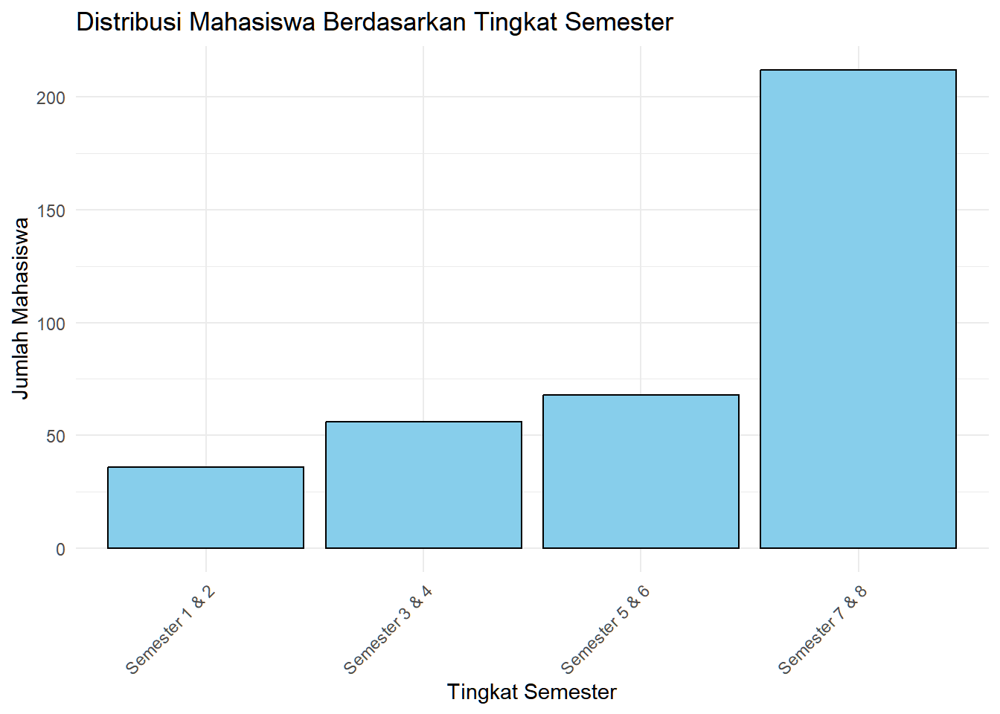

**Interpretasi:** Grafik di atas menunjukkan bahwa mayoritas responden mahasiswa berasal dari tingkat semester 5 & 6, diikuti oleh semester 7 & 8.

**Penjelasan Sintaks (Grammar of Graphics):**

-   **DATA**: `ggplot(data_ubl_cleaned)` mendefinisikan dataset yang digunakan.
-   **GEOM**: `geom_bar(...)` menentukan bentuk geometris yang digunakan, yaitu batang.
-   **MAPPING**: `mapping = aes(x = Tingkat.Semester)` memetakan variabel `Tingkat.Semester` dari data ke sumbu x pada grafik.
-   **STAT**: `geom_bar()` secara default menggunakan `stat = "count"`, yang berarti ia secara otomatis melakukan transformasi statistik dengan menghitung jumlah baris untuk setiap kategori `Tingkat.Semester` dan menampilkannya sebagai ketinggian batang di sumbu y.
-   `fill = "skyblue", color = "black"`: Ini adalah pengaturan properti visual, bukan pemetaan. Kita mengatur semua batang agar memiliki warna isian "skyblue" dan garis tepi "black".
-   `labs(...)`, `theme_minimal()`, `theme(...)`: Ini adalah lapisan tambahan untuk kustomisasi label dan tema, bukan bagian inti dari "grammar".

##### Diagram Batang Bertumpuk *(Stacked)*

Kita bisa menambahkan variabel lain, misalnya `Uang.Saku`, ke dalam `aes()` dengan properti `fill` untuk membuat diagram batang bertumpuk. Ini menunjukkan proporsi uang saku di setiap tingkat semester.

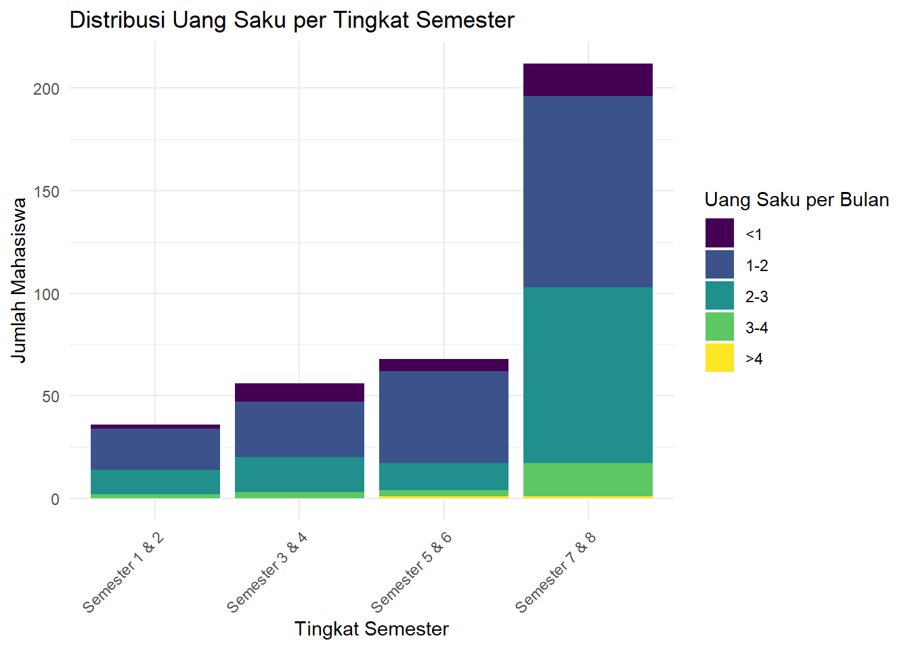

**Interpretasi:** Dari grafik ini, kita bisa melihat komposisi uang saku di setiap angkatan. Misalnya, pada tingkat "Semester 5 & 6", sebagian besar mahasiswa memiliki uang saku antara 1 juta hingga 2 juta. Hal ini kita ketahui dari perbandingan relatif tinggi porsi warna-warna dalam masing-masing batang.

**Penjelasan Sintaks (Grammar of Graphics):**

-   **MAPPING**: `mapping = aes(x = Tingkat.Semester, fill = Uang.Saku)` kini memiliki pemetaan tambahan. Selain sumbu x, kita juga memetakan variabel `Uang.Saku` ke properti visual `fill` (warna isian). `ggplot` akan membuat segmen berwarna berbeda di dalam setiap batang sesuai kategori uang saku.
-   **POSITION**: Secara default, `geom_bar()` menggunakan `position = "stack"` ketika `fill` dipetakan ke sebuah variabel. Inilah yang menyebabkan segmen-segmen tersebut ditumpuk di atas satu sama lain.
-   `labs(fill = "Uang Saku per Bulan")`: Argumen `fill` di dalam `labs()` berfungsi untuk mengubah judul dari legenda yang secara otomatis dibuat dari pemetaan `fill`.

Untuk membandingkan jumlah absolut antar kategori uang saku, diagram batang berkelompok lebih efektif. Kita gunakan `position = "dodge"`.

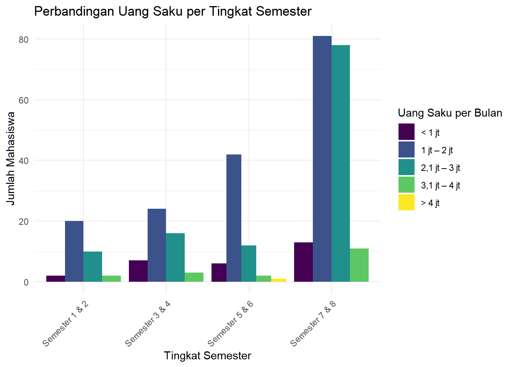

**Interpretasi:** Grafik ini mempermudah perbandingan langsung. Terlihat jelas bahwa kategori uang saku "1 jt – 2 jt" mendominasi di hampir semua tingkat semester.

-   **POSITION**: Komponen `position` diubah secara eksplisit menjadi `position = "dodge"`. Ini menginstruksikan `ggplot` untuk menempatkan batang-batang yang memiliki kategori x yang sama (misalnya, "Semester 5 & 6") bersebelahan, bukan menumpuknya. Ini memungkinkan perbandingan langsung antar kategori `Uang.Saku`.

Terkadang kita lebih tertarik pada perbandingan proporsi antar grup daripada jumlah absolutnya. Dengan mengubah `position` menjadi `"fill"`, kita dapat membuat setiap batang memiliki tinggi yang sama (100%) dan menunjukkan persentase relatif dari setiap subgrup.

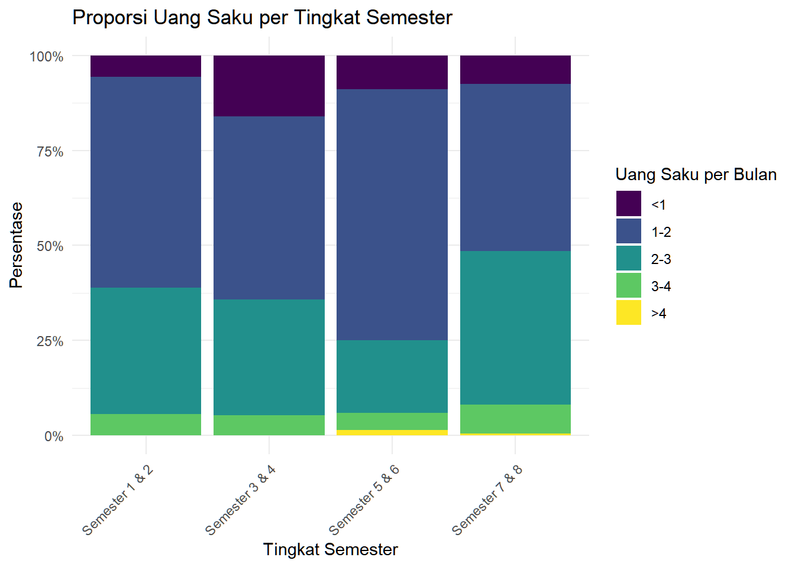

**Interpretasi:** Grafik ini menunjukkan bahwa secara proporsional, mahasiswa dengan kategori uang saku tertinggi ("\>4jt") yang paling dominan terdapat pada tingkat 3 ("Semester 5 & 6"). Sementara itu, mahasiswa kategori uang saku terrendah paling banyak porsinya pada tingkat 2 ("Semester 3 & 4"). Ini adalah wawasan yang mungkin tidak terlihat jelas pada grafik jumlah absolut.

**Penjelasan Sintaks (Grammar of Graphics):**

-   **POSITION**: Komponen `position` diubah menjadi `position = "fill"`. Pengaturan ini secara otomatis melakukan transformasi **STAT** yang berbeda: ia menghitung proporsi dari setiap subgrup (`Uang.Saku`) dalam setiap grup (`Tingkat.Semester`). Hasilnya adalah setiap batang dinormalisasi menjadi setinggi 1 (atau 100%).

-   **SCALE**: `scale_y_continuous(labels = scales::percent)` adalah lapisan tambahan yang mengontrol **SKALA** pada sumbu y. Fungsi `scales::percent` digunakan untuk memformat label sumbu dari angka desimal (misal: 0.5) menjadi format persentase (misal: 50%) agar lebih mudah dibaca.

::: {.rmdexercise}
**Aktivitas Mandiri 1: Membuat dan Menginterpretasikan Diagram Batang [STP-3.2, STP-3.3]**

Buatlah diagram batang untuk variabel `Fakultas`:

1. **Diagram batang sederhana** - gunakan `geom_bar()`
2. **Diagram batang bertumpuk** dengan `Uang.Saku` sebagai fill
3. **Diagram batang berkelompok** dengan `position = "dodge"` dan interpretasikan hasilnya:
   - Fakultas mana yang paling banyak mahasiswa dengan uang saku >2jt?
   - Bagaimana pola distribusi uang saku antar fakultas?
   - Apakah ada fakultas yang dominan memiliki mahasiswa dengan uang saku tertentu?
:::

### Diagram Lollipop

Diagram lolipop adalah alternatif dari diagram batang yang dapat mengurangi tinta visual dan memberikan penekanan lebih pada nilai data. Grafik ini menggunakan segmen garis dan titik untuk merepresentasikan nilai. Ini sangat efektif untuk menampilkan data kategoris yang banyak kategorinya.


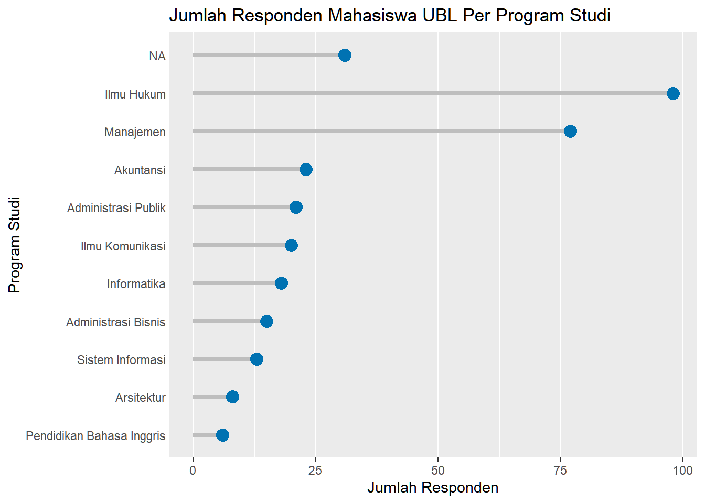

**Interpretasi:** Grafik ini menunjukkan bahwa kebanyakan responden berasal dari program studi Ilmu Hukum dan Manajemen, dengan perbandingan yang cukup timpang dengan prodi-prodi lain. Selain itu, ternyata cukup dominan mahasiswa yang tidak memberikan data prodi mereka (NA) di antara prodi-prodi selain dua yang tertinggi tadi.

**Penjelasan Sintaks (Grammar of Graphics):**

-   **DATA & STAT**: Sama seperti contoh sebelumnya, kita melakukan pra-pemrosesan data menggunakan `dplyr`. Kita mengelompokkan data berdasarkan `Prodi`, menghitung (`count`) jumlahnya, mengurutkan (`arrange`), dan yang terpenting, mengubah `Prodi` menjadi variabel faktor yang terurut (`fct_inorder`) agar plot ditampilkan sesuai urutan yang kita inginkan.
-   **GEOM & MAPPING (Layering)**: Di sinilah keunikan diagram lolipop. Kita menggunakan **dua lapisan `geom`**:
    -   `geom_segment()`: Digunakan untuk membuat "batang" atau segmen garis. **Mapping**-nya membutuhkan empat estetika: `x` dan `xend` (yang sama untuk garis vertikal) serta `y` (titik awal, yaitu 0) dan `yend` (titik akhir, yaitu `jumlah`).
    -   `geom_point()`: Digunakan untuk membuat "permen" atau titik di ujung segmen. **Mapping**-nya lebih sederhana, hanya membutuhkan `x` dan `y`.
-   **KOORDINAT**: `coord_flip()` digunakan untuk membalik sumbu, membuat diagram lolipop horizontal yang seringkali lebih mudah dibaca label kategorinya.
-   **THEME**: Lapisan tema digunakan untuk membersihkan tampilan, seperti menghilangkan beberapa garis grid dan batas panel untuk menonjolkan data itu sendiri.

### Diagram Pai/Donat *(Pie/Donut Chart)*

Diagram pai (dan variasinya, diagram donat) digunakan untuk menunjukkan proporsi dari sebuah keseluruhan. Meskipun populer, diagram pai seringkali sulit untuk dibaca secara akurat, terutama ketika ada banyak irisan atau ukurannya mirip. Diagram donat sedikit lebih baik karena mengurangi penekanan pada sudut dan lebih fokus pada panjang busur.

Di `ggplot2`, diagram pai dibuat dengan memulai dari diagram batang bertumpuk, lalu mengubah sistem **KOORDINAT**-nya menjadi koordinat polar. Akan tetapi, dalam `ggplot2` kita tidak bisa membuat diagram pai langsung dari datasetnya, tetapi kita harus membentuk **tabel distribusi frekuensinya** terlebih dahulu.


```
##                                Fakultas jumlah     persen
## 1           Fakultas Ekonomi dan Bisnis    104 0.31515152
## 2                        Fakultas Hukum     98 0.29696970
## 3                Fakultas Ilmu Komputer     29 0.08787879
## 4      Fakultas Ilmu Sosial dan Politik     52 0.15757576
## 5 Fakultas Keguruan dan Ilmu Pendidikan      6 0.01818182
## 6                       Fakultas Teknik     41 0.12424242
```

Baru kemudian kita bisa menghasilkan perintah `ggplot` untuk

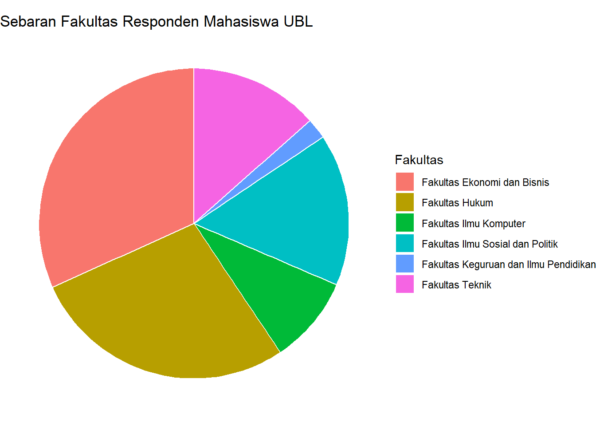

**Interpretasi:** Diagram donat ini menunjukkan proporsi dari setiap fakultas. Terlihat jelas bahwa irisan "Fakultas Ekonomi dan Bisnis" dan "Fakultas Hukum" mendominasi porsi responden.

**Penjelasan Sintaks (Grammar of Graphics):**

-   **DATA & STAT**: Kita menggunakan data `alasan_counts` yang sudah diagregasi, lalu menambahkan kolom baru untuk persentase (`persen`) dan posisi vertikal untuk label (`posisi_y_label`).
-   **GEOM & MAPPING**: Kita mulai dengan `geom_bar(stat = "identity")` yang membuat diagram batang di mana tinggi batang (`y`) adalah nilai persentase itu sendiri. `x=2` adalah trik untuk membuat satu batang tunggal yang akan kita "lilit".
-   **KOORDINAT**: `coord_polar(theta = "y")` adalah komponen kunci. Ini mengambil diagram batang dan mengubah sistem koordinatnya dari Kartesius (x,y) menjadi Polar. Sumbu y "dibengkokkan" menjadi sebuah lingkaran.
-   `theme_void()`: Menghilangkan semua elemen tema seperti sumbu, label sumbu, dan latar belakang, yang tidak relevan untuk diagram pai/donat.
-   kita bisa menambahkan lubang di tengah pai dengan menambahkan `xlim(0.5, 2.5)` yang merupakan batas dalam dan batas luar dari radius si diagram seperti berikut.

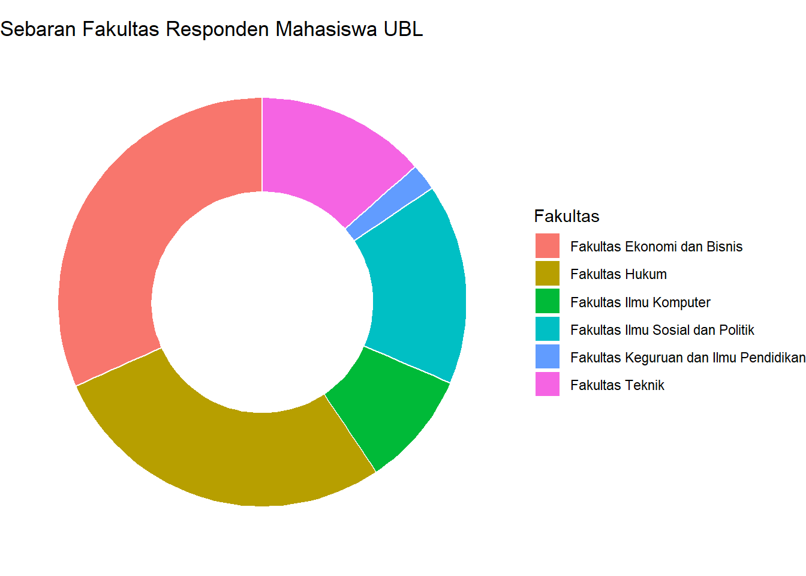

> ⚠️**Penting**
>
> Komunitas perupa data pada dasarnya menganjurkan kita untuk 'menghindari' diagram lingkaran. Hal ini bisa kalian baca di [laman ini](https://www.data-to-viz.com/caveat/pie.html). Alternatifnya, mereka lebih menyarankan kita untuk menggunakan diagram batang atau diagram lollipop saja

### Diagram *Treemap*

Treemap adalah alternatif lain untuk diagram pai, terutama efektif ketika Anda memiliki banyak kategori. Treemap menampilkan data hierarkis atau bagian-ke-keseluruhan sebagai satu set persegi panjang bersarang. Ukuran setiap persegi panjang sebanding dengan nilainya.

Untuk membuat treemap, kita perlu paket tambahan yaitu `treemapify`.


Kita akan membuat *treemap* dari alasan mahasiswa memilih tempat tinggal mereka


```
##             alasan_singkat jumlah
## 1         Bersama Keluarga    247
## 2                    Murah     16
## 3 Dekat Kampus/lokasi lain     35
## 4        Fasilitas Lengkap      1
## 5               Lain-lain       2
## 6                     Aman     29
```

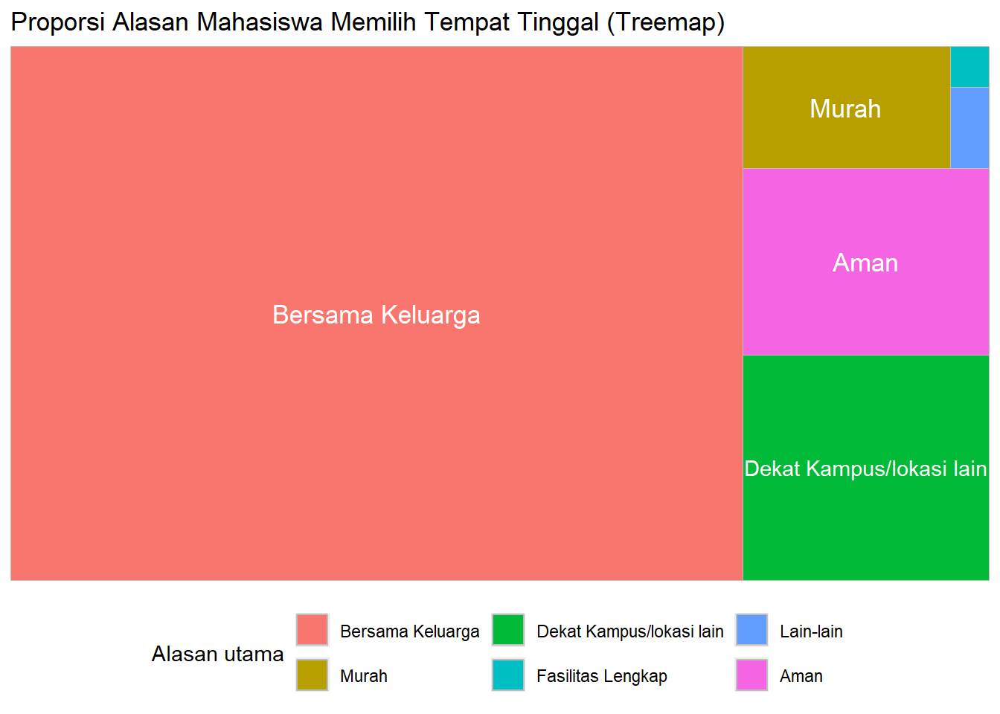

**Penjelasan Sintaks (Grammar of Graphics):**

-   **DATA**: Kita menggunakan data `alasan_counts` yang sudah diagregasi.
-   **GEOM & MAPPING**: Paket `treemapify` menyediakan `geom` baru yang terintegrasi dengan `ggplot2`.
    1.  `geom_treemap()`: Ini adalah `geom` utama. Alih-alih `x` dan `y`, **MAPPING** utamanya adalah `aes(area = jumlah)`. `ggplot` akan secara otomatis menghitung tata letak persegi panjang berdasarkan nilai `jumlah`. Kita juga memetakan `alasan_singkat` ke `fill` untuk warna dan `label` untuk teks.
    2.  `geom_treemap_text()`: Ini adalah `geom` tambahan khusus untuk menempatkan teks di dalam setiap area treemap.
-   **THEME**: Kita bisa menyembunyikan legenda karena setiap area sudah diberi label secara langsung, sehingga legenda menjadi berlebihan. Caranya adalah mengatur nilai `bottom =` menjadi `"none"`. Akan tetapi, untuk kasus kita, kita punya area yang terlalu kecil untuk diberi label, sehingga kita tetap tampilkan legenda.

### Histogram

Histogram digunakan untuk melihat distribusi dari variabel numerik/kontinu, seperti `Umur`.

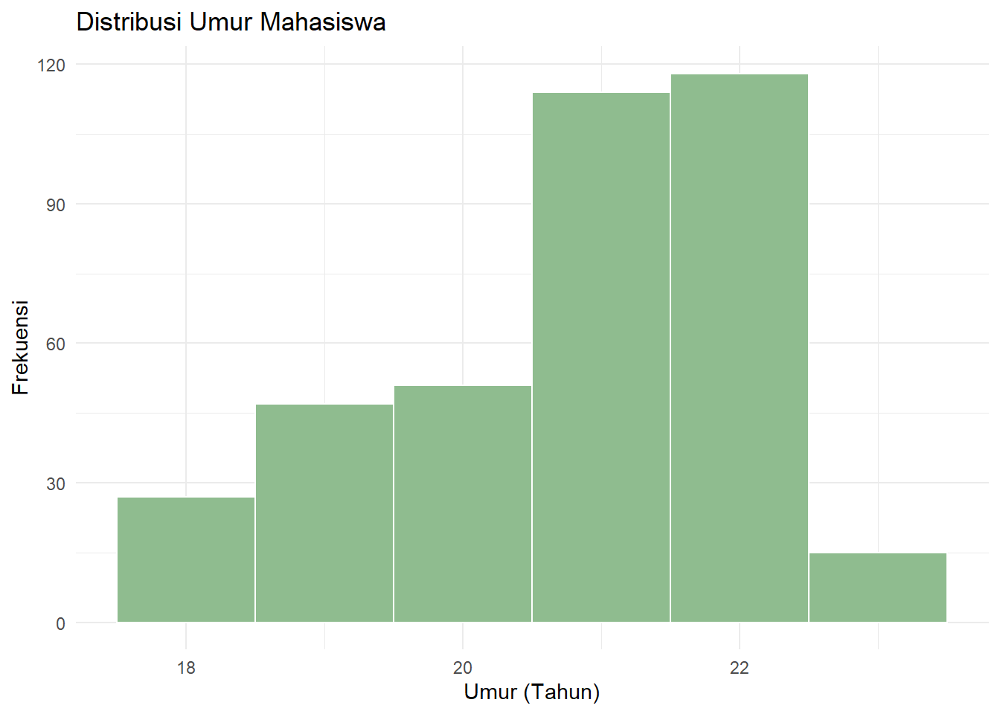

**Penjelasan Sintaks (Grammar of Graphics):**

-   **DATA**: `ggplot(data_ubl_cleaned)` mendefinisikan dataset.
-   **GEOM**: `geom_histogram(...)` menentukan bentuk geometris berupa histogram.
-   **MAPPING**: `mapping = aes(x = Umur)` memetakan variabel numerik `Umur` ke sumbu x.
-   **STAT**: `geom_histogram` memiliki `stat = "bin"` sebagai defaultnya. Transformasi statistik ini akan membagi data `Umur` ke dalam beberapa rentang (bins) yang lebarnya diatur oleh `binwidth = 1`, lalu menghitung frekuensi data di setiap rentang tersebut untuk ditampilkan di sumbu y.

### *Boxplot*

Box plot berguna untuk membandingkan distribusi variabel numerik di antara beberapa grup/kategori. Mari kita bandingkan distribusi jarak tempat tinggal (`jarak`) untuk setiap jenis kendaraan utama.

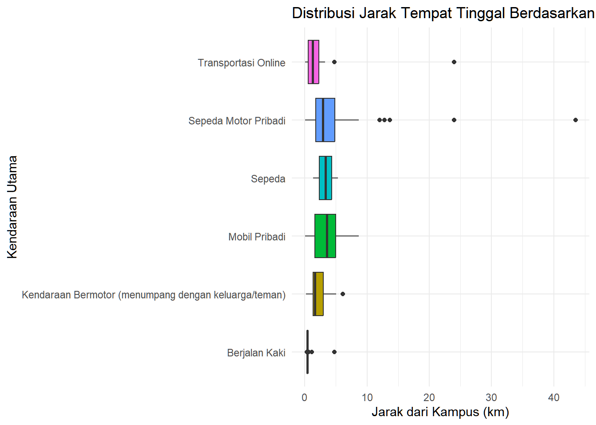

**Interpretasi:** Box plot ini menunjukkan bahwa mahasiswa yang menggunakan mobil pribadi cenderung memiliki rentang jarak tempat tinggal yang lebih bervariasi dan median yang sedikit lebih tinggi dibandingkan pengguna sepeda motor. Pengguna ojek online memiliki median jarak yang paling rendah di antara kategori lainnya.

**Penjelasan Sintaks (Grammar of Graphics):**

-   **DATA**: `ggplot(data_ubl_cleaned)` mendefinisikan dataset.

-   **GEOM**: `geom_boxplot(...)` menentukan bentuk geometris berupa diagram kotak.

-   **MAPPING**: `mapping = aes(x = kendaraan.utama, y = \`jarak.(km)\`, fill = kendaraan.utama)`memetakan tiga hal: variabel kategori`kendaraan.utama`ke sumbu x, variabel numerik`jarak.(km)`ke sumbu y, dan`kendaraan.utama`ke warna isian`fill\`.

-   **STAT**: `geom_boxplot` secara default menggunakan `stat_boxplot`, yang menghitung ringkasan lima angka (minimum, Q1, median, Q3, maksimum) untuk setiap grup di sumbu x.

-   **KOORDINAT**: `coord_flip()` secara eksplisit mengubah sistem koordinat dengan membalik sumbu x dan y. Ini adalah komponen terpisah yang diterapkan setelah komponen lainnya.

-   `theme(legend.position = "none")`: Kustomisasi lapisan tema untuk menyembunyikan legenda.

### Grafik Pencar *(Scatter Plot)*

Scatter plot ideal untuk melihat hubungan antara dua variabel numerik. Mari kita lihat hubungan antara `Umur` dan `jarak` tempat tinggal.

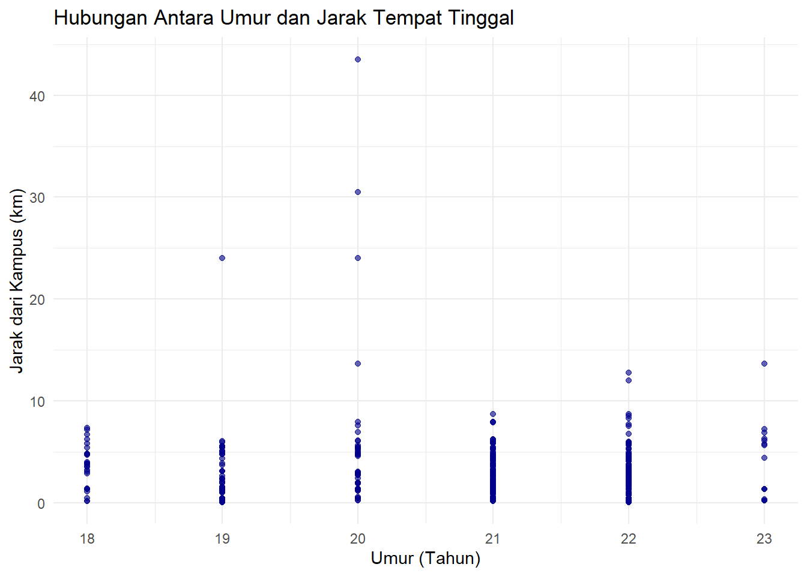

**Interpretasi:** Grafik ini tidak menunjukkan adanya pola atau hubungan yang jelas antara umur mahasiswa dan jarak tempat tinggal mereka dari kampus. Titik-titik tersebar secara acak.

**Penjelasan Sintaks (Grammar of Graphics):**

-   **DATA**: `ggplot(data_ubl_cleaned)` mendefinisikan dataset.
-   **GEOM**: `geom_point(...)` menentukan bentuk geometris berupa titik.
-   **MAPPING**: `mapping = aes(x = Umur, y = \`jarak.(km)\`)`memetakan dua variabel,`Umur`ke sumbu x dan`jarak.(km)\` ke sumbu y. Setiap baris data akan menjadi satu titik pada plot.
-   `alpha = 0.6` dan `color = "darkblue"` adalah pengaturan properti visual untuk semua titik.

Penting untuk menjaga konteks dalam interpretasi. Scatter plot kita menunjukkan bahwa mahasiswa yang lebih tua cenderung tinggal lebih jauh dari kampus. Namun, untuk benar-benar memahami kekuatan hubungan ini, kita perlu menggunakan statistik korelasi (akan dipelajari di modul selanjutnya).

::: {.rmdexercise}
**Aktivitas Mandiri 2: Histogram dan Boxplot untuk Variabel Numerik [STP-3.2, STP-3.3]**

Gunakan variabel `jarak` (jarak tempat tinggal dari kampus):

1. **Buat histogram** dengan `binwidth = 2` dan interpretasikan:
   - Apakah distribusi jarak simetris atau menceng (skewed)?
   - Pada rentang jarak berapa frekuensi mahasiswa paling tinggi?
   - Apakah ada pola tertentu dalam distribusi jarak?

2. **Buat boxplot** yang membandingkan `jarak` berdasarkan `Tingkat.Semester` dan interpretasikan:
   - Tingkat semester mana yang rata-rata (median) tinggal paling jauh dari kampus?
   - Apakah ada outlier? Jika ada, pada tingkat semester mana?
   - Bagaimana variabilitas jarak pada setiap tingkat semester?
:::

::: {.rmdexercise}
**Aktivitas Mandiri 3: Visualisasi Komprehensif untuk `biaya_dalam_sepekan` [STP-3.1, STP-3.2, STP-3.3, STP-3.4]**

**A. Menghasilkan Grafik [STP-3.3]:**

1. Buat **histogram** untuk `biaya_dalam_sepekan`
   - Coba beberapa nilai `binwidth` (misal: 20, 50, atau 100) dan pilih yang paling informatif
   - Tambahkan judul dan label sumbu yang jelas

2. Buat **boxplot** untuk `biaya_dalam_sepekan` berdasarkan `kendaraan.utama`
   - Gunakan `geom_boxplot()` dengan `fill` berdasarkan kendaraan
   - Tambahkan label yang jelas

3. Buat **scatter plot** untuk `Umur` vs `biaya_dalam_sepekan`
   - Tambahkan `geom_point()` dengan `alpha = 0.5` untuk transparansi
   - Pertimbangkan menambahkan `geom_smooth(method = "lm")` untuk melihat trend

**B. Pemilihan Visualisasi dan Tingkat Pengukuran [STP-3.1, STP-3.4]:**

4. **Mengapa histogram cocok untuk `biaya_dalam_sepekan`?**
   - Jelaskan kaitannya dengan tingkat pengukuran variabel (metrik/rasio)
   - Informasi apa yang bisa diperoleh dari histogram? (distribusi, spread, outlier)

5. **Apakah scatter plot cocok untuk `Jenis.Kelamin` vs `Umur`? Mengapa tidak?**
   - Jelaskan kaitannya dengan tingkat pengukuran variabel
   - Diagram apa yang lebih sesuai untuk membandingkan umur berdasarkan jenis kelamin?

**C. Interpretasi Mendalam [STP-3.2]:**

6. **Dari histogram no.1:**
   - Berapa rentang biaya yang paling sering muncul (modus)?
   - Apakah distribusinya simetris, menceng kanan, atau menceng kiri?
   - Apakah ada outlier (nilai ekstrem)?

7. **Dari boxplot no.2:**
   - Kendaraan apa yang memiliki median biaya tertinggi?
   - Kendaraan apa yang paling bervariasi biayanya (IQR terbesar)?
   - Apakah ada outlier? Pada jenis kendaraan apa?

8. **Dari scatter plot no.3:**
   - Apakah ada pola hubungan antara umur dan biaya transportasi?
   - Jika ada trend line, apakah slopenya positif atau negatif?
   - Apa interpretasi kontekstualnya?

**D. Dokumentasi [STP-3.3]:**

9. Kumpulkan file modul ini dengan:
   - Seluruh kode diagram yang sudah Anda buat di modul ini
   - Seluruh interpretasi dan analisis untuk setiap diagram
   - Screenshot atau output grafik yang sudah dihasilkan
:::

------------------------------------------------------------------------


<!--chapter:end:03-visualisasi-data.Rmd-->

# Modul-4: Distribusi Sampling dan Interval Kepercayaan

Setelah mempelajari modul ini, Anda diharapkan dapat:

1. menghasilkan distribusi statistik sampel dan menghitung standard error-nya [STP-4.3]{.capaian}
2. menghasilkan interval kepercayaan dengan menggunaan perangkat lunak komputer [STP-5.2]{.capaian}


---

## Pendahuluan

Dalam statistika inferensial, kita seringkali ingin mengetahui karakteristik dari sebuah populasi (misalnya, rata-rata uang saku seluruh mahasiswa di Indonesia). Namun, mengumpulkan data dari seluruh populasi seringkali tidak memungkinkan. Sebagai solusinya, kita mengambil sampel acak dari populasi tersebut dan menggunakan statistik dari sampel (seperti rata-rata sampel) untuk menduga parameter populasi.

Modul ini akan membahas dua konsep fundamental dalam statistika inferensial: **Distribusi Sampling** dan **Interval Kepercayaan** untuk rata-rata dan proporsi. Kita akan menggunakan studi kasus data jarak tempuh mahasiswa dari empat universitas di Bandar Lampung dan sekitarnya untuk memahami bagaimana konsep ini diterapkan dalam praktik.

## Perangkat Lunak dan Pustaka (Libraries)

Pastikan Anda telah menginstal pustaka `tidyverse` yang akan sangat membantu dalam proses manipulasi dan visualisasi data.


``` r
library(tidyverse)
library(readr)
```

## Memuat dan Mempersiapkan Data

Langkah pertama adalah memuat data survei mahasiswa dari empat universitas. Kita akan menggabungkan dan membersihkan data tersebut untuk analisis. Variabel yang akan menjadi fokus kita adalah **jarak tempuh (km)** dan **jenis tempat tinggal**.


``` r
# Membaca 4 file CSV
df_uinril <- read_csv2("datasets/DataUtama_mhsUINRIL.csv")
df_ubl <- read_csv2("datasets/DataUtama_mhsUBL.csv")
df_unila <- read_csv2("datasets/DataUtama_mhsUNILA.csv")
df_itera <- read_csv2("datasets/DataUtama_mhsITERA.csv")

# Membersihkan dan menggabungkan data
# Perhatikan: UNILA memiliki nama kolom dengan huruf besar "Jenis Tempat Tinggal"
data_mahasiswa <- bind_rows(
  df_uinril |>
    select(
      kampus = kampus,
      jarak_km = jarak.km,
      jenis_tinggal = jenis.tempat.tinggal
    ),
  df_ubl |>
    select(
      kampus = kampus,
      jarak_km = jarak.km,
      jenis_tinggal = jenis.tempat.tinggal
    ),
  df_unila |>
    select(
      kampus = kampus,
      jarak_km = jarak.km,
      jenis_tinggal = `Jenis Tempat Tinggal`  # Perhatikan: huruf kapital
    ),
  df_itera |>
    select(
      kampus = kampus,
      jarak_km = jarak.km,
      jenis_tinggal = jenis.tempat.tinggal
    )
) |>
  drop_na(jarak_km, jenis_tinggal) |> # menghilangkan missing values
  mutate(
    jarak_km = as.numeric(jarak_km),
    tipe_tinggal_baku = case_when(
      grepl("Kos", jenis_tinggal, ignore.case = TRUE) ~ "Kos/Asrama",
      grepl("Asrama", jenis_tinggal, ignore.case = TRUE) ~ "Kos/Asrama",
      TRUE ~ "Rumah Keluarga/Pribadi"
    )
  ) |>
  filter(jarak_km > 0 & jarak_km < 100) # membatasi jarak yang realistis

# Menampilkan beberapa baris pertama dari data gabungan
head(data_mahasiswa)
```

```
## # A tibble: 6 × 4
##   kampus jarak_km jenis_tinggal                 tipe_tinggal_baku     
##   <chr>     <dbl> <chr>                         <chr>                 
## 1 UINRIL    19.3  Rumah bersama saudara         Rumah Keluarga/Pribadi
## 2 UINRIL     0.58 Kos sendiri                   Kos/Asrama            
## 3 UINRIL     0.56 Kos sendiri                   Kos/Asrama            
## 4 UINRIL     1.05 Kos sendiri                   Kos/Asrama            
## 5 UINRIL     1.69 Rumah mengontrak bersama-sama Rumah Keluarga/Pribadi
## 6 UINRIL     7.91 Rumah pribadi/rumah keluarga  Rumah Keluarga/Pribadi
```

``` r
# Menampilkan ringkasan data
summary(data_mahasiswa)
```

```
##     kampus             jarak_km        jenis_tinggal      tipe_tinggal_baku 
##  Length:1600        Min.   : 0.06352   Length:1600        Length:1600       
##  Class :character   1st Qu.: 1.31127   Class :character   Class :character  
##  Mode  :character   Median : 2.90884   Mode  :character   Mode  :character  
##                     Mean   : 3.62552                                        
##                     3rd Qu.: 5.14000                                        
##                     Max.   :43.54519
```

``` r
# Menampilkan frekuensi jenis tempat tinggal yang sudah dibakukan
table(data_mahasiswa$tipe_tinggal_baku)
```

```
## 
##             Kos/Asrama Rumah Keluarga/Pribadi 
##                    639                    961
```

> **Penjelasan `case_when()`**:
>
> Fungsi `case_when()` (bagian dari `dplyr`) sangat berguna untuk membuat variabel baru berdasarkan serangkaian aturan kondisional, mirip seperti pernyataan `IF-ELSE IF-ELSE`. Di dalam `mutate()`, kita membuat kolom baru bernama `tipe_tinggal_baku`.
>
> -   **Aturan pertama**: `str_detect(tolower(jenis_tinggal), "kos|asrama|rusunawa") ~ "Kos/Asrama"`
>
>     -   `tolower(jenis_tinggal)`: Mengubah semua teks di kolom `jenis_tinggal` menjadi huruf kecil agar pencarian tidak sensitif terhadap huruf besar/kecil.
>
>     -   `str_detect(...)`: Fungsi ini memeriksa apakah sebuah teks mengandung pola tertentu.
>
>     -   `"kos|asrama|rusunawa"`: Ini adalah polanya. Tanda `|` berarti "ATAU". Jadi, fungsi ini mencari kata "kos" ATAU "asrama" ATAU "rusunawa".
>
>     -   `~ "Kos/Asrama"`: Jika salah satu kata kunci ditemukan, maka nilai untuk kolom `tipe_tinggal_baku` adalah "Kos/Asrama".
>
> -   **Aturan kedua**: `TRUE ~ "Rumah Keluarga/Pribadi"`
>
>     -   `TRUE`: Ini adalah kondisi "penampung" atau *default*. Jika tidak ada kondisi sebelumnya yang terpenuhi, aturan ini akan dijalankan.
>
>     -   `~ "Rumah Keluarga/Pribadi"`: Memberi nilai "Rumah Keluarga/Pribadi" untuk semua baris yang tidak cocok dengan aturan pertama.
>
> Singkatnya, kode ini membakukan data `jenis_tinggal` yang bervariasi menjadi dua kategori yang bersih dan konsisten untuk analisis proporsi.

Pada tahap ini, kita menganggap data gabungan dari 1.206 mahasiswa sebagai **"populasi"** kita untuk tujuan simulasi.

## Distribusi *Sampling* dan *Standard Error*

Distribusi *sampling* adalah distribusi dari suatu statistik (misalnya, rata-rata) yang dihitung dari semua kemungkinan sampel dengan ukuran yang sama yang diambil dari sebuah populasi. Ini adalah istilah lain dari **distribusi statistik sampel**.

Teorema Limit Pusat (*Central Limit Theorem*) menyatakan bahwa jika kita mengambil sampel yang cukup besar, distribusi *sampling* dari rata-rata akan mendekati distribusi normal.

### Mendefinisikan Parameter Populasi

Pertama, mari kita hitung rata-rata dan standar deviasi "populasi" kita sebagai acuan.


``` r
# Menghitung rata-rata jarak "populasi"
pop_mean <- mean(data_mahasiswa$jarak_km)
# Menghitung standar deviasi jarak "populasi"
pop_sd <- sd(data_mahasiswa$jarak_km)

paste("Rata-rata Jarak Populasi (μ):", round(pop_mean, 2), "km")
```

```
## [1] "Rata-rata Jarak Populasi (μ): 3.63 km"
```

``` r
paste("Standar Deviasi Populasi (σ):", round(pop_sd, 2), "km")
```

```
## [1] "Standar Deviasi Populasi (σ): 3.35 km"
```

### Simulasi Pengambilan Sampel

Sekarang, kita akan mensimulasikan proses pengambilan sampel secara berulang. Kita akan mengambil 1000 sampel acak, masing-masing berukuran 50 mahasiswa (`n=50`), lalu menghitung rata-rata jarak untuk setiap sampel.


``` r
# Menetapkan parameter simulasi
ukuran_sampel <- 50
jumlah_simulasi <- 1000

# Menjalankan simulasi
set.seed(123) # Untuk hasil yang dapat direproduksi. Silakan ganti seed sesuai keinginan Anda.
# 'replicate' akan menjalankan ekspresi kedua sebanyak 'jumlah_simulasi' kali
rataan_sampel <- replicate(jumlah_simulasi, {
  sampel_jarak <- sample(data_mahasiswa$jarak_km, ukuran_sampel)
  mean(sampel_jarak)
})

# Membuat dataframe dari hasil simulasi
df_sampling <- data.frame(rataan_sampel)
head(df_sampling)
```

```
##   rataan_sampel
## 1      3.393546
## 2      4.115982
## 3      3.263581
## 4      4.171112
## 5      3.345113
## 6      3.373455
```

::: {.rmdexercise}
**Aktivitas Mandiri 1: Simulasi dengan Parameter Berbeda [STP-4.3]**

Modifikasi kode simulasi di atas:
1. Ubah `ukuran_sampel` menjadi 30 (dari 50)
2. Ubah `jumlah_simulasi` menjadi 500 (dari 1000)
3. Hitung ulang SE empiris dan teoritis
4. Buat histogram distribusi sampling yang baru
5. Bandingkan:
   - Bagaimana bentuk distribusi berubah dengan n=30 vs n=50?
   - Apakah SE empiris dan teoritis masih dekat?
:::

### Visualisasi Distribusi Sampling

Kumpulan dari 1000 rata-rata sampel inilah yang membentuk **distribusi sampling**. Mari kita visualisasikan dalam bentuk histogram.


``` r
# Visualisasi Distribusi Sampling dengan Histogram
ggplot(df_sampling, aes(x = rataan_sampel)) +
  geom_histogram(aes(y = ..density..), bins = 30, fill = "skyblue", color = "black", alpha = 0.7) +
  geom_density(color = "red", size = 1) +
  geom_vline(xintercept = pop_mean, color = "blue", linetype = "dashed", size = 1.2) +
  labs(
    title = "Distribusi Sampling dari Rata-rata Jarak Tempuh",
    subtitle = paste("Ukuran Sampel (n) =", ukuran_sampel, "| Jumlah Simulasi =", jumlah_simulasi),
    x = "Rata-rata Jarak Sampel (km)",
    y = "Densitas"
  ) +
  annotate("text", x = pop_mean * 1.1, y = 0.1, label = paste("μ =", round(pop_mean, 2)), color = "blue") +
  theme_minimal()
```


Perhatikan bagaimana distribusi dari rata-rata sampel berbentuk seperti lonceng (mendekati normal) dan berpusat di sekitar rata-rata populasi (garis biru putus-putus).

### Menghitung *Standard Error* (SE)

*Standard Error* (SE) adalah standar deviasi dari distribusi sampling. Ini mengukur seberapa besar variasi rata-rata sampel di sekitar rata-rata populasi. SE dapat dipahami dari dua perspektif: satu dari sisi teori dalam simulasi, dan satu lagi dari sisi praktik ketika kita hanya memiliki satu sampel.

1.  **Empiris (dari simulasi)**: Menghitung standar deviasi dari 1000 rata-rata sampel yang kita hasilkan.

2.  **Teoritis (dari populasi)**: Menggunakan rumus $SE=\frac{\sigma}{\sqrt{n}}$, di mana $σ$ adalah standar deviasi populasi dan $n$ adalah ukuran sampel.

3.  **Estimasi (dari sampel)**: Dalam praktik statistika inferensial, kita hampir tidak pernah mengetahui . Oleh karena itu, kita mengestimasinya menggunakan standar deviasi dari sampel kita sendiri (s). Rumusnya menjadi $SE=\frac{s}{\sqrt{n}}$. **Inilah nilai yang sebenarnya digunakan saat kita membuat interval kepercayaan atau melakukan uji hipotesis dari data sampel nyata.**


``` r
# 1. Standard Error Empiris (dari 1000 sampel)
se_empiris <- sd(df_sampling$rataan_sampel)

# 2. Standard Error Teoritis (menggunakan info populasi)
se_teoritis <- pop_sd / sqrt(ukuran_sampel)

paste("Standard Error (Empiris, dari simulasi):", round(se_empiris, 3))
```

```
## [1] "Standard Error (Empiris, dari simulasi): 0.452"
```

``` r
paste("Standard Error (Teoritis, dari populasi):", round(se_teoritis, 3))
```

```
## [1] "Standard Error (Teoritis, dari populasi): 0.474"
```

Mari kita hitung estimasi standard error dari satu sampel acak yang akan kita gunakan nanti di Bagian 4.5.


``` r
# Mengambil satu sampel acak (sama seperti di Bagian 4.1)
set.seed(42)
sampel_tunggal_untuk_se <- sample(data_mahasiswa$jarak_km, ukuran_sampel)
sd_sampel_tunggal <- sd(sampel_tunggal_untuk_se)

# 3. Estimasi Standard Error (dari satu sampel, kasus nyata)
se_estimasi <- sd_sampel_tunggal / sqrt(ukuran_sampel)
paste("Estimasi Standard Error (dari satu sampel):", round(se_estimasi, 3))
```

```
## [1] "Estimasi Standard Error (dari satu sampel): 0.307"
```

Perhatikan bahwa nilai SE Empiris dan Teoritis sangat dekat karena berasal dari simulasi di mana parameter populasi diketahui. Nilai SE Estimasi akan bervariasi tergantung sampel mana yang kita ambil, namun nilai inilah yang paling realistis untuk digunakan dalam analisis nyata.

## Estimasi Parameter-1: Interval Kepercayaan Rata-rata

Untuk bagian ini kita akan menggunakan *library* bernama `MKinfer`yang berguna untuk menghasilkan interval kepercayaan sebagai estimasi rentang.

Lakukan instalasi *library* ini dengan perintah berikut.


``` r
install.packages("MKinfer")
```

Kemudian muat paket `MKinfer` tersebut.


``` r
library(MKinfer)
```

### Mengambil Satu Sampel


``` r
# Kita gunakan sampel yang sudah dibuat sebelumnya
sampel_tunggal <- sampel_tunggal_untuk_se
mean_sampel_tunggal <- mean(sampel_tunggal)

cat(paste("Rata-rata Sampel Tunggal:", round(mean_sampel_tunggal, 2), "km\n"))
```

```
## Rata-rata Sampel Tunggal: 3.46 km
```

``` r
cat(paste("Standar Deviasi Sampel Tunggal:", round(sd_sampel_tunggal, 2), "km\n"))
```

```
## Standar Deviasi Sampel Tunggal: 2.17 km
```

### Menghasilkan Interval Kepercayaan


``` r
# Menghitung interval kepercayaan 95% menggunakan MKinfer
hasil_ci_mean <- meanCI(sampel_tunggal, conf.level = 0.95)

# Menampilkan hasil
hasil_ci_mean
```

```
## 
## 	Exact confidence interval(s)
## 
## 95 percent confidence interval:
##         2.5 %   97.5 %
## mean 2.845641 4.081422
## 
## sample estimates:
##     mean       sd 
## 3.463532 2.174163 
## 
## additional information:
## SE of mean 
##   0.307473
```

Hasil dari fungsi `meanCI` tersebut langsung menunjukkan rentang kepercayaan yang limit bawahnya ditunjukkan oleh angka di bawah `2.5%`dan limit atasnya oleh angka di bawah `97.5%`. Nilai-nilai ini adalah nilai $\alpha/2$ yang dibagi dua ke kiri dan kanan grafik.

**Pertanyaan**

Berapakah rentang kepercayaan untuk rata-rata jarak tempat tinggal dari kampus dari sampel kita? Tuliskan interpretasinya yang tepat. Bandingkan dengan rata-rata parameter


``` r
# Jawablah pertanyaan di atas dengan menuliskannya sebagai komentar di chunk ini
# Rentang kepercayaannya adalah 2,81 - 3,95 km

# Apa interpretasi dari hasil ini?
# Rata-rata jarak dari kampus untuk tempat tinggal seluruh mahasiswa berada di rentang 2,81 - 3,95 km. Jika dibandingkan dengan rata-rata populasi, rata-rata populasi ternyata masuk di rentang ini.
pop_mean
```

```
## [1] 3.625515
```

## Estimasi Parameter-2: Interval Kepercayaan Proporsi

Selain rata-rata, kita juga sering tertarik untuk mengestimasi proporsi dari suatu kategori dalam populasi. Contohnya, berapa persentase mahasiswa yang tinggal di kos/asrama? Prosesnya mirip: kita mengambil sampel, menghitung proporsi sampel, lalu membangun interval kepercayaan di sekitar proporsi tersebut.

### Parameter Proporsi

Pertama, mari kita hitung proporsi "populasi" yang sebenarnya dari data kita. Kita akan mencari proporsi mahasiswa yang tinggal di "Kos/Asrama".


``` r
# Menghitung proporsi populasi
tabel_populasi <- table(data_mahasiswa$tipe_tinggal_baku)
pop_prop <- prop.table(tabel_populasi)["Kos/Asrama"]

cat("Tabel Frekuensi Jenis Tinggal di Populasi:\n")
```

```
## Tabel Frekuensi Jenis Tinggal di Populasi:
```

``` r
print(tabel_populasi)
```

```
## 
##             Kos/Asrama Rumah Keluarga/Pribadi 
##                    639                    961
```

``` r
cat(paste("\nProporsi Mahasiswa di Kos/Asrama (p):", round(pop_prop, 4)))
```

```
## 
## Proporsi Mahasiswa di Kos/Asrama (p): 0.3994
```

### Mengambil Satu Sampel dan Menghitung Proporsinya

Sekarang, kita ambil satu sampel acak (misalnya, `n=100`) dan hitung proporsi sampel $\hat{p}$ mahasiswa yang tinggal di kos/asrama.


``` r
# Menetapkan ukuran sampel
ukuran_sampel_prop <- 100

# Mengambil sampel acak dari kolom tipe tinggal
set.seed(101) # Menggunakan seed baru
sampel_prop <- sample(data_mahasiswa$tipe_tinggal_baku, ukuran_sampel_prop)

# Menghitung frekuensi di dalam sampel
tabel_sampel <- table(sampel_prop)
# Menghitung proporsi sampel
prop_sampel <- prop.table(tabel_sampel)["Kos/Asrama"]

cat("Tabel Frekuensi Jenis Tinggal di Sampel:\n")
```

```
## Tabel Frekuensi Jenis Tinggal di Sampel:
```

``` r
print(tabel_sampel)
```

```
## sampel_prop
##             Kos/Asrama Rumah Keluarga/Pribadi 
##                     36                     64
```

``` r
cat(paste("\nProporsi Sampel Mahasiswa di Kos/Asrama (p-hat):", round(prop_sampel, 4)))
```

```
## 
## Proporsi Sampel Mahasiswa di Kos/Asrama (p-hat): 0.36
```

### Menghasilkan Interval Kepercayaan untuk Proporsi

Kita akan menggunakan fungsi `binomCI()` di R. Fungsi ini memerlukan jumlah "sukses", yakni jumlah mahasiswa di kos/asrama, dan total ukuran sampel.


``` r
# Mendapatkan jumlah "sukses" dari tabel sampel
jumlah_sukses <- tabel_sampel["Kos/Asrama"]
total_sampel <- ukuran_sampel_prop

# Menghitung interval kepercayaan 95% untuk proporsi
hasil_prop_test <- binomCI(jumlah_sukses, total_sampel, conf.level = 0.95)
# Menampilkan hasil
print(hasil_prop_test)
```

```
## 
## 	wilson confidence interval
## 
## 95 percent confidence interval:
##          2.5 %   97.5 %
## prob 0.2727122 0.457646
## 
## sample estimate:
## prob 
## 0.36 
## 
## additional information:
## standard error of prob 
##             0.04717785
```

**Pertanyaan**

Berapakah rentang kepercayaan untuk proporsi mahasiswa yang tinggal di kos/asrama? Tuliskan interpretasinya yang tepat. Bandingkan dengan proporsi parameter.


``` r
# Jawablah pertanyaan di atas dengan menuliskannya sebagai komentar di chunk ini  # Rentang kepercayaannya adalah 0,37 hingga 0,56

# Tuliskan interpretasi dari rentang tersebut
# Tidak banyak mahasiswa yang tinggal di kos/asrama, karena rentang kepercayaan parameter proporsi mahasiswa yang tinggal di kos/asrama adalah 37% hingga 56% saja.
```

::: {.rmdexercise}
**Aktivitas Mandiri 2: Interval Kepercayaan 99% [STP-5.2]**

Untuk proporsi mahasiswa di Kos/Asrama:
1. Hitung interval kepercayaan 99% (`conf.level = 0.99`)
2. Bandingkan dengan hasil 95%
3. Mana yang lebih lebar? Mengapa?

Untuk rata-rata jarak:
1. Ambil sampel baru dengan `ukuran_sampel = 75`
2. Hitung CI 90%
3. Interpretasikan hasilnya
:::

::: {.rmdexercise}
**Aktivitas Mandiri 3: Interval Kepercayaan 97% [STP-4.3, STP-5.2]**

**Petunjuk:** Gunakan `conf.level = 0.97`

1. **Rata-rata Jarak:**
   - Hitung CI 97% untuk rata-rata jarak
   - Interpretasi: "Kita 97% yakin bahwa rata-rata jarak populasi berada di rentang..."

2. **Proporsi Penghuni Kos/Asrama:**
   - Hitung CI 97% untuk proporsi
   
3. **Analisis Perbandingan:**
   - Bandingkan CI 97%, 95%, dan 90%
   - Jelaskan trade-off antara lebar interval dan tingkat kepercayaan
:::

------------------------------------------------------------------------


<!--chapter:end:04-distribusi-statistik-interval-kepercayaan.Rmd-->

# Modul-5: Uji Hipotesis

Setelah mempelajari modul ini, Anda diharapkan dapat:

1. mampu menghasilkan uji hipotesis satu populasi dengan menggunakan perangkat lunak komputer [STP-6.2]{.capaian}
2. mampu menghasilkan uji hipotesis dua atau lebih populasi pada suatu kasus menggunakan perangkat lunak komputer [STP-7.2]{.capaian}


---

## Pendahuluan

Uji hipotesis adalah salah satu teknik dalam analisis statistik inferensial yang memperkirakan parameter melalui pernyataan-pernyataan dugaan atau **hipotesis**. Hipotesis di sini adalah pernyataan yang mengandung dugaan bahwa nilai parameter adalah sama dengan suatu nilai atau berbeda. Hipotesis yang sama dengan suatu nilai kita sebut dengan **hipotesis kosong *(null hypothesis)***, sementara yang berbeda disebut **hipotesis alternatif *(alternative hypothesis)***

## Perangkat Lunak dan Pustaka (Libraries)

Seperti biasa, kita perlu memuat pustaka *(libraries)* yang diperlukan dalam pengolahan data kita.

Dalam modul ini kita akan menggunakan sebuah pustaka bernama `stats` yang merupakan pustaka khusus untuk perhitungan-perhitungan statistik dan juga penghasil angka acak.


``` r
library(tidyverse)
library(readr)
library(stats)
```

Biasanya pustaka `stats` sudah termuat secara bawaan *(default)* saat kita menjalankan R melalui RStudio. Untuk mengecek apakah suatu pustaka sudah termuat ketika kita menjalankan R, tulis perintah berikut.

``` r
"package:{nama pustaka}" %in% search() # ganti {nama pustaka} dengan nama pustaka yang ingin dicari

"package: stats" %in% search() # untuk mengecek apakah 'stats' sudah dimuat
```

## Memuat Data

``` r
data_mahasiswa <- read_csv2("data_mahasiswa.csv")
# read_csv2() → untuk file CSV dgn pemisah titik koma (;)
# read_csv() → untuk file CSV dgn pemisah koma (,).
```


``` r
data_mahasiswa <- read_csv2("datasets/data_mahasiswa.csv") 
```

## Perkenalan Markdown: LaTeX

Dalam file Markdown terdapat fitur bahasa LaTeX. Bahasa ini digunakan untuk menulis simbol matematis.

Untuk menyisipkan persamaan matematis menggunakan LaTeX, kita dapat menggunakan perintah Insert \> LaTeX Math \> Inline Math/Display Math. Inline Math akan menyisipkan simbol matematis di dalam paragraf, sementara Display Math membuat persamaan di bagian terpisah dari paragraf.

Dalam mode Source, Inline Math disisipkan dengan mengetikkan `$$` terlebih dahulu dan menuliskan simbolnya di antara dua `$` tersebut. Sementara itu, untuk Display Math kita perlu mengetikkan empat buah tanda `$` sehingga terlihat seperti berikut.

``` markdown
$$
H_0 : \mu_0 = 4
\newline H_1 : \mu_0 \ne 4
$$
```

Hasilnya adalah seperti berikut:

$$
H_0 : \mu_0 = 4\newline H_1 : \mu_0 \ne 4
$$

Anda dapat mempelajari penulisan LaTeX selengkapnya [di sini](https://www.overleaf.com/learn/latex/Mathematical_expressions#Further_reading "https://www.overleaf.com/learn/latex/Mathematical_expressions#Further_reading").

## Uji Hipotesis Satu Populasi

Pengujian hipotesis satu populasi bermakna pengujian hipotesis untuk suatu parameter yang berasal dari satu buah populasi saja. Misalnya, dalam kasus modul ini, kita memiliki populasi berupa seluruh mahasiswa yang berkuliah di Kota Bandar Lampung dan sekitarnya.

Dalam uji hipotesis satu populasi, kita hanya berfokus pada satu kelompok data, dan ingin mengetahui apakah parameter populasi sama dengan nilai tertentu atau tidak. Nilai acuan ini biasanya berasal dari teori, standar, atau dugaan awal. Ada dua jenis parameter yang bisa diuji:

**Rata-rata** (µ) → misalnya, apakah rata-rata jarak mahasiswa ke kampus = 4 km?

**Proporsi** (p) → misalnya, apakah proporsi mahasiswa yang tinggal di kos/asrama = 50%?

Prinsipnya sama: kita rumuskan hipotesis nol (H0), tentukan hipotesis alternatif (H1), hitung statistik uji (Z atau t), tentukan daerah kritis, lalu disimpulkan.

Penjelasan lebih lanjut akan dibahas dalam subbab-subbab berikut.

### Rata-rata

Dalam kasus ini, kita akan menguji hipotesis parameter rata-rata berupa jarak mahasiswa yang berkuliah di universitas-universitas di Kota Bandar Lampung dan sekitarnya. Berdasarkan `data_mahasiswa` , kita dapat menghitung rata-rata statistik jarak mahasiswa yang menjadi responden. Rata-rata statistik jarak tersebut kita gunakan untuk menguji hipotesis parameter rata-rata dengan suatu nilai.

Jika dimisalkan suatu nilai tersebut adalah 4 km, maka hipotesis yang diujinya menjadi "rata-rata jarak tempat tinggal mahasiswa ke kampusnya masing-masing di Kota Bandar Lampung dan sekitarnya adalah 4 km." Ini disebut **hipotesis kosong**, karena memuat kesamaan terhadap suatu nilai. Sementara itu, lawannya, yakni **hipotesis alternatif**, akan dibahas di masing-masing bagian.

**Membuat fungsi perhitungan statistik uji**

Pertama, mari kita buat sebuah fungsi di R untuk menghitung nilai statistik uji. Dengan adanya fungsi ini, kita tidak perlu lagi melakukan perhitungan manual setiap kali menguji hipotesis. Fungsi ini akan menerima masukan berupa rata-rata sampel, rata-rata hipotesis, simpangan baku, dan ukuran sampel, kemudian menghasilkan nilai statistik uji Z.


``` r
# Membuat fungsi uji hipotesis (hypothesis testing, ht) untuk rata-rata (mean)
# dengan 1 populasi (1pop)
# Keterangan input:
#   - xbar : statistik rata-rata
#   - mu   : parameter rata-rata
#   - sd   : statistik simpangan baku
#   - n    : ukuran sampel
ht_mean_1pop <- function(xbar, mu, sd, n) {
  se <- sd/sqrt(n) # menghitung standard error untuk rata-rata
  z_hitung <- (xbar - mu)/se # menghitung nilai Z dari statistik
  return(z_hitung)
}
```

**Mendeklarasikan variabel uji**

Setelah fungsi dibuat, kita deklarasikan variabel-variabel yang akan digunakan. Variabel-variabel ini akan dipakai langsung sebagai input fungsi uji hipotesis. Dengan mendeklarasikannya lebih dulu, kita memastikan semua nilai yang diperlukan untuk perhitungan sudah tersedia dengan jelas dan proses penghitungan menjadi lebih rapi.


``` r
# Mendeklarasikan variabel-variabel yang akan diuji
sample_mean <- mean(data_mahasiswa$jarak_km) # artinya menghitung rata-rata dari kolom jarak_km pada data data_mahasiswa.
pop_mean <- 4.0 # ini nilai hipotesis μ₀ yang ingin diuji.
sample_sd <- sd(data_mahasiswa$jarak_km)
# Menghasilkan data frame ringkasan dataset dengan menghitung jumlah mahasiswa sebagai ukuran sampel
ukuran_sampel <- data_mahasiswa |>  # "|>" disebut pipe operator, fungsinya untuk meneruskan hasil dari suatu ekspresi ke fungsi berikutnya (bisa pakai shortcut : Ctrl + Shift + M).
  summarize(ukuran_sampel = n())
# Menyimpan angka jumlah mahasiswa sebagai variabel n
ukuran_sampel <- ukuran_sampel$ukuran_sampel # mengekstrak angka dari tabel menjadi nilai tunggal (scalar) agar bisa dipakai dalam perhitungan berikutnya.

# Menampilkan variabel-variabel yang akan diuji
cat("Rata-rata jarak sampel adalah", sample_mean, "km.", 
    "\nParameter rata-rata jarak yang diuji adalah", pop_mean, "km.",
    "\nSimpangan baku jarak sampel adalah", sample_sd, "km.",
    "\nUkuran sampel adalah", ukuran_sampel, "orang.")
```

```
## Rata-rata jarak sampel adalah 3.90177 km. 
## Parameter rata-rata jarak yang diuji adalah 4 km. 
## Simpangan baku jarak sampel adalah 3.534776 km. 
## Ukuran sampel adalah 1206 orang.
```

### Memahami Distribusi Normal dan Area Kritis
Dalam uji hipotesis, kita menggunakan distribusi normal standar (kurva Z) untuk menentukan apakah statistik uji kita jatuh pada area "tidak biasa" (area kritis/penolakan) atau area "biasa" (area penerimaan H₀).

#### Visualisasi Two-Tailed Test (α = 0.05)

Untuk memahami konsep area kritis, perhatikan Gambar \@ref(fig:dist-normal-two-tailed). Gambar tersebut menunjukkan bahwa untuk uji two-tailed dengan α = 0.05, area kritis terbagi menjadi dua bagian (masing-masing 2.5%) di kedua ekor distribusi.

<div class="figure" style="text-align: center">
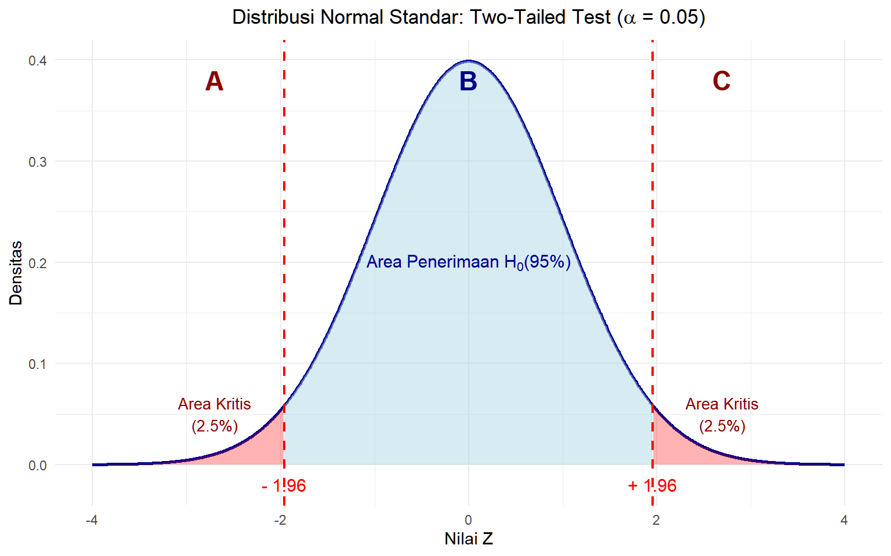
<p class="caption">(\#fig:mod05-visualize-two-tailed)Distribusi Normal dengan Area Kritis Two-Tailed (α = 0.05)</p>
</div>

**Penjelasan:**

- Area biru (tengah): Area penerimaan H₀ sebesar 95%
- Area merah (kiri & kanan): Area kritis total 5% (2.5% + 2.5%)
- Jika |Z hitung| > 1.96 → Tolak H₀ (jatuh di area merah)
- Fungsi `qnorm(0.025)` = -1.96 dan `qnorm(0.975)` = +1.96

#### Visualisasi Left-Tailed Test (α = 0.05)

<div class="figure" style="text-align: center">
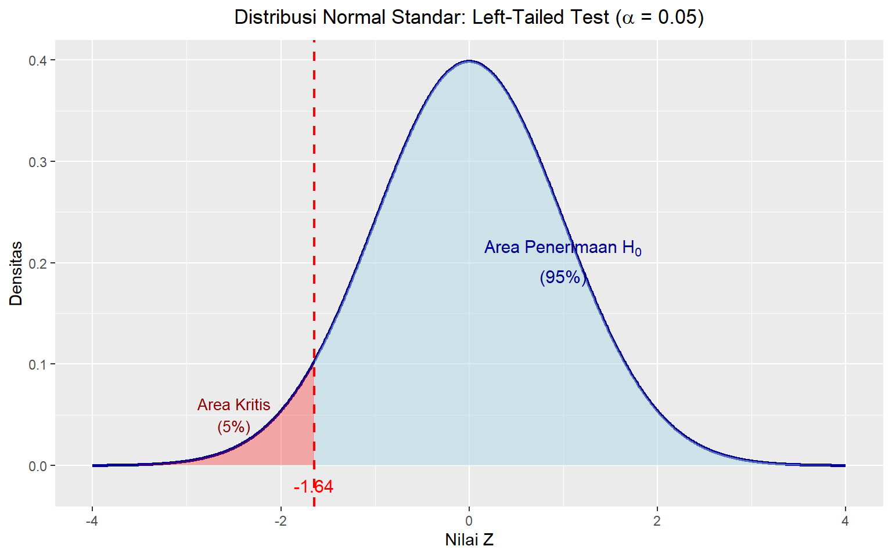
<p class="caption">(\#fig:mod05-visualize-left-tailed)Distribusi Normal dengan Area Kritis Left-Tailed (α = 0.05)</p>
</div>
**Catatan:** Untuk left-tailed test, seluruh α (5%) berada di ekor kiri. Z kritis = `qnorm(0.05)` = -1.64

#### Visualisasi Right-Tailed Test (α = 0.05)

<div class="figure" style="text-align: center">
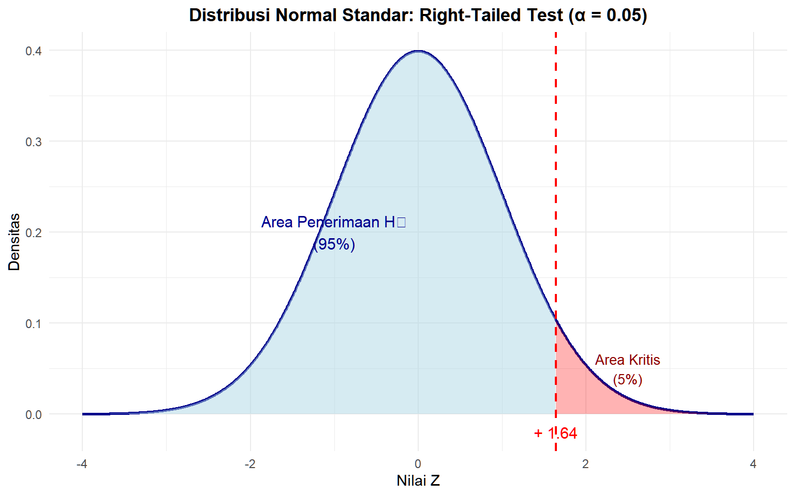
<p class="caption">(\#fig:mod05-visualize-right-tailed)Distribusi Normal dengan Area Kritis Right-Tailed (α = 0.05)</p>
</div>

**Catatan:** Untuk right-tailed test, seluruh α (5%) berada di ekor kanan. Z kritis = `qnorm(0.95)` = 1.64

#### Hubungan dengan Fungsi `qnorm()`
Tiga visualisasi di atas menunjukkan bagaimana fungsi `qnorm()` bekerja:

- **Two-tailed:** `qnorm(alpha/2)` dan `qnorm(1 - alpha/2)` → ±1.96
- **Left-tailed:** `qnorm(alpha)` → -1.64
- **Right-tailed:** `qnorm(1 - alpha)` → +1.64

**Interpretasi Keputusan:**
- Jika Z hitung jatuh di area merah → **Tolak H₀**
- Jika Z hitung jatuh di area biru → **Gagal tolak H₀**

#### *Two-tailed Test* (Tidak Berarah)

Uji dua arah (two-tailed test) adalah salah satu bentuk pengujian hipotesis statistik yang digunakan ketika peneliti ingin mengetahui apakah nilai rata-rata populasi berbeda secara signifikan dari suatu nilai tertentu (nilai hipotesis, biasanya dilambangkan μ₀), tanpa memandang arah perbedaan tersebut. Artinya, kita tidak hanya mempertanyakan apakah rata-rata lebih besar atau lebih kecil, tetapi fokus pada apakah terdapat perbedaan yang cukup signifikan ke salah satu arah. Dalam uji ini, kita ingin mengetahui apakah rata-rata jarak tempuh mahasiswa menuju kampus berbeda secara signifikan dari 4 km, tanpa menentukan apakah lebih besar atau lebih kecil.

##### Merumuskan hipotesis

Langkah pertama adalah merumuskan hipotesis. Di sini kita mendefinisikan dua kemungkinan: hipotesis nol (H0) dan hipotesis alternatif (H1). H0 biasanya menyatakan bahwa “tidak ada perbedaan” atau “nilai parameter sama dengan nilai tertentu”. Sebaliknya, H1 menyatakan adanya perbedaan yang signifikan. Pada uji ini, Hipotesis nol menyatakan bahwa rata-rata sama dengan 4 km, sedangkan hipotesis alternatif menyatakan bahwa rata-rata tidak sama dengan 4 km. Dengan demikian, kita sedang menguji apakah terdapat perbedaan nyata dari nilai acuan tersebut.


``` r
cat("H0 : rata-rata jarak = 4 km", # fungsi "cat()" digunakan untuk mecetak teks ke console dengan format yang bisa kita atur sendiri.
    "\n\nH1 : rata-rata jarak != 4 km") # "!=" berarti "tidak sama dengan" (menandakan uji dua sisi).
```

```
## H0 : rata-rata jarak = 4 km 
## 
## H1 : rata-rata jarak != 4 km
```

##### Memilih distribusi *sampling*, wilayah dan titik kritis

Setelah hipotesis dirumuskan, kita perlu menentukan distribusi sampling dan titik kritis. Distribusi sampling adalah distribusi dari nilai rata-rata sampel jika kita mengambil banyak sampel dari populasi. Titik kritis adalah nilai ambang yang menentukan wilayah penolakan hipotesis nol. Dalam uji dua arah, daerah kritis terletak di kedua ujung distribusi normal dengan luas masing-masing sebesar α/2. Misalnya, dengan α = 0,05, maka masing-masing sisi memiliki 0,025. Artinya, hanya jika nilai uji berada jauh di salah satu sisi, kita akan menolak H0.


``` r
# Hipotesis yang dipakai tidak berarah, maka wilayah kritis adalah alpha/2
alpha <- 0.05
z_crit_2tail <- abs(qnorm(alpha/2)) # Nilai yang digunakan adalah nilai absolut, karena dibagi 2, tanda tidak berpengaruh

cat("Titik kritis uji two-tailed:",z_crit_2tail)
```

```
## Titik kritis uji two-tailed: 1.959964
```

##### Menghitung statistik uji

Setelah menentukan titik kritis, kita menghitung nilai statistik uji menggunakan data yang kita miliki. Nilai ini menunjukkan seberapa jauh rata-rata sampel menyimpang dari nilai hipotesis populasi, dalam satuan standar error. Jika nilai ini berada di luar batas kritis, maka penyimpangan tersebut dianggap terlalu besar untuk hanya terjadi karena kebetulan.


``` r
# hasil perhitungan statistik uji diabsolutkan untuk mengambil nilainya saja tanpa tandanya
z_mean_jarak <- abs(ht_mean_1pop(sample_mean, pop_mean, sample_sd, ukuran_sampel))

cat("Hasil statistik uji rata-rata:", z_mean_jarak)
```

```
## Hasil statistik uji rata-rata: 0.9650591
```

##### Menarik kesimpulan

Langkah terakhir adalah menarik kesimpulan berdasarkan perbandingan antara nilai statistik uji dan titik kritis. Jika nilai statistik uji (absolut) lebih kecil dari titik kritis, maka kita gagal menolak H₀, artinya perbedaan yang terlihat kemungkinan hanya kebetulan sampel. Jika lebih besar atau sama, kita menolak H₀, artinya ada bukti yang cukup bahwa rata-rata jarak tidak sama dengan 4.


``` r
if (z_mean_jarak < z_crit_2tail) {
  tolak_h0 <- FALSE
  cat("Hipotesis kosong gagal ditolak. Perbedaan rata-rata sampel", round(sample_mean, 2), "dengan", pop_mean, "hanyalah kebetulan")
} else {
  tolak_h0 <- TRUE  
  cat("Hipotesis kosong ditolak. Rata-rata jarak pada sampel mahasiswa sebesar", round(sample_mean, 2), "km menunjukkan perbedaan yang signifikan")
}
```

```
## Hipotesis kosong gagal ditolak. Perbedaan rata-rata sampel 3.9 dengan 4 hanyalah kebetulan
```

#### *One-tailed Test* (Berarah)

Uji satu arah (one-tailed test) digunakan ketika kita memiliki dugaan arah perbedaan. Misalnya, kita ingin tahu apakah rata-rata sampel lebih kecil dari 4 km, bukan sekadar berbeda. Dalam konteks ini, daerah kritis hanya berada di salah satu sisi distribusi. Uji satu arah biasanya lebih sensitif karena semua probabilitas α ditempatkan di satu sisi, sehingga lebih mudah untuk mendeteksi perbedaan yang sesuai dengan arah hipotesis alternatif.

##### Merumuskan Hipotesis

Untuk uji satu arah, hipotesis alternatif ditentukan dengan arah tertentu. Misalnya, jika kita menduga rata-rata jarak lebih kecil dari 4 km, maka:


Dengan cara ini, kita hanya akan menolak H0 jika bukti menunjukkan bahwa rata-rata memang lebih kecil. Jika ternyata rata-rata lebih besar, maka hal itu tidak mendukung H1.


``` r
cat("H0 : rata-rata jarak = 4 km",
    "\n\nH1 : rata-rata jarak < 4 km")
```

```
## H0 : rata-rata jarak = 4 km 
## 
## H1 : rata-rata jarak < 4 km
```

##### Memilih distribusi sampling, wilayah, serta titik kritis

Karena hipotesis alternatif hanya mengarah ke satu sisi, maka daerah kritis hanya ditetapkan di sisi kiri atau kanan distribusi normal. Jika H1 menyatakan rata-rata lebih kecil, maka titik kritis ditentukan pada sisi kiri. Sebaliknya, jika H1 menyatakan rata-rata lebih besar, maka titik kritis ada di sisi kanan. Dengan α = 0,05, seluruh probabilitas kesalahan ditempatkan di satu sisi distribusi.


``` r
tail <- "kiri" # H1 menyatakan lebih kecil dari (left-tailed)

if (tail == "kiri") {
  z_crit_1tail <- qnorm(alpha)
} else {
  z_crit_1tail <- qnorm(1-alpha)
}

cat("Titik kritis uji one-tailed:", z_crit_1tail)
```

```
## Titik kritis uji one-tailed: -1.644854
```

##### Menghitung statistik uji

Setelah titik kritis ditentukan, kita menghitung nilai statistik uji. Pada uji satu arah, tanda dari nilai Z menjadi sangat penting. Hal ini karena nilai negatif atau positif menunjukkan arah penyimpangan rata-rata sampel dari nilai populasi.


``` r
# Hasil perhitungan statistik uji TIDAK diabsolutkan
z_mean_jarak <- ht_mean_1pop(sample_mean, pop_mean, sample_sd, ukuran_sampel)

cat("Hasil statistik uji rata-rata:", z_mean_jarak)
```

```
## Hasil statistik uji rata-rata: -0.9650591
```

##### Menarik kesimpulan

Langkah terakhir adalah membandingkan nilai statistik uji dengan titik kritis. Jika nilai uji lebih kecil dari titik kritis atau jatuh ke dalam daerah kritis, maka H0 ditolak, artinya perbedaan rata-rata kemungkinan hanyalah kebetulan. Sebaliknya, jika nilai uji lebih besar, maka H0 gagal ditolak yang berarti tidak ada bukti cukup untuk menyatakan adanya perbedaan.


``` r
if (z_mean_jarak < z_crit_1tail) {
  tolak_h0 <- TRUE
  cat("Hipotesis kosong ditolak. Rata-rata jarak pada sampel mahasiswa sebesar", round(sample_mean, 2), "km menunjukkan perbedaan yang signifikan (lebih kecil)")
} else {
  tolak_h0 <- FALSE  
  cat("Hipotesis kosong gagal ditolak. Perbedaan rata-rata sampel dengan populasi hanyalah kebetulan")
}
```

```
## Hipotesis kosong gagal ditolak. Perbedaan rata-rata sampel dengan populasi hanyalah kebetulan
```

### Proporsi

Proporsi adalah perbandingan jumlah elemen yang memenuhi suatu kriteria terhadap jumlah total. Misalnya, dalam kasus mahasiswa, kita bisa melihat proporsi mahasiswa yang tinggal di kos/asrama dibandingkan dengan seluruh mahasiswa dalam sampel.

Pengujian proporsi bermanfaat ketika kita ingin menguji apakah proporsi sampel yang kita peroleh berbeda secara signifikan dari nilai proporsi populasi yang diasumsikan. Contoh kasusnya adalah: "Apakah benar 50% mahasiswa di Bandar Lampung tinggal di kos/asrama?" Jika hasil sampel kita menunjukkan 47% atau 55%, kita perlu uji hipotesis untuk menentukan apakah perbedaan tersebut kebetulan atau memang signifikan.

##### Membuat fungsi

Untuk memudahkan proses, kita membuat sebuah fungsi di R yang dapat menghitung statistik uji Z untuk proporsi satu populasi. Fungsi ini akan menerima input berupa:


``` r
ht_prop_1pop <- function(p_hat, P, n) {
  se <- sqrt((p_hat * (1-p_hat))/n) # menghitung standard error untuk rata-rata
  z_hitung <- (p_hat - P)/se # menghitung nilai Z dari statistik
  return(z_hitung)
}
```

##### Meringkas Data

Sebelum melakukan uji hipotesis, kita perlu mengetahui berapa proporsi mahasiswa yang tinggal di masing-masing tipe tempat tinggal. Kita bisa gunakan fungsi group_by() dan summarize() untuk menghitung jumlah mahasiswa berdasarkan tipe tempat tinggal, lalu menambahkan kolom proporsi. Dengan cara ini, kita mendapatkan ringkasan data yang memperlihatkan distribusi tempat tinggal mahasiswa.


``` r
summarize_tempat_tinggal <- data_mahasiswa |> 
  group_by("Tipe tinggal" = tipe_tinggal_baku) |> 
  summarize("Jumlah" = n()) |> 
  mutate("proporsi" = Jumlah/sum(Jumlah))

summarize_tempat_tinggal
```

```
## # A tibble: 2 × 3
##   `Tipe tinggal`         Jumlah proporsi
##   <chr>                   <int>    <dbl>
## 1 Kos/Asrama                504    0.418
## 2 Rumah Keluarga/Pribadi    702    0.582
```

##### Menyimpan Nilai Proporsi

Setelah kita memperoleh ringkasan data, kita simpan nilai proporsi mahasiswa yang tinggal di kos atau asrama ke dalam sebuah variabel. Dengan cara ini, nilai tersebut dapat digunakan dengan mudah dalam perhitungan selanjutnya tanpa harus menghitung ulang.


``` r
proporsi_kos_asrama <- summarize_tempat_tinggal$proporsi[1]
proporsi_kos_asrama
```

```
## [1] 0.4179104
```

##### Mendeklarasikan variabel pengujian

Pada tahap ini, kita menentukan variabel-variabel utama yang akan digunakan dalam uji hipotesis. Semua variabel inilah yang nantinya akan dimasukkan ke dalam fungsi uji hipotesis yang telah dibuat.


``` r
# Mendeklarasikan variabel-variabel yang akan diuji
sample_prop <- proporsi_kos_asrama
pop_prop <- 0.5

# Menghasilkan data frame ringkasan dataset dengan menghitung jumlah mahasiswa sebagai ukuran sampel
ukuran_sampel <- data_mahasiswa |>
  summarize(ukuran_sampel = n())
# Menyimpan angka jumlah mahasiswa sebagai variabel n
ukuran_sampel <- ukuran_sampel$ukuran_sampel

# Menampilkan variabel-variabel yang akan diuji
cat("Proporsi penghuni Kos/Asrama sampel adalah", sample_prop,
    "\nParameter proporsi penghuni Kos/Asrama yang diuji adalah", pop_prop,
    "\nUkuran sampel adalah", ukuran_sampel, "orang.")
```

```
## Proporsi penghuni Kos/Asrama sampel adalah 0.4179104 
## Parameter proporsi penghuni Kos/Asrama yang diuji adalah 0.5 
## Ukuran sampel adalah 1206 orang.
```

#### *Two-tailed Test*

Pada pengujian hipotesis proporsi dengan two-tailed test, kita ingin mengetahui apakah proporsi sampel berbeda secara signifikan dari proporsi populasi yang dihipotesiskan. Artinya, kita hanya fokus pada perbedaan, bukan pada arah perbedaan. Misalnya, kita ingin menguji apakah proporsi mahasiswa yang tinggal di kos/asrama benar-benar sama dengan 50% atau tidak. Jika hasilnya jauh lebih besar atau jauh lebih kecil, keduanya dianggap sebagai bukti menolak hipotesis nol.

##### Merumuskan hipotesis

Sama seperti uji dua arah pada rata-rata, uji dua arah pada proporsi diawali dengan merumuskan hipotesis. Di sini kita mendefinisikan dua kemungkinan: hipotesis nol (H0) dan hipotesis alternatif (H1). H0 biasanya menyatakan bahwa “tidak ada perbedaan” atau “nilai parameter sama dengan nilai tertentu”. Sebaliknya, H1 menyatakan adanya perbedaan yang signifikan. Dalam uji dua arah, rumus hipotesis ditulis sebagai:


``` r
cat("H0 : prop. Kos/Asrama = 0,5",
    "\n\nH1 : prop. Kos/Asrama != 0,5")
```

```
## H0 : prop. Kos/Asrama = 0,5 
## 
## H1 : prop. Kos/Asrama != 0,5
```

##### Memilih distribusi sampling, wilayah dan titik kritis

Sama seperti sebelumnya, setelah hipotesis ditetapkan, kita perlu menentukan distribusi yang digunakan. Untuk kasus proporsi dengan ukuran sampel besar, digunakan distribusi normal. Kemudian, karena kita menggunakan uji dua arah, wilayah kritis akan terbagi dua, masing-masing di ekor kiri dan kanan distribusi. Kali ini, kita menggunakan taraf signifikansi α=0.10.


``` r
# Hipotesis yang dipakai tidak berarah, maka wilayah kritis adalah alpha/2
alpha <- 0.10 # (tingkat signifikansi 10%)
z_crit_2tail <- abs(qnorm(alpha/2)) # Nilai yang digunakan adalah nilai absolut

cat("Titik kritis uji two-tailed:", z_crit_2tail)
```

```
## Titik kritis uji two-tailed: 1.644854
```

##### Menghitung Statistik Uji

Setelah titik kritis ditentukan, kita menghitung nilai statistik uji Z berdasarkan proporsi sampel dan proporsi populasi yang diuji.


``` r
# Hasil perhitungan statistik uji diabsolutkan
z_prop_kos <- abs(ht_prop_1pop(sample_prop, pop_prop, ukuran_sampel))

z_prop_kos
```

```
## [1] 5.779963
```

##### Menarik kesimpulan

Langkah terakhir adalah membandingkan nilai statistik uji dengan titik kritis. Dari sini kita bisa menarik kesimpulan apakah hipotesis nol ditolak atau gagal ditolak. Jika nilai statistik uji (absolut) lebih kecil dari titik kritis, maka H₀ gagal ditolak, artinya perbedaan yang terlihat kemungkinan hanya kebetulan sampel. Jika lebih besar atau sama, maka H₀ ditolak, artinya ada bukti yang cukup bahwa proporsi tidak sama dengan 0,5.


``` r
if (z_prop_kos < z_crit_2tail) {
  tolak_h0 <- FALSE
  cat("Hipotesis kosong gagal ditolak. Perbedaan proporsi penghuni Kos/Asrama sebanyak", round(sample_prop, 3), "dari", pop_prop, "hanyalah kebetulan")
} else {
  tolak_h0 <- TRUE  
  cat("Hipotesis kosong ditolak. Perbedaan proporsi penghuni Kos/Asrama sebanyak", round(sample_prop, 3), "dari", pop_prop, "adalah signifikan")
}
```

```
## Hipotesis kosong ditolak. Perbedaan proporsi penghuni Kos/Asrama sebanyak 0.418 dari 0.5 adalah signifikan
```

#### *One-tailed Test*

Pada uji hipotesis proporsi satu arah, kita hanya berfokus dengan satu sisi distribusi, yakni apakah proporsi lebih besar atau lebih kecil dari nilai yang dihipotesiskan (kiri untuk dugaan “\<”, kanan untuk dugaan “\>”). Uji ini lebih spesifik karena hipotesis alternatif sudah menetapkan arah. Misalnya, kita ingin tahu apakah proporsi mahasiswa kos/asrama lebih kecil dari 50%. Dalam uji ini, hanya sisi kiri distribusi yang menjadi perhatian.

##### Merumuskan hipotesis

Hipotesis dirumuskan sebagai berikut:


``` r
cat("H0 : prop. Kos/Asrama = 0,5",
    "\n\nH1 : prop. Kos/Asrama < 0,5")
```

```
## H0 : prop. Kos/Asrama = 0,5 
## 
## H1 : prop. Kos/Asrama < 0,5
```

##### Memilih distribusi Sampling, wilayah dan titik kritis

Distribusi sampling yang digunakan tetap distribusi normal. Namun, karena ini uji satu arah, maka seluruh α ditempatkan pada salah satu sisi. Jika hipotesis alternatifnya menyatakan lebih besar, maka daerah kritis ada di sebelah kanan. Jika menyatakan lebih kecil, maka daerah kritis ada di sebelah kiri. Dengan taraf signifikansi α, titik kritis dihitung dengan qnorm(1 - alpha) untuk sisi kanan atau qnorm(alpha) untuk sisi kiri.


``` r
tail <- "kiri"

if (tail == "kiri") {
  z_crit_1tail <- qnorm(alpha)
} else {
  z_crit_1tail <- qnorm(1-alpha)
}

cat("Titik kritis uji one-tailed:", z_crit_1tail)
```

```
## Titik kritis uji one-tailed: -1.281552
```

##### Menghitung statistik uji

Sama seperti pada uji dua arah, kita menghitung nilai statistik uji Z dengan fungsi yang sudah dibuat sebelumnya tetapi kali ini kita tidak mengambil nilai absolut karena tanda statistik memberi informasi arah.


``` r
# Hasil perhitungan statistik uji TIDAK diabsolutkan
z_prop_kos <- ht_prop_1pop(sample_prop, pop_prop, ukuran_sampel)

z_prop_kos
```

```
## [1] -5.779963
```

##### Menarik kesimpulan

Kesimpulan diambil dengan membandingkan nilai statistik uji (z_prop_kos) dengan titik kritis (z_crit_1tail). Untuk uji satu arah (kiri), kita menolak H₀ jika nilai statistik uji lebih kecil dari titik kritis. Jika tidak, kita gagal menolak H₀. Kesimpulan ini menjelaskan apakah ada cukup bukti untuk menyatakan proporsi memang lebih kecil dari nilai acuan.


``` r
if (z_prop_kos < z_crit_1tail) {
  tolak_h0 <- TRUE
  cat("Hipotesis kosong ditolak. Perbedaan proporsi penghuni Kos/Asrama sebanyak", round(sample_prop, 3), "dari", pop_prop, "adalah signifikan (lebih kecil)")
} else {
  tolak_h0 <- FALSE  
  cat("Hipotesis kosong gagal ditolak. Perbedaan proporsi penghuni Kos/Asrama sebanyak", round(sample_prop, 3), "dari", pop_prop, "hanyalah kebetulan")
}
```

```
## Hipotesis kosong ditolak. Perbedaan proporsi penghuni Kos/Asrama sebanyak 0.418 dari 0.5 adalah signifikan (lebih kecil)
```

## Uji Hipotesis 2 Populasi Independen

Dua populasi dikatakan independen apabila tidak ada pengaruh antara populasi 1 dengan populasi lain. Artinya, data dari populasi pertama dan kedua berdiri sendiri, tidak saling berkaitan. Contohnya adalah membandingkan rata-rata jarak tempat tinggal mahasiswa ITERA dengan mahasiswa UINRIL, di mana setiap kelompok mahasiswa berasal dari populasi yang berbeda.

### Rata-rata

##### Merumuskan fungsi

Pada langkah ini, kita akan membuat fungsi uji hipotesis rata-rata untuk dua populasi independen. Fungsi ini diperlukan karena kita ingin menghitung nilai statistik uji (Z) berdasarkan data ringkasan dari dua sampel Dengan fungsi ini, kita bisa langsung memasukkan nilai-nilai statistik dari kedua populasi dan mendapatkan nilai Z yang akan dibandingkan dengan titik kritis.


``` r
ht_mean_2pop_ind <- function(xbar1, xbar2, sd1, sd2, n1, n2) {
  se <- sqrt(             # Indentasi diberikan untuk memudahkan
    (                     # pembacaan karena banyaknya tanda kurung
      (sd1^2)/(n1 - 1)
    ) + (
      (sd2^2)/(n2 - 1)
    )
  )
  z_hitung <- (xbar1 - xbar2)/se # menghitung nilai Z dari statistik
  return(z_hitung)
}
```

##### Menghitung mean 2 populasi

Sebelum menjalankan uji hipotesis, kita perlu mendapatkan data ringkasan berupa rata-rata, simpangan baku, dan jumlah sampel dari masing-masing populasi. Pada tahap ini, kita akan membuat tabel ringkasan jarak mahasiswa dari rumah ke kampus berdasarkan kelompok kampus. Data ini nantinya akan menjadi input untuk fungsi yang sudah kita buat di langkah sebelumnya. Dengan cara ini, kita bisa lebih mudah membandingkan dua populasi secara langsung.


``` r
summarize_jarak_2pop <- data_mahasiswa |>
  group_by(Kampus = kampus) |>
  summarize(`Rata-rata` = mean(jarak_km),
            `Simpangan baku` = sd(jarak_km),
            Jumlah = n())

summarize_jarak_2pop
```

```
## # A tibble: 3 × 4
##   Kampus `Rata-rata` `Simpangan baku` Jumlah
##   <chr>        <dbl>            <dbl>  <int>
## 1 ITERA         5.01             2.82    427
## 2 UBL           3.38             3.74    379
## 3 UINRIL        3.21             3.74    400
```

##### Mendeklarasikan variabel uji

Setelah mendapatkan ringkasan data, kita harus menyimpan nilai rata-rata, simpangan baku, dan ukuran sampel ke dalam variabel khusus. Variabel-variabel ini akan dipakai langsung sebagai input fungsi uji hipotesis. Dengan mendeklarasikannya lebih dulu, proses penghitungan menjadi lebih rapi dan mudah diikuti.


``` r
mean_jarak_uinril <- summarize_jarak_2pop$`Rata-rata`[3]
mean_jarak_itera <- summarize_jarak_2pop$`Rata-rata`[1]

sd_jarak_uinril <- summarize_jarak_2pop$`Simpangan baku`[3]
sd_jarak_itera <- summarize_jarak_2pop$`Simpangan baku`[1]

n_jarak_uinril <- summarize_jarak_2pop$Jumlah[3]
n_jarak_itera <- summarize_jarak_2pop$Jumlah[1]
```

#### *Two-tailed Test*

##### Merumuskan hipotesis

Sama seerti sebelumnya, langkah pertama dalam uji hipotesis adalah menyusun hipotesis nol (H0) dan hipotesis alternatif (H1). Untuk kasus two-tailed test, hipotesis alternatif menyatakan adanya perbedaan rata-rata tanpa menyebutkan arah (lebih besar atau lebih kecil). Artinya, kita hanya ingin tahu apakah terdapat perbedaan signifikan atau tidak, tanpa peduli siapa yang lebih besar. Hipotesis nol menyatakan tidak ada perbedaan, atau selisih rata-rata sama dengan nol.


``` r
cat("H0: mu_jarakUINRIL - mu_jarakITERA = 0",
    "\n\nH1: mu_jarakUINRIL - mu_jarakITERA != 0")
```

```
## H0: mu_jarakUINRIL - mu_jarakITERA = 0 
## 
## H1: mu_jarakUINRIL - mu_jarakITERA != 0
```

##### Memilih distribusi sampling, wilayah, dan titik kritis

Setelah hipotesis dirumuskan, kita harus menentukan distribusi sampling yang dipakai serta wilayah kritisnya. Karena ukuran sampel cukup besar, distribusi normal standar (Z) digunakan sebagai acuan. Untuk two-tailed test, wilayah kritis terbagi dua sama besar di kedua sisi kurva distribusi. Nilai kritis diperoleh dari tabel distribusi normal pada α/2, lalu dibuat dalam bentuk absolut karena titik kritis simetris di kedua sisi.


``` r
# Hipotesis yang dipakai tidak berarah, maka wilayah kritis adalah alpha/2
alpha <- 0.001

z_crit_2tail <- abs(qnorm(alpha/2)) # Nilai yang digunakan adalah nilai absolut

cat("Titik kritis uji two-tailed:", z_crit_2tail)
```

```
## Titik kritis uji two-tailed: 3.290527
```

##### Menghitung statistik uji

Setelah mengetahui titik kritis, kita hitung nilai statistik uji (Z) dari data yang dimiliki. Nilai ini diperoleh dengan memasukkan rata-rata, simpangan baku, dan ukuran sampel ke fungsi ht_mean_2pop_ind. Karena pengujian dilakukan dua sisi, nilai Z hasil perhitungan diabsolutkan agar bisa dibandingkan langsung dengan titik kritis.


``` r
# Hasil perhitungan statistik uji diabsolutkan
z_mean_jarak_2pop <- abs(ht_mean_2pop_ind(mean_jarak_uinril, mean_jarak_itera,
                                      sd_jarak_uinril, sd_jarak_itera,
                                      n_jarak_uinril, n_jarak_itera))

z_mean_jarak_2pop
```

```
## [1] 7.743731
```

##### Menarik kesimpulan

Langkah terakhir adalah membandingkan nilai statistik uji dengan titik kritis. Jika Z hitung lebih kecil dari Z kritis, maka H0 gagal ditolak, artinya perbedaan rata-rata jarak antara dua populasi kemungkinan hanyalah kebetulan. Jika Z hitung lebih besar, maka H0 ditolak, yang berarti terdapat cukup bukti untuk menyatakan adanya perbedaan.


``` r
if (z_mean_jarak_2pop < z_crit_2tail) {
  tolak_h0 <- FALSE
  cat("Hipotesis kosong gagal ditolak. Perbedaan rata-rata jarak mahasiswa UINRIL dengan ITERA dari sampel hanyalah kebetulan.")
} else {
  tolak_h0 <- TRUE  
  cat("Hipotesis kosong ditolak. Perbedaan rata-rata jarak mahasiswa UINRIL dengan ITERA dari sampel signifikan.")
}
```

```
## Hipotesis kosong ditolak. Perbedaan rata-rata jarak mahasiswa UINRIL dengan ITERA dari sampel signifikan.
```

#### *One-tailed Test*

##### Merumuskan hipotesis

Untuk one-tailed test, hipotesis alternatif (H1) menyebutkan arah perbedaan yang spesifik, misalnya rata-rata populasi 1 lebih kecil dari populasi 2. Berbeda dengan two-tailed test yang hanya memeriksa “ada perbedaan”, one-tailed test lebih fokus untuk mengetahui apakah perbedaan itu terjadi sesuai arah yang dihipotesiskan. Hipotesis nol (H0) tetap menyatakan tidak ada perbedaan, tetapi pengujian difokuskan hanya pada satu sisi distribusi.


``` r
cat("H0: mu_jarakUINRIL - mu_jarakITERA = 0",
    "\n\nH1: mu_jarakUINRIL - mu_jarakITERA < 0")
```

```
## H0: mu_jarakUINRIL - mu_jarakITERA = 0 
## 
## H1: mu_jarakUINRIL - mu_jarakITERA < 0
```

##### Memilih distribusi sampling, wilayah, dan titik kritis

Dalam pengujian one-tailed, kita perlu menentukan sisi mana yang akan digunakan sebagai wilayah kritis. Jika hipotesis alternatif menyebutkan “lebih kecil”, maka wilayah kritis berada di sisi kiri distribusi. Sebaliknya, jika hipotesis menyebutkan “lebih besar”, wilayah kritis diletakkan di sisi kanan.


``` r
tail <- "kiri"

if (tail == "kiri") {
  z_crit_1tail <- qnorm(alpha)
} else {
  z_crit_1tail <- qnorm(1-alpha)
}

cat("Titik kritis uji one-tailed:", z_crit_1tail)
```

```
## Titik kritis uji one-tailed: -3.090232
```

##### Menghitung Statistik uji

Selanjutnya, kita menghitung nilai statistik uji menggunakan fungsi ht_mean_2pop_ind. Berbeda dengan two-tailed test, pada one-tailed test nilai Z tidak diabsolutkan karena arah perbedaan menjadi penting.


``` r
# Hasil perhitungan statistik uji TIDAK diabsolutkan
z_mean_jarak_2pop <- ht_mean_2pop_ind(mean_jarak_uinril, mean_jarak_itera,
                                  sd_jarak_uinril, sd_jarak_itera,
                                  n_jarak_uinril, n_jarak_itera)

z_mean_jarak_2pop
```

```
## [1] -7.743731
```

##### Menarik kesimpulan

Tahap terakhir adalah menarik kesimpulan dengan cara membandingkan nilai statistik uji terhadap titik kritis. Jika nilai Z hitung jatuh pada wilayah kritis (misalnya lebih kecil dari Z kritis kiri), maka hipotesis nol ditolak. Artinya, ada bukti cukup untuk menyatakan rata-rata jarak mahasiswa ITERA memang lebih kecil dari mahasiswa UINRIL sesuai hipotesis arah. Jika tidak, maka hipotesis nol gagal ditolak, dan kita simpulkan bahwa arah perbedaan yang diduga tidak terbukti secara signifikan.


``` r
if (z_mean_jarak_2pop < z_crit_1tail) {
  tolak_h0 <- TRUE
  cat("Hipotesis kosong ditolak. Mahasiswa ITERA secara rata-rata tinggal lebih jauh dari kampus dibandingkan mahasiswa UINRIL significanly.")
} else {
  tolak_h0 <- FALSE  
  cat("Hipotesis kosong gagal ditolak. Tidak cukup bukti menyatakan mahasiswa ITERA tinggal lebih jauh.")
}
```

```
## Hipotesis kosong ditolak. Mahasiswa ITERA secara rata-rata tinggal lebih jauh dari kampus dibandingkan mahasiswa UINRIL significanly.
```

### Proporsi

Pada bagian ini kita akan melakukan uji hipotesis terhadap proporsi dua populasi yang independen. Berbeda dengan rata-rata, proporsi digunakan ketika data berbentuk kategori (misalnya pilihan tinggal di kos/asrama atau tinggal bersama keluarga). Prinsip pengujian tetap sama, yaitu membandingkan apakah perbedaan proporsi antar populasi signifikan atau hanya karena kebetulan sampel.

##### Membuat fungsi

Sama seperti sebelumnya, langkah pertama adalah membuat fungsi khusus untuk menghitung nilai statistik uji pada uji hipotesis proporsi dua populasi independen. Fungsi ini menerima input berupa proporsi sampel masing-masing populasi (p_hat1 dan p_hat2) serta ukuran sampelnya (n1 dan n2). Di dalam fungsi, dihitung terlebih dahulu proporsi gabungan (p_gab) yang mewakili keseluruhan sampel. Kemudian dihitung standard error (SE), dan akhirnya didapatkan nilai Z hitung.


``` r
# Membuat fungsi uji hipotesis (hypothesis testing, ht) untuk rata-rata (mean)
# dengan 1 populasi (2pop) Independen (In)
# Keterangan input:
#   - xbar1 : statistik rata-rata populasi #1
#   - xbar2 : statistik rata-rata populasi #2
#   - sd1   : statistik simpangan baku populasi #1
#   - sd2   : statistik simpangan baku populasi #2
#   - n1    : ukuran sampel dari populasi #1
#   - n2    : ukuran sampel dari populasi #2
ht_prop_2pop_ind <- function(p_hat1, p_hat2, n1, n2) {
  p_gab <- ((n1*p_hat1 + n2*p_hat2))/(n1 + n2) # Total proporsi yang diuji
                                               # untuk kedua populasi
  se <- sqrt(
    (p_gab*(1-p_gab)) * ( # Indentasi diberikan untuk memudahkan pembacaan
      (1/n1) + (1/n2)     # karena banyaknya kurung
    )
  )
  z_hitung <- (p_hat1 - p_hat2)/se # menghitung nilai Z dari statistik
  return(z_hitung)
}
```

##### Mendeklarasikan variabel uji

Setelah fungsi dibuat, kita perlu menyiapkan data yang akan diuji. Pertama, data mahasiswa dikelompokkan berdasarkan kampus dan tipe_tinggal_baku. Selanjutnya dihitung proporsi tiap kategori (misalnya proporsi mahasiswa yang tinggal di kos/asrama). Data kemudian diubah dari format long ke wide sehingga tiap kategori menjadi variabel. Dari hasil ini kita bisa mengambil proporsi masing-masing populasi, serta ukuran sampel total pada tiap kampus.


``` r
summarize_tempat_tinggal_2pop <- data_mahasiswa |> 
  group_by(kampus, tipe_tinggal_baku) |> 
  summarize(Jumlah = n()) |>
  mutate(proporsi = Jumlah/sum(Jumlah)) |> # menghitung proporsi tiap kategori.
  select(-Jumlah) |> 
  spread(tipe_tinggal_baku, proporsi) # mengubah data long menjadi wide (kolom                                          # kategori jadi variabel).

summarize_tempat_tinggal_2pop
```

```
## # A tibble: 3 × 3
## # Groups:   kampus [3]
##   kampus `Kos/Asrama` `Rumah Keluarga/Pribadi`
##   <chr>         <dbl>                    <dbl>
## 1 ITERA         0.550                    0.450
## 2 UBL           0.224                    0.776
## 3 UINRIL        0.46                     0.54
```

``` r
proporsi_kos_asrama_itera <- summarize_tempat_tinggal_2pop$`Kos/Asrama`[1]
proporsi_kos_asrama_uinril <- summarize_tempat_tinggal_2pop$`Kos/Asrama`[3]

n_kos_asrama_2pop <- data_mahasiswa |> 
  count(kampus)

n_kos_asrama_itera <- n_kos_asrama_2pop$n[1]
n_kos_asrama_uinril <- n_kos_asrama_2pop$n[3]
```

####*Two-tailed Test*


``` r
# Gunakan CI = 93%, artinya alpha = 7% = 0.07
alpha <- 0.07

# Hitung Z kritis 2-tailed
z_crit_2tail <- abs(qnorm(alpha/2))

# Hitung statistik uji proporsi 2 populasi
# Asumsi: Menggunakan data proporsi kos/asrama ITERA vs UINRIL yang sudah disiapkan sebelumnya
z_prop_2pop <- abs(ht_prop_2pop_ind(proporsi_kos_asrama_uinril, proporsi_kos_asrama_itera,
                             n_kos_asrama_uinril, n_kos_asrama_itera))

cat("Titik Kritis:", z_crit_2tail, "\nZ Hitung:", z_prop_2pop, "\n")
```

```
## Titik Kritis: 1.811911 
## Z Hitung: 2.597132
```

``` r
if (z_prop_2pop < z_crit_2tail) {
  cat("Hipotesis nol gagal ditolak.")
} else {
  cat("Hipotesis nol ditolak.")
}
```

```
## Hipotesis nol ditolak.
```

#### *One-tailed Test*


``` r
# Gunakan CI = 96%, artinya alpha = 4% = 0.04
alpha <- 0.04
tail <- "kiri" # Asumsi uji lebih kecil (UINRIL < ITERA misalnya)

# Hitung Z kritis 1-tailed
if (tail == "kiri") {
  z_crit_1tail <- qnorm(alpha)
} else {
  z_crit_1tail <- qnorm(1-alpha)
}

# Hitung statistik uji (tidak absolut)
z_prop_2pop <- ht_prop_2pop_ind(proporsi_kos_asrama_uinril, proporsi_kos_asrama_itera,
                             n_kos_asrama_uinril, n_kos_asrama_itera)

cat("Titik Kritis:", z_crit_1tail, "\nZ Hitung:", z_prop_2pop, "\n")
```

```
## Titik Kritis: -1.750686 
## Z Hitung: -2.597132
```

``` r
if (z_prop_2pop < z_crit_1tail) {
  cat("Hipotesis nol ditolak (Signifikan).")
} else {
  cat("Hipotesis nol gagal ditolak.")
}
```

```
## Hipotesis nol ditolak (Signifikan).
```

## Uji Hipotesis 2 Populasi Dependen

Menguji hipotesis 2 populasi yang dependen pada dasarnya sama persis dengan uji hipotesis 1 populasi, karena statistik yang diuji adalah **perbedaan nilai sampel**. Biasanya berbentuk "sebelum-sesudah". Contoh: mengukur nilai mahasiswa sebelum dan sesudah diberi pelatihan. Bedanya dengan independen : kita tidak bandingkan dua kelompok berbeda, tapi pasangan data dari kelompok yang sama dalam dua kondisi.

Perbedaan nilai sampel jumlah nilainya hanya 1, sehingga bisa diperlakukan seperti halnya perhitungan uji hipotesis 1 populasi. Simpangan baku yang diketahui pun adalah simpangan baku **perbedaan nilainya, sehingga jumlah nilainya hanya 1 juga**.

## Soal Latihan


<!--chapter:end:05-uji-hipotesis.Rmd-->

# Modul-6: Analisis Hubungan Korelatif: Korelasi Variabel Nominal dan Ordinal

Setelah mempelajari modul ini, Anda diharapkan dapat:

1. mampu menghasilkan koefisien korelasi variabel di tingkat nominal dengan perangkat lunak komputer [STP-9.2]{.capaian}
2. mampu menghasilkan koefisien korelasi variabel di tingkat ordinal dengan perangkat lunak komputer [STP-10.2]{.capaian}


---

## Pendahuluan

Analisis korelasi adalah salah satu teknik analisis yang termasuk ke dalam lingkup statistika bivariat, statistika yang analisisnya melibatkan dua variabel **sekaligus**. Pada praktikum-praktikum sebelumnya kita hanya melibatkan satu variabel saja, misalnya:

-   pada praktikum ke-2, kita mengaplikasikan persentase hanya pada variabel `Jenis.Kelamin`, `Fakultas`, `Tingkat.Semester`, `Uang.Saku`, atau`jenis.tempat.tinggal` saja, tetapi tidak menghubungkannya satu sama lain,

    ``` r
    data.ubl |> 
      tbl_summary(include = c(Jenis.Kelamin,
                              Fakultas,
                              Tingkat.Semester,
                              Uang.Saku,
                              jenis.tempat.tinggal)) |> 
      as_flex_table()
    ```

-   pada praktikum ke-3, kita membuat histogram untuk variabel `Umur` saja

    ``` r
    histogram <- ggplot(data.ubl.cleaned) +
      geom_histogram(mapping = aes(x = Umur), binwidth = 1, fill = "darkseagreen", color = "white") +
      labs(
        title = "Distribusi Umur Mahasiswa",
        x = "Umur (Tahun)",
        y = "Frekuensi"
      ) +
      theme_minimal()

    histogram
    ```

-   pada praktikum-praktikum tentang analisis statistik inferensial, kita hanya tertarik pada proporsi atau rata-rata suatu variabel saja, yang pastinya tunggal.

Dalam praktikum ini kita akan mempraktikkan analisis korelasi pada dua variabel **secara bersamaan.** Ketika kita tertarik pada analisis untuk dua variabel secara bersamaan, artinya kita sedang menganalisis sebuah **keterkaitan** atau sebuah **hubungan**. Dalam praktikum ini, hubungan itu disebut **korelasi**.

Korelasi yang akan kita pelajari adalah korelasi pada pasangan variabel dengan tingkat pengukuran nominal dan juga ordinal.

## Pustaka *(Libraries)* yang Diperlukan dan Memuat Data

Seperti biasa, kita perlu memuat pustaka *(libraries)* yang diperlukan dalam pengolahan data kita. Untuk memuat tabel silang kita akan gunakan pustaka `gtsummary` kembali seperti pada praktikum ke-2


``` r
library(tidyverse)
library(readr)
```

**Memuat dataset**

Kita akan menggunakan dataset keempat kampus di Kota Bandar Lampung dan sekitarnya sebagai bahan. Tulis ulang dan jalankan baris perintah berikut untuk mengolah data keempat kampus


``` r
# Membaca data
data_mahasiswa <- read_csv2("datasets/Data Praktikum 06.csv")
```

**Mengatur Faktor untuk Variabel Kategoris**

Setelah membaca data, kita perlu mengatur variabel-variabel nominal dan ordinal dengan mengatur nilai-nilainya berupa *factor*.

Namun sebelum itu, kita akan membuat vektor-vektor untuk kita aplikasikan menjadi *factor* dengan memanfaatkan `group_by` dan `summarize` yang berasal dari pustaka `dplyr`.


``` r
# MEMBUAT FAKTOR UNTUK KAMPUS
# Meringkas data berdasarkan kolom Kampus PT
faktor_kampus <- data_mahasiswa |>
  group_by(kampus = Kampus_PT) |>
  summarize(jumlah = n())
# Membuat vektor untuk faktor Kampus PT dari kolom nama Kampus
faktor_kampus <- faktor_kampus$kampus

# MEMBUAT FAKTOR UNTUK FAKULTAS
# Meringkas data berdasarkan kolom Fakultas
faktor_fakultas <- data_mahasiswa |>
  group_by(fakultas = Fakultas) |>
  summarize(jumlah = n())
# Membuat vektor untuk faktor Fakultas dari kolom nama fakultas
faktor_fakultas <- faktor_fakultas$fakultas

# MEMBUAT FAKTOR UNTUK PROGRAM STUDI
# Meringkas data berdasarkan kolom Prodi
faktor_prodi <- data_mahasiswa |>
  group_by(prodi = Prodi) |>
  summarize(jumlah = n())
# Membuat vektor untuk faktor Prodi dari kolom nama Prodi
faktor_prodi <- faktor_prodi$prodi

# MEMBUAT FAKTOR UNTUK JENIS KELAMIN
# Meringkas data berdasarkan kolom Jenis Kelamin
faktor_jk <- data_mahasiswa |>
  group_by(jk = `Jenis Kelamin`) |> 
  summarize(jumlah = n())
# Membuat vektor untuk faktor Jenis Kelamin dari kolom nama Jenis Kelamin
faktor_jk <- faktor_jk$jk

# MEMBUAT FAKTOR UNTUK TINGKAT SEMESTER
# Meringkas data berdasarkan kolom Tingkat Semester
faktor_semester <- data_mahasiswa |>
  group_by(semester = `Tingkat Semester`) |>
  summarize(jumlah = n())
# Membuat vektor faktor Tingkat Semester dari kolom Tingkat Semester
faktor_semester <- faktor_semester$semester

# MEMBUAT FAKTOR UNTUK UANG SAKU
# Meringkas data berdasarkan kolom Uang Saku
faktor_uang_saku <- data_mahasiswa |>
  group_by(uang = `Uang Saku`) |>
  summarize(jumlah = n())
# Memperbaiki urutan uang saku
faktor_uang_saku$uang[c(1,4)] <- faktor_uang_saku$uang[c(4,1)]
faktor_uang_saku$jumlah[c(1,4)] <- faktor_uang_saku$jumlah[c(4,1)]

faktor_uang_saku$uang[c(2,4)] <- faktor_uang_saku$uang[c(4,2)]
faktor_uang_saku$jumlah[c(2,4)] <- faktor_uang_saku$jumlah[c(4,2)]

faktor_uang_saku$uang[c(3,4)] <- faktor_uang_saku$uang[c(4,3)]
faktor_uang_saku$jumlah[c(3,4)] <- faktor_uang_saku$jumlah[c(4,3)]

# Membuat vektor faktor Tingkat Uang Saku dari kolom Uang Saku
faktor_uang_saku <- faktor_uang_saku$uang

# MEMBUAT FAKTOR UNTUK KENDARAAN UTAMA
# Meringkas data berdasarkan kolom Kendaraan Utama
faktor_kendaraan_utama <- data_mahasiswa |>
  group_by(kendaraan = `kendaraan utama`) |>
  summarize(jumlah = n())
# Membuat vektpr faktor untuk kendaraan utama dari kolom 'kendaraan'
faktor_kendaraan_utama <- faktor_kendaraan_utama$kendaraan


# MEMBUAT FAKTOR JENIS TEMPAT TINGGAL
# Meringkas data berdasarkan kolom Jenis Tempat Tinggal
faktor_jenis_tempat_tinggal <- data_mahasiswa |>
  group_by(tempat_tinggal = `jenis tempat tinggal`) |>
  summarize(jumlah = n())
# Membuat vektor faktor untuk jenis tempat tinggal berdasarkan kolom Jenis Tempat Tinggal
faktor_jenis_tempat_tinggal <- faktor_jenis_tempat_tinggal$tempat_tinggal
```

Barulah selanjutnya kita bisa mengatur *factor* untuk setiap variabel kategoris


``` r
data_mahasiswa <- data_mahasiswa |>
  mutate (Kampus_PT = factor(Kampus_PT, levels = faktor_kampus),
         `Jenis Kelamin` = factor(`Jenis Kelamin`, levels = faktor_jk),
         Fakultas = factor(Fakultas, levels = faktor_fakultas),
         Prodi = factor(Prodi, levels = faktor_prodi),
         `Tingkat Semester` = factor(`Tingkat Semester`, levels = faktor_semester,
                                     ordered = TRUE), # Variabel ordinal
         `Uang Saku` = factor(`Uang Saku`, levels = faktor_uang_saku,
                              ordered = TRUE), # Variabel ordinal
         `kendaraan utama` = factor(`kendaraan utama`, levels = faktor_kendaraan_utama),
         `jenis tempat tinggal` = factor(`jenis tempat tinggal`, levels = faktor_jenis_tempat_tinggal)
         )
```

Kita dapat memeriksa hasil pekerjaan kita dengan perintah `glimpse`


``` r
# Memeriksa hasil pengaturan factor
glimpse(data_mahasiswa)
```

```
## Rows: 1,557
## Columns: 22
## $ Kampus_PT                  <fct> ITERA, ITERA, ITERA, ITERA, ITERA, ITERA, ITERA, ITERA, ITERA,…
## $ `Nomor urut`               <dbl> 17, 211, 342, 42, 56, 254, 267, 289, 330, 259, 48, 169, 225, 2…
## $ `Jenis Kelamin`            <fct> Perempuan, Perempuan, Perempuan, Perempuan, Laki-laki, Perempu…
## $ Umur                       <dbl> 20, 20, 22, 21, 22, 22, 21, 21, 20, 23, 19, 23, 21, 19, 22, 23…
## $ Fakultas                   <fct> FTIK, FTIK, FTI, FTIK, FTIK, FTIK, FTIK, FTIK, FTI, FTIK, FTIK…
## $ Prodi                      <fct> Perencanaan Wilayah dan Kota, Perencanaan Wilayah dan Kota, Te…
## $ `Tingkat Semester`         <ord> Semester 3-4, Semester 5-6, Semester 7-8, Semester 7-8, Semest…
## $ `Uang Saku`                <ord> "1 - 2 Jt", "2,1 - 3 Jt", "2,1 - 3 Jt", "2,1 - 3 Jt", "1 - 2 J…
## $ `jumlah mobil`             <dbl> 1, 0, 3, 3, 1, 3, 3, 3, 3, 2, 1, 0, 3, 2, 2, 2, 1, 0, 2, 0, 1,…
## $ `jumlah motor`             <dbl> 0, 1, 2, 3, 0, 2, 2, 3, 2, 2, 0, 1, 1, 2, 1, 1, 1, 1, 1, 0, 0,…
## $ `jumlah sepeda`            <dbl> 1, 1, 3, 3, 0, 2, 3, 4, 2, 2, 1, 0, 1, 2, 1, 2, 1, 0, 0, 0, 0,…
## $ `kendaraan utama`          <fct> Sepeda motor pribadi, Mobil pribadi, Mobil pribadi, Mobil prib…
## $ `jenis tempat tinggal`     <fct> Kos sendiri, Rumah pribadi, Rumah pribadi, Rumah pribadi, Ruma…
## $ jarak                      <dbl> 3.47, 4.88, 3.09, 5.46, 3.70, 6.18, 4.87, 5.08, 3.82, 7.51, 7.…
## $ `biaya sepekan`            <dbl> 400, 280, 225, 200, 200, 200, 200, 200, 200, 180, 150, 150, 15…
## $ `Jumlah Perjalanan Senin`  <dbl> 2, 4, 2, 0, 4, 0, 3, 4, 2, 0, 1, 4, 2, 0, 3, 2, 2, 0, 3, 2, 4,…
## $ `Jumlah Perjalanan Selasa` <dbl> 3, 4, 2, 3, 3, 0, 4, 4, 2, 2, 1, 3, 2, 2, 2, 0, 2, 3, 4, 2, 4,…
## $ `Jumlah Perjalanan Rabu`   <dbl> 3, 5, 0, 4, 3, 3, 4, 4, 0, 2, 1, 2, 2, 2, 4, 2, 2, 2, 3, 2, 4,…
## $ `Jumlah Perjalanan Kamis`  <dbl> 0, 4, 2, 3, 2, 0, 4, 4, 2, 2, 1, 2, 2, 2, 2, 2, 2, 2, 4, 2, 4,…
## $ `Jumlah Perjalanan Jumat`  <dbl> 0, 5, 0, 3, 2, 2, 4, 5, 2, 2, 1, 3, 3, 4, 4, 2, 2, 0, 4, 4, 5,…
## $ `Jumlah Perjalanan Sabtu`  <dbl> 2, 0, 3, 0, 3, 3, 0, 2, 2, 0, 1, 2, 2, 0, 0, 2, 2, 2, 4, 0, 0,…
## $ `Jumlah Perjalanan Ahad`   <dbl> 4, 3, 0, 2, 2, 0, 3, 2, 2, 0, 1, 2, 0, 0, 2, 0, 2, 2, 2, 2, 0,…
```

## Pembuatan Tabel Silang

Setelah kita memastikan data kita bersih, kita siap untuk menganalisis korelasi antarvariabel kategoris.

Korelasi antarvariabel kategoris memerlukan "bahan baku" berupa **tabel silang** atau ***cross table***. Kebanyakan literatur juga menggunakan istilah ***contingency table***. Tabel silang adalah tabel dua arah, yakni yang baik baris maupun kolomnya adalah **nilai-nilai dari dua variabel** yang disilangkan.

*Chunk* berikut memperlihatkan bagaimana membuat tabel silang antara variabel `jenis tempat tinggal` dengan `kendaraan utama`.


``` r
library(gtsummary)
library(flextable)

# Menghasilkan tabel silang antara variabel kendaraan utama dan jenis tempat tinggal
# untuk keperluan presentasi
data_mahasiswa |>
  select(`jenis tempat tinggal`, `kendaraan utama`) |>
  tbl_summary(by = `jenis tempat tinggal`) |>
  as_flex_table()
```

```{=html}
<div class="tabwid"><style>.cl-fda8839a{}.cl-fd9a1954{font-family:'Arial';font-size:11pt;font-weight:bold;font-style:normal;text-decoration:none;color:rgba(0, 0, 0, 1.00);background-color:transparent;}.cl-fd9a1972{font-family:'Arial';font-size:11pt;font-weight:normal;font-style:normal;text-decoration:none;color:rgba(0, 0, 0, 1.00);background-color:transparent;}.cl-fd9a197c{font-family:'Arial';font-size:6.6pt;font-weight:normal;font-style:normal;text-decoration:none;color:rgba(0, 0, 0, 1.00);background-color:transparent;position: relative;bottom:3.3pt;}.cl-fd9febfe{margin:0;text-align:left;border-bottom: 0 solid rgba(0, 0, 0, 1.00);border-top: 0 solid rgba(0, 0, 0, 1.00);border-left: 0 solid rgba(0, 0, 0, 1.00);border-right: 0 solid rgba(0, 0, 0, 1.00);padding-bottom:2pt;padding-top:2pt;padding-left:5pt;padding-right:5pt;line-height: 1;background-color:transparent;}.cl-fd9fec08{margin:0;text-align:center;border-bottom: 0 solid rgba(0, 0, 0, 1.00);border-top: 0 solid rgba(0, 0, 0, 1.00);border-left: 0 solid rgba(0, 0, 0, 1.00);border-right: 0 solid rgba(0, 0, 0, 1.00);padding-bottom:2pt;padding-top:2pt;padding-left:5pt;padding-right:5pt;line-height: 1;background-color:transparent;}.cl-fd9fec12{margin:0;text-align:left;border-bottom: 0 solid rgba(0, 0, 0, 1.00);border-top: 0 solid rgba(0, 0, 0, 1.00);border-left: 0 solid rgba(0, 0, 0, 1.00);border-right: 0 solid rgba(0, 0, 0, 1.00);padding-bottom:5pt;padding-top:5pt;padding-left:5pt;padding-right:5pt;line-height: 1;background-color:transparent;}.cl-fd9fec26{margin:0;text-align:center;border-bottom: 0 solid rgba(0, 0, 0, 1.00);border-top: 0 solid rgba(0, 0, 0, 1.00);border-left: 0 solid rgba(0, 0, 0, 1.00);border-right: 0 solid rgba(0, 0, 0, 1.00);padding-bottom:5pt;padding-top:5pt;padding-left:5pt;padding-right:5pt;line-height: 1;background-color:transparent;}.cl-fd9fec27{margin:0;text-align:left;border-bottom: 0 solid rgba(0, 0, 0, 1.00);border-top: 0 solid rgba(0, 0, 0, 1.00);border-left: 0 solid rgba(0, 0, 0, 1.00);border-right: 0 solid rgba(0, 0, 0, 1.00);padding-bottom:5pt;padding-top:5pt;padding-left:15pt;padding-right:5pt;line-height: 1;background-color:transparent;}.cl-fd9fec3a{margin:0;text-align:left;border-bottom: 0 solid rgba(0, 0, 0, 1.00);border-top: 0 solid rgba(0, 0, 0, 1.00);border-left: 0 solid rgba(0, 0, 0, 1.00);border-right: 0 solid rgba(0, 0, 0, 1.00);padding-bottom:5pt;padding-top:5pt;padding-left:5pt;padding-right:5pt;line-height: 1;background-color:transparent;}.cl-fda026aa{width:2.967in;background-color:transparent;vertical-align: middle;border-bottom: 1pt solid rgba(0, 0, 0, 1.00);border-top: 1pt solid rgba(0, 0, 0, 1.00);border-left: 0 solid rgba(0, 0, 0, 1.00);border-right: 0 solid rgba(0, 0, 0, 1.00);margin-bottom:0;margin-top:0;margin-left:0;margin-right:0;}.cl-fda026be{width:0.931in;background-color:transparent;vertical-align: middle;border-bottom: 1pt solid rgba(0, 0, 0, 1.00);border-top: 1pt solid rgba(0, 0, 0, 1.00);border-left: 0 solid rgba(0, 0, 0, 1.00);border-right: 0 solid rgba(0, 0, 0, 1.00);margin-bottom:0;margin-top:0;margin-left:0;margin-right:0;}.cl-fda026c8{width:1.771in;background-color:transparent;vertical-align: middle;border-bottom: 1pt solid rgba(0, 0, 0, 1.00);border-top: 1pt solid rgba(0, 0, 0, 1.00);border-left: 0 solid rgba(0, 0, 0, 1.00);border-right: 0 solid rgba(0, 0, 0, 1.00);margin-bottom:0;margin-top:0;margin-left:0;margin-right:0;}.cl-fda026c9{width:1.202in;background-color:transparent;vertical-align: middle;border-bottom: 1pt solid rgba(0, 0, 0, 1.00);border-top: 1pt solid rgba(0, 0, 0, 1.00);border-left: 0 solid rgba(0, 0, 0, 1.00);border-right: 0 solid rgba(0, 0, 0, 1.00);margin-bottom:0;margin-top:0;margin-left:0;margin-right:0;}.cl-fda026d2{width:2.476in;background-color:transparent;vertical-align: middle;border-bottom: 1pt solid rgba(0, 0, 0, 1.00);border-top: 1pt solid rgba(0, 0, 0, 1.00);border-left: 0 solid rgba(0, 0, 0, 1.00);border-right: 0 solid rgba(0, 0, 0, 1.00);margin-bottom:0;margin-top:0;margin-left:0;margin-right:0;}.cl-fda026d3{width:2.356in;background-color:transparent;vertical-align: middle;border-bottom: 1pt solid rgba(0, 0, 0, 1.00);border-top: 1pt solid rgba(0, 0, 0, 1.00);border-left: 0 solid rgba(0, 0, 0, 1.00);border-right: 0 solid rgba(0, 0, 0, 1.00);margin-bottom:0;margin-top:0;margin-left:0;margin-right:0;}.cl-fda026dc{width:1.44in;background-color:transparent;vertical-align: middle;border-bottom: 1pt solid rgba(0, 0, 0, 1.00);border-top: 1pt solid rgba(0, 0, 0, 1.00);border-left: 0 solid rgba(0, 0, 0, 1.00);border-right: 0 solid rgba(0, 0, 0, 1.00);margin-bottom:0;margin-top:0;margin-left:0;margin-right:0;}.cl-fda026e6{width:1.516in;background-color:transparent;vertical-align: middle;border-bottom: 1pt solid rgba(0, 0, 0, 1.00);border-top: 1pt solid rgba(0, 0, 0, 1.00);border-left: 0 solid rgba(0, 0, 0, 1.00);border-right: 0 solid rgba(0, 0, 0, 1.00);margin-bottom:0;margin-top:0;margin-left:0;margin-right:0;}.cl-fda026f0{width:2.967in;background-color:transparent;vertical-align: top;border-bottom: 0 solid rgba(0, 0, 0, 1.00);border-top: 0 solid rgba(0, 0, 0, 1.00);border-left: 0 solid rgba(0, 0, 0, 1.00);border-right: 0 solid rgba(0, 0, 0, 1.00);margin-bottom:0;margin-top:0;margin-left:0;margin-right:0;}.cl-fda026fa{width:0.931in;background-color:transparent;vertical-align: top;border-bottom: 0 solid rgba(0, 0, 0, 1.00);border-top: 0 solid rgba(0, 0, 0, 1.00);border-left: 0 solid rgba(0, 0, 0, 1.00);border-right: 0 solid rgba(0, 0, 0, 1.00);margin-bottom:0;margin-top:0;margin-left:0;margin-right:0;}.cl-fda026fb{width:1.771in;background-color:transparent;vertical-align: top;border-bottom: 0 solid rgba(0, 0, 0, 1.00);border-top: 0 solid rgba(0, 0, 0, 1.00);border-left: 0 solid rgba(0, 0, 0, 1.00);border-right: 0 solid rgba(0, 0, 0, 1.00);margin-bottom:0;margin-top:0;margin-left:0;margin-right:0;}.cl-fda02704{width:1.202in;background-color:transparent;vertical-align: top;border-bottom: 0 solid rgba(0, 0, 0, 1.00);border-top: 0 solid rgba(0, 0, 0, 1.00);border-left: 0 solid rgba(0, 0, 0, 1.00);border-right: 0 solid rgba(0, 0, 0, 1.00);margin-bottom:0;margin-top:0;margin-left:0;margin-right:0;}.cl-fda0270e{width:2.476in;background-color:transparent;vertical-align: top;border-bottom: 0 solid rgba(0, 0, 0, 1.00);border-top: 0 solid rgba(0, 0, 0, 1.00);border-left: 0 solid rgba(0, 0, 0, 1.00);border-right: 0 solid rgba(0, 0, 0, 1.00);margin-bottom:0;margin-top:0;margin-left:0;margin-right:0;}.cl-fda02718{width:2.356in;background-color:transparent;vertical-align: top;border-bottom: 0 solid rgba(0, 0, 0, 1.00);border-top: 0 solid rgba(0, 0, 0, 1.00);border-left: 0 solid rgba(0, 0, 0, 1.00);border-right: 0 solid rgba(0, 0, 0, 1.00);margin-bottom:0;margin-top:0;margin-left:0;margin-right:0;}.cl-fda02719{width:1.44in;background-color:transparent;vertical-align: top;border-bottom: 0 solid rgba(0, 0, 0, 1.00);border-top: 0 solid rgba(0, 0, 0, 1.00);border-left: 0 solid rgba(0, 0, 0, 1.00);border-right: 0 solid rgba(0, 0, 0, 1.00);margin-bottom:0;margin-top:0;margin-left:0;margin-right:0;}.cl-fda02722{width:1.516in;background-color:transparent;vertical-align: top;border-bottom: 0 solid rgba(0, 0, 0, 1.00);border-top: 0 solid rgba(0, 0, 0, 1.00);border-left: 0 solid rgba(0, 0, 0, 1.00);border-right: 0 solid rgba(0, 0, 0, 1.00);margin-bottom:0;margin-top:0;margin-left:0;margin-right:0;}.cl-fda0272c{width:2.967in;background-color:transparent;vertical-align: top;border-bottom: 0 solid rgba(0, 0, 0, 1.00);border-top: 0 solid rgba(0, 0, 0, 1.00);border-left: 0 solid rgba(0, 0, 0, 1.00);border-right: 0 solid rgba(0, 0, 0, 1.00);margin-bottom:0;margin-top:0;margin-left:0;margin-right:0;}.cl-fda02736{width:0.931in;background-color:transparent;vertical-align: top;border-bottom: 0 solid rgba(0, 0, 0, 1.00);border-top: 0 solid rgba(0, 0, 0, 1.00);border-left: 0 solid rgba(0, 0, 0, 1.00);border-right: 0 solid rgba(0, 0, 0, 1.00);margin-bottom:0;margin-top:0;margin-left:0;margin-right:0;}.cl-fda02737{width:1.771in;background-color:transparent;vertical-align: top;border-bottom: 0 solid rgba(0, 0, 0, 1.00);border-top: 0 solid rgba(0, 0, 0, 1.00);border-left: 0 solid rgba(0, 0, 0, 1.00);border-right: 0 solid rgba(0, 0, 0, 1.00);margin-bottom:0;margin-top:0;margin-left:0;margin-right:0;}.cl-fda02740{width:1.202in;background-color:transparent;vertical-align: top;border-bottom: 0 solid rgba(0, 0, 0, 1.00);border-top: 0 solid rgba(0, 0, 0, 1.00);border-left: 0 solid rgba(0, 0, 0, 1.00);border-right: 0 solid rgba(0, 0, 0, 1.00);margin-bottom:0;margin-top:0;margin-left:0;margin-right:0;}.cl-fda02741{width:2.476in;background-color:transparent;vertical-align: top;border-bottom: 0 solid rgba(0, 0, 0, 1.00);border-top: 0 solid rgba(0, 0, 0, 1.00);border-left: 0 solid rgba(0, 0, 0, 1.00);border-right: 0 solid rgba(0, 0, 0, 1.00);margin-bottom:0;margin-top:0;margin-left:0;margin-right:0;}.cl-fda0274a{width:2.356in;background-color:transparent;vertical-align: top;border-bottom: 0 solid rgba(0, 0, 0, 1.00);border-top: 0 solid rgba(0, 0, 0, 1.00);border-left: 0 solid rgba(0, 0, 0, 1.00);border-right: 0 solid rgba(0, 0, 0, 1.00);margin-bottom:0;margin-top:0;margin-left:0;margin-right:0;}.cl-fda02754{width:1.44in;background-color:transparent;vertical-align: top;border-bottom: 0 solid rgba(0, 0, 0, 1.00);border-top: 0 solid rgba(0, 0, 0, 1.00);border-left: 0 solid rgba(0, 0, 0, 1.00);border-right: 0 solid rgba(0, 0, 0, 1.00);margin-bottom:0;margin-top:0;margin-left:0;margin-right:0;}.cl-fda02755{width:1.516in;background-color:transparent;vertical-align: top;border-bottom: 0 solid rgba(0, 0, 0, 1.00);border-top: 0 solid rgba(0, 0, 0, 1.00);border-left: 0 solid rgba(0, 0, 0, 1.00);border-right: 0 solid rgba(0, 0, 0, 1.00);margin-bottom:0;margin-top:0;margin-left:0;margin-right:0;}.cl-fda02768{width:2.967in;background-color:transparent;vertical-align: top;border-bottom: 1pt solid rgba(0, 0, 0, 1.00);border-top: 0 solid rgba(0, 0, 0, 1.00);border-left: 0 solid rgba(0, 0, 0, 1.00);border-right: 0 solid rgba(0, 0, 0, 1.00);margin-bottom:0;margin-top:0;margin-left:0;margin-right:0;}.cl-fda02772{width:0.931in;background-color:transparent;vertical-align: top;border-bottom: 1pt solid rgba(0, 0, 0, 1.00);border-top: 0 solid rgba(0, 0, 0, 1.00);border-left: 0 solid rgba(0, 0, 0, 1.00);border-right: 0 solid rgba(0, 0, 0, 1.00);margin-bottom:0;margin-top:0;margin-left:0;margin-right:0;}.cl-fda02773{width:1.771in;background-color:transparent;vertical-align: top;border-bottom: 1pt solid rgba(0, 0, 0, 1.00);border-top: 0 solid rgba(0, 0, 0, 1.00);border-left: 0 solid rgba(0, 0, 0, 1.00);border-right: 0 solid rgba(0, 0, 0, 1.00);margin-bottom:0;margin-top:0;margin-left:0;margin-right:0;}.cl-fda0277c{width:1.202in;background-color:transparent;vertical-align: top;border-bottom: 1pt solid rgba(0, 0, 0, 1.00);border-top: 0 solid rgba(0, 0, 0, 1.00);border-left: 0 solid rgba(0, 0, 0, 1.00);border-right: 0 solid rgba(0, 0, 0, 1.00);margin-bottom:0;margin-top:0;margin-left:0;margin-right:0;}.cl-fda0277d{width:2.476in;background-color:transparent;vertical-align: top;border-bottom: 1pt solid rgba(0, 0, 0, 1.00);border-top: 0 solid rgba(0, 0, 0, 1.00);border-left: 0 solid rgba(0, 0, 0, 1.00);border-right: 0 solid rgba(0, 0, 0, 1.00);margin-bottom:0;margin-top:0;margin-left:0;margin-right:0;}.cl-fda02786{width:2.356in;background-color:transparent;vertical-align: top;border-bottom: 1pt solid rgba(0, 0, 0, 1.00);border-top: 0 solid rgba(0, 0, 0, 1.00);border-left: 0 solid rgba(0, 0, 0, 1.00);border-right: 0 solid rgba(0, 0, 0, 1.00);margin-bottom:0;margin-top:0;margin-left:0;margin-right:0;}.cl-fda02787{width:1.44in;background-color:transparent;vertical-align: top;border-bottom: 1pt solid rgba(0, 0, 0, 1.00);border-top: 0 solid rgba(0, 0, 0, 1.00);border-left: 0 solid rgba(0, 0, 0, 1.00);border-right: 0 solid rgba(0, 0, 0, 1.00);margin-bottom:0;margin-top:0;margin-left:0;margin-right:0;}.cl-fda02790{width:1.516in;background-color:transparent;vertical-align: top;border-bottom: 1pt solid rgba(0, 0, 0, 1.00);border-top: 0 solid rgba(0, 0, 0, 1.00);border-left: 0 solid rgba(0, 0, 0, 1.00);border-right: 0 solid rgba(0, 0, 0, 1.00);margin-bottom:0;margin-top:0;margin-left:0;margin-right:0;}.cl-fda02791{width:2.967in;background-color:transparent;vertical-align: middle;border-bottom: 0 solid rgba(255, 255, 255, 0.00);border-top: 0 solid rgba(255, 255, 255, 0.00);border-left: 0 solid rgba(255, 255, 255, 0.00);border-right: 0 solid rgba(255, 255, 255, 0.00);margin-bottom:0;margin-top:0;margin-left:0;margin-right:0;}.cl-fda027a4{width:0.931in;background-color:transparent;vertical-align: middle;border-bottom: 0 solid rgba(255, 255, 255, 0.00);border-top: 0 solid rgba(255, 255, 255, 0.00);border-left: 0 solid rgba(255, 255, 255, 0.00);border-right: 0 solid rgba(255, 255, 255, 0.00);margin-bottom:0;margin-top:0;margin-left:0;margin-right:0;}.cl-fda027ae{width:1.771in;background-color:transparent;vertical-align: middle;border-bottom: 0 solid rgba(255, 255, 255, 0.00);border-top: 0 solid rgba(255, 255, 255, 0.00);border-left: 0 solid rgba(255, 255, 255, 0.00);border-right: 0 solid rgba(255, 255, 255, 0.00);margin-bottom:0;margin-top:0;margin-left:0;margin-right:0;}.cl-fda027b8{width:1.202in;background-color:transparent;vertical-align: middle;border-bottom: 0 solid rgba(255, 255, 255, 0.00);border-top: 0 solid rgba(255, 255, 255, 0.00);border-left: 0 solid rgba(255, 255, 255, 0.00);border-right: 0 solid rgba(255, 255, 255, 0.00);margin-bottom:0;margin-top:0;margin-left:0;margin-right:0;}.cl-fda027c2{width:2.476in;background-color:transparent;vertical-align: middle;border-bottom: 0 solid rgba(255, 255, 255, 0.00);border-top: 0 solid rgba(255, 255, 255, 0.00);border-left: 0 solid rgba(255, 255, 255, 0.00);border-right: 0 solid rgba(255, 255, 255, 0.00);margin-bottom:0;margin-top:0;margin-left:0;margin-right:0;}.cl-fda027c3{width:2.356in;background-color:transparent;vertical-align: middle;border-bottom: 0 solid rgba(255, 255, 255, 0.00);border-top: 0 solid rgba(255, 255, 255, 0.00);border-left: 0 solid rgba(255, 255, 255, 0.00);border-right: 0 solid rgba(255, 255, 255, 0.00);margin-bottom:0;margin-top:0;margin-left:0;margin-right:0;}.cl-fda027c4{width:1.44in;background-color:transparent;vertical-align: middle;border-bottom: 0 solid rgba(255, 255, 255, 0.00);border-top: 0 solid rgba(255, 255, 255, 0.00);border-left: 0 solid rgba(255, 255, 255, 0.00);border-right: 0 solid rgba(255, 255, 255, 0.00);margin-bottom:0;margin-top:0;margin-left:0;margin-right:0;}.cl-fda027cc{width:1.516in;background-color:transparent;vertical-align: middle;border-bottom: 0 solid rgba(255, 255, 255, 0.00);border-top: 0 solid rgba(255, 255, 255, 0.00);border-left: 0 solid rgba(255, 255, 255, 0.00);border-right: 0 solid rgba(255, 255, 255, 0.00);margin-bottom:0;margin-top:0;margin-left:0;margin-right:0;}</style><table data-quarto-disable-processing='true' class='cl-fda8839a'><thead><tr style="overflow-wrap:break-word;"><th class="cl-fda026aa"><p class="cl-fd9febfe"><span class="cl-fd9a1954">Characteristic</span></p></th><th class="cl-fda026be"><p class="cl-fd9fec08"><span class="cl-fd9a1954">Asrama</span><span class="cl-fd9a1972">  </span><br><span class="cl-fd9a1972">N = 25</span><span class="cl-fd9a197c">1</span></p></th><th class="cl-fda026c8"><p class="cl-fd9fec08"><span class="cl-fd9a1954">Kos bersama-sama</span><span class="cl-fd9a1972">  </span><br><span class="cl-fd9a1972">N = 120</span><span class="cl-fd9a197c">1</span></p></th><th class="cl-fda026c9"><p class="cl-fd9fec08"><span class="cl-fd9a1954">Kos sendiri</span><span class="cl-fd9a1972">  </span><br><span class="cl-fd9a1972">N = 468</span><span class="cl-fd9a197c">1</span></p></th><th class="cl-fda026d2"><p class="cl-fd9fec08"><span class="cl-fd9a1954">Rumah mengontrak bersama</span><span class="cl-fd9a1972">  </span><br><span class="cl-fd9a1972">N = 223</span><span class="cl-fd9a197c">1</span></p></th><th class="cl-fda026d3"><p class="cl-fd9fec08"><span class="cl-fd9a1954">Rumah mengontrak pribadi</span><span class="cl-fd9a1972">  </span><br><span class="cl-fd9a1972">N = 43</span><span class="cl-fd9a197c">1</span></p></th><th class="cl-fda026dc"><p class="cl-fd9fec08"><span class="cl-fd9a1954">Rumah pribadi</span><span class="cl-fd9a1972">  </span><br><span class="cl-fd9a1972">N = 553</span><span class="cl-fd9a197c">1</span></p></th><th class="cl-fda026e6"><p class="cl-fd9fec08"><span class="cl-fd9a1954">Rumah saudara</span><span class="cl-fd9a1972">  </span><br><span class="cl-fd9a1972">N = 125</span><span class="cl-fd9a197c">1</span></p></th></tr></thead><tbody><tr style="overflow-wrap:break-word;"><td class="cl-fda026f0"><p class="cl-fd9fec12"><span class="cl-fd9a1972">kendaraan utama</span></p></td><td class="cl-fda026fa"><p class="cl-fd9fec26"><span class="cl-fd9a1972"></span></p></td><td class="cl-fda026fb"><p class="cl-fd9fec26"><span class="cl-fd9a1972"></span></p></td><td class="cl-fda02704"><p class="cl-fd9fec26"><span class="cl-fd9a1972"></span></p></td><td class="cl-fda0270e"><p class="cl-fd9fec26"><span class="cl-fd9a1972"></span></p></td><td class="cl-fda02718"><p class="cl-fd9fec26"><span class="cl-fd9a1972"></span></p></td><td class="cl-fda02719"><p class="cl-fd9fec26"><span class="cl-fd9a1972"></span></p></td><td class="cl-fda02722"><p class="cl-fd9fec26"><span class="cl-fd9a1972"></span></p></td></tr><tr style="overflow-wrap:break-word;"><td class="cl-fda0272c"><p class="cl-fd9fec27"><span class="cl-fd9a1972">Berjalan kaki</span></p></td><td class="cl-fda02736"><p class="cl-fd9fec26"><span class="cl-fd9a1972">23 (92%)</span></p></td><td class="cl-fda02737"><p class="cl-fd9fec26"><span class="cl-fd9a1972">20 (17%)</span></p></td><td class="cl-fda02740"><p class="cl-fd9fec26"><span class="cl-fd9a1972">39 (8.3%)</span></p></td><td class="cl-fda02741"><p class="cl-fd9fec26"><span class="cl-fd9a1972">17 (7.6%)</span></p></td><td class="cl-fda0274a"><p class="cl-fd9fec26"><span class="cl-fd9a1972">11 (26%)</span></p></td><td class="cl-fda02754"><p class="cl-fd9fec26"><span class="cl-fd9a1972">0 (0%)</span></p></td><td class="cl-fda02755"><p class="cl-fd9fec26"><span class="cl-fd9a1972">1 (0.8%)</span></p></td></tr><tr style="overflow-wrap:break-word;"><td class="cl-fda0272c"><p class="cl-fd9fec27"><span class="cl-fd9a1972">Layanan online</span></p></td><td class="cl-fda02736"><p class="cl-fd9fec26"><span class="cl-fd9a1972">0 (0%)</span></p></td><td class="cl-fda02737"><p class="cl-fd9fec26"><span class="cl-fd9a1972">19 (16%)</span></p></td><td class="cl-fda02740"><p class="cl-fd9fec26"><span class="cl-fd9a1972">86 (18%)</span></p></td><td class="cl-fda02741"><p class="cl-fd9fec26"><span class="cl-fd9a1972">28 (13%)</span></p></td><td class="cl-fda0274a"><p class="cl-fd9fec26"><span class="cl-fd9a1972">6 (14%)</span></p></td><td class="cl-fda02754"><p class="cl-fd9fec26"><span class="cl-fd9a1972">37 (6.7%)</span></p></td><td class="cl-fda02755"><p class="cl-fd9fec26"><span class="cl-fd9a1972">12 (9.6%)</span></p></td></tr><tr style="overflow-wrap:break-word;"><td class="cl-fda0272c"><p class="cl-fd9fec27"><span class="cl-fd9a1972">Menumpang dengan teman/keluarga</span></p></td><td class="cl-fda02736"><p class="cl-fd9fec26"><span class="cl-fd9a1972">0 (0%)</span></p></td><td class="cl-fda02737"><p class="cl-fd9fec26"><span class="cl-fd9a1972">18 (15%)</span></p></td><td class="cl-fda02740"><p class="cl-fd9fec26"><span class="cl-fd9a1972">24 (5.1%)</span></p></td><td class="cl-fda02741"><p class="cl-fd9fec26"><span class="cl-fd9a1972">40 (18%)</span></p></td><td class="cl-fda0274a"><p class="cl-fd9fec26"><span class="cl-fd9a1972">0 (0%)</span></p></td><td class="cl-fda02754"><p class="cl-fd9fec26"><span class="cl-fd9a1972">11 (2.0%)</span></p></td><td class="cl-fda02755"><p class="cl-fd9fec26"><span class="cl-fd9a1972">4 (3.2%)</span></p></td></tr><tr style="overflow-wrap:break-word;"><td class="cl-fda0272c"><p class="cl-fd9fec27"><span class="cl-fd9a1972">Mobil pribadi</span></p></td><td class="cl-fda02736"><p class="cl-fd9fec26"><span class="cl-fd9a1972">0 (0%)</span></p></td><td class="cl-fda02737"><p class="cl-fd9fec26"><span class="cl-fd9a1972">6 (5.0%)</span></p></td><td class="cl-fda02740"><p class="cl-fd9fec26"><span class="cl-fd9a1972">15 (3.2%)</span></p></td><td class="cl-fda02741"><p class="cl-fd9fec26"><span class="cl-fd9a1972">5 (2.2%)</span></p></td><td class="cl-fda0274a"><p class="cl-fd9fec26"><span class="cl-fd9a1972">3 (7.0%)</span></p></td><td class="cl-fda02754"><p class="cl-fd9fec26"><span class="cl-fd9a1972">110 (20%)</span></p></td><td class="cl-fda02755"><p class="cl-fd9fec26"><span class="cl-fd9a1972">13 (10%)</span></p></td></tr><tr style="overflow-wrap:break-word;"><td class="cl-fda0272c"><p class="cl-fd9fec27"><span class="cl-fd9a1972">Sepeda</span></p></td><td class="cl-fda02736"><p class="cl-fd9fec26"><span class="cl-fd9a1972">0 (0%)</span></p></td><td class="cl-fda02737"><p class="cl-fd9fec26"><span class="cl-fd9a1972">0 (0%)</span></p></td><td class="cl-fda02740"><p class="cl-fd9fec26"><span class="cl-fd9a1972">8 (1.7%)</span></p></td><td class="cl-fda02741"><p class="cl-fd9fec26"><span class="cl-fd9a1972">8 (3.6%)</span></p></td><td class="cl-fda0274a"><p class="cl-fd9fec26"><span class="cl-fd9a1972">0 (0%)</span></p></td><td class="cl-fda02754"><p class="cl-fd9fec26"><span class="cl-fd9a1972">1 (0.2%)</span></p></td><td class="cl-fda02755"><p class="cl-fd9fec26"><span class="cl-fd9a1972">1 (0.8%)</span></p></td></tr><tr style="overflow-wrap:break-word;"><td class="cl-fda02768"><p class="cl-fd9fec27"><span class="cl-fd9a1972">Sepeda motor pribadi</span></p></td><td class="cl-fda02772"><p class="cl-fd9fec26"><span class="cl-fd9a1972">2 (8.0%)</span></p></td><td class="cl-fda02773"><p class="cl-fd9fec26"><span class="cl-fd9a1972">57 (48%)</span></p></td><td class="cl-fda0277c"><p class="cl-fd9fec26"><span class="cl-fd9a1972">296 (63%)</span></p></td><td class="cl-fda0277d"><p class="cl-fd9fec26"><span class="cl-fd9a1972">125 (56%)</span></p></td><td class="cl-fda02786"><p class="cl-fd9fec26"><span class="cl-fd9a1972">23 (53%)</span></p></td><td class="cl-fda02787"><p class="cl-fd9fec26"><span class="cl-fd9a1972">394 (71%)</span></p></td><td class="cl-fda02790"><p class="cl-fd9fec26"><span class="cl-fd9a1972">94 (75%)</span></p></td></tr></tbody><tfoot><tr style="overflow-wrap:break-word;"><td  colspan="8"class="cl-fda02791"><p class="cl-fd9fec3a"><span class="cl-fd9a197c">1</span><span class="cl-fd9a1972">n (%)</span></p></td></tr></tfoot></table></div>
```

Tabel silang yang merupakan hasil dari *script* di atas adalah seperti berikut. Baris menunjukkan kategori dalam variabel `kendaraan utama`, sementara kolom menunjukkan kategori dalam variabel `jenis tempat tinggal`. Nilai-nilai dalam sel-selnya adalah frekuensi/jumlah data yang termasuk ke dalam kondisi berupa kategori kedua variabel.

Perhatikan cara menginterpretasi informasi dari tabel tersebut:

-   jumlah pengguna layanan online yang tinggal di kos bersama-sama adalah 19 orang, yang setara dengan 16%.

-   tidak ada pengguna sepeda yang tinggal di Asrama, Kos bersama-sama, atau mengontrak rumah secara pribadi. Keberadaannya juga langka pada kalangan mahasiswa yang tinggal di rumah pribadi atau di saudaranya.

{width="600"}

Selain dengan `tbl_summary()` yang gunanya cenderung untuk presentasi, kita dapat menggunakan perintah `table()` untuk menghasilkan tabel silang yang siap dioperasikan ke dalam perhitungan koefisien korelasi di tahap selanjutnya. Perintah `table()` mengambil dua masukan, yakni vektor variabel-variabel yang kita akan analisis, dipisahkan dengan tanda koma (`,`).


``` r
table(data_mahasiswa$`jenis tempat tinggal`,  # vektor variabel-variabel ini kita akses dari 
      data_mahasiswa$`kendaraan utama`)       # dataset menggunakan operator '$'
```

```
##                           
##                            Berjalan kaki Layanan online Menumpang dengan teman/keluarga
##   Asrama                              23              0                               0
##   Kos bersama-sama                    20             19                              18
##   Kos sendiri                         39             86                              24
##   Rumah mengontrak bersama            17             28                              40
##   Rumah mengontrak pribadi            11              6                               0
##   Rumah pribadi                        0             37                              11
##   Rumah saudara                        1             12                               4
##                           
##                            Mobil pribadi Sepeda Sepeda motor pribadi
##   Asrama                               0      0                    2
##   Kos bersama-sama                     6      0                   57
##   Kos sendiri                         15      8                  296
##   Rumah mengontrak bersama             5      8                  125
##   Rumah mengontrak pribadi             3      0                   23
##   Rumah pribadi                      110      1                  394
##   Rumah saudara                       13      1                   94
```

**Latihan: buatlah tabel silang antara variabel `Tingkat Semester` dan `Uang Saku` baik dengan `gt_summary` maupun dengan `table()`!**

## Analisis Korelasi Antarvariabel Nominal

Dalam analisis korelasi variabel nominal, kita mengukur **keberadaan** dan juga **kekuatan hubungan**. Ukuran yang kita pakai untuk menyatakan hal tersebut adalah **koefisien korelasi variabel nominal**, yang di antaranya adalah koefisien $\phi$ **(phi)**, **V Cramer** dan **koefisien C**. Ketiga koefisien tersebut dihitung dari nilai $\chi^2$ ("chi kuadrat").

Selain itu, terdapat juga $\lambda$ **(lambda)** yang merupakan koefisien korelasi variabel nominal berbasis *error,* atau disebut juga PRE *(proportional reduction of error).*

Ukuran dari keempat koefisien tersebut adalah besarnya yang berkisar **antara 0 dan 1** dengan **0 berarti tidak ada hubungan sama sekali** dan **1 berarti hubungan yang ada sangat kuat.**

### Koefisien Korelasi Variabel Nominal Berbasis $\chi^2$

Yang pertama adalah koefisien korelasi berbasis nilai $\chi^2$ . Karena berbasis nilai $\chi^2$, maka kita harus menghitung terlebih dahulu nilai $\chi^2$ antara dua variabel kita.

Untuk menghitung $\chi^2$ kita menggunakan dua perintah utama dalam R, yakni `table()` dan `chisq.test()`. Perintah `table()` berfungsi membuat tabel silang yang berguna sebagai "bahan baku" perhitungan $\chi^2$ kita, kemudian perintah `chisq.test()` menghitung nilai $\chi^2$ tersebut.


``` r
# Menyimpan tabel
tempat_tinggal_kend <- table(data_mahasiswa$`kendaraan utama`,
                        data_mahasiswa$`jenis tempat tinggal`)
# Menyimpan hasil chi-square test
chisq_tempat_tinggal_kend <- 
  tempat_tinggal_kend |>
  chisq.test()
```

Seperti yang bisa kita lihat, hasil perhitungan berupa variabel R `chisq_tempat_tinggal_kend` berada di bagian data, dan jika kita perluas, maka di dalamnya terdapat banyak variabel-variabel lain. Variabel-variabel lain tersebut menyimpan berbagai nilai yang menjadi bagian dari hasil perhitungan. Nilai-nilai yang penting untuk

-   `.$statistic` menyimpan nilai $\chi^2$ dari tabel. Ini digunakan untuk menghitung kekuatan korelasi

-   `.$parameter` menyimpan nilai *degree of freedom* (df)

-   `.$p.value` menyimpan nilai probabilitas untuk menerima $H_0$ yang berarti tidak ada hubungan antara dua variabel yang dianalisis

-   `.$expected` menyimpan tabel frekuensi yang diharapkan dari data kita

Tampilkan seluruh nilai tersebut


``` r
chisq_tempat_tinggal_kend$statistic
```

```
## X-squared 
##  600.8622
```

``` r
chisq_tempat_tinggal_kend$parameter
```

```
## df 
## 30
```

``` r
chisq_tempat_tinggal_kend$p.value
```

```
## [1] 1.963807e-107
```

``` r
chisq_tempat_tinggal_kend$expected
```

```
##                                  
##                                       Asrama Kos bersama-sama Kos sendiri Rumah mengontrak bersama
##   Berjalan kaki                    1.7822736         8.554913   33.364162                15.897881
##   Layanan online                   3.0186256        14.489403   56.508671                26.926140
##   Menumpang dengan teman/keluarga  1.5574823         7.475915   29.156069                13.892742
##   Mobil pribadi                    2.4405909        11.714836   45.687861                21.770071
##   Sepeda                           0.2890173         1.387283    5.410405                 2.578035
##   Sepeda motor pribadi            15.9120103        76.377649  297.872832               141.935132
##                                  
##                                   Rumah mengontrak pribadi Rumah pribadi Rumah saudara
##   Berjalan kaki                                  3.0655106     39.423892      8.911368
##   Layanan online                                 5.1920360     66.771997     15.093128
##   Menumpang dengan teman/keluarga                2.6788696     34.451509      7.787412
##   Mobil pribadi                                  4.1978163     53.985870     12.202954
##   Sepeda                                         0.4971098      6.393064      1.445087
##   Sepeda motor pribadi                          27.3686577    351.973667     79.560051
```

Kita akan menghitung nilai koefisien V Cramer untuk menyatakan korelasi antara jenis kendaraan yang digunakan sebagai moda ke kampus dan jenis tempat tinggal mahasiswa menggunakan rumus berikut dan berdasarkan nilai $\chi^2$ yang kita dapatkan dari tes sebelumnya.

$$
V = \sqrt{\frac{\chi^2}{n \times min(c−1,r−1)}}​​
$$


``` r
# Menyimpan nilai Chi-squared menggunakan metode "as.numeric"
chisq_tempat_tinggal_kend <- as.numeric(chisq_tempat_tinggal_kend$statistic)

# Menghitung jumlah data
n <- data_mahasiswa |>
  summarize(jumlah = n())
n <- n$jumlah

# Menghitung jumlah kategori dari 'jenis tempat tinggal' sebagai jumlah kolom
kolom <- data_mahasiswa |>
  group_by(jenis = `jenis tempat tinggal`) |>
  summarize(jumlah = n())
kolom <- length(kolom$jenis)

# Menghitung jumlah kategori dari 'kendaraan utama' sebagai jumlah baris
baris <- data_mahasiswa |>
  group_by(kend = `kendaraan utama`) |>
  summarize(jumlah = (n))
baris <- length(baris$kend)

# Menghitung koefisien V
v_tempat_tinggal_kend <- sqrt(chisq_tempat_tinggal_kend/(n * min(kolom-1, baris-1)))
v_tempat_tinggal_kend
```

```
## [1] 0.2778166
```

**Kesimpulan:** Hasil dari perhitungan koefisien V adalah **0,253**. Angka ini menunjukkan hubungan yang sedikit lemah, karena berada di bawah nilai tengah-tengah yaitu 0,5. Artinya, hubungan antara jenis tempat tinggal dengan jenis kendaraan yang sering digunakan ke kampus tidak begitu kuat.

**Cara lain:** kita dapat menggunakan pustaka `rcompanion` untuk menghitung koefisien V Cramer, yaitu dengan perintah `cramerV()`. Perintah ini mengambil langsung vektor kolom variabel yang kita akan analisis, sehingga menggunakan notasi `$` untuk mengakses kolom `` `jenis tempat tinggal` `` dan `` `kendaraan utama` ``.

Tentunya kita harus menginstal pustaka tersebut jika belum memilikinya dengan perintah `install.packages('rcompanion')`.


``` r
install.packages("rcompanion")
```


``` r
library(rcompanion)

cramerV(data_mahasiswa$`jenis tempat tinggal`, data_mahasiswa$`kendaraan utama`)
```

```
## Cramer V 
##   0.2778
```

### Koefisien Korelasi Variabel Nominal Berbasis *Error*

Untuk analisis korelasi variabel nominal berbasis *error* yang menggunakan koefisien $\lambda$ kita dapat menggunakan perintah `lambda()` yang ada di dalam pustaka `RCPA3`. Terlebih dahulu tentunya lakukan instalasi pustaka tersebut dengan perintah `install.packages('RCPA3')`.

Perintah `lambda()` mengambil masukan berupa tabel silang seperti yang kita buat pada perhitungan $\chi^2$, yakni perintah `table()` .


``` r
install.packages("RCPA3")
```


``` r
library(RCPA3)

# Menghitung koefisien lambda
lambda_tempat_tinggal_kend <- lambda(tempat_tinggal_kend, digits = 3, detailed = TRUE)
# digits menandakan berapa desimal angka yang kita hasilkan
# detailed menandakan apakah kita memperlihatkan nilai-nilai error yang dihitung
```

## Analisis Korelasi Antarvariabel Ordinal

Dalam analisis korelasi variabel ordinal, kita tidak hanya dapat mengukur keberadaan dan juga kekuatan hubungan, tetapi juga **arah hubungan**. Yang dimaksud dengan 'arah hubungan' adalah **searah** atau **berlawanan**. Hubungan searah berarti semakin tinggi nilai variabel #1, maka semakin tinggi juga nilai variabel #2, begitu pula sebaliknya. Akan tetapi, jika arah hubungan berlawanan, semakin tinggi nilai variabel #1 maka semakin rendah nilai variabel #2, begitu pula sebaliknya.

Arah hubungan ditunjukkan oleh **tanda koefisien** dan kekuatannya ditunjukkan oleh **besar angka koefisien.** Oleh karena itu, nilai korelasi pada variabel ordinal berkisar antara $-1$ hingga $+1$ dengan tanda $-$ untuk menandakan hubungan berlawanan dan $+$ untuk hubungan searah.

Kita dapat menggunakan perintah `GKgamma()` dari pustaka `vcdExtra`. Lakukan instalasi pustaka terlebih dahulu dengan perintah `install.packages('vcdExtra')`.

Perintah `GKgamma()` mengambil masukan sama seperti `chisq.test()`, yakni tabel silang yang dihasilkan dari perintah `table()`.

Dalam praktikum ini, kita akan menganalisis kekuatan dan arah hubungan antara Uang Saku dan Tingkat Semester. Apakah mahasiswa dengan tingkat semester makin tinggi uang sakunya makin tinggi pula, atau sebaliknya?


``` r
install.packages("vcdExtra")
```


``` r
library(vcdExtra)

# Membuat variabel table() sebagai masukan
uang_saku_tingkat_semester <- table(data_mahasiswa$`Uang Saku`,
                                  data_mahasiswa$`Tingkat Semester`)

# Menghitung nilai Gamma dari variabel table() yang sudah dibuat
gamma_uang_saku_tingkat_semester <- GKgamma(uang_saku_tingkat_semester)

# Menampilkan nilai Gamma
gamma_uang_saku_tingkat_semester
```

```
## gamma        : -0.009 
## std. error   : 0.033 
## CI           : -0.073 0.056
```

Seperti halnya nilai variabel hasil perhitungan `chisq.test()`, hasil perhitungan `GKgamma()` juga terdiri atas banyak variabel. Nilai gamma sendiri dapat kita akses dengan `.$gamma`.

Nilai lain yang penting bagi kita adalah nilai `.$C` dan `.$D` . Nilai-nilai tersebut adalah nilai operasi dalam sel tabel silang yang merupakan penyusun dalam perhitungan koefisien tersebut mengikuti rumus berikut:

$$
G = \frac{C-D}{C+D}
$$


``` r
# Menampilkan nilai C dan D
print(gamma_uang_saku_tingkat_semester$C)
```

```
## [1] 283397
```

``` r
print(gamma_uang_saku_tingkat_semester$D)
```

```
## [1] 288282
```

::: {.rmdexercise}
**Aktivitas Mandiri 3: Analisis Korelasi Komprehensif [STP-9.2, STP-10.2]**

**A. Korelasi Nominal [STP-9.2]:**

1. **Fakultas vs Prodi:**
   - Hitung V Cramer dan Lambda
   - Interpretasikan kekuatan hubungan

2. **Jenis Kelamin vs Kendaraan Utama:**
   - Hitung kedua koefisien
   - Bandingkan dengan hubungan Fak ultas-Prodi
  
**B. Korelasi Ordinal [STP-10.2]:**

3. **Tingkat Semester vs Uang Saku:**
   - Hitung koefisien Gamma
   - Interpretasikan arah dan kekuatan hubungan
:::

------------------------------------------------------------------------

<!--chapter:end:06-korelasi-nominal-ordinal.Rmd-->

# Modul-7: Analisis Hubungan Korelatif: Korelasi Variabel Metrik

Setelah mempelajari modul ini, Anda diharapkan mampu menghasilkan koefisien korelasi variabel di tingkat metrik dengan perangkat lunak komputer. [STP-11.2]{.capaian}


---

## Pendahuluan

Analisis korelasi adalah salah satu teknik analisis yang termasuk ke dalam lingkup statistika bivariat, statistika yang analisisnya melibatkan dua variabel **sekaligus**. Pada praktikum sebelumnya kita sudah mengenal koefisien-koefisien berikut untuk menganalisis korelasi antara dua variabel nominal dan ordinal:

-   V Cramer dan $\lambda$ (lambda) untuk dua variabel nominal
-   Gamma (G) untuk dua variabel ordinal

Dalam praktikum ini kita akan mempraktikkan analisis korelasi pada **dua variabel** **metrik.** Pada praktikum sebelumnya kita mengetahui bahwa dari koefisien-koefisien korelasi kita dapat mengetahui:

-   **kekuatan** untuk dua variabel nominal

-   **kekuatan** dan **arah** untuk dua variabel ordinal

Untuk dua variabel metrik, selain **kekuatan** dan juga **arah hubungan**, kita juga dapat menganalisis **pola** hubungan tersebut, yakni persebaran titik-titik data secara **grafis**.

Dalam praktikum ini kita akan mempraktikkan perhitungan dua jenis koefisien: **Spearman's rho** ($\rho$) dan **Pearson's r.**

## Pustaka *(Libraries)* yang Diperlukan dan Memuat Data

Seperti biasa, kita perlu memuat pustaka *(libraries)* yang diperlukan dalam pengolahan data kita. Dalam analisis korelasi variabel metrik kita tidak lagi menggunakan tabel silang, tetapi kita langsung menganalisis kolom-kolom yang ada di dataset kita.


``` r
library(tidyverse)
library(readr)
```

**Memuat dataset**

Kita akan menggunakan dataset keempat kampus di Kota Bandar Lampung dan sekitarnya sebagai bahan. Tulis ulang dan jalankan baris perintah berikut untuk mengolah data keempat kampus


``` r
# Membaca data
data_mahasiswa <- read_csv2("datasets/Data Praktikum 07.csv")
```

**Mengatur Faktor untuk Variabel Kategoris: Opsional**

Karena kita hanya akan berkutat dengan variabel-variabel metrik, maka kita bisa saja melewatkan tahap ini.

## Pola Hubungan Data

Dalam analisis korelasi variabel-variabel metrik kita dapat menganalisis satu lagi sifat hubungan dalam dua variabel yang kita perhitungkan: **pola hubungan data.** Pola hubungan adalah bentuk sebaran titik-titik yang dapat kita lihat dengan diagram pencar *(scatter plot)*.

**Membuat Diagram Pencar**

Membuat diagram pencar dapat dilakukan dengan menerapkan perintah `geom_point()` dari pustaka `ggplot2`yang dimuat bersama pustaka `tidyverse`.

Kita akan melihat pola sebaran data kita dilihat dari variabel jarak dari kampus (`jarak`) dengan biaya yang dikeluarkan untuk transportasi selama sepekan (`biaya sepekan`). Variabel-variabel yang akan kita lihat hubungannya itu kita masukkan ke `x` dan `y` yang adalah dalam perintah `aes()`.


``` r
# Membuat diagram pencar antara variabel jarak dan biaya transportasi sepekan
scatter_plot <- ggplot(data = data_mahasiswa,
                       mapping = aes(x = jarak, # variabel di sumbu X
                                     y = `biaya sepekan`)) + # variabel di sumbu Y
  geom_point(aes(color = `jenis tempat tinggal`)) + # perintah untuk menampilkan diagram pencar
  labs(title = "Jarak tempat tinggal vs. Biaya Transportasi Sepekan",
       y = "Biaya transportasi sepekan (ribu rupiah)",
       x = "Jarak dari tempat tinggal ke kampus (km)")

# Menampilkan diagram
scatter_plot
```


Dari diagram yang dihasilkan kita dapat menarik interpretasi hubungan antara kedua variabel secara visual:

-   Tidak ada kecenderungan arah hubungan antara jarak tempat tinggal ke kampus dengan biaya transportasi per pekan
-   Terdapat responden yang tinggal dekat dengan kampus (\<10 km) tetapi biayanya tetap tinggi (\>Rp200 ribu), juga yang tinggal jauh dari kampus (20-40 km) tetapi biayanya rendah (\<Rp200 ribu)

Dari hasil diagram ini kita sudah bisa menduga bahwa hubungan antara jarak tempat tinggal ke kampus dengan biaya yang dikeluarkan tidak terlalu erat dan arahnya tidak beraturan.

Akan tetapi, untuk lebih jelas, kita perlu meninjaunya lewat angka koefisien korelasi.

## Analisis Korelasi Spearman's $\rho$

Setidaknya ada dua kondisi yang menganjurkan kita menganalisis korelasi suatu pasangan variabel metrik dengan koefisien $\rho$ Spearman:

-   Koefisien $\rho$ Spearman biasanya digunakan untuk menganalisis korelasi dua variabel peringkat *(rank)*. Dengan kata lain, koefisien ini lebih cocok dikenakan pada variabel-variabel dengan tingkat pengukuran **interval**, seperti peringkat, *rating* atau data lain yang tidak memiliki titik nol absolut yang bermakna.

-   Kita **tidak menemukan adanya hubungan linear** antara dua variabel metrik yang kita analisis. Jika menurut pola data kita ditemukan hubungan linear, kita dianjurkan menggunakan koefisien $\rho$ Spearman ini.

Kita akan menggunakan koefisien korelasi $\rho$ Spearman ini untuk menganalisis hubungan antara jarak tempat tinggal dengan biaya yang dikeluarkan per pekan.

Koefisien korelasi untuk variabel metrik di R dapat dianalisis dengan perintah `cor()` yang mengambil masukan berupa vektor data angka variabel-variabel yang kita analisis. Adapun jenis korelasi dapat kita pilih dengan menambahkan argumen `method =` yang dapat bernilai `"spearman",` `"kendall"`, atau `"pearson"`, sesuai dengan metode yang kita gunakan.


``` r
# Mengatur variabel x dan y
x <- data_mahasiswa$jarak
y <- data_mahasiswa$`biaya sepekan`

cor(x, y, method = "spearman")
```

```
## [1] 0.08576446
```

Sebagaimana koefisien-koefisien korelasi lainnya, nilai $\rho$ Spearman berkisar antara $-1$ hingga $+1$ yang menyatakan hubungan berlawanan yang kuat hingga hubungan searah yang kuat. Secara umum, tanda positif pada koefisien tersebut menunjukkan hubungan yang searah antara biaya transportasi sepekan dengan jarak tempuh ke kampus. Akan tetapi, dilihat dari besar nilainya, sulit mengatakan bahwa terdapat hubungan yang kuat antara jarak tempuh ke kampus dengan biaya perjalanan sepekan.

## Analisis Korelasi Pearson's *r*

Untuk analisis menggunakan koefisien korelasi Pearson's r, kita akan memodifikasi sedikit data kita. Kita akan melihat hubungan antara jumlah perjalanan di hari kerja *(weekdays)* dengan jarak tempat tinggal ke kampus **untuk pengguna transportasi online saja**. Dengan demikian, kita perlu membuat dataset terpisah dari dataset utama kita.

Terlebih dahulu, kita perlu membuat variabel khusus `jumlah_perjalanan_weekdays` yang merupakan penjumlahan dari kolom-kolom `Jumlah Perjalanan Senin` hingga `Jumlah Perjalanan Jumat`. Perhatikan cara pembuatannya yang menggunakan perintah `rowSums()` dan `across()` yang merupakan perintah khusus untuk operasi-operasi antarkolom. Tanda `:` bermakna "pilih kolom dari jumlah perjalanan hari senin sampai kolom jumlah perjalanan hari jumat". Hal ini memungkinkan karena dalam dataset kita kolom-kolom tersebut posisinya berdekatan.


``` r
# Membuat kolom jumlah perjalanan weekdays
data_mahasiswa <- data_mahasiswa |> 
  mutate(`jumlah_perjalanan_weekdays` = rowSums(
    across(`Jumlah Perjalanan Senin`:`Jumlah Perjalanan Jumat`)
  ))
```

Setelah itu, barulah kita membuat dataset khusus pengguna layanan online saja. Kita menggunakan perintah `filter()` dengan operator `==` yang bermakna *saringlah data dengan nilai* `` `kendaraan utama` `` *sama dengan* `"Layanan online"`*.*


``` r
# Memilih responden mahasiswa pengguna angkutan daring saja
# dan membuatnya menjadi dataset baru
data_mahasiswa_online <- data_mahasiswa |> 
  filter(`kendaraan utama` == "Layanan online")
```

Kita dapat mengecek hasilnya dengan melakukan perintah `group_by()` dan `summarize()`. Hasilnya akan menampilkan `kendaraan utama` kita hanya bernilai `"Layanan online"`


``` r
# Menampilkan hasil filter
data_mahasiswa_online |> 
  group_by(`kendaraan utama`) |> 
  summarize("jumlah" = n())
```

```
## # A tibble: 1 × 2
##   `kendaraan utama` jumlah
##   <chr>              <int>
## 1 Layanan online       188
```

Kemudian, kita bisa menghitung koefisien korelasi Pearson's $r$-nya.


``` r
# Mengatur variabel x dan y
x <- data_mahasiswa_online$jarak
y <- data_mahasiswa_online$`jumlah_perjalanan_weekdays`

cor(x, y, method = "pearson")
```

```
## [1] -0.2980376
```

Interpretasi hasil koefisien tersebut sama dengan interpretasi koefisien korelasi variabel ordinal, yakni tanda menunjukkan arah hubungan sementara besar angka menunjukkan kekuatan hubungan.

**Latihan: Interpretasikan nilai korelasi r tersebut**

Kita akan menelaah hubungan antara dua variabel tersebut berdasarkan tampilan visualnya dari diagram pencar *(scatterplot)*.


``` r
# Membuat diagram pencar antara variabel jumlah perjalanan weekdays dan jarak tempat tinggal pengguna online
scatter_plot <- ggplot(data = data_mahasiswa_online,
                       mapping = aes(x = jarak, # variabel di sumbu X
                                     y = `jumlah_perjalanan_weekdays`)) + # variabel di sumbu Y
  geom_point() + # perintah untuk menampilkan diagram pencar
  labs(title = "jumlah_perjalanan_weekdays vs Jarak Tempat Tinggal dari Kampus",
       subtitle = "Pengguna layanan daring",
       y = "jumlah_perjalanan_weekdays",
       x = "Jarak dari kampus (km)")

# Menampilkan scatter plot
scatter_plot
```

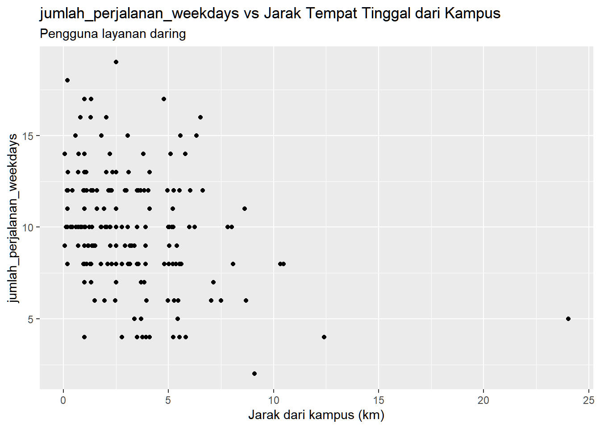

Perhatikan bentuk sebaran titik-titik dalam diagram pencarnya. Secara sekilas, sebaran titik-titik tersebut membentuk formasi kemiringan ke bawah, akan tetapi kerapatannya kecil.

::: {.rmdexercise}
**Aktivitas Mandiri 3: Analisis Korelasi Metrik Komprehensif [STP-11.2]**

1. **Pilih 3 Pasang Variabel Metrik:**
   - Buat scatter plot untuk setiap pasangan
   - Pilih Pearson atau Spearman berdasarkan pola
   - Hitung koefisien korelasi
   - Interpretasikan arah dan kekuatan

2. **Jelaskan Pemilihan Metode:**
   - Mengapa Pearson atau Spearman untuk setiap pasangan?
   - Pertimbangkan: pola linear vs monoton, outlier, distribusi data
:::

------------------------------------------------------------------------

<!--chapter:end:07-korelasi-metrik.Rmd-->

# Modul-8: Analisis Hubungan Kausalitas: Regresi Linear Sederhana dan Berganda

Setelah mempelajari modul ini, Anda diharapkan dapat:

1. mampu menghasilkan regresi linear sederhana dengan perangkat lunak komputer [STP-13.3]{.capaian}
2. mampu menghasilkan persamaan regresi linear berganda dengan perangkat lunak komputer [STP-14.3]{.capaian}


---

## Pendahuluan

Analisis regresi linear adalah analisis statistik untuk menyatakan hubungan sebab-akibat (kausalitas) antar minimal dua variabel. Analisis regresi linear yang melibatkan *dua variabel saja* (*satu variabel dependen* dan *satu variabel independen*), kita sebut sebagai **regresi linear sederhana**, sedangkan analisis regresi linar yang melibatkan lebih dari dua variabel (*satu variabel dependen* dan *lebih dari satu variabel independen*) kita sebut sebagai **regresi linear berganda *(multiple linear regression)***

Analisis regresi linear mewajibkan tingkat pengukuran minimal untuk variabel dependennya adalah **metrik**. Sementara itu, variabel independennya dapat berupa metrik atau bukan (ordinal/nominal).

Analisis regresi linear menghasilkan persamaan yang disebut **persamaan regresi linear**. Bentuk umum persamaan regresi linear tersebut adalah sebagai berikut.

$$
y = β_0 + β_1x
$$

dengan

-   $y$ adalah variabel dependen (disebut juga *variabel respons* atau *predicted variable*)
-   $x$ adalah variabel independen (disebut juga *variabel eksplanatory* atau *predictor variable*)
-   $\beta_0$ adalah konstanta yang menjadi *intercept*, yaitu nilai $y$ ketika $x=0$
-   $\beta_1$ adalah koefisien yang menyatakan seberapa besar perubahan $y$ ketika satu unit nilai $x$ berubah.

Persamaan regresi linear di atas adalah untuk **analisis regresi linear sederhana**, yakni analisis regresi linear yang melibatkan dua variabel saja. Untuk **regresi linear berganda**, kita hanya perlu menambahkan pasangan $\beta$ dan $x$ lainnya, sehingga bentuk umum untuk persamaan regresi linear berganda adalah seperti berikut.

$$
y = β_0 + β_1x_1 + β_2x_2 + ... + β_kx_k
$$

dengan

-   $x_k$ adalah variabel independen ke-$k$
-   $\beta_k$ adalah koefisien untuk variabel independen ke-$k$ tersebut

## Penjelasan Kasus

Dalam praktikum kali ini, kita akan memodelkan hubungan kausal antara dua variabel metrik: **jarak tempat tinggal ke kampus** dan **biaya perjalanan sepekan** untuk mahasiswa-mahasiswi yang menggunakan **kendaraan layanan online saja**. Harga perjalanan menggunakan layanan *online* tentunya dipengaruhi oleh jarak tempuh kendaraan tersebut. Hubungan kausal ini menjadi kasus untuk **regresi linear sederhana**.

Untuk **regresi linear berganda**, kita akan melibatkan satu variabel tambahan sebagai variabel independen, yakni variabel berjenis kategoris , sehingga kita memiliki total variabel sejumlah 3 buah (1 variabel dependen, 2 variabel independen).

## Memuat Pustaka *(Libraries)* yang Diperlukan

Seperti biasa, kita perlu memuat pustaka *(libraries)* yang diperlukan dalam pengolahan data kita. Seperti halnya juga analisis korelasi variabel metrik, kita tidak lagi menggunakan tabel silang, tetapi kita langsung menganalisis kolom-kolom yang ada di dataset kita.


``` r
library(tidyverse) # untuk mengolah data terstruktur
library(readr) # untuk membaca file csv
library(gtsummary) # untuk memproduksi tabel hasil pembuatan regresi dengan cepat dan rapi
```

## Memuat Dataset

Kita akan menggunakan dataset keempat kampus di Kota Bandar Lampung dan sekitarnya sebagai bahan. Kemudian kita akan menyaring objek-objek yang memiliki nilai variabel `kendaraan utama` sama dengan `'Layanan online'`.


``` r
# Membaca data dari file csv
data_mahasiswa <- read_csv2("datasets/Data Praktikum 08.csv")

# Memisahkan data mahasiswa yang menggunakan kendaraan online sebagai moda utama
data_mahasiswa_online <- data_mahasiswa |> 
  filter(`kendaraan utama` == 'Layanan online')
```

## Pola Hubungan Data

Sebagai pendahuluan, kita akan mengidentifikasi kekuatan, arah, dan pola hubungan antara variabel dependen dan independen kita (biaya perjalanan sepekan dan jarak tempat tinggal-kampus). Untuk itu kita dapat menghitung koefisien korelasi untuk hubungan variabel metrik juga, yakni koefisien korelasi Pearson's $r$.

Pola hubungan akan kita analisis dengan membuat diagram pencar *(scatter plot)* antara variabel dependen dengan variabel independennya.

**Menghitung Koefisien Pearson's** $r$

Menghitung koefisien korelasi Pearson's $r$ dapat kita lakukan dengan perintah `cor()` dengan atribut `method = "pearson"` setelah terlebih dahulu menyimpan nilai masing-masing variabel ke dalam suatu vektor.


``` r
# Menyimpan vektor jarak dan biaya (perjalanan) sepekan ke dalam variabel 
# 'x' dan 'y'
x <- data_mahasiswa_online$jarak
y <- data_mahasiswa_online$`biaya sepekan`

cor(x, y, use = "complete.obs", method = "pearson")
```

```
## [1] -0.1813941
```

> **Jawablah:** Tuliskan interpretasi kalian terhadap koefisien korelasi antara variabel jarak tempuh dengan biaya perjalanan sepekan.
>
> *Petunjuk: ulas kekuatan serta arah hubungannya serta maknai secara kontekstual ulasan tersebut*

**Membuat Diagram Pencar**

Membuat diagram pencar dapat dilakukan dengan menerapkan perintah `geom_point()` dari pustaka `ggplot2` yang dimuat bersama pustaka `tidyverse`.


``` r
# Membuat diagram pencar antara variabel jarak dan biaya transportasi sepekan
# untuk mahasiswa yang pakai layanan online
scp <- ggplot(data = data_mahasiswa_online,
              mapping = aes(x = jarak, # variabel di sumbu X
                            y = `biaya sepekan`)
              ) + # variabel di sumbu Y
  geom_point(color = 'navy',  # perintah untuk menampilkan diagram pencar dengan warna biru
             size = 1.5,      # mengatur ukuran titik
             shape = 15) +    # mengatur bentuk titik menjadi persegi
  labs(title = "Jarak tempat tinggal vs. Biaya Transportasi Sepekan",
       subtitle = "Mahasiswa dengan Moda Transportasi Layanan Online",
       y = "Biaya transportasi sepekan (ribu rupiah)",
       x = "Jarak dari tempat tinggal ke kampus (km)")

# Menampilkan diagram
scp
```

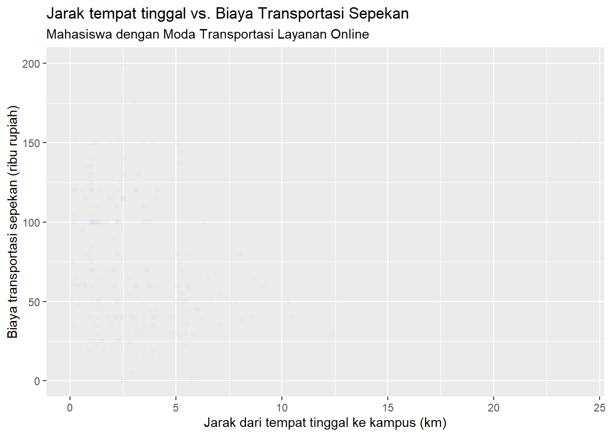

Setelah Anda melakukan pembuatan diagram pencar tersebut, Anda akan menyadari bahwa kita memiliki *outlier* (pencilan), yakni objek yang memiliki nilai jarak dari tempat tinggal ke kampus mencapai hampir 25 km.

Keberadaan pencilan ini akan mengganggu hasil analisis kita. Mari kita buktikan dengan menghilangkan data pencilan tersebut.


``` r
# Menghilangkan observasi pencilan dengan menyaring observasi dengan
# jarak < 15 km
data_mahasiswa_online <- data_mahasiswa_online |> 
  filter(jarak < 15)
```

Di sini kita akan menghitung ulang nilai koefisien korelasi kita.


``` r
# Menghitung korelasi antara biaya sepekan dengan jarak dari dataset yang
# sudah dihilangkan pencilannya
x <- data_mahasiswa_online$jarak
y <- data_mahasiswa_online$`biaya sepekan`

cor(x, y, method = "pearson")
```

```
## [1] -0.3086803
```

> **Jawablah:** Bagaimana perbedaan nilai koefisiennya?

Kita pun dapat memeriksa hasil perbaikan dataset kita dari diagram pencar yang baru berikut.


``` r
# Membuat diagram pencar antara variabel jarak dan biaya transportasi sepekan
# untuk mahasiswa yang pakai layanan online, setelah pencilan dihilangkan
scp <- ggplot(data = data_mahasiswa_online,
              mapping = aes(x = jarak, # variabel di sumbu X
                            y = `biaya sepekan`)) + # variabel di sumbu Y
  geom_point(color = 'navy',  # perintah untuk menampilkan diagram pencar
             size = 1.5,      # mengatur ukuran titik
             shape = 15) +    # mengatur bentuk titik menjadi persegi
  labs(title = "Jarak tempat tinggal vs. Biaya Transportasi Sepekan",
       subtitle = "Mahasiswa dengan Moda Transportasi Layanan Online",
       y = "Biaya transportasi sepekan (ribu rupiah)",
       x = "Jarak dari tempat tinggal ke kampus (km)")

# Menampilkan diagram yang baru
scp
```

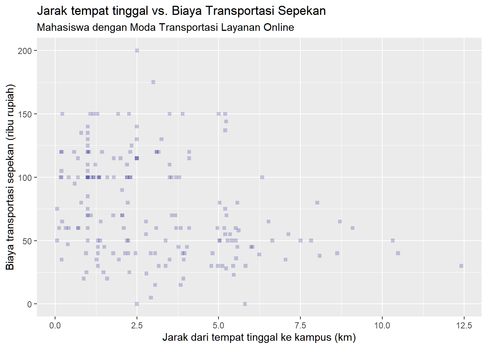

## Model Regresi Linear Sederhana

Dalam bagian ini kita akan mempelajari cara menyusun, menampilkan, menafsirkan/menginterpretasi, dan memprediksi nilai variabel dependen berdasarkan model yang kita susun.

### Penyusunan Model

Untuk membuat persamaan model regresi linear, kita akan menggunakan perintah `lm` yang sudah disediakan secara bawaan oleh R. Hasil dari perintah ini dapat kita simpan sebagai variabel tertentu.


``` r
# Membuat model regresi linear
model <- lm(y ~ x, data = data_mahasiswa_online)
```

Argumen yang kita gunakan adalah `var_dependen ~ var_independen` serta nama dataset yang kita gunakan. Tanda `~` (disebut *tilde*) dapat kita masukkan dengan menekan `Shift` + `` ` `` yang ada di sebelah kiri tombol angka 1 di *keyboard* kita.

Sebelumnya kita sudah mendefinisikan `y` dan `x` sebagai variabel untuk vektor biaya transportasi sepekan dan vektor jarak, sehingga kita bisa langsung menggunakannya di atas. Dataset yang kita gunakan adalah dataset mahasiswa yang menggunakan layanan *online* sebagai moda transportasi utama yang kita simpan dalam `data_mahasiswa_online`.

### Penampilan Model

Untuk menampilkan hasil penyusunan model regresi linear, kita akan menggunakan perintah `summary` yang juga sudah disediakan secara bawaan oleh R.


``` r
# Menampilkan hasil model regresi linear
summary(model)
```

```
## 
## Call:
## lm(formula = y ~ x, data = data_mahasiswa_online)
## 
## Residuals:
##     Min      1Q  Median      3Q     Max 
## -79.255 -30.717  -3.562  26.758 120.787 
## 
## Coefficients:
##             Estimate Std. Error t value Pr(>|t|)    
## (Intercept)   92.557      4.598  20.129  < 2e-16 ***
## x             -5.321      1.205  -4.414 1.72e-05 ***
## ---
## Signif. codes:  0 '***' 0.001 '**' 0.01 '*' 0.05 '.' 0.1 ' ' 1
## 
## Residual standard error: 38.11 on 185 degrees of freedom
## Multiple R-squared:  0.09528,	Adjusted R-squared:  0.09039 
## F-statistic: 19.48 on 1 and 185 DF,  p-value: 1.721e-05
```

Yang ditampilkan dengan perintah tersebut antara lain adalah sebagai berikut. Penjelasan lebih lanjutnya akan diberikan di subbagian selanjutnya.

-   `Call` : bentuk persamaan model yang sudah kita input sebelumnya

-   `Residuals` : informasi residual model

-   `Coefficients` : tabel yang menunjukkan angka-angka dalam persamaan model yang dihasilkan

-   Nilai-nilai uji kualitas model seperti `Residual standard error` *(standard error* estimasi), *Multiple R-squared* dan *Adjusted R-squared* (koefisien determinasi), serta *F-statistic* (uji signifikansi model).

Selain menggunakan `summary`, kita juga dapat menggunakan perintah `tbl_regression`, perintah yang disediakan oleh paket/*library* `gtsummary`. Hasil dari perintah ini adalah tabel yang sudah diformat sesuai dengan *templat* artikel ilmiah.


``` r
# Menampilkan hasil model regresi linear dengan tbl_regression
tbl_regression(model)
```

```{=html}
<div id="gyzehufyvy" style="padding-left:0px;padding-right:0px;padding-top:10px;padding-bottom:10px;overflow-x:auto;overflow-y:auto;width:auto;height:auto;">
<style>#gyzehufyvy table {
  font-family: system-ui, 'Segoe UI', Roboto, Helvetica, Arial, sans-serif, 'Apple Color Emoji', 'Segoe UI Emoji', 'Segoe UI Symbol', 'Noto Color Emoji';
  -webkit-font-smoothing: antialiased;
  -moz-osx-font-smoothing: grayscale;
}

#gyzehufyvy thead, #gyzehufyvy tbody, #gyzehufyvy tfoot, #gyzehufyvy tr, #gyzehufyvy td, #gyzehufyvy th {
  border-style: none;
}

#gyzehufyvy p {
  margin: 0;
  padding: 0;
}

#gyzehufyvy .gt_table {
  display: table;
  border-collapse: collapse;
  line-height: normal;
  margin-left: auto;
  margin-right: auto;
  color: #333333;
  font-size: 16px;
  font-weight: normal;
  font-style: normal;
  background-color: #FFFFFF;
  width: auto;
  border-top-style: solid;
  border-top-width: 2px;
  border-top-color: #A8A8A8;
  border-right-style: none;
  border-right-width: 2px;
  border-right-color: #D3D3D3;
  border-bottom-style: solid;
  border-bottom-width: 2px;
  border-bottom-color: #A8A8A8;
  border-left-style: none;
  border-left-width: 2px;
  border-left-color: #D3D3D3;
}

#gyzehufyvy .gt_caption {
  padding-top: 4px;
  padding-bottom: 4px;
}

#gyzehufyvy .gt_title {
  color: #333333;
  font-size: 125%;
  font-weight: initial;
  padding-top: 4px;
  padding-bottom: 4px;
  padding-left: 5px;
  padding-right: 5px;
  border-bottom-color: #FFFFFF;
  border-bottom-width: 0;
}

#gyzehufyvy .gt_subtitle {
  color: #333333;
  font-size: 85%;
  font-weight: initial;
  padding-top: 3px;
  padding-bottom: 5px;
  padding-left: 5px;
  padding-right: 5px;
  border-top-color: #FFFFFF;
  border-top-width: 0;
}

#gyzehufyvy .gt_heading {
  background-color: #FFFFFF;
  text-align: center;
  border-bottom-color: #FFFFFF;
  border-left-style: none;
  border-left-width: 1px;
  border-left-color: #D3D3D3;
  border-right-style: none;
  border-right-width: 1px;
  border-right-color: #D3D3D3;
}

#gyzehufyvy .gt_bottom_border {
  border-bottom-style: solid;
  border-bottom-width: 2px;
  border-bottom-color: #D3D3D3;
}

#gyzehufyvy .gt_col_headings {
  border-top-style: solid;
  border-top-width: 2px;
  border-top-color: #D3D3D3;
  border-bottom-style: solid;
  border-bottom-width: 2px;
  border-bottom-color: #D3D3D3;
  border-left-style: none;
  border-left-width: 1px;
  border-left-color: #D3D3D3;
  border-right-style: none;
  border-right-width: 1px;
  border-right-color: #D3D3D3;
}

#gyzehufyvy .gt_col_heading {
  color: #333333;
  background-color: #FFFFFF;
  font-size: 100%;
  font-weight: normal;
  text-transform: inherit;
  border-left-style: none;
  border-left-width: 1px;
  border-left-color: #D3D3D3;
  border-right-style: none;
  border-right-width: 1px;
  border-right-color: #D3D3D3;
  vertical-align: bottom;
  padding-top: 5px;
  padding-bottom: 6px;
  padding-left: 5px;
  padding-right: 5px;
  overflow-x: hidden;
}

#gyzehufyvy .gt_column_spanner_outer {
  color: #333333;
  background-color: #FFFFFF;
  font-size: 100%;
  font-weight: normal;
  text-transform: inherit;
  padding-top: 0;
  padding-bottom: 0;
  padding-left: 4px;
  padding-right: 4px;
}

#gyzehufyvy .gt_column_spanner_outer:first-child {
  padding-left: 0;
}

#gyzehufyvy .gt_column_spanner_outer:last-child {
  padding-right: 0;
}

#gyzehufyvy .gt_column_spanner {
  border-bottom-style: solid;
  border-bottom-width: 2px;
  border-bottom-color: #D3D3D3;
  vertical-align: bottom;
  padding-top: 5px;
  padding-bottom: 5px;
  overflow-x: hidden;
  display: inline-block;
  width: 100%;
}

#gyzehufyvy .gt_spanner_row {
  border-bottom-style: hidden;
}

#gyzehufyvy .gt_group_heading {
  padding-top: 8px;
  padding-bottom: 8px;
  padding-left: 5px;
  padding-right: 5px;
  color: #333333;
  background-color: #FFFFFF;
  font-size: 100%;
  font-weight: initial;
  text-transform: inherit;
  border-top-style: solid;
  border-top-width: 2px;
  border-top-color: #D3D3D3;
  border-bottom-style: solid;
  border-bottom-width: 2px;
  border-bottom-color: #D3D3D3;
  border-left-style: none;
  border-left-width: 1px;
  border-left-color: #D3D3D3;
  border-right-style: none;
  border-right-width: 1px;
  border-right-color: #D3D3D3;
  vertical-align: middle;
  text-align: left;
}

#gyzehufyvy .gt_empty_group_heading {
  padding: 0.5px;
  color: #333333;
  background-color: #FFFFFF;
  font-size: 100%;
  font-weight: initial;
  border-top-style: solid;
  border-top-width: 2px;
  border-top-color: #D3D3D3;
  border-bottom-style: solid;
  border-bottom-width: 2px;
  border-bottom-color: #D3D3D3;
  vertical-align: middle;
}

#gyzehufyvy .gt_from_md > :first-child {
  margin-top: 0;
}

#gyzehufyvy .gt_from_md > :last-child {
  margin-bottom: 0;
}

#gyzehufyvy .gt_row {
  padding-top: 8px;
  padding-bottom: 8px;
  padding-left: 5px;
  padding-right: 5px;
  margin: 10px;
  border-top-style: solid;
  border-top-width: 1px;
  border-top-color: #D3D3D3;
  border-left-style: none;
  border-left-width: 1px;
  border-left-color: #D3D3D3;
  border-right-style: none;
  border-right-width: 1px;
  border-right-color: #D3D3D3;
  vertical-align: middle;
  overflow-x: hidden;
}

#gyzehufyvy .gt_stub {
  color: #333333;
  background-color: #FFFFFF;
  font-size: 100%;
  font-weight: initial;
  text-transform: inherit;
  border-right-style: solid;
  border-right-width: 2px;
  border-right-color: #D3D3D3;
  padding-left: 5px;
  padding-right: 5px;
}

#gyzehufyvy .gt_stub_row_group {
  color: #333333;
  background-color: #FFFFFF;
  font-size: 100%;
  font-weight: initial;
  text-transform: inherit;
  border-right-style: solid;
  border-right-width: 2px;
  border-right-color: #D3D3D3;
  padding-left: 5px;
  padding-right: 5px;
  vertical-align: top;
}

#gyzehufyvy .gt_row_group_first td {
  border-top-width: 2px;
}

#gyzehufyvy .gt_row_group_first th {
  border-top-width: 2px;
}

#gyzehufyvy .gt_summary_row {
  color: #333333;
  background-color: #FFFFFF;
  text-transform: inherit;
  padding-top: 8px;
  padding-bottom: 8px;
  padding-left: 5px;
  padding-right: 5px;
}

#gyzehufyvy .gt_first_summary_row {
  border-top-style: solid;
  border-top-color: #D3D3D3;
}

#gyzehufyvy .gt_first_summary_row.thick {
  border-top-width: 2px;
}

#gyzehufyvy .gt_last_summary_row {
  padding-top: 8px;
  padding-bottom: 8px;
  padding-left: 5px;
  padding-right: 5px;
  border-bottom-style: solid;
  border-bottom-width: 2px;
  border-bottom-color: #D3D3D3;
}

#gyzehufyvy .gt_grand_summary_row {
  color: #333333;
  background-color: #FFFFFF;
  text-transform: inherit;
  padding-top: 8px;
  padding-bottom: 8px;
  padding-left: 5px;
  padding-right: 5px;
}

#gyzehufyvy .gt_first_grand_summary_row {
  padding-top: 8px;
  padding-bottom: 8px;
  padding-left: 5px;
  padding-right: 5px;
  border-top-style: double;
  border-top-width: 6px;
  border-top-color: #D3D3D3;
}

#gyzehufyvy .gt_last_grand_summary_row_top {
  padding-top: 8px;
  padding-bottom: 8px;
  padding-left: 5px;
  padding-right: 5px;
  border-bottom-style: double;
  border-bottom-width: 6px;
  border-bottom-color: #D3D3D3;
}

#gyzehufyvy .gt_striped {
  background-color: rgba(128, 128, 128, 0.05);
}

#gyzehufyvy .gt_table_body {
  border-top-style: solid;
  border-top-width: 2px;
  border-top-color: #D3D3D3;
  border-bottom-style: solid;
  border-bottom-width: 2px;
  border-bottom-color: #D3D3D3;
}

#gyzehufyvy .gt_footnotes {
  color: #333333;
  background-color: #FFFFFF;
  border-bottom-style: none;
  border-bottom-width: 2px;
  border-bottom-color: #D3D3D3;
  border-left-style: none;
  border-left-width: 2px;
  border-left-color: #D3D3D3;
  border-right-style: none;
  border-right-width: 2px;
  border-right-color: #D3D3D3;
}

#gyzehufyvy .gt_footnote {
  margin: 0px;
  font-size: 90%;
  padding-top: 4px;
  padding-bottom: 4px;
  padding-left: 5px;
  padding-right: 5px;
}

#gyzehufyvy .gt_sourcenotes {
  color: #333333;
  background-color: #FFFFFF;
  border-bottom-style: none;
  border-bottom-width: 2px;
  border-bottom-color: #D3D3D3;
  border-left-style: none;
  border-left-width: 2px;
  border-left-color: #D3D3D3;
  border-right-style: none;
  border-right-width: 2px;
  border-right-color: #D3D3D3;
}

#gyzehufyvy .gt_sourcenote {
  font-size: 90%;
  padding-top: 4px;
  padding-bottom: 4px;
  padding-left: 5px;
  padding-right: 5px;
}

#gyzehufyvy .gt_left {
  text-align: left;
}

#gyzehufyvy .gt_center {
  text-align: center;
}

#gyzehufyvy .gt_right {
  text-align: right;
  font-variant-numeric: tabular-nums;
}

#gyzehufyvy .gt_font_normal {
  font-weight: normal;
}

#gyzehufyvy .gt_font_bold {
  font-weight: bold;
}

#gyzehufyvy .gt_font_italic {
  font-style: italic;
}

#gyzehufyvy .gt_super {
  font-size: 65%;
}

#gyzehufyvy .gt_footnote_marks {
  font-size: 75%;
  vertical-align: 0.4em;
  position: initial;
}

#gyzehufyvy .gt_asterisk {
  font-size: 100%;
  vertical-align: 0;
}

#gyzehufyvy .gt_indent_1 {
  text-indent: 5px;
}

#gyzehufyvy .gt_indent_2 {
  text-indent: 10px;
}

#gyzehufyvy .gt_indent_3 {
  text-indent: 15px;
}

#gyzehufyvy .gt_indent_4 {
  text-indent: 20px;
}

#gyzehufyvy .gt_indent_5 {
  text-indent: 25px;
}

#gyzehufyvy .katex-display {
  display: inline-flex !important;
  margin-bottom: 0.75em !important;
}

#gyzehufyvy div.Reactable > div.rt-table > div.rt-thead > div.rt-tr.rt-tr-group-header > div.rt-th-group:after {
  height: 0px !important;
}
</style>
<table class="gt_table" data-quarto-disable-processing="false" data-quarto-bootstrap="false">
  <thead>
    <tr class="gt_col_headings">
      <th class="gt_col_heading gt_columns_bottom_border gt_left" rowspan="1" colspan="1" scope="col" id="label"><span class='gt_from_md'><strong>Characteristic</strong></span></th>
      <th class="gt_col_heading gt_columns_bottom_border gt_center" rowspan="1" colspan="1" scope="col" id="estimate"><span class='gt_from_md'><strong>Beta</strong></span></th>
      <th class="gt_col_heading gt_columns_bottom_border gt_center" rowspan="1" colspan="1" scope="col" id="conf.low"><span class='gt_from_md'><strong>95% CI</strong></span></th>
      <th class="gt_col_heading gt_columns_bottom_border gt_center" rowspan="1" colspan="1" scope="col" id="p.value"><span class='gt_from_md'><strong>p-value</strong></span></th>
    </tr>
  </thead>
  <tbody class="gt_table_body">
    <tr><td headers="label" class="gt_row gt_left">x</td>
<td headers="estimate" class="gt_row gt_center">-5.3</td>
<td headers="conf.low" class="gt_row gt_center">-7.7, -2.9</td>
<td headers="p.value" class="gt_row gt_center"><0.001</td></tr>
  </tbody>
  <tfoot>
    <tr class="gt_sourcenotes">
      <td class="gt_sourcenote" colspan="4"><span class='gt_from_md'>Abbreviation: CI = Confidence Interval</span></td>
    </tr>
  </tfoot>
</table>
</div>
```

Jika kalian menemukan pertanyaan untuk menginstal sebuah paket di *console*, yakni `broom.helpers`, pilih saja "Yes" untuk mengunduh dan menginstalnya.

Secara bawaan, tabel tidak menampilkan nilai konstanta *(intercept)*, menampilkan nilai *confidence level* 95%, dan menampilkan nilai dari variabel independen sesuai variabel yang kita tetapkan sebelumnya, dalam hal ini adalah `x`. Untuk menggantinya, kita dapat melakukan penyesuaian perintah sebagai berikut.


``` r
tbl_regression(
  model,
  intercept = TRUE, # mengatur intercept-nya ditampilkan
  conf.level = 0.99, # mengatur nilai confidence level menjadi 99%
  label = list(x ~ "Jarak tempuh ke kampus, km") # Mengganti tulisan "x" saja menjadi yang
) # lebih bermakna
```

```{=html}
<div id="omohigndci" style="padding-left:0px;padding-right:0px;padding-top:10px;padding-bottom:10px;overflow-x:auto;overflow-y:auto;width:auto;height:auto;">
<style>#omohigndci table {
  font-family: system-ui, 'Segoe UI', Roboto, Helvetica, Arial, sans-serif, 'Apple Color Emoji', 'Segoe UI Emoji', 'Segoe UI Symbol', 'Noto Color Emoji';
  -webkit-font-smoothing: antialiased;
  -moz-osx-font-smoothing: grayscale;
}

#omohigndci thead, #omohigndci tbody, #omohigndci tfoot, #omohigndci tr, #omohigndci td, #omohigndci th {
  border-style: none;
}

#omohigndci p {
  margin: 0;
  padding: 0;
}

#omohigndci .gt_table {
  display: table;
  border-collapse: collapse;
  line-height: normal;
  margin-left: auto;
  margin-right: auto;
  color: #333333;
  font-size: 16px;
  font-weight: normal;
  font-style: normal;
  background-color: #FFFFFF;
  width: auto;
  border-top-style: solid;
  border-top-width: 2px;
  border-top-color: #A8A8A8;
  border-right-style: none;
  border-right-width: 2px;
  border-right-color: #D3D3D3;
  border-bottom-style: solid;
  border-bottom-width: 2px;
  border-bottom-color: #A8A8A8;
  border-left-style: none;
  border-left-width: 2px;
  border-left-color: #D3D3D3;
}

#omohigndci .gt_caption {
  padding-top: 4px;
  padding-bottom: 4px;
}

#omohigndci .gt_title {
  color: #333333;
  font-size: 125%;
  font-weight: initial;
  padding-top: 4px;
  padding-bottom: 4px;
  padding-left: 5px;
  padding-right: 5px;
  border-bottom-color: #FFFFFF;
  border-bottom-width: 0;
}

#omohigndci .gt_subtitle {
  color: #333333;
  font-size: 85%;
  font-weight: initial;
  padding-top: 3px;
  padding-bottom: 5px;
  padding-left: 5px;
  padding-right: 5px;
  border-top-color: #FFFFFF;
  border-top-width: 0;
}

#omohigndci .gt_heading {
  background-color: #FFFFFF;
  text-align: center;
  border-bottom-color: #FFFFFF;
  border-left-style: none;
  border-left-width: 1px;
  border-left-color: #D3D3D3;
  border-right-style: none;
  border-right-width: 1px;
  border-right-color: #D3D3D3;
}

#omohigndci .gt_bottom_border {
  border-bottom-style: solid;
  border-bottom-width: 2px;
  border-bottom-color: #D3D3D3;
}

#omohigndci .gt_col_headings {
  border-top-style: solid;
  border-top-width: 2px;
  border-top-color: #D3D3D3;
  border-bottom-style: solid;
  border-bottom-width: 2px;
  border-bottom-color: #D3D3D3;
  border-left-style: none;
  border-left-width: 1px;
  border-left-color: #D3D3D3;
  border-right-style: none;
  border-right-width: 1px;
  border-right-color: #D3D3D3;
}

#omohigndci .gt_col_heading {
  color: #333333;
  background-color: #FFFFFF;
  font-size: 100%;
  font-weight: normal;
  text-transform: inherit;
  border-left-style: none;
  border-left-width: 1px;
  border-left-color: #D3D3D3;
  border-right-style: none;
  border-right-width: 1px;
  border-right-color: #D3D3D3;
  vertical-align: bottom;
  padding-top: 5px;
  padding-bottom: 6px;
  padding-left: 5px;
  padding-right: 5px;
  overflow-x: hidden;
}

#omohigndci .gt_column_spanner_outer {
  color: #333333;
  background-color: #FFFFFF;
  font-size: 100%;
  font-weight: normal;
  text-transform: inherit;
  padding-top: 0;
  padding-bottom: 0;
  padding-left: 4px;
  padding-right: 4px;
}

#omohigndci .gt_column_spanner_outer:first-child {
  padding-left: 0;
}

#omohigndci .gt_column_spanner_outer:last-child {
  padding-right: 0;
}

#omohigndci .gt_column_spanner {
  border-bottom-style: solid;
  border-bottom-width: 2px;
  border-bottom-color: #D3D3D3;
  vertical-align: bottom;
  padding-top: 5px;
  padding-bottom: 5px;
  overflow-x: hidden;
  display: inline-block;
  width: 100%;
}

#omohigndci .gt_spanner_row {
  border-bottom-style: hidden;
}

#omohigndci .gt_group_heading {
  padding-top: 8px;
  padding-bottom: 8px;
  padding-left: 5px;
  padding-right: 5px;
  color: #333333;
  background-color: #FFFFFF;
  font-size: 100%;
  font-weight: initial;
  text-transform: inherit;
  border-top-style: solid;
  border-top-width: 2px;
  border-top-color: #D3D3D3;
  border-bottom-style: solid;
  border-bottom-width: 2px;
  border-bottom-color: #D3D3D3;
  border-left-style: none;
  border-left-width: 1px;
  border-left-color: #D3D3D3;
  border-right-style: none;
  border-right-width: 1px;
  border-right-color: #D3D3D3;
  vertical-align: middle;
  text-align: left;
}

#omohigndci .gt_empty_group_heading {
  padding: 0.5px;
  color: #333333;
  background-color: #FFFFFF;
  font-size: 100%;
  font-weight: initial;
  border-top-style: solid;
  border-top-width: 2px;
  border-top-color: #D3D3D3;
  border-bottom-style: solid;
  border-bottom-width: 2px;
  border-bottom-color: #D3D3D3;
  vertical-align: middle;
}

#omohigndci .gt_from_md > :first-child {
  margin-top: 0;
}

#omohigndci .gt_from_md > :last-child {
  margin-bottom: 0;
}

#omohigndci .gt_row {
  padding-top: 8px;
  padding-bottom: 8px;
  padding-left: 5px;
  padding-right: 5px;
  margin: 10px;
  border-top-style: solid;
  border-top-width: 1px;
  border-top-color: #D3D3D3;
  border-left-style: none;
  border-left-width: 1px;
  border-left-color: #D3D3D3;
  border-right-style: none;
  border-right-width: 1px;
  border-right-color: #D3D3D3;
  vertical-align: middle;
  overflow-x: hidden;
}

#omohigndci .gt_stub {
  color: #333333;
  background-color: #FFFFFF;
  font-size: 100%;
  font-weight: initial;
  text-transform: inherit;
  border-right-style: solid;
  border-right-width: 2px;
  border-right-color: #D3D3D3;
  padding-left: 5px;
  padding-right: 5px;
}

#omohigndci .gt_stub_row_group {
  color: #333333;
  background-color: #FFFFFF;
  font-size: 100%;
  font-weight: initial;
  text-transform: inherit;
  border-right-style: solid;
  border-right-width: 2px;
  border-right-color: #D3D3D3;
  padding-left: 5px;
  padding-right: 5px;
  vertical-align: top;
}

#omohigndci .gt_row_group_first td {
  border-top-width: 2px;
}

#omohigndci .gt_row_group_first th {
  border-top-width: 2px;
}

#omohigndci .gt_summary_row {
  color: #333333;
  background-color: #FFFFFF;
  text-transform: inherit;
  padding-top: 8px;
  padding-bottom: 8px;
  padding-left: 5px;
  padding-right: 5px;
}

#omohigndci .gt_first_summary_row {
  border-top-style: solid;
  border-top-color: #D3D3D3;
}

#omohigndci .gt_first_summary_row.thick {
  border-top-width: 2px;
}

#omohigndci .gt_last_summary_row {
  padding-top: 8px;
  padding-bottom: 8px;
  padding-left: 5px;
  padding-right: 5px;
  border-bottom-style: solid;
  border-bottom-width: 2px;
  border-bottom-color: #D3D3D3;
}

#omohigndci .gt_grand_summary_row {
  color: #333333;
  background-color: #FFFFFF;
  text-transform: inherit;
  padding-top: 8px;
  padding-bottom: 8px;
  padding-left: 5px;
  padding-right: 5px;
}

#omohigndci .gt_first_grand_summary_row {
  padding-top: 8px;
  padding-bottom: 8px;
  padding-left: 5px;
  padding-right: 5px;
  border-top-style: double;
  border-top-width: 6px;
  border-top-color: #D3D3D3;
}

#omohigndci .gt_last_grand_summary_row_top {
  padding-top: 8px;
  padding-bottom: 8px;
  padding-left: 5px;
  padding-right: 5px;
  border-bottom-style: double;
  border-bottom-width: 6px;
  border-bottom-color: #D3D3D3;
}

#omohigndci .gt_striped {
  background-color: rgba(128, 128, 128, 0.05);
}

#omohigndci .gt_table_body {
  border-top-style: solid;
  border-top-width: 2px;
  border-top-color: #D3D3D3;
  border-bottom-style: solid;
  border-bottom-width: 2px;
  border-bottom-color: #D3D3D3;
}

#omohigndci .gt_footnotes {
  color: #333333;
  background-color: #FFFFFF;
  border-bottom-style: none;
  border-bottom-width: 2px;
  border-bottom-color: #D3D3D3;
  border-left-style: none;
  border-left-width: 2px;
  border-left-color: #D3D3D3;
  border-right-style: none;
  border-right-width: 2px;
  border-right-color: #D3D3D3;
}

#omohigndci .gt_footnote {
  margin: 0px;
  font-size: 90%;
  padding-top: 4px;
  padding-bottom: 4px;
  padding-left: 5px;
  padding-right: 5px;
}

#omohigndci .gt_sourcenotes {
  color: #333333;
  background-color: #FFFFFF;
  border-bottom-style: none;
  border-bottom-width: 2px;
  border-bottom-color: #D3D3D3;
  border-left-style: none;
  border-left-width: 2px;
  border-left-color: #D3D3D3;
  border-right-style: none;
  border-right-width: 2px;
  border-right-color: #D3D3D3;
}

#omohigndci .gt_sourcenote {
  font-size: 90%;
  padding-top: 4px;
  padding-bottom: 4px;
  padding-left: 5px;
  padding-right: 5px;
}

#omohigndci .gt_left {
  text-align: left;
}

#omohigndci .gt_center {
  text-align: center;
}

#omohigndci .gt_right {
  text-align: right;
  font-variant-numeric: tabular-nums;
}

#omohigndci .gt_font_normal {
  font-weight: normal;
}

#omohigndci .gt_font_bold {
  font-weight: bold;
}

#omohigndci .gt_font_italic {
  font-style: italic;
}

#omohigndci .gt_super {
  font-size: 65%;
}

#omohigndci .gt_footnote_marks {
  font-size: 75%;
  vertical-align: 0.4em;
  position: initial;
}

#omohigndci .gt_asterisk {
  font-size: 100%;
  vertical-align: 0;
}

#omohigndci .gt_indent_1 {
  text-indent: 5px;
}

#omohigndci .gt_indent_2 {
  text-indent: 10px;
}

#omohigndci .gt_indent_3 {
  text-indent: 15px;
}

#omohigndci .gt_indent_4 {
  text-indent: 20px;
}

#omohigndci .gt_indent_5 {
  text-indent: 25px;
}

#omohigndci .katex-display {
  display: inline-flex !important;
  margin-bottom: 0.75em !important;
}

#omohigndci div.Reactable > div.rt-table > div.rt-thead > div.rt-tr.rt-tr-group-header > div.rt-th-group:after {
  height: 0px !important;
}
</style>
<table class="gt_table" data-quarto-disable-processing="false" data-quarto-bootstrap="false">
  <thead>
    <tr class="gt_col_headings">
      <th class="gt_col_heading gt_columns_bottom_border gt_left" rowspan="1" colspan="1" scope="col" id="label"><span class='gt_from_md'><strong>Characteristic</strong></span></th>
      <th class="gt_col_heading gt_columns_bottom_border gt_center" rowspan="1" colspan="1" scope="col" id="estimate"><span class='gt_from_md'><strong>Beta</strong></span></th>
      <th class="gt_col_heading gt_columns_bottom_border gt_center" rowspan="1" colspan="1" scope="col" id="conf.low"><span class='gt_from_md'><strong>99% CI</strong></span></th>
      <th class="gt_col_heading gt_columns_bottom_border gt_center" rowspan="1" colspan="1" scope="col" id="p.value"><span class='gt_from_md'><strong>p-value</strong></span></th>
    </tr>
  </thead>
  <tbody class="gt_table_body">
    <tr><td headers="label" class="gt_row gt_left">(Intercept)</td>
<td headers="estimate" class="gt_row gt_center">93</td>
<td headers="conf.low" class="gt_row gt_center">81, 105</td>
<td headers="p.value" class="gt_row gt_center"><0.001</td></tr>
    <tr><td headers="label" class="gt_row gt_left">Jarak tempuh ke kampus, km</td>
<td headers="estimate" class="gt_row gt_center">-5.3</td>
<td headers="conf.low" class="gt_row gt_center">-8.5, -2.2</td>
<td headers="p.value" class="gt_row gt_center"><0.001</td></tr>
  </tbody>
  <tfoot>
    <tr class="gt_sourcenotes">
      <td class="gt_sourcenote" colspan="4"><span class='gt_from_md'>Abbreviation: CI = Confidence Interval</span></td>
    </tr>
  </tfoot>
</table>
</div>
```

### Penafsiran/interpretasi Model

Yang kita akan tafsirkan dari model kita di antaranya adalah:

-   persamaan model

-   makna nilai konstanta dan koefisien

-   uji kualitas model (ANOVA, `F-statistic`)

-   uji kualitas variabel (`Pr(>|t|)`)

#### Tafsiran persamaan model

Persamaan model dapat kita tafsirkan berdasarkan keluaran dari `summary` berupa `Coefficients` atau hasil dari `tbl_regression` milik `gtsummary`.

Berdasarkan keluaran kedua perintah tersebut, kita dapat mengetahui bagaimana persamaan regresi linearnya dengan mengganti bentuk umum persamaan regresi linear dengan angka-angka yang dihasilkan di `model`.

Bentuk umum:

$$
y = β_0 + β_1x
$$

Dengan mengambil hasil dari *summary(model)*, kita dapat menuliskan persamaan regresi linear kita menjadi:

$$
y = 93 - 5,3x
$$

Dari persamaan model ini kita dapat menggambar garis yang melewati titik-titik data kita. Ini merupakan persamaan garis terbaik dari seluruh kemungkinan persamaan garis yang ada, yang kita tentukan dengan meminimalkan kuadrat terkecil.


``` r
# Membuat diagram pencar antara variabel jarak dan biaya transportasi sepekan
# untuk mahasiswa yang pakai layanan online, setelah pencilan dihilangkan,
# ditambah garis dari persamaan regresi
scp <- ggplot(data = data_mahasiswa_online,
              mapping = aes(x = jarak, # variabel di sumbu X
                            y = `biaya sepekan`)) + # variabel di sumbu Y
  geom_point(color = 'navy',  
             size = 1.5,      
             shape = 15) +    
  geom_abline(aes(intercept = coef(model)[1],
                  slope = coef(model)[2],
                  color = "red")) +
  labs(title = "Jarak tempat tinggal vs. Biaya Transportasi Sepekan",
       subtitle = "Mahasiswa dengan Moda Transportasi Layanan Online",
       y = "Biaya transportasi sepekan (ribu rupiah)",
       x = "Jarak dari tempat tinggal ke kampus (km)")

# Menampilkan diagram pencar
scp
```

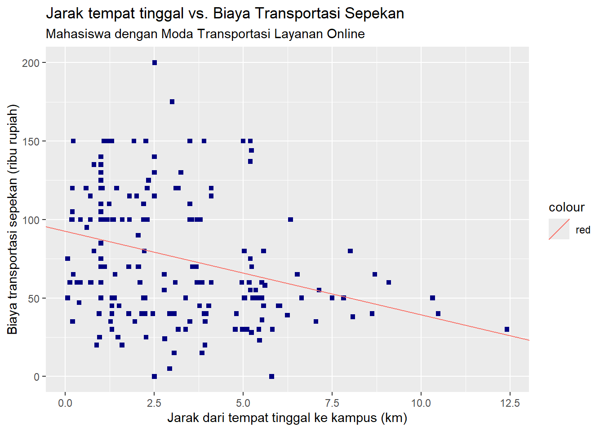

-   `coef(model)[1]` mengacu pada keluaran fungsi `coef` dari variabel `model` kita yang pertama (`[1]`), yakni angka *intercept*/konstantanya. Ini menjadi nilai dari atribut `intercept` yang terletak dalam fungsi `geom_abline`

-   `coef(model)[2]` mengacu pada keluaran fungsi `coef` dari variabel `model` kita yang kedua ([`2]`), yakni angka koefisien variabel independen kita. Ini menjadi nilai dari atribut `slope` yang terletak dalam fungsi `geom_abline` karena nilai koefisien variabel independen menunjukkan kemiringan garis persamaan regresi linear kita

Persamaan model dapat kita tafsirkan berdasarkan keluaran dari `summary` berupa `Coefficients` atau hasil dari `tbl_regression` milik `gtsummary`.

Berdasarkan keluaran kedua perintah tersebut, kita dapat mengetahui bagaimana persamaan regresi linearnya dengan mengganti bentuk umum persamaan regresi linear dengan angka-angka yang dihasilkan di `model`.

Bentuk umum:

$$
y = β_0 + β_1x
$$

Dengan mengambil hasil dari *summary(model)*, kita dapat menuliskan persamaan regresi linear kita menjadi:

$$
y = 93 - 5,3x
$$

Dari persamaan model ini kita dapat menggambar garis yang melewati titik-titik data kita. Ini merupakan persamaan garis terbaik dari seluruh kemungkinan persamaan garis yang ada, yang kita tentukan dengan meminimalkan kuadrat terkecil.


``` r
# Membuat diagram pencar antara variabel jarak dan biaya transportasi sepekan
# untuk mahasiswa yang pakai layanan online, setelah pencilan dihilangkan,
# ditambah garis dari persamaan regresi
scp <- ggplot(data = data_mahasiswa_online,
              mapping = aes(x = jarak, # variabel di sumbu X
                            y = `biaya sepekan`)) + # variabel di sumbu Y
  geom_point(color = 'navy',  
             size = 1.5,      
             shape = 15) +    
  geom_abline(aes(intercept = coef(model)[1],
                  slope = coef(model)[2],
                  color = "red")) +
  labs(title = "Jarak tempat tinggal vs. Biaya Transportasi Sepekan",
       subtitle = "Mahasiswa dengan Moda Transportasi Layanan Online",
       y = "Biaya transportasi sepekan (ribu rupiah)",
       x = "Jarak dari tempat tinggal ke kampus (km)")

# Menampilkan diagram pencar
scp
```


-   `coef(model)[1]` mengacu pada keluaran fungsi `coef` dari variabel `model` kita yang pertama (`[1]`), yakni angka *intercept*/konstantanya. Ini menjadi nilai dari atribut `intercept` yang terletak dalam fungsi `geom_abline`

-   `coef(model)[2]` mengacu pada keluaran fungsi `coef` dari variabel `model` kita yang kedua ([`2]`), yakni angka koefisien variabel independen kita. Ini menjadi nilai dari atribut `slope` yang terletak dalam fungsi `geom_abline` karena nilai koefisien variabel independen menunjukkan kemiringan garis persamaan regresi linear kita

#### Tafsiran nilai konstanta dan koefisien

Persamaan regresi linear ini bermakna nilai konstanta sebesar 93 berarti bahwa dengan tinggal di kampus ($x=0$), mahasiswa masih akan mengeluarkan biaya sebesar 93.000 rupiah (ingat bahwa variabel `biaya sepekan` menggunakan satuan ribuan rupiah) untuk mengakses kampus selama sepekan. Kita bisa pahami hal tersebut sebagai perkiraan harga sewa penginapan di kampus.

Sementara itu, nilai koefisien sebesar $-5,3$ berarti bahwa penambahan jarak sebesar 1 km akan **mengurangi** biaya transportasi sepekan sebesar 5.300 rupiah. Artinya, makin jauh 1 km seorang mahasiswa tinggal dari kampus, makin kecil pula biaya transportasi sepekannya sebesar 5.300 rupiah.

> **Pertanyaan bonus:** Mengapa mahasiswa yang tinggal lebih jauh dari kampus biaya perjalanan sepekannya lebih kecil? Bukankah biaya transportasi makin jauh malah makin mahal?

#### Tafsiran uji kualitas model

Uji kualitas model kita terdiri atas *standard error* dari residual, koefisien determinasi atau $R^2$, dan uji signifikansi persamaan menggunakan statistik $F$ (`F-statistic`) yang merupakan hasil ANOVA *(analysis of variance)*.

-   *Standard error* dari residual mencerminkan rata-rata galat (residu), yaitu selisih nilai variabel dependen yang dihitung (biaya perjalanan sepekan hasil prediksi dari model) dengan nilai variabel dependen yang kita peroleh dari data.

    -   Hasil `summary` menunjukkan angka 38,11 yang artinya rata-rata kesalahan prediksi dari model kita adalah sebesar 38.110 rupiah.

-   Koefisien determinasi atau $R^2$ menyatakan kesesuaian *(fit)* dari model kita, yakni seberapa banyak proporsi variansi data variabel dependen kita (biaya perjalanan sepekan) dijelaskan oleh variabel independennya (jarak dari kampus ke tempat tinggal).

    Sisa dari angka $R^2$ ini adalah banyak variansi yang tidak dijelaskan oleh variabel independen, artinya dijelaskan oleh variabel lainnya yang tidak ada dalam model dan juga keacakan (misal dalam pengambilan data atau kejadian acak).

    -   Hasil `summary` menunjukkan angka 0,095 yang berarti hanya 9,5% variansi biaya perjalanan sepekan dijelaskan oleh variansi jarak perjalanan ke kampus.

    -   Makin tinggi nilai $R^2$ dari model kita, makin besar proporsi variansi variabel dependen kita dijelaskan oleh variabel independennya.

    -   Hal ini menunjukkan bahwa pengaruh dari variabel independen kita terhadap variabel dependennya kuat

-   Koefisien uji signifikansi ($F$) (`F-statistics`) adalah uji hipotesis ANOVA *(analysis of variance)* yang membuktikan hipotesis nol bahwa tidak ada hubungan antara variabel dependen dengan variabel independen yang kita modelkan. Penerimaan hipotesis nol ini ditandai dari nilai signifikansi (`p-value`) yang lebih kecil dari 5% (`0.05`).

    -   Hasil `summary` menunjukkan bahwa nilai `p-value` kita adalah `1,721e-05`. Angka tersebut menyatakan notasi ilmiah $1,721\times10^{-5}$ yang berarti bahwa nilai `p-value` kita sangat-sangat lebih kecil dari `0.05.`

    -   Ini artinya kita tidak dapat menerima hipotesis nol kita yang menyatakan tidak ada hubungan antara variabel biaya perjalanan sepekan (variabel dependen) dengan variabel jarak tempuh ke kampus (variabel independen).

**Simpulan tafsiran kualitas model**: kita sudah melihat bahwa hubungan kausal antara variabel jarak ke kampus terhadap biaya perjalanan sepekan adalah terbalik dengan besar kemiringan 5,3. Hubungan kausal tersebut benar-benar ada berdasarkan hasil dari koefisien uji signifikansi (ANOVA) yang *p-value-*nya \<0,05. Akan tetapi, hubungan tersebut tidak cukup kuat karena nilai koefisien determinasi yang kecil, yakni hanya 9% saja.

#### Tafsiran uji kualitas variabel

Uji kualitas variabel adalah pengujian terhadap signifikansi atau kepentingan variabel independen kita. Hasil pengujian ini diperlihatkan oleh angka *p-value* dari uji t (`t value`)-nya, yakni yang ada di kolom `Pr(>|t|)`.

Apabila nilai `Pr(>|t|)` kita \>0,05 maka variabel independen kita dianggap **tidak signifikan**, karena artinya nilai koefisien yang ada di kolom `Estimate` **sebenarnya adalah nol** sehingga **bisa dikeluarkan dari persamaan regresi linear**.

Sebaliknya, jika nilai `Pr(>|t|)` kita \<0,05 maka variabel independen kita dianggap **signifikan**, artinya nilai koefisien yang ada di kolom `Estimate` **sebenarnya adalah nilai koefisien tersebut.**

Nilai `Pr(>|t|)` variabel `x` adalah `1,721e-05` yang berarti koefisien senilai `-5.321` adalah **signifikan**.

### Melakukan Prediksi

Kita melakukan prediksi dengan menggunakan perintah `predict`. Misalkan kita ingin melakukan prediksi biaya perjalanan sepekan untuk mahasiswa yang tinggal di jarak 90 dan 120 km dari kampus


``` r
bahan_pred <- tibble(x = c(90, 120))

predict(model, bahan_pred)
```

```
##         1         2 
## -386.3117 -545.9345
```

-   Perintah `tibble` adalah perintah untuk membuat dataset berisi kolom `x` yang terdiri atas 2 nilai: 90 km dan 120 km. Kita menyimpan dataset contoh tersebut ke dalam variabel bernama `bahan_pred`

-   Dalam membuat dataset untuk prediksi kita harus memperhatikan nama variabel/nama kolom yang kita berikan dalam perintah `tibble`. Nama kolom yang akan kita prediksi harus **sama persis** dengan nama variabel yang kita nyatakan dalam perintah `lm`.

## Model Regresi Linear Berganda

Dalam bagian ini kita hanya akan mempelajari penggunaan variabel *dummy* untuk meningkatkan kekuatan prediksi kita. Di akhir, Anda akan menafsirkan hal-hal yang sudah Anda pelajari pada bagian regresi linear.

Kita akan menggunakan variabel `jenis tempat tinggal` untuk variabel *dummy*. Pertama, kita akan mengatur jenis nilai pada kolom `jenis tempat tinggal` menggunakan perintah `factor`.


``` r
# Membuat nilai kolom menjadi variabel kategoris dengan 'factor'
data_mahasiswa_online$`jenis tempat tinggal` <- factor(data_mahasiswa_online$`jenis tempat tinggal`)
```

Kedua, kita akan membuat model seperti halnya yang kita lakukan dalam analisis regresi linear sederhana. Kita akan menggunakan nama yang lebih representatif.


``` r
# Membuat variabel-variabel
jarak <- x # variabel 'x' saja diubah menjadi 'jarak'
biaya <- y # variabel 'y' saja diubah menjadi 'biaya'
ling <- data_mahasiswa_online$`jenis tempat tinggal` # tempat tinggal diberi
                                                     # nama 'ling'

# Menyatakan model
mdl <- lm(biaya ~ jarak + ling, data = data_mahasiswa_online)

# Melihat hasil pemodelan
summary(mdl)
```

```
## 
## Call:
## lm(formula = biaya ~ jarak + ling, data = data_mahasiswa_online)
## 
## Residuals:
##     Min      1Q  Median      3Q     Max 
## -73.743 -23.421  -2.143  19.424 114.322 
## 
## Coefficients:
##                              Estimate Std. Error t value Pr(>|t|)    
## (Intercept)                    98.103      8.104  12.105  < 2e-16 ***
## jarak                          -4.954      1.118  -4.431 1.63e-05 ***
## lingKos sendiri               -20.779      8.787  -2.365   0.0191 *  
## lingRumah mengontrak bersama  -17.198     10.409  -1.652   0.1002    
## lingRumah mengontrak pribadi   27.744     16.031   1.731   0.0852 .  
## lingRumah pribadi              20.348      9.866   2.062   0.0406 *  
## lingRumah saudara              10.365     12.689   0.817   0.4151    
## ---
## Signif. codes:  0 '***' 0.001 '**' 0.01 '*' 0.05 '.' 0.1 ' ' 1
## 
## Residual standard error: 34.23 on 180 degrees of freedom
## Multiple R-squared:  0.2899,	Adjusted R-squared:  0.2663 
## F-statistic: 12.25 on 6 and 180 DF,  p-value: 1.538e-11
```

Selanjutnya, kita akan menafsirkan hasil dari summary model ini.

### Penjelasan Variabel *Dummy*

Dalam persamaan model kita tersebut, variabel `ling` atau `jenis tempat tinggal` diubah menjadi variabel *dummy* :

1.  `lingKos sendiri`,
2.  `lingRumah mengontrak bersama`,
3.  `lingRumah mengontrak pribadi`,
4.  `lingRumah pribadi`, dan
5.  `lingRumah saudara`.

Nama variabel-variabel tersebut tak lain adalah gabungan kata `ling` dengan tiap-tiap kategori dalam variabel `jenis tempat tinggal`.

Perhatikan bahwa kita jadi memiliki 5 variabel *dummy* dari satu variabel kategoris `jenis tempat tinggal` yang terdiri atas 6 kategori nilai: "Kos bersama-sama", "Kos sendiri", "Rumah mengontrak bersama", "Rumah mengontrak pribadi", "Rumah pribadi", dan "Rumah saudara."

Variabel *dummy* adalah variabel yang bernilai 0 (nol) atau 1 (satu) saja. Nol artinya variabel *dummy* tersebut bernilai "salah" atau "tidak", sedangkan satu artinya variabel *dummy* tersebut bernilai "benar" atau "ya."

Variabel-variabel *dummy* yang 5 buah ini hanya akan bernilai 1 atau 0 sesuai dengan kategori dari variabel `jenis tempat tinggal` suatu objek. Perhatikan bahwa kita tidak punya "`lingKos sendiri`" dalam variabel *dummy* kita. Ini artinya apabila kategori `jenis tempat tinggal` suatu objek adalah "Kos sendiri", **kelima variabel *dummy* akan bernilai 0.**

Tabel berikut merangkum nilai-nilai variabel *dummy* untuk setiap kategori nilai variabel `jenis tempat tinggal`.

| Kategori                 | `lingKos sendiri` | `lingRumah mengontrak bersama` | `lingRumah mengontrak pribadi` | `lingRumah pribadi` | `lingRumah saudara` |
| ------------------------ | ----------------- | ------------------------------ | ------------------------------ | ------------------- | ------------------- |
| Kos sendiri              | 1                 | 0                              | 0                              | 0                   | 0                   |
| Rumah mengontrak bersama | 0                 | 1                              | 0                              | 0                   | 0                   |
| Rumah mengontrak pribadi | 0                 | 0                              | 1                              | 0                   | 0                   |
| Rumah pribadi            | 0                 | 0                              | 0                              | 1                   | 0                   |
| Rumah saudara            | 0                 | 0                              | 0                              | 0                   | 1                   |
| Kos bersama              | 0                 | 0                              | 0                              | 0                   | 0                   |

: Nilai variabel dummy untuk setiap kategori

### Interpretasi Variabel *Dummy*

Dalam menginterpretasi variable *dummy* kita tidak bisa menggunakan `Pr(>|t|)` semata, karena variabel *dummy* pada hakikatnya sepaket. Jadi, walaupun nilai `Pr(>|t|)` sebuah variabel *dummy* adalah \>0,05 ia akan tetap berada dalam persamaan regresi linear.

Interpretasi koefisien variabel *dummy* adalah dengan memahami bahwa nilai variabel dependen berubah sesuai nilai koefisien apabila variabel *dummy* tersebut bernilai **benar** atau **1**. Artinya, jika mahasiswa tinggal di kosan sendirian (`lingKos sendiri = 1`), maka biaya transportasi sepekan berkurang sebesar `20.779` yang juga berarti sebesar 20,7 ribu rupiah. Jika mahasiswa tinggal di rumah pribadi (`lingRumah pribadi = 1`) maka biaya transportasi sepekan bertambah sebesar `20.348` atau 20,3 ribu rupiah.

### Prediksi Model

Dari persamaan model regresi linear kita, kita juga dapat memprediksi nilai biaya perjalanan sepekan untuk mahasiswa-mahasiswa dengan kondisi lain. Misalnya kita ingin memprediksi biaya sepekan transportasi mahasiswa yang tinggal di Rumah saudara berjarak 7,9 km dari kampus dan di Rumah kontrakan bersama yang berjarak 10 km dari kampus.


``` r
# Menyusun dataset untuk diprediksi
mhs <- tibble(jarak = c(7.9, 10),
              ling = c("Rumah saudara", "Rumah mengontrak bersama")
              )

# melihat hasil prediksi
predict(mdl, mhs)
```

```
##        1        2 
## 69.33008 31.36362
```

> **Jawablah:**
>
> a.  Bagaimana persamaan model regresi linear berganda kita?
> b.  Tafsirlah kualitas model kita, mulai uji kualitas model ($F$), $R^2$, serta uji kualitas setiap variabel
> c.  Apa saja yang meningkatkan dan menurunkan biaya perjalanan sepekan mahasiswa?

::: {.rmdexercise}
**Aktivitas Mandiri 4: Analisis Regresi Komprehensif [STP-13.3, STP-14.3]**

**A. Regresi Linear Sederhana [STP-13.3]:**

Model: `jumlah perjalanan weekdays` vs `jarak`
1. Buat model sederhana
2. Tuliskan persamaan regresi
3. Interpretasikan intercept dan slope
4. Uji kualitas model (F-statistic, R²)

**B. Regresi Linear Berganda [STP-14.3]:**

Model: `jumlah perjalanan weekdays` ~ `jarak` + `umur` + `jenis tempat tinggal`
1. Buat model berganda
2. Tuliskan persamaan lengkap
3. Identifikasi variabel signifikan
4. Bandingkan R²

**C. Interpretasi:**
- Faktor yang meningkatkan/menurunkan jumlah perjalanan?
- Proporsi variansi yang dijelaskan?
:::

------------------------------------------------------------------------

<!--chapter:end:08-regresi-linear.Rmd-->

# Modul-9: Analisis Hubungan Multivariat Interdependensi - Analisis Faktor dan PCA

Setelah mempelajari modul ini, Anda diharapkan dapat menghasilkan komponen prinsip menggunakan perangkat lunak komputer [STP-14.3]{.capaian}


---

## Pendahuluan

Analisis Komponen Prinsip (*Principal Component Analysis*, PCA) dan Analisis Faktor (*Common Factor Analysis*) adalah metode analisis multivariat yang digunakan untuk meringkas atau mereduksi jumlah variabel yang banyak menjadi beberapa dimensi baru (disebut komponen atau faktor) yang lebih sedikit, namun tetap merepresentasikan informasi dari variabel asli.

Kedua metode ini termasuk dalam analisis interdependensi, di mana seluruh variabel dianggap setara dan saling berhubungan satu sama lain, tanpa ada pembagian variabel independen dan dependen.

## Studi Kasus

Kita akan menggunakan data @bindar2022faktor, yaitu penelitian mengenai preferensi masyarakat Kota Bandung dalam mengakses lokasi *Car-Free Day* (CFD). Terdapat 12 variabel yang akan dianalisis:

1.  `ongkos`: Total biaya perjalanan
2.  `bparkir`: Biaya parkir
3.  `durasi`: Durasi perjalanan
4.  `bareng`: Jumlah rombongan dalam perjalanan
5.  `toplajur`: Jumlah lajur jalan terbanyak yang dilalui
6.  `usia`: Usia pelaku perjalanan
7.  `jmlmotor`: Jumlah sepeda motor di rumah tangga
8.  `jmlmobil`: Jumlah mobil di rumah tangga
9.  `jmlsepeda`: Jumlah sepeda di rumah tangga
10. `jmldewasa`: Jumlah orang dewasa dalam rumah tangga
11. `jmlanak`: Jumlah anak-anak dalam rumah tangga
12. `jarak`: Jarak tempuh dari rumah ke lokasi CFD

## Memuat Pustaka *(Libraries)*

Kita membutuhkan paket `tidyverse` untuk manipulasi data dan `psych` untuk melakukan uji KMO, Bartlett, serta fungsi analisis faktor dan PCA.


``` r
library(tidyverse)
library(psych)
```

## Asumsi Awal

Sebelum melakukan analisis komponen prinsip atau analisis faktor, idealnya kita perlu memeriksa asumsi dasar, yaitu:

1.  **Linearitas**: Adanya hubungan linear antarvariabel.
2.  **Normalitas**: Variabel berdistribusi normal multivariat.

Kita dapat melakukan inspeksi visual menggunakan matriks diagram pencar (*scatter plot matrix*). Di sini kita menggunakan fungsi `pairs.panels` dari paket `psych` yang memberikan informasi lengkap berupa scatter plot, histogram, dan nilai korelasi.


``` r
# Membaca data (Kita muat di sini untuk keperluan inspeksi awal)
# Jika data belum dimuat, baris ini akan memuatnya.
data_cfd <- read_csv2("datasets/Data Praktikum 09.csv")

# Memilih 12 variabel metrik yang akan dianalisis sesuai studi kasus
# Variabel ini sama dengan yang akan digunakan pada tahap persiapan data selanjutnya
data_selected <- data_cfd |> 
  select(ongkos, bparkir, durasi, bareng, toplajur, usia, 
         jmlmotor, jmlmobil, jmlsepeda, jmldewasa, jmlanak, jarak)

# Membuat Scatter Plot Matrix menggunakan psych::pairs.panels
pairs.panels(data_selected,
             method = "pearson", # Menggunakan korelasi Pearson
             hist.col = "#00AFBB", # Warna histogram
             density = FALSE,    # Tidak menampilkan garis density agar lebih bersih
             lm.col = "red",   # Mengubah warna data points menjadi abu-abu gelap
             ellipses = TRUE,   # Menampilkan elips korelasi untuk melihat pola linearitas
             lm = TRUE,         # Menampilkan garis regresi linear lurus
             main = "Scatter Plot Matrix Asumsi Awal")
```


**Penjelasan Kode dan Output:**

-   **Kode**: Kita menggunakan fungsi `pairs.panels` dari paket `psych`. Argumen `method = "pearson"` digunakan untuk menghitung koefisien korelasi Pearson. `hist.col` mengatur warna histogram di diagonal utama. `ellipses = TRUE` menambahkan elips yang menggambarkan kovarians dan arah hubungan.
-   **Output**:
    -   **Diagonal Utama**: Menampilkan histogram distribusi frekuensi untuk setiap variabel. Kita dapat melihat apakah distribusi variabel mendekati normal (bentuk lonceng) atau menceng (*skewed*).
    -   **Bawah Diagonal**: Menampilkan *scatter plot* (diagram pencar) untuk setiap pasangan variabel. Ini berguna untuk mendeteksi pola hubungan (apakah linear) dan adanya pencilan (*outliers*).
    -   **Atas Diagonal**: Menampilkan nilai koefisien korelasi Pearson ($r$). Ukuran font angka korelasi menyesuaikan dengan besarnya nilai korelasi (semakin besar nilai, semakin besar font). **Interpretasi Singkat**:
    -   **Normalitas**: Pada diagonal utama, histogram yang berbentuk lonceng menunjukkan distribusi mendekati normal. Distribusi yang menceng (*skewed*) atau tidak simetris menandakan ketidaknormalan.
    -   **Linearitas**: Perhatikan bagian bawah diagonal (Scatter Plot).
        -   **Garis Tren**: Indikasi linearitas dapat dilihat dari garis tren (biasanya berwarna merah) yang terbentuk di antara titik-titik data. Jika garis tersebut cenderung lurus, maka hubungan antar variabel bersifat linear.
        -   **Elips**: Bentuk elips menunjukkan kekuatan korelasi. **Elips yang pipih (sempit)** menandakan korelasi kuat dan hubungan yang jelas. Sebaliknya, **elips yang cenderung bulat** menandakan korelasi yang lemah.
        -   Perbesar grafik dengan membuka hasil di jendela baru atau klik 'Zoom' jika ia muncul di panel 'Plots'.

**Latihan 2:**

Berdasarkan *Scatter Plot Matrix* di atas:

1.  Sebutkan satu variabel yang menurut Anda memiliki distribusi mendekati normal (lihat histogram diagonal)!
2.  Sebutkan pasangan variabel yang memiliki hubungan linear cukup kuat (lihat bentuk elips/sebaran data)!

## Mempersiapkan Data

Kita memastikan kembali variabel yang akan digunakan dalam analisis ini.


``` r
# Memilih variabel yang akan dianalisis
data_analisis <- data_cfd |> 
  select(ongkos, bparkir, durasi, bareng, toplajur, usia, 
         jmlmotor, jmlmobil, jmlsepeda, jmldewasa, jmlanak, jarak)

# Melihat sekilas data
glimpse(data_analisis)
```

```
## Rows: 319
## Columns: 12
## $ ongkos    <dbl> 464.40, 464.40, 464.40, 0.00, 0.00, 0.00, 0.00, 0.00, 0.00, 0.00, 10000.00, 300…
## $ bparkir   <dbl> 2000, 2000, 3000, 0, 0, 0, 0, 0, 0, 0, 2000, 5000, 0, 0, 0, 0, 0, 0, 0, 3000, 0…
## $ durasi    <dbl> 20, 10, 15, 30, 5, 30, 5, 30, 5, 9, 30, 30, 10, 30, 2, 30, 60, 30, 30, 30, 20, …
## $ bareng    <dbl> 2, 0, 2, 5, 2, 0, 0, 0, 0, 0, 2, 3, 1, 0, 10, 3, 2, 3, 3, 2, 1, 1, 0, 1, 1, 1, …
## $ toplajur  <dbl> 4, 4, 4, 8, 2, 4, 4, 4, 0, 2, 8, 6, 4, 4, 2, 4, 6, 4, 4, 4, 4, 4, 8, 4, 4, 4, 2…
## $ usia      <dbl> 45, 46, 50, 25, 22, 63, 22, 60, 20, 19, 16, 46, 22, 28, 50, 28, 17, 28, 25, 43,…
## $ jmlmotor  <dbl> 2, 2, 3, 0, 2, 1, 1, 2, 1, 0, 2, 1, 1, 4, 5, 1, 3, 1, 1, 1, 1, 1, 1, 1, 2, 1, 0…
## $ jmlmobil  <dbl> 0, 1, 0, 0, 3, 1, 1, 1, 0, 0, 2, 1, 0, 0, 1, 0, 0, 0, 0, 0, 0, 0, 2, 0, 0, 0, 0…
## $ jmlsepeda <dbl> 2, 4, 0, 2, 3, 2, 1, 1, 0, 0, 0, 2, 0, 2, 6, 1, 4, 1, 1, 0, 1, 0, 3, 3, 1, 0, 1…
## $ jmldewasa <dbl> 4, 4, 4, 3, 5, 2, 2, 4, 1, 1, 3, 1, 5, 2, 2, 3, 5, 12, 5, 2, 1, 2, 5, 2, 6, 2, …
## $ jmlanak   <dbl> 1, 1, 0, 0, 0, 0, 1, 0, 0, 0, 2, 2, 0, 0, 0, 0, 3, 3, 0, 1, 0, 0, 0, 1, 2, 0, 0…
## $ jarak     <dbl> 3000, 3000, 3000, 7000, 280, 7000, 600, 7200, 0, 500, 5000, 4000, 2000, 5000, 1…
```

**Latihan 1:**

Berdasarkan output `glimpse` di atas, jawablah pertanyaan berikut:

1.  Berapa jumlah observasi (baris) atau objek dalam data tersebut?
2.  Berapa jumlah variabel (kolom) yang aktif digunakan dalam analisis?

## Uji Kelayakan Data (Asumsi)

Sebelum melakukan ekstraksi dimensi, kita perlu memastikan data layak untuk dianalisis faktor/PCA. Dua indikator utama adalah **Uji Bartlett of Sphericity** dan **Measure of Sampling Adequacy (MSA)** atau **Kaiser-Meyer-Olkin (KMO)**.

### Uji Bartlett of Sphericity

Uji ini melihat apakah terdapat korelasi antarvariabel dalam data. Syarat: Nilai $p < 0,05$.


``` r
# Uji Bartlett
cortest.bartlett(data_analisis)
```

```
## $chisq
## [1] 573.4283
## 
## $p.value
## [1] 5.636504e-82
## 
## $df
## [1] 66
```

**Latihan 3:**

Lihat nilai $p.value$ pada output di atas. Apakah nilai tersebut $< 0.05$? Apa kesimpulan Anda mengenai korelasi antar variabel dalam data ini? (Apakah matriks korelasi berbeda secara signifikan dengan matriks identitas?)

### Uji KMO dan MSA

Nilai KMO keseluruhan harus $> 0,5$. Selain itu, nilai MSA per variabel (diagonal pada matriks anti-image correlation) juga harus $> 0,5$.


``` r
# Uji KMO
KMO(data_analisis)
```

```
## Kaiser-Meyer-Olkin factor adequacy
## Call: KMO(r = data_analisis)
## Overall MSA =  0.63
## MSA for each item = 
##    ongkos   bparkir    durasi    bareng  toplajur      usia  jmlmotor  jmlmobil jmlsepeda 
##      0.66      0.65      0.60      0.63      0.81      0.62      0.61      0.61      0.57 
## jmldewasa   jmlanak     jarak 
##      0.48      0.44      0.64
```

Berdasarkan hasil di atas: - Nilai KMO Keseluruhan (*Overall MSA*) = 0,63 (Layak, \> 0,5). - Namun, jika dilihat per variabel (*MSA for each item*), terdapat variabel dengan nilai \< 0,5 yaitu `jmldewasa` (0,48) dan `jmlanak` (0,44).

Sesuai prosedur, kita harus mengeluarkan variabel yang tidak memenuhi syarat MSA.


``` r
# Mengeluarkan variabel jmldewasa dan jmlanak
data_analisis_final <- data_analisis |> 
  select(-jmldewasa, -jmlanak)

# Cek ulang KMO
KMO(data_analisis_final)
```

```
## Kaiser-Meyer-Olkin factor adequacy
## Call: KMO(r = data_analisis_final)
## Overall MSA =  0.65
## MSA for each item = 
##    ongkos   bparkir    durasi    bareng  toplajur      usia  jmlmotor  jmlmobil jmlsepeda 
##      0.66      0.65      0.60      0.63      0.82      0.62      0.64      0.62      0.58 
##     jarak 
##      0.64
```

Sekarang seluruh variabel memiliki MSA \> 0,5 dan KMO keseluruhan naik menjadi 0,68. Data siap diekstraksi.

## Mengekstrak Dimensi Baru

Langkah selanjutnya adalah menentukan berapa jumlah dimensi (faktor/komponen) yang akan dibentuk. Kita dapat menggunakan **Analisis Paralel** atau melihat **Nilai Eigen** (*Eigenvalues*) dan **Scree Plot**.

### Nilai Eigen dan Total Variansi

Kita akan melihat berapa banyak variansi yang bisa dijelaskan oleh setiap komponen.


``` r
# Melakukan PCA tanpa rotasi untuk melihat Eigenvalues
analisis_awal <- principal(data_analisis_final, nfactors = 10, rotate = "none")

# Menampilkan nilai eigen
analisis_awal$values
```

```
##  [1] 2.4878770 1.6496907 1.2355641 1.0172985 0.8514614 0.8261586 0.6137405 0.5061041 0.4703792
## [10] 0.3417258
```

Kriteria umum penentuan jumlah dimensi: 1. **Kaiser's Criterion**: Ambil komponen dengan nilai eigen \> 1. 2. **Cumulative Variance**: Ambil jumlah komponen yang menjelaskan total variansi \> 60%.

Dari nilai eigen di atas, terdapat 4 komponen dengan nilai \> 1 (2.488, 1.650, 1.236, 1.017).

### *Scree Plot*

Grafik ini menunjukkan penurunan nilai eigen. Titik di mana grafik mulai melandai (siku) menunjukkan batas jumlah faktor.


``` r
# Membuat Scree Plot
scree(data_analisis_final, pc=TRUE)
```

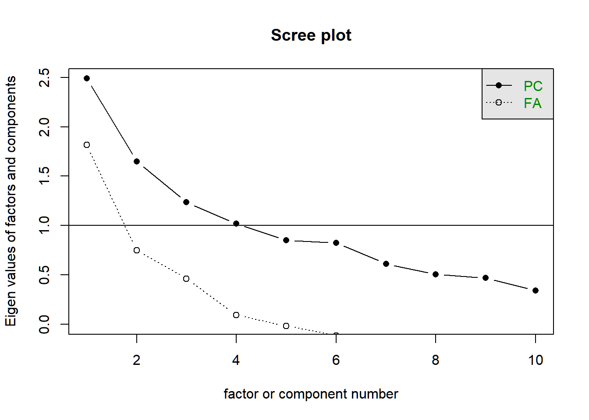

**Latihan 4:**

1.  Berdasarkan **Kaiser's Criterion** (Nilai Eigen \> 1) pada sub-bab 9.7.1, berapa komponen yang sebaiknya diekstrak?
2.  Berdasarkan **Scree Plot** di atas (lihat titik siku/ *elbow*), berapa komponen yang sebaiknya diekstrak?

Berdasarkan analisis-analisis sebelumnya, diputuskan untuk menggunakan **4 dimensi**.

## Melakukan Analisis Faktor dan Rotasi

Kita akan melakukan ekstraksi 4 faktor menggunakan metode **Analisis Faktor** (untuk pengelompokan variabel) dan **PCA** (untuk pembentukan variat), kemudian melakukan **Rotasi Varimax** agar pengelompokan variabel lebih tegas (nilai *loading* kontras).

### Analisis Faktor (Common Factor Analysis)

Analisis ini bertujuan mengelompokkan variabel-variabel yang mirip (korelasi tinggi) ke dalam faktor laten.


``` r
# Analisis Faktor dengan 4 faktor dan rotasi Varimax
# fm="pa" (Principal Axis) adalah metode umum untuk Common Factor Analysis di R (mirip SPSS)
af_result <- fa(data_analisis_final, nfactors = 4, rotate = "varimax", fm = "pa")

# Menampilkan hasil loading faktor
print(af_result$loadings, cutoff = 0.3)
```

```
## 
## Loadings:
##           PA1    PA2    PA3    PA4   
## ongkos                   0.667       
## bparkir                  0.699       
## durasi     0.660                     
## bareng                               
## toplajur   0.364         0.401       
## usia                            0.420
## jmlmotor          0.300              
## jmlmobil          0.391              
## jmlsepeda         1.004              
## jarak      0.855                     
## 
##                  PA1   PA2   PA3   PA4
## SS loadings    1.404 1.329 1.238 0.424
## Proportion Var 0.140 0.133 0.124 0.042
## Cumulative Var 0.140 0.273 0.397 0.440
```

*Catatan: `cutoff = 0.3` digunakan untuk menyembunyikan nilai loading yang kecil agar tabel lebih mudah dibaca.*

**Cara Membaca Output:** Perhatikan matriks komponen yang dirotasi (*Rotated Factor Matrix*). Setiap kolom (PA1, PA2, dst) merepresentasikan faktor. Nilai angka adalah *factor loading* (korelasi antara variabel dengan faktor).

**Contoh Identifikasi Faktor 1 (PA1):** Lihat kolom `PA1`. Variabel dengan nilai *loading* terbesar (dan di atas 0.5) adalah: - `durasi` (0.98) - `jarak` (0.96) Maka, Faktor 1 dibentuk oleh `durasi` dan `jarak`.

**Latihan 5:**

Berdasarkan output di atas, tentukan variabel pembentuk faktor lainnya:

1.  **Faktor 2 (PA2)**: Variabel apa saja yang memiliki *loading* tinggi di kolom ini?
2.  **Faktor 3 (PA3)**: Variabel apa saja yang memiliki *loading* tinggi di kolom ini?
3.  **Faktor 4 (PA4)**: Variabel apa saja yang memiliki *loading* tinggi di kolom ini?

### Analisis Komponen Prinsip (PCA)

Jika tujuan kita adalah mereduksi data menjadi skor komponen untuk analisis lanjutan (misal regresi), kita menggunakan PCA.


``` r
# PCA dengan 4 komponen dan rotasi Varimax
pca_result <- principal(data_analisis_final, nfactors = 4, rotate = "varimax")

# Menampilkan hasil loading komponen (untuk interpretasi)
print(pca_result$loadings, cutoff = 0.3)
```

```
## 
## Loadings:
##           RC1    RC3    RC2    RC4   
## ongkos            0.791              
## bparkir           0.823              
## durasi     0.847                     
## bareng                          0.806
## toplajur   0.490  0.425              
## usia                     0.324 -0.601
## jmlmotor   0.344         0.597       
## jmlmobil          0.385  0.638       
## jmlsepeda                0.833       
## jarak      0.825                     
## 
##                  RC1   RC3   RC2   RC4
## SS loadings    1.840 1.753 1.626 1.171
## Proportion Var 0.184 0.175 0.163 0.117
## Cumulative Var 0.184 0.359 0.522 0.639
```

``` r
# Menampilkan bobot skor komponen (weights) untuk pembentukan skor
print(pca_result$weights, digits = 3)
```

```
##               RC1     RC3     RC2     RC4
## ongkos     0.0254  0.4485 -0.0730  0.0301
## bparkir   -0.1330  0.5089 -0.0205  0.0298
## durasi     0.5237 -0.1667 -0.0855 -0.0144
## bareng    -0.0276 -0.0299  0.1825  0.7256
## toplajur   0.1979  0.1949  0.0396 -0.1924
## usia      -0.0194 -0.0251  0.1391 -0.4847
## jmlmotor   0.1783 -0.2001  0.3905  0.2852
## jmlmobil  -0.2100  0.2495  0.3974 -0.0890
## jmlsepeda -0.0496 -0.0641  0.5290 -0.0047
## jarak      0.4506  0.0303 -0.0532  0.0381
```

**Identifikasi Persamaan Komponen**

Komponen Prinsip (RC) adalah kombinasi linear dari variabel asal (yang sudah distandarisasi). Persamaannya dapat ditulis sebagai: $$RC_j = w_{1j}Z_1 + w_{2j}Z_2 + \dots + w_{pj}Z_p$$ Dimana $w$ adalah nilai **Component Score Coefficients (Weights)**, bukan nilai *loading*. Loading hanya menunjukkan korelasi, sedangkan weights menunjukkan bobot kontribusi setiap variabel dalam pembentukan skor komponen.

**Contoh:** Misalkan kita ingin membentuk persamaan untuk **RC1**. Lihat output `Weights` pada kolom `RC1`: - `durasi`: 0.524 - `jarak`: 0.451 - Variabel lain memiliki bobot yang lebih kecil.

Maka persamaannya: $$RC1 \approx 0.524(Z_{durasi}) + 0.451(Z_{jarak}) + \dots$$

**Menghasilkan Component Score**

Untuk mendapatkan nilai skor komponen setiap observasi secara otomatis, kita dapat mengakses objek `$scores` dari hasil PCA.


``` r
# Menampilkan 6 baris pertama dari skor komponen
head(pca_result$scores)
```

```
##             RC1        RC3         RC2         RC4
## [1,] -0.1944617 -0.4804209  0.36717340 -0.54187967
## [2,] -0.7752196 -0.1911165  1.50812139 -1.14287093
## [3,] -0.2069996 -0.2693966 -0.04572532 -0.49628033
## [4,]  0.7677605 -0.2647856 -0.21284551  0.01899626
## [5,] -1.6702167 -0.2667413  1.87084197  0.22728535
## [6,]  0.1797747 -0.6385342  0.52415727 -2.00189106
```

**Latihan 6:**

Berdasarkan output weights PCA di atas, tuliskan persamaan matematis terbentuknya komponen **RC2**! (Sebutkan variabel mana saja yang memiliki kontribusi besar beserta koefisien weights-nya).

## Interpretasi dan Penamaan Dimensi

Langkah terakhir adalah memberi nama pada dimensi yang terbentuk berdasarkan variabel-variabel pembentuknya.

**Latihan 7:** Tuliskan seluruh kelompok dari analisis faktor dan juga seluruh persamaan komponen yang dihasilkan dari PCA!

::: {.rmdexercise}
**Aktivitas Mandiri Komprehensif: Analisis PCA Mandiri [STP-14.3]**

Gunakan dataset dengan variabel metrik yang berbeda:

1. **Persiapan:** Pilih variabel, cek normalitas, uji Bartlett/KMO
2. **Ekstraksi:** Hitung eigenvalues, buat scree plot, tentukan jumlah komponen
3. **Analisis:** Lakukan PCA dengan rotasi Varimax
4. **Interpretasi:** Identifikasi variabel pembentuk, beri nama komponen, tuliskan persamaan
5. **Evaluasi:** Hitung proporsi variansi yang dijelaskan
:::

------------------------------------------------------------------------

<!--chapter:end:09-komponen-prinsip.Rmd-->

# Referensi

<!--chapter:end:99-referensi.Rmd-->

